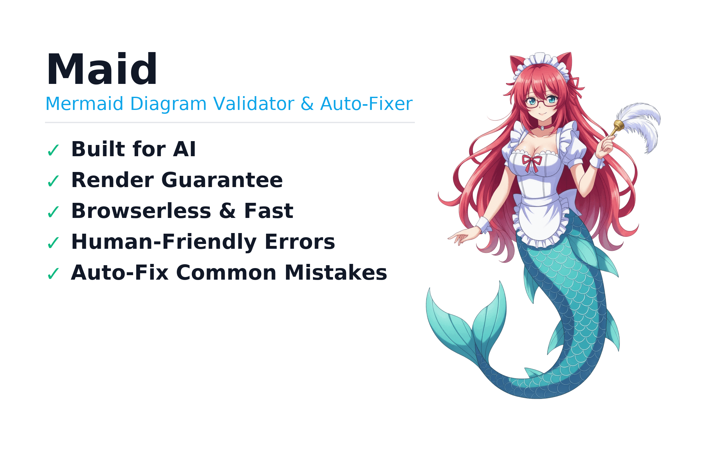
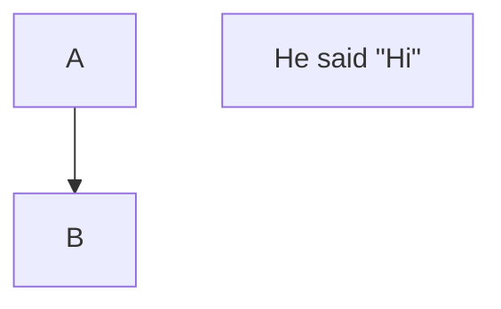
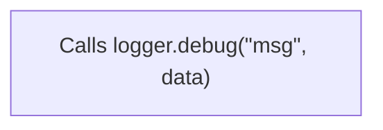
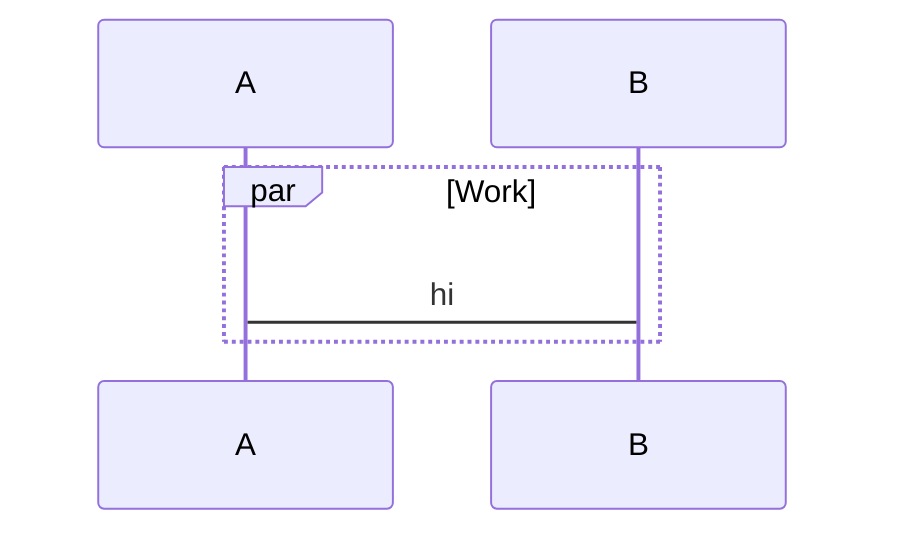

# Maid

Fast, accurate Mermaid diagram validator with clear, actionable diagnostics. Built for the AI age where Mermaid has become essential—but validation shouldn't require a browser.

## Why Maid?

- **Built for AI**: Designed for AI agents and LLMs that generate Mermaid diagrams
- **Render Guarantee**: When Maid says it's valid, your diagram will render
- **Lightning Fast**: Validates in milliseconds without launching a browser
- **Human-Friendly**: Clear error messages with line numbers, carets, and actionable hints
- **Lightweight**: ~5MB vs. mermaid-cli's 1.7GB (Puppeteer + Chrome)
- **Auto-Fix**: Automatically corrects common AI-generated mistakes

## Quick Start

```bash
# One‑off (npx)
npx -y @probelabs/maid diagram.mmd

# Or install locally (dev dependency)
npm install -D @probelabs/maid
npx maid diagram.mmd   # uses local bin from @probelabs/maid

# From stdin
cat diagram.mmd | npx -y @probelabs/maid -

# Markdown with multiple diagrams
npx -y @probelabs/maid README.md

# Lint an entire docs directory (recursively)
npx -y @probelabs/maid docs/
```

### SDK Quick Example

Use Maid programmatically (ESM). See docs/SDK.md for more.

```js
import { validate, fixText } from '@probelabs/maid';

const src = 'flowchart TD\nA->B';
const { errors } = validate(src);
if (errors.length) {
  const { fixed } = fixText(src, { level: 'safe' });
  console.log(fixed);
}
```

Exit codes
- 0: no errors (including when no Mermaid diagrams are found)
- 1: at least one error (warnings do not fail)

## MCP Server for AI Assistants

Maid includes a Model Context Protocol (MCP) server that allows AI assistants like Claude Code to validate and fix Mermaid diagrams directly in conversations.

### Quick Setup for Claude Code

Add Maid MCP server using the CLI:

```bash
claude mcp add -- npx -y @probelabs/maid mcp
```

Or configure manually in `~/.claude.json`:

```json
{
  "mcpServers": {
    "maid": {
      "type": "stdio",
      "command": "npx",
      "args": ["-y", "@probelabs/maid", "mcp"]
    }
  }
}
```

After configuration, restart Claude Code. The assistant will now be able to validate and fix Mermaid diagrams when you ask.

### MCP Tool: `validate_mermaid`

**Inputs:**
- `text` (string, required): Mermaid diagram text or Markdown content with ```mermaid blocks
- `autofix` (boolean, optional): Set to `true` to automatically fix syntax errors

**Returns (JSON):**
- `valid` (boolean): Whether the diagram is valid
- `diagramType` (string): Detected diagram type (flowchart, pie, sequence, unknown)
- `errorCount`, `warningCount` (number): Count of errors and warnings
- `errors` (array): Detailed error objects with line, column, message, code, hint
- `fixed` (string): Corrected diagram text (only when autofix=true)

### Example Usage in Conversations

Once configured, you can ask Claude Code:
- "Check this Mermaid diagram for errors"
- "Validate the Mermaid diagrams in my README.md"
- "Fix the syntax errors in this flowchart"

The assistant will use the MCP server to validate or fix diagrams and show you the results.

## Using as an SDK

Maid can be used programmatically (ESM, CommonJS, and TypeScript). The public API lives at the package root export. See docs/SDK.md for complete examples.

For detailed examples (ESM, CommonJS, TypeScript) and API surface, see docs/SDK.md.

### Browser Usage with Mermaid.js-Compatible API

Maid provides a **drop-in replacement** for Mermaid.js that works in the browser with no external dependencies. Perfect for validating and rendering diagrams client-side without Puppeteer or Chrome.

**Quick Start (via CDN):**

```html
<!DOCTYPE html>
<html>
<head>
    <title>Maid Browser Example</title>
</head>
<body>
    <div id="diagram"></div>

    <script type="module">
        // Import from ProLabs CDN
        import { createMermaidAPI } from 'https://probelabs.com/maid/maid.bundle.js';

        // Create a Mermaid.js-compatible API
        const maid = createMermaidAPI();

        const diagramText = `
            flowchart TD
                A[Start] --> B{Decision}
                B -->|Yes| C[Process]
                B -->|No| D[End]
        `;

        // Use exactly like Mermaid.js
        const { svg } = await maid.render('diagram-id', diagramText);
        document.getElementById('diagram').innerHTML = svg;
    </script>
</body>
</html>
```

**Features:**
- ✅ **Same API as Mermaid.js** - Drop-in replacement for `mermaid.render()`
- ✅ **No dependencies** - Works completely offline (~350KB bundle)
- ✅ **Built-in validation** - Auto-fixes common errors before rendering
- ✅ **Experimental renderer** - Supports flowchart and pie diagrams

**Toggle Between Renderers:**

```html
<script type="module">
    import { createMermaidAPI } from 'https://probelabs.com/maid/maid.bundle.js';
    import mermaid from 'https://cdn.jsdelivr.net/npm/mermaid@11/dist/mermaid.esm.min.mjs';

    const maidRenderer = createMermaidAPI();
    mermaid.initialize({ startOnLoad: false });

    // Choose renderer based on user preference
    const useMaid = true; // or read from checkbox
    const renderer = useMaid ? maidRenderer : mermaid;

    // Both use the same API!
    const { svg } = await renderer.render('id', diagramText);
</script>
```

**Interactive Demo:** Try it live at [https://probelabs.com/maid/demo.html](https://probelabs.com/maid/demo.html)

**API Reference:**
- `createMermaidAPI()` - Creates Mermaid.js-compatible instance
- `maid.render(id, text, options?)` - Async render (returns `{ svg }`)
- `maid.renderSync(id, text, options?)` - Sync render (returns `{ svg }`)
- `maid.initialize(config?)` - No-op for compatibility

**Supported Diagram Types (Browser Rendering):**
- ✅ Flowcharts (`flowchart`, `graph`)
- ✅ Pie charts (`pie`)
- 🚧 Other types fall back to validation only

**Bundle Sizes:**
- Maid browser bundle: ~350KB minified
- Mermaid.js: ~400KB (CDN) or 1.7GB (mermaid-cli + Puppeteer)

### Rendering Diagrams (Experimental)

```bash
# Render to SVG (default)
npx -y @probelabs/maid render diagram.mmd

# Render to PNG
npx -y @probelabs/maid render diagram.mmd output.png

# Render from stdin
cat diagram.mmd | npx -y @probelabs/maid render - output.svg

# Force output format
npx -y @probelabs/maid render diagram.mmd -f png
```

Notes
- The renderer is **experimental** and primarily for parser validation
- Currently supports **flowchart diagrams only**
- PNG output requires `rsvg-convert` or `ImageMagick` installed
- See "Development > Experimental Renderer" for technical details

### Autofix in a nutshell

```bash
# Safe fixes only (mechanical)
npx -y @probelabs/maid --fix docs/

# Safe + heuristic fixes (more aggressive)
npx -y @probelabs/maid --fix=all docs/

# Preview the fixed content without writing (single file or stdin)
npx -y @probelabs/maid --fix --dry-run --print-fixed diagram.mmd
```

Notes
- Safe fixes are idempotent and conservative (arrows, inner quotes to `&quot;`, missing `:`, missing `end`, etc.).
- `--fix=all` additionally enables conservative heuristics (e.g., wrap unquoted labels, close unclosed quotes/brackets).
- In directory mode, Maid prints "All diagrams valid after fixes. Modified X file(s)." when it succeeds post-fix.
- See "Autofix" below for details and examples.

### Directory Scans: Include/Exclude and .gitignore

- Include globs: `--include` or `-I` (repeatable or comma‑separated)
- Exclude globs: `--exclude` or `-E` (repeatable or comma‑separated)
- Respect `.gitignore` by default; disable with `--no-gitignore`

Examples

```bash
# Respect .gitignore (default)
npx -y @probelabs/maid docs/

# Only files under docs/content
npx -y @probelabs/maid docs/ -I "docs/content/**/*.md,docs/content/**/*.mmd"

# Exclude legacy and drafts
npx -y @probelabs/maid docs/ -E "docs/legacy/**" -E "**/*.draft.md"

# Do not respect .gitignore
npx -y @probelabs/maid docs/ --no-gitignore

# JSON report for CI
npx -y @probelabs/maid --format json -I "**/*.mdx" -E "**/node_modules/**" docs/
```

## Why Maid Exists

Mermaid has become an essential part of modern engineering culture. It's in our documentation, our AI workflows, and our development processes. Every major LLM knows Mermaid syntax because they've been trained on millions of diagrams. But there's a challenge.

### The AI Challenge

When AI generates complex Mermaid diagrams, the success rate is surprisingly low. The syntax is too free-form, making it easy for AI to generate invalid diagrams that look correct but won't render. You can see this yourself in Mermaid's own live editor—even simple mistakes lead to cryptic errors.

### The Validation Gap

**You can't know if a Mermaid diagram will render without actually rendering it.** This architectural constraint exists because:

1. **Tightly Coupled Architecture**: Mermaid's parser (based on Jison, a JavaScript port of the 1990s Bison parser) tightly couples parsing with rendering. Validation requires rendering.

2. **mermaid-cli's Approach**: The official CLI tool bundles Puppeteer and Chrome—a 1.7GB dependency—to validate by actually rendering your diagram.

3. **Cryptic Error Messages**: When validation fails, you get messages like:
   ```
   Expecting 'SEMI', 'NEWLINE', 'EOF', 'AMP', 'START_LINK', 'LINK', 'LINK_ID', got 'MINUS'
   ```
   These token-based errors are difficult for both humans and AI to understand.

### The Maid Solution

Maid fills this gap with a modern, lightweight validator. We built a parser from scratch that:

- **Decouples validation from rendering** - No browser needed
- **Provides semantic error messages** - AI and humans can understand and fix issues
- **Guarantees rendering** - When Maid says it's valid, it will render
- **Auto-fixes common mistakes** - Especially those AI agents frequently make
- **Stays lightweight** - 5MB, not 1.7GB

This isn't about competing with Mermaid—it's about making Mermaid more accessible and reliable for everyone, especially in the AI age.

## Supported Diagrams (today)

- Flowchart (`flowchart`, `graph`)
- Sequence (`sequenceDiagram`)
- Pie (`pie`)
- Class (`classDiagram`)
- State (`stateDiagram`, `stateDiagram-v2`)

Note: Other Mermaid diagram types (e.g., `gantt`, `journey`, `erDiagram`, etc.) are treated as valid (pass‑through). We’ll add native validation over time.

## What It Catches

### ❌ Common Errors
- Invalid arrow syntax (`->` instead of `-->`)
- Unclosed brackets and mismatched node shapes
- Invalid directions (must be TD, TB, BT, RL, LR)
- Missing diagram type declaration
- Malformed class and subgraph syntax

### ⚠️ Best Practice Warnings
- Link text without proper pipe delimiters
- Empty diagrams
- Problematic HTML entities

## Testing & Validation

Commands
- Run baseline tests: `npm test`
- Error‑code assertions (all types): `npm run test:errors:all`
- Autofix smoke tests: `node scripts/test-fixes.js`
  - CI runs these automatically on every PR/commit.
- Markdown extraction and offsets: `npm run test:markdown`
- Directory scan behavior: `npm run test:dir`
- Compare with mermaid‑cli (non‑blocking): `node scripts/compare-linters.js flowchart|pie|sequence`

Current coverage
- Flowchart: 20 valid • 18 invalid
- Pie: 4 valid • 8 invalid
- Sequence: 13 valid • 20 invalid

## Roadmap & Support

As of 2025‑09‑30. Mermaid statuses summarized from the docs.

| Diagram | Mermaid status | Maid support | Notes |
| --- | --- | --- | --- |
| Flowchart | Stable | Yes | TD/TB/BT/RL/LR; subgraphs; strict mode optional |
| Sequence | Stable | Yes | Blocks (alt/opt/par/critical/etc.), autonumber, notes |
| Pie | Stable | Yes | Titles, showData, label/number rules |
| Class | Stable | Yes | Class/members/relations; stereotypes; alias |
| State | Stable | Yes | Transitions, start `[*]`, state blocks, notes |
| ER | Experimental | Pass-through | |
| Gantt | Stable | Pass-through | |
| User Journey | Stable | Pass-through | |
| GitGraph | Stable | Planned | |
| Mindmap | Stable (icons experimental) | Planned | |
| Timeline | Stable (icons experimental) | Planned | |
| Quadrant Chart | Stable | Planned | |
| XY Chart | Stable | Planned | |
| Requirement | Stable | Planned | |
| C4 | Experimental | Planned | |
| Sankey | Experimental | Planned | |
| Block Diagram | New/experimental | Planned | |
| Treemap | Beta/New | Planned | |

Support

| Channel | Use for |
| --- | --- |
| GitHub Issues | Bugs, feature requests, questions |
| Pull Requests | Improvements to validators, diagnostics, docs |

## Testing / CI

- Baseline tests (flowchart): a fast harness that runs Maid over curated valid/invalid fixtures and expects 100% pass/fail parity with our intended behavior. In CI this step is labeled “Run linter tests (flowchart baseline)”.
  - Command: `npm test` (runs `scripts/test-chevrotain.js`).

- Error-code assertions (all types): verifies that each invalid fixture surfaces the expected stable error codes across flowchart, pie, and sequence.
  - Command: `npm run test:errors:all`.

- Compare with mermaid-cli: runs mermaid-cli on all fixtures and checks overall VALID/INVALID parity with Maid. This intentionally prints differences but does not fail the job.
  - Commands: `node scripts/compare-linters.js flowchart|pie|sequence`.

- Markdown extraction and offsets: validates multi-diagram Markdown parsing and line-number accuracy.
  - Command: `npm run test:markdown`.

- Directory scan: validates recursive scanning, include/exclude, .gitignore handling, and exit codes.
  - Command: `npm run test:dir`.

## Releasing

We publish to npm when a Git tag is pushed that matches the package version.

Rules
- Tags must be in the form `vX.Y.Z`.
- The tag must match `package.json`'s `version`. CI will fail if they differ.

Steps
1. Bump the version in `package.json` and commit.
   - Or use npm to bump and create a tag in one step: `npm version patch|minor|major`.
2. Push the tag: `git push --follow-tags`.
3. GitHub Actions (Release workflow) will build, run quick tests, and publish to npm.

Notes
- The package includes only the compiled `out/` folder, README, and LICENSE.
- Node.js >= 18 is required (see `engines`).
- Requires a repository secret `NPM_TOKEN` with publish access to the npm package.

These layers give confidence in correctness (baseline), diagnostic quality (error codes), and compatibility with the reference renderer (mermaid-cli comparison).

## Error Codes

Diagnostics include stable error codes and hints for quick fixes. See the full list in docs/errors.md.

### Autofix Support

- Use `--fix` for safe, mechanical fixes and `--fix=all` to include conservative heuristics.
- A complete matrix of error codes and autofix behavior is in docs/errors.md (section “Autofix Support Matrix”).

## Autofix

Maid can optionally fix many common issues for you. There are two levels:

- Safe (`--fix`): mechanical, low‑risk changes, idempotent.
- All (`--fix=all`): includes Safe and adds heuristic fixes that require mild inference.

What gets fixed (highlights)
- Flowchart (Safe):
  - `->` → `-->`
  - Inner quotes → `&quot;` inside quoted labels
  - `direction` keyword inside subgraphs (replace unknown kw)
  - Mismatched closer for shapes (e.g., `A(text]` → `A(text)`)
- Flowchart (Safe):
  - Wrap unquoted labels when a `"` appears inside (and normalize inner quotes)
  - Insert a best‑guess missing closing bracket
  - Add default direction ` TD` after `flowchart`/`graph` header
  - Insert ` --> ` when two nodes are placed on one line without an arrow
- Sequence (Safe):
  - Add `: ` in messages and notes
  - Replace `else` with `option` inside `critical`
  - Insert a new `end` for unclosed blocks (keeps indentation)
  - Move extraneous tokens after `autonumber` to the next line
  - Fix inner quotes in participant/actor names by using `&quot;` (e.g., `participant "Logger \"debug\""` → `participant "Logger &quot;debug&quot;"`)
- Sequence (All):
  - Normalize malformed `autonumber` to `autonumber`
  - Close unclosed quotes at end of line
- Pie (Safe):
  - Insert missing ` : ` between label and number
  - Wrap unquoted labels and normalize inner quotes to `&quot;`
- Pie (All):
  - Close unclosed quotes (before colon if present, else end of line)
 - Flowchart (Safe):
   - Remove empty shapes A[""] / A[" "] / A[] → A

Before/After examples

Flowchart (Safe — arrow and quotes)
```mermaid
%% before
flowchart TD
  A -> B
  C["He said \"Hi\""]
```
becomes


Flowchart (All — wrap unquoted label containing quotes)
```mermaid
%% before
flowchart TD
  A[Calls logger.debug("msg", data)]
```
becomes


Sequence (Safe — message colon and missing end)
```mermaid
%% before
sequenceDiagram
  par Work
    A->B hi
```
becomes


Pie (Safe — missing colon and unquoted label)
```text
pie
  Dogs 10
```
becomes
```text
pie
  "Dogs"  : 10
```

Tips
- Run with a clean working tree so you can review diffs easily.
- Use `--dry-run --print-fixed` to preview changes for a single file or stdin.
- After `--fix`, run without `--fix` to confirm exit code 0.
- Full code → fix mapping is in docs/errors.md (Autofix Support Matrix).

### CLI Output Formats

- Text (default): caret-underlined snippet style with codes, hints, and precise spans.
- JSON: machine-readable report for editors/CI.

```bash
# Text (default)
npx -y @probelabs/maid diagram.mmd

# JSON
npx -y @probelabs/maid --format json diagram.mmd
```

### Strict Mode

Enable strict mode to require quoted labels inside shapes (e.g., `[ ... ]`, `{ ... }`, `( ... )`).

```bash
npx -y @probelabs/maid --strict diagram.mmd
```

In strict mode, unquoted labels are flagged with FL-STRICT-LABEL-QUOTES-REQUIRED. Use double quotes and &quot; for inner quotes.

## Scanning Markdown and Directories

Maid validates:
- Standalone Mermaid files (`.mmd`, `.mermaid`).
- Markdown files with one or more Mermaid code fences (```mermaid, ```mmd, or ~~~mermaid).
- Entire directories (recursively), finding Markdown/Mermaid files and validating all embedded diagrams.

Behavior
- Keeps precise line/column positions relative to the original Markdown file by offsetting diagnostics from each fenced block.
- “No Mermaid diagrams found” is considered success (exit code 0). Text mode prints a short note; JSON includes `diagramCount: 0`.
- Exit code is 1 only when errors are present. Warnings do not fail.

### CLI Options

- `--format`, `-f` text|json
  - text: human-readable snippets with carets (default)
  - json: machine-readable output for CI/editors
- `--strict`, `-s`
  - Require quoted labels inside shapes; emits `FL-STRICT-LABEL-QUOTES-REQUIRED` when violated.
- Autofix flags:
  - `--fix` Apply safe auto-fixes (e.g., replace `->` with `-->`, normalize inner quotes to `&quot;`, add missing `: ` in sequence message and notes, replace `else` with `option` in `critical`, insert missing `end` for blocks, fix `direction` keyword in subgraphs).
  - `--fix=all` Apply safe + heuristic fixes (e.g., wrap unquoted labels with quotes where it’s unambiguous, close unclosed quotes/brackets in limited contexts). Heuristics are conservative but may be opinionated.
  - `--dry-run`, `-n` Don’t write files; useful with single files.
  - `--print-fixed` When combined with `--fix*` on a single file or `-`, print the fixed content to stdout instead of a diagnostic report.
- Directory scan flags:
  - `--include`, `-I` Glob(s) to include (repeatable or comma‑separated)
  - `--exclude`, `-E` Glob(s) to exclude (repeatable or comma‑separated)
  - `--no-gitignore` Do not respect `.gitignore` (default is to respect it)

Examples

```bash
# Validate Markdown containing multiple diagrams
npx -y @probelabs/maid README.md

# Lint all docs, respecting .gitignore
npx -y @probelabs/maid docs/

# Only Markdown/Mermaid under docs/content
npx -y @probelabs/maid docs/ -I "docs/content/**/*.md,docs/content/**/*.mmd"

# Exclude legacy docs and any *.draft.md files
npx -y @probelabs/maid docs/ -E "docs/legacy/**" -E "**/*.draft.md"

# Disable .gitignore filtering
npx -y @probelabs/maid docs/ --no-gitignore

# JSON report for CI
npx -y @probelabs/maid --format json docs/
```

### JSON Output

Single file (diagram or Markdown):

```json
{
  "file": "README.md",
  "valid": false,
  "errorCount": 1,
  "warningCount": 0,
  "diagramCount": 1,
  "errors": [
    { "line": 12, "column": 3, "severity": "error", "code": "SE-AND-OUTSIDE-PAR", "message": "…" }
  ],
  "warnings": []
}
```

Directory scan:

```json
{
  "valid": false,
  "errorCount": 2,
  "warningCount": 1,
  "diagramCount": 5,
  "files": [
    { "file": "docs/good.md", "valid": true,  "errorCount": 0, "warningCount": 0, "errors": [], "warnings": [] },
    { "file": "docs/bad.md",  "valid": false, "errorCount": 2, "warningCount": 1, "errors": [ … ], "warnings": [ … ] }
  ]
}
```

## CI/CD Integration

### SDK Details

Looking for programmatic usage? The full SDK guide (examples, exports, and tips) is in docs/SDK.md. The top of this README includes a short SDK Quick Example for convenience.

### GitHub Actions

Validate entire docs directory on every push/PR (Node 22.x):

```yaml
name: Lint Mermaid Diagrams
on:
  push:
    branches: [ main ]
  pull_request:
    branches: [ main ]

jobs:
  lint:
    runs-on: ubuntu-latest
    steps:
      - uses: actions/checkout@v4
        with:
          fetch-depth: 0
      - uses: actions/setup-node@v4
        with:
          node-version: '22.x'
          cache: 'npm'
      - name: Lint docs/
        run: npx -y @probelabs/maid docs/
```

Only lint files changed in a pull request:

```yaml
name: Lint Changed Mermaid Files
on:
  pull_request:
    branches: [ main ]

jobs:
  lint-changed:
    runs-on: ubuntu-latest
    steps:
      - uses: actions/checkout@v4
        with:
          fetch-depth: 0
      - uses: actions/setup-node@v4
        with:
          node-version: '22.x'
          cache: 'npm'
      - name: Get changed Mermaid/Markdown files
        id: changed
        run: |
          set -e
          base="${{ github.event.pull_request.base.sha }}"
          head="${{ github.sha }}"
          files=$(git diff --name-only --diff-filter=ACMR "$base"..."$head" -- \
            "**/*.md" "**/*.markdown" "**/*.mdx" "**/*.mmd" "**/*.mermaid")
          if [ -z "$files" ]; then
            echo "files=" >> "$GITHUB_OUTPUT"
          else
            # Space-separated list suitable for shell for-loop
            echo "files=$files" >> "$GITHUB_OUTPUT"
          fi
      - name: Lint changed files
        if: steps.changed.outputs.files != ''
        run: |
          # Install locally for faster repeated invocations
          npm i -D @probelabs/maid
          failed=0
          for f in ${{ steps.changed.outputs.files }}; do
            echo "Linting $f"
            npx maid "$f" || failed=1
          done
          if [ "$failed" -ne 0 ]; then
            echo "Linting failed for one or more files" >&2
            exit 1
          fi
      - name: No Mermaid files changed
        if: steps.changed.outputs.files == ''
        run: echo "No changed Mermaid/Markdown files. Skipping."
```

### Pre-commit Hook

Lint only staged files, including Markdown files that contain Mermaid fences (```mermaid or ~~~mermaid):

```bash
#!/bin/sh
# .git/hooks/pre-commit
set -e

# Collect staged files (added/copied/modified/renamed)
STAGED=$(git diff --cached --name-only -z --diff-filter=ACMR)
[ -z "$STAGED" ] && exit 0

# Build lint list: .mmd/.mermaid, and Markdown files that contain Mermaid fences
LINT_LIST=""
while IFS= read -r -d '' f; do
  case "$f" in
    *.mmd|*.mermaid)
      LINT_LIST="$LINT_LIST\n$f" ;;
    *.md|*.markdown|*.mdx)
      if grep -Eq '^( {0,3})(```|~~~)[[:space:]]*(mermaid|mmd)([[:space:]]|$)' "$f"; then
        LINT_LIST="$LINT_LIST\n$f"
      fi
      ;;
  esac
done <<EOF
$STAGED
EOF

TMP=$(mktemp)
printf "%s\n" "$LINT_LIST" | sed '/^$/d' > "$TMP"
[ ! -s "$TMP" ] && { rm -f "$TMP"; exit 0; }

FAILED=0
while IFS= read -r FILE; do
  [ -z "$FILE" ] && continue
  echo "maid: $FILE"
  npx -y @probelabs/maid "$FILE" || FAILED=1
done < "$TMP"
rm -f "$TMP"

exit $FAILED
```

## Architecture

Built from scratch with modern tooling for reliability and performance:

- **[Chevrotain](https://chevrotain.io/)** - Modern, fast parser framework (not 1990s Bison/Jison)
  - Allows semantic validation without rendering
  - Provides exact error locations and recovery
  - Enables intelligent auto-fix suggestions
- **TypeScript** - Type-safe implementation with great IDE support
- **Decoupled Design** - Validation logic completely separate from rendering
- **Automated Testing** - GitHub Actions CI on every commit
- **Render Guarantee** - Our test suite validates against actual Mermaid rendering

### Project Structure
```
├── src/
│   ├── core/
│   │   ├── router.ts         # Detects diagram type and routes
│   │   └── types.ts          # Shared types
│   ├── diagrams/
│   │   ├── flowchart/        # Flowchart lexer/parser/validation
│   │   ├── sequence/         # Sequence lexer/parser/validation
│   │   └── pie/              # Pie lexer/parser/validation
│   └── cli.ts                # CLI implementation
├── test-fixtures/
│   ├── flowchart/
│   │   ├── valid/
│   │   └── invalid/
│   └── pie/
│       └── valid/
└── scripts/
    ├── test-chevrotain.js    # Test runner
    ├── test-linter.js        # Alternate test runner
    └── compare-linters.js    # mermaid-cli comparison
```

## Development

### Build from Source

```bash
# Clone repository
git clone https://github.com/probelabs/maid.git
cd maid

# Install dependencies
npm install

# Build
npm run build

# Run tests
npm test
```

### Experimental Renderer

Maid includes an experimental lightweight renderer for flowchart and pie diagrams. This renderer serves as a visual validation tool for our parser implementation.

**Purpose:**
- Validate parser correctness by visually rendering diagrams
- Identify parsing issues that are difficult to detect through other testing methods
- Provide a lightweight alternative for basic diagram rendering (294KB vs Mermaid.js's 2.6MB)

**Status:**
- ⚠️ **Experimental** - Not intended for production use
- Currently supports flowchart and pie diagrams
- Primary goal is parser validation, not feature parity with Mermaid.js

**Building the Browser Bundle:**
```bash
npm run build:browser
# Generates site/maid/maid.bundle.js (294KB, 87KB gzipped)
```

**Architecture:**
- Chevrotain parser for CST generation
- Dagre.js for automatic graph layout
- Custom SVG generation for shapes and edges
- **Pluggable design** - Swap layout engines and output renderers

**Pluggability:**

The renderer uses a clean interface-based architecture that allows you to:
- Use alternative layout engines (e.g., Graphviz DOT, D3 force-directed)
- Generate different output formats (e.g., SVG, Canvas, DOT)

Example - Using a custom DOT renderer:
```typescript
import { renderMermaid, DotRenderer } from '@probelabs/maid';

const result = renderMermaid(diagramText, {
  renderer: new DotRenderer()
});
// result.svg now contains Graphviz DOT format
```

Example - Custom layout engine:
```typescript
import { renderMermaid, ILayoutEngine } from '@probelabs/maid';

class MyLayoutEngine implements ILayoutEngine {
  layout(graph: Graph): Layout {
    // Your custom layout algorithm
    return { nodes, edges, width, height };
  }
}

const result = renderMermaid(diagramText, {
  layoutEngine: new MyLayoutEngine()
});
```

**Core Interfaces:**
- `ILayoutEngine` - Calculates node/edge positions from graph model
- `IRenderer` - Generates output (SVG, DOT, etc.) from positioned layout

**Implementations:**
- `DagreLayoutEngine` - Hierarchical layout using Dagre (default)
- `SVGRenderer` - SVG output with Mermaid-like styling (default)
- `DotRenderer` - Graphviz DOT format (example implementation)

See `src/renderer/interfaces.ts` for interface definitions.

### Extending the Linter

1. Add a new module: `src/diagrams/<type>/{lexer.ts,parser.ts,validate.ts}`
2. Register in `src/core/router.ts` via header detection
3. Add fixtures under `test-fixtures/<type>/{valid,invalid}`
4. Build and verify: `npm run build && node scripts/compare-linters.js <type>`
5. Regenerate previews: `node scripts/generate-preview.js <type>`

## Releasing

We publish to npm when a Git tag is pushed that matches the package version.

Rules
- Tags must be in the form `vX.Y.Z` and match `package.json`’s `version`.

Steps
1. Bump version and tag: `npm version patch|minor|major`
2. Push with tags: `git push --follow-tags`
3. Release workflow builds, runs quick tests, and publishes to npm

Notes
- Package includes only compiled `out/`, README, and LICENSE
- Requires repository secret `NPM_TOKEN` (publish access)

## Edge Cases Covered

- Flowchart:
  - Escaped quotes in labels (rejected)
  - Double quotes inside single-quoted labels (rejected, mermaid-compat)
  - Mismatched quotes inside labels (accepted, mermaid-compat)
  - Link text outside pipes triggers warnings
- Pie:
  - Labels must be quoted (single or double quotes)
  - Colon and numeric value are required for each slice
  - `title` without colon is accepted (e.g., `title "Pets"`); `title:` is rejected by current mermaid-cli
  - Current mermaid-cli may emit an error SVG instead of failing the process; our preview scripts detect this and surface the error text

## Contributing

We welcome contributions! Please ensure:

1. All tests pass: `npm test`
2. 100% mermaid-cli compatibility: `npm run test:compare`
3. Update test fixtures if needed
4. Regenerate previews: `npm run generate:previews`

## License

ISC

---

Built with ❤️ for developers who care about documentation quality.
