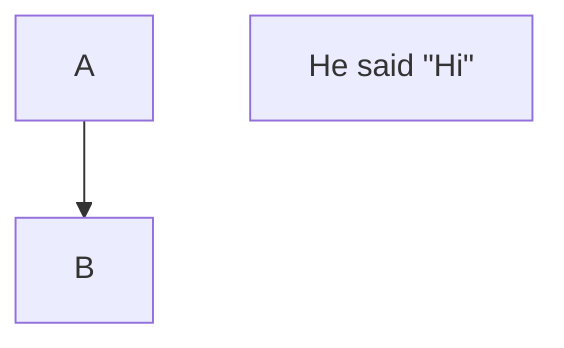
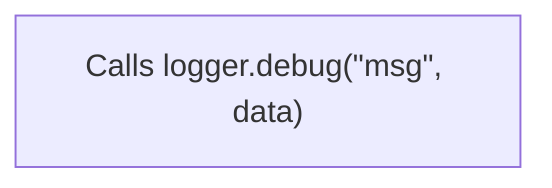
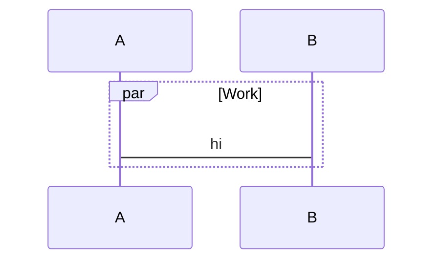

# Maid

Fast, accurate Mermaid diagram validator with clear, actionable diagnostics.

## Why Maid?

- Fast: validates in milliseconds
- Accurate: parity with mermaid‑cli on curated fixtures
- Helpful: human‑friendly errors with line numbers, carets, and hints

## Quick Start

```bash
# One‑off (npx)
npx -y @probelabs/maid diagram.mmd

# Or install locally (dev dependency)
npm install -D @probelabs/maid
npx maid diagram.mmd   # uses local bin from @probelabs/maid

# From stdin
cat diagram.mmd | npx -y @probelabs/maid -

# Markdown with multiple diagrams
npx -y @probelabs/maid README.md

# Lint an entire docs directory (recursively)
npx -y @probelabs/maid docs/
```

Exit codes
- 0: no errors (including when no Mermaid diagrams are found)
- 1: at least one error (warnings do not fail)

### Autofix in a nutshell

```bash
# Safe fixes only (mechanical)
npx -y @probelabs/maid --fix docs/

# Safe + heuristic fixes (more aggressive)
npx -y @probelabs/maid --fix=all docs/

# Preview the fixed content without writing (single file or stdin)
npx -y @probelabs/maid --fix --dry-run --print-fixed diagram.mmd
```

Notes
- Safe fixes are idempotent and conservative (arrows, inner quotes to `&quot;`, missing `:`, missing `end`, etc.).
- `--fix=all` additionally enables conservative heuristics (e.g., wrap unquoted labels, close unclosed quotes/brackets).
- In directory mode, Maid prints “All diagrams valid after fixes. Modified X file(s).” when it succeeds post-fix.
- See “Autofix” below for details and examples.

### Directory Scans: Include/Exclude and .gitignore

- Include globs: `--include` or `-I` (repeatable or comma‑separated)
- Exclude globs: `--exclude` or `-E` (repeatable or comma‑separated)
- Respect `.gitignore` by default; disable with `--no-gitignore`

Examples

```bash
# Respect .gitignore (default)
npx -y @probelabs/maid docs/

# Only files under docs/content
npx -y @probelabs/maid docs/ -I "docs/content/**/*.md,docs/content/**/*.mmd"

# Exclude legacy and drafts
npx -y @probelabs/maid docs/ -E "docs/legacy/**" -E "**/*.draft.md"

# Do not respect .gitignore
npx -y @probelabs/maid docs/ --no-gitignore

# JSON report for CI
npx -y @probelabs/maid --format json -I "**/*.mdx" -E "**/node_modules/**" docs/
```

## Supported Diagrams (today)

- Flowchart (`flowchart`, `graph`)
- Sequence (`sequenceDiagram`)
- Pie (`pie`)

## What It Catches

### ❌ Common Errors
- Invalid arrow syntax (`->` instead of `-->`)
- Unclosed brackets and mismatched node shapes
- Invalid directions (must be TD, TB, BT, RL, LR)
- Missing diagram type declaration
- Malformed class and subgraph syntax

### ⚠️ Best Practice Warnings
- Link text without proper pipe delimiters
- Empty diagrams
- Problematic HTML entities

## Testing & Validation

Commands
- Run baseline tests: `npm test`
- Error‑code assertions (all types): `npm run test:errors:all`
- Autofix smoke tests: `node scripts/test-fixes.js`
- Markdown extraction and offsets: `npm run test:markdown`
- Directory scan behavior: `npm run test:dir`
- Compare with mermaid‑cli (non‑blocking): `node scripts/compare-linters.js flowchart|pie|sequence`

Current coverage
- Flowchart: 20 valid • 18 invalid
- Pie: 4 valid • 8 invalid
- Sequence: 13 valid • 20 invalid

## Roadmap & Support

As of 2025‑09‑30. Mermaid statuses summarized from the docs.

| Diagram | Mermaid status | Maid support | Notes |
| --- | --- | --- | --- |
| Flowchart | Stable | Yes | TD/TB/BT/RL/LR; subgraphs; strict mode optional |
| Sequence | Stable | Yes | Blocks (alt/opt/par/critical/etc.), autonumber, notes |
| Pie | Stable | Yes | Titles, showData, label/number rules |
| Class | Stable | Planned | |
| State | Stable | Planned | |
| ER | Experimental | Planned | |
| Gantt | Stable | Planned | |
| User Journey | Stable | Planned | |
| GitGraph | Stable | Planned | |
| Mindmap | Stable (icons experimental) | Planned | |
| Timeline | Stable (icons experimental) | Planned | |
| Quadrant Chart | Stable | Planned | |
| XY Chart | Stable | Planned | |
| Requirement | Stable | Planned | |
| C4 | Experimental | Planned | |
| Sankey | Experimental | Planned | |
| Block Diagram | New/experimental | Planned | |
| Treemap | Beta/New | Planned | |

Support

| Channel | Use for |
| --- | --- |
| GitHub Issues | Bugs, feature requests, questions |
| Pull Requests | Improvements to validators, diagnostics, docs |

## Testing / CI

- Baseline tests (flowchart): a fast harness that runs Maid over curated valid/invalid fixtures and expects 100% pass/fail parity with our intended behavior. In CI this step is labeled “Run linter tests (flowchart baseline)”.
  - Command: `npm test` (runs `scripts/test-chevrotain.js`).

- Error-code assertions (all types): verifies that each invalid fixture surfaces the expected stable error codes across flowchart, pie, and sequence.
  - Command: `npm run test:errors:all`.

- Compare with mermaid-cli: runs mermaid-cli on all fixtures and checks overall VALID/INVALID parity with Maid. This intentionally prints differences but does not fail the job.
  - Commands: `node scripts/compare-linters.js flowchart|pie|sequence`.

- Markdown extraction and offsets: validates multi-diagram Markdown parsing and line-number accuracy.
  - Command: `npm run test:markdown`.

- Directory scan: validates recursive scanning, include/exclude, .gitignore handling, and exit codes.
  - Command: `npm run test:dir`.

## Releasing

We publish to npm when a Git tag is pushed that matches the package version.

Rules
- Tags must be in the form `vX.Y.Z`.
- The tag must match `package.json`'s `version`. CI will fail if they differ.

Steps
1. Bump the version in `package.json` and commit.
   - Or use npm to bump and create a tag in one step: `npm version patch|minor|major`.
2. Push the tag: `git push --follow-tags`.
3. GitHub Actions (Release workflow) will build, run quick tests, and publish to npm.

Notes
- The package includes only the compiled `out/` folder, README, and LICENSE.
- Node.js >= 18 is required (see `engines`).
- Requires a repository secret `NPM_TOKEN` with publish access to the npm package.

These layers give confidence in correctness (baseline), diagnostic quality (error codes), and compatibility with the reference renderer (mermaid-cli comparison).

## Error Codes

Diagnostics include stable error codes and hints for quick fixes. See the full list in docs/errors.md.

### Autofix Support

- Use `--fix` for safe, mechanical fixes and `--fix=all` to include conservative heuristics.
- A complete matrix of error codes and autofix behavior is in docs/errors.md (section “Autofix Support Matrix”).

## Autofix

Maid can optionally fix many common issues for you. There are two levels:

- Safe (`--fix`): mechanical, low‑risk changes, idempotent.
- All (`--fix=all`): includes Safe and adds heuristic fixes that require mild inference.

What gets fixed (highlights)
- Flowchart (Safe):
  - `->` → `-->`
  - Inner quotes → `&quot;` inside quoted labels
  - `direction` keyword inside subgraphs (replace unknown kw)
  - Mismatched closer for shapes (e.g., `A(text]` → `A(text)`)
- Flowchart (All):
  - Wrap unquoted labels when a `"` appears inside (and normalize inner quotes)
  - Insert a best‑guess missing closing bracket
  - Add default direction ` TD` after `flowchart`/`graph` header
  - Insert ` --> ` when two nodes are placed on one line without an arrow
- Sequence (Safe):
  - Add `: ` in messages and notes
  - Replace `else` with `option` inside `critical`
  - Insert a new `end` for unclosed blocks (keeps indentation)
  - Move extraneous tokens after `autonumber` to the next line
- Sequence (All):
  - Normalize malformed `autonumber` to `autonumber`
  - Close unclosed quotes at end of line
- Pie (Safe):
  - Insert missing ` : ` between label and number
  - Wrap unquoted labels and normalize inner quotes to `&quot;`
- Pie (All):
  - Close unclosed quotes (before colon if present, else end of line)

Before/After examples

Flowchart (Safe — arrow and quotes)
```mermaid
%% before
flowchart TD
  A -> B
  C["He said \"Hi\""]
```
becomes


Flowchart (All — wrap unquoted label containing quotes)
```mermaid
%% before
flowchart TD
  A[Calls logger.debug("msg", data)]
```
becomes


Sequence (Safe — message colon and missing end)
```mermaid
%% before
sequenceDiagram
  par Work
    A->B hi
```
becomes


Pie (Safe — missing colon and unquoted label)
```text
pie
  Dogs 10
```
becomes
```text
pie
  "Dogs"  : 10
```

Tips
- Run with a clean working tree so you can review diffs easily.
- Use `--dry-run --print-fixed` to preview changes for a single file or stdin.
- After `--fix`, run without `--fix` to confirm exit code 0.
- Full code → fix mapping is in docs/errors.md (Autofix Support Matrix).

### CLI Output Formats

- Text (default): caret-underlined snippet style with codes, hints, and precise spans.
- JSON: machine-readable report for editors/CI.

```bash
# Text (default)
npx -y @probelabs/maid diagram.mmd

# JSON
npx -y @probelabs/maid --format json diagram.mmd
```

### Strict Mode

Enable strict mode to require quoted labels inside shapes (e.g., `[ ... ]`, `{ ... }`, `( ... )`).

```bash
npx -y @probelabs/maid --strict diagram.mmd
```

In strict mode, unquoted labels are flagged with FL-STRICT-LABEL-QUOTES-REQUIRED. Use double quotes and &quot; for inner quotes.

## Scanning Markdown and Directories

Maid validates:
- Standalone Mermaid files (`.mmd`, `.mermaid`).
- Markdown files with one or more Mermaid code fences (```mermaid, ```mmd, or ~~~mermaid).
- Entire directories (recursively), finding Markdown/Mermaid files and validating all embedded diagrams.

Behavior
- Keeps precise line/column positions relative to the original Markdown file by offsetting diagnostics from each fenced block.
- “No Mermaid diagrams found” is considered success (exit code 0). Text mode prints a short note; JSON includes `diagramCount: 0`.
- Exit code is 1 only when errors are present. Warnings do not fail.

### CLI Options

- `--format`, `-f` text|json
  - text: human-readable snippets with carets (default)
  - json: machine-readable output for CI/editors
- `--strict`, `-s`
  - Require quoted labels inside shapes; emits `FL-STRICT-LABEL-QUOTES-REQUIRED` when violated.
- Autofix flags:
  - `--fix` Apply safe auto-fixes (e.g., replace `->` with `-->`, normalize inner quotes to `&quot;`, add missing `: ` in sequence message and notes, replace `else` with `option` in `critical`, insert missing `end` for blocks, fix `direction` keyword in subgraphs).
  - `--fix=all` Apply safe + heuristic fixes (e.g., wrap unquoted labels with quotes where it’s unambiguous, close unclosed quotes/brackets in limited contexts). Heuristics are conservative but may be opinionated.
  - `--dry-run`, `-n` Don’t write files; useful with single files.
  - `--print-fixed` When combined with `--fix*` on a single file or `-`, print the fixed content to stdout instead of a diagnostic report.
- Directory scan flags:
  - `--include`, `-I` Glob(s) to include (repeatable or comma‑separated)
  - `--exclude`, `-E` Glob(s) to exclude (repeatable or comma‑separated)
  - `--no-gitignore` Do not respect `.gitignore` (default is to respect it)

Examples

```bash
# Validate Markdown containing multiple diagrams
npx -y @probelabs/maid README.md

# Lint all docs, respecting .gitignore
npx -y @probelabs/maid docs/

# Only Markdown/Mermaid under docs/content
npx -y @probelabs/maid docs/ -I "docs/content/**/*.md,docs/content/**/*.mmd"

# Exclude legacy docs and any *.draft.md files
npx -y @probelabs/maid docs/ -E "docs/legacy/**" -E "**/*.draft.md"

# Disable .gitignore filtering
npx -y @probelabs/maid docs/ --no-gitignore

# JSON report for CI
npx -y @probelabs/maid --format json docs/
```

### JSON Output

Single file (diagram or Markdown):

```json
{
  "file": "README.md",
  "valid": false,
  "errorCount": 1,
  "warningCount": 0,
  "diagramCount": 1,
  "errors": [
    { "line": 12, "column": 3, "severity": "error", "code": "SE-AND-OUTSIDE-PAR", "message": "…" }
  ],
  "warnings": []
}
```

Directory scan:

```json
{
  "valid": false,
  "errorCount": 2,
  "warningCount": 1,
  "diagramCount": 5,
  "files": [
    { "file": "docs/good.md", "valid": true,  "errorCount": 0, "warningCount": 0, "errors": [], "warnings": [] },
    { "file": "docs/bad.md",  "valid": false, "errorCount": 2, "warningCount": 1, "errors": [ … ], "warnings": [ … ] }
  ]
}
```

## CI/CD Integration

### GitHub Actions

Validate entire docs directory on every push/PR (Node 22.x):

```yaml
name: Lint Mermaid Diagrams
on:
  push:
    branches: [ main ]
  pull_request:
    branches: [ main ]

jobs:
  lint:
    runs-on: ubuntu-latest
    steps:
      - uses: actions/checkout@v4
        with:
          fetch-depth: 0
      - uses: actions/setup-node@v4
        with:
          node-version: '22.x'
          cache: 'npm'
      - name: Lint docs/
        run: npx -y @probelabs/maid docs/
```

Only lint files changed in a pull request:

```yaml
name: Lint Changed Mermaid Files
on:
  pull_request:
    branches: [ main ]

jobs:
  lint-changed:
    runs-on: ubuntu-latest
    steps:
      - uses: actions/checkout@v4
        with:
          fetch-depth: 0
      - uses: actions/setup-node@v4
        with:
          node-version: '22.x'
          cache: 'npm'
      - name: Get changed Mermaid/Markdown files
        id: changed
        run: |
          set -e
          base="${{ github.event.pull_request.base.sha }}"
          head="${{ github.sha }}"
          files=$(git diff --name-only --diff-filter=ACMR "$base"..."$head" -- \
            "**/*.md" "**/*.markdown" "**/*.mdx" "**/*.mmd" "**/*.mermaid")
          if [ -z "$files" ]; then
            echo "files=" >> "$GITHUB_OUTPUT"
          else
            # Space-separated list suitable for shell for-loop
            echo "files=$files" >> "$GITHUB_OUTPUT"
          fi
      - name: Lint changed files
        if: steps.changed.outputs.files != ''
        run: |
          # Install locally for faster repeated invocations
          npm i -D @probelabs/maid
          failed=0
          for f in ${{ steps.changed.outputs.files }}; do
            echo "Linting $f"
            npx maid "$f" || failed=1
          done
          if [ "$failed" -ne 0 ]; then
            echo "Linting failed for one or more files" >&2
            exit 1
          fi
      - name: No Mermaid files changed
        if: steps.changed.outputs.files == ''
        run: echo "No changed Mermaid/Markdown files. Skipping."
```

### Pre-commit Hook

Lint only staged files, including Markdown files that contain Mermaid fences (```mermaid or ~~~mermaid):

```bash
#!/bin/sh
# .git/hooks/pre-commit
set -e

# Collect staged files (added/copied/modified/renamed)
STAGED=$(git diff --cached --name-only -z --diff-filter=ACMR)
[ -z "$STAGED" ] && exit 0

# Build lint list: .mmd/.mermaid, and Markdown files that contain Mermaid fences
LINT_LIST=""
while IFS= read -r -d '' f; do
  case "$f" in
    *.mmd|*.mermaid)
      LINT_LIST="$LINT_LIST\n$f" ;;
    *.md|*.markdown|*.mdx)
      if grep -Eq '^( {0,3})(```|~~~)[[:space:]]*(mermaid|mmd)([[:space:]]|$)' "$f"; then
        LINT_LIST="$LINT_LIST\n$f"
      fi
      ;;
  esac
done <<EOF
$STAGED
EOF

TMP=$(mktemp)
printf "%s\n" "$LINT_LIST" | sed '/^$/d' > "$TMP"
[ ! -s "$TMP" ] && { rm -f "$TMP"; exit 0; }

FAILED=0
while IFS= read -r FILE; do
  [ -z "$FILE" ] && continue
  echo "maid: $FILE"
  npx -y @probelabs/maid "$FILE" || FAILED=1
done < "$TMP"
rm -f "$TMP"

exit $FAILED
```

## Architecture

Built with modern tooling for reliability and performance:

- **[Chevrotain](https://chevrotain.io/)** - Fast, flexible tokenizer and parser for accurate syntax validation
- **TypeScript** - Type-safe implementation with great IDE support
- **Automated Testing** - GitHub Actions CI on every commit

### Project Structure
```
├── src/
│   ├── core/
│   │   ├── router.ts         # Detects diagram type and routes
│   │   └── types.ts          # Shared types
│   ├── diagrams/
│   │   ├── flowchart/        # Flowchart lexer/parser/validation
│   │   ├── sequence/         # Sequence lexer/parser/validation
│   │   └── pie/              # Pie lexer/parser/validation
│   └── cli.ts                # CLI implementation
├── test-fixtures/
│   ├── flowchart/
│   │   ├── valid/
│   │   └── invalid/
│   └── pie/
│       └── valid/
└── scripts/
    ├── test-chevrotain.js    # Test runner
    ├── test-linter.js        # Alternate test runner
    └── compare-linters.js    # mermaid-cli comparison
```

## Development

### Build from Source

```bash
# Clone repository
git clone https://github.com/probelabs/maid.git
cd maid

# Install dependencies
npm install

# Build
npm run build

# Run tests
npm test
```

### Extending the Linter

1. Add a new module: `src/diagrams/<type>/{lexer.ts,parser.ts,validate.ts}`
2. Register in `src/core/router.ts` via header detection
3. Add fixtures under `test-fixtures/<type>/{valid,invalid}`
4. Build and verify: `npm run build && node scripts/compare-linters.js <type>`
5. Regenerate previews: `node scripts/generate-preview.js <type>`

## Releasing

We publish to npm when a Git tag is pushed that matches the package version.

Rules
- Tags must be in the form `vX.Y.Z` and match `package.json`’s `version`.

Steps
1. Bump version and tag: `npm version patch|minor|major`
2. Push with tags: `git push --follow-tags`
3. Release workflow builds, runs quick tests, and publishes to npm

Notes
- Package includes only compiled `out/`, README, and LICENSE
- Requires repository secret `NPM_TOKEN` (publish access)

## Edge Cases Covered

- Flowchart:
  - Escaped quotes in labels (rejected)
  - Double quotes inside single-quoted labels (rejected, mermaid-compat)
  - Mismatched quotes inside labels (accepted, mermaid-compat)
  - Link text outside pipes triggers warnings
- Pie:
  - Labels must be quoted (single or double quotes)
  - Colon and numeric value are required for each slice
  - `title` without colon is accepted (e.g., `title "Pets"`); `title:` is rejected by current mermaid-cli
  - Current mermaid-cli may emit an error SVG instead of failing the process; our preview scripts detect this and surface the error text

## Contributing

We welcome contributions! Please ensure:

1. All tests pass: `npm test`
2. 100% mermaid-cli compatibility: `npm run test:compare`
3. Update test fixtures if needed
4. Regenerate previews: `npm run generate:previews`

## License

ISC

---

Built with ❤️ for developers who care about documentation quality.
