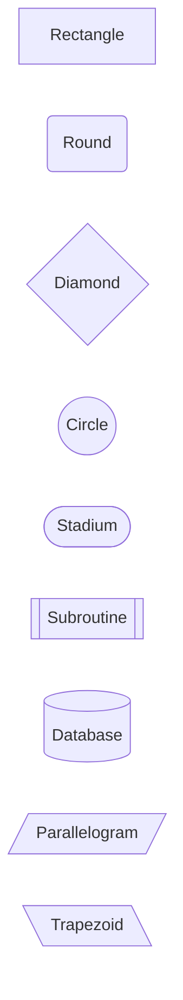
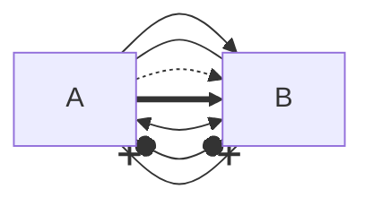

# Quick Reference

## Common Commands

```bash
# Build
npm run build                    # TypeScript build

# Test
npm test                         # Run test suite
npm run test:compare            # Compare with mermaid-cli
npm run lint:valid              # Test all valid fixtures
npm run lint:invalid            # Test all invalid fixtures

# Generate Documentation
npm run generate:previews       # Regenerate both preview files
npm run generate:valid          # Regenerate valid diagrams preview
npm run generate:invalid        # Regenerate invalid diagrams preview

# Development
# Update parser/tokens in src/chevrotain-*.ts and rebuild
```

## File Locations

```
src/chevrotain-lexer.ts        # Tokens and lexer
src/chevrotain-parser.ts       # Parser rules
test-fixtures/flowchart/       # Test cases
scripts/test-linter.js         # Test runner
scripts/compare-linters.js     # Comparison tool
out/cli.js                     # Runtime CLI (generated)
```

## Test Single File

```bash
# Test with our linter
node out/cli.js path/to/diagram.mmd

# Test with mermaid-cli
npx @mermaid-js/mermaid-cli -i path/to/diagram.mmd -o /tmp/test.svg
```

## Error Messages

### Our Linter Output

**Valid:**
```
✅ diagram.mmd: Valid
```

**Invalid:**
```
Found 2 error(s) in diagram.mmd:

error: diagram.mmd:2:1 - Missing arrow between nodes
error: diagram.mmd:3:5 - Invalid arrow syntax: -> (use --> instead)
```

**Warning:**
```
Found 1 warning(s) in diagram.mmd:

warning: diagram.mmd:2:11 - Link text must be enclosed in pipes: |text|
```

## Common Validation Errors

| Error | Example | Fix |
|-------|---------|-----|
| Invalid arrow | `A -> B` | `A --> B` |
| Wrong direction | `flowchart XY` | `flowchart TD` |
| Missing arrow | `A B` | `A --> B` |
| Mixed brackets | `[text)` | `[text]` |
| Unclosed bracket | `[text` | `[text]` |
| No diagram type | `A --> B` | `flowchart TD`<br>`    A --> B` |
| Empty diagram | `flowchart TD` | Add nodes/links |
| Invalid class | `class A` | `class A className` |
| Bad subgraph | `subgraph`<br>`end` | `subgraph id`<br>`end` |

## Valid Node Shapes



## Valid Arrow Types



## Debug Mode

Add logging to `src/cli.ts`:

```javascript
// Debug line processing
console.log('Processing line:', lineNum, line);

// Debug regex matches
const match = line.match(/pattern/);
console.log('Match result:', match);

// Debug error detection
if (errors.length > 0) {
  console.log('Errors found:', errors);
}
```

## Performance Check

```bash
# Time single file
time node out/cli.js test.mmd

# Time test suite
time npm test

# Memory usage
/usr/bin/time -l node out/cli.js test.mmd
```

## CI/CD Status Checks

```bash
# Simulate CI locally
rm -rf node_modules out/
npm ci
npm run build
npm test

# Check specific Node version
nvm use 18
npm test
nvm use 20
npm test
```

## Git Workflow

```bash
# Create feature branch
git checkout -b feature/new-validation

# Make changes and test
npm test
npm run test:compare

# Regenerate docs if needed
npm run generate:previews

# Commit
git add .
git commit -m "feat: Add validation for X"

# Push and create PR
git push -u origin feature/new-validation
```

## Troubleshooting

### Build Fails
```bash
rm -rf src/generated out/
npm run build
```

### Tests Fail
```bash
# Check specific file
node out/cli.js problem-file.mmd

# Compare with mermaid-cli
npx @mermaid-js/mermaid-cli -i problem-file.mmd -o /tmp/test.svg
```

### TypeScript Errors
```bash
npx tsc --noEmit
```

```

## Accuracy Requirement

**Must maintain 100% accuracy:**

```
Valid diagrams: 17/17 passing (100%)
Invalid diagrams: 13/13 detected (100%)
```

Any change that reduces accuracy should not be merged.

---

Last updated: 2024
