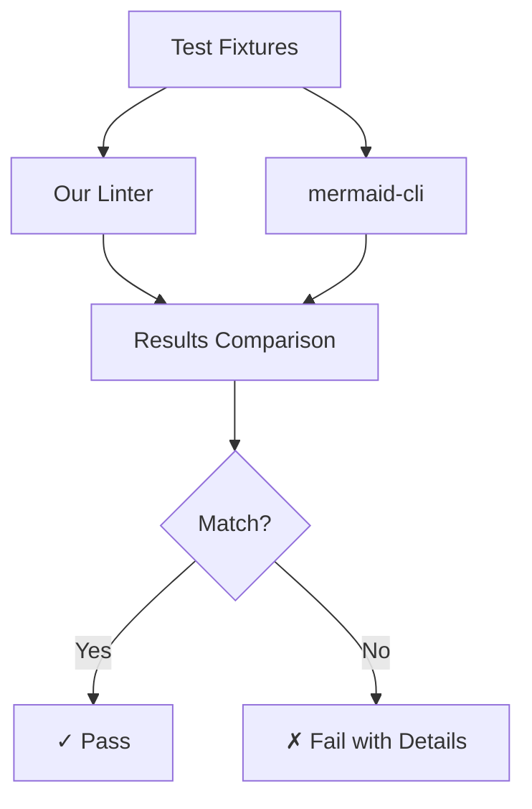
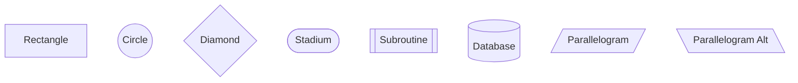

# Testing Documentation

## Overview

Our testing strategy ensures 100% compatibility with mermaid-cli through comprehensive fixture-based testing.

## Test Architecture



## Test Fixtures

### Structure

```
test-fixtures/flowchart/
├── valid/                 # 17 diagrams that should pass
│   ├── simple-flow.mmd
│   ├── complex-shapes.mmd
│   ├── subgraphs.mmd
│   └── ...
└── invalid/              # 13 diagrams that should fail
    ├── missing-arrow.mmd
    ├── wrong-direction.mmd
    ├── invalid-class.mmd
    └── ...
```

### Valid Fixtures Coverage

| Category | Files | Description |
|----------|-------|-------------|
| Basic Flow | `simple-flow.mmd` | Simple A→B connections |
| Node Shapes | `complex-shapes.mmd` | All Mermaid shapes: `[]`, `()`, `{}`, `[()]`, etc. |
| Arrows | `special-arrows.mmd`, `link-styles.mmd` | `-->`, `-.->`, `==>`, `<-->`, `o--o`, `x--x` |
| Subgraphs | `subgraphs.mmd`, `nested-subgraphs.mmd` | Grouping and nesting |
| Special Cases | `unicode-text.mmd`, `empty-nodes.mmd` | Edge cases |
| Styling | `styling-classes.mmd` | CSS classes and styles |

### Invalid Fixtures Coverage

| Error Type | File | Issue |
|------------|------|-------|
| Syntax | `invalid-arrow.mmd` | `->` instead of `-->` |
| Structure | `missing-arrow.mmd` | `A B` without connection |
| Direction | `wrong-direction.mmd` | `flowchart XY` (invalid) |
| Brackets | `unclosed-bracket.mmd`, `mixed-brackets.mmd` | `[text)` mismatches |
| Subgraph | `invalid-subgraph.mmd`, `duplicate-subgraph.mmd` | Missing ID, duplicates |
| Declaration | `no-diagram-type.mmd`, `empty-diagram.mmd` | Missing `flowchart` |

## Testing Scripts

### 1. Test Runner (`scripts/test-linter.js`)

**Purpose:** Validate our linter against all fixtures

**Algorithm:**
```javascript
function testLinter(filepath) {
  const output = execSync(`node ./out/cli.js "${filepath}"`);
  const hasError = output.includes('error');
  const hasWarning = output.includes('warning');
  
  return { 
    valid: !hasError, 
    hasWarning,
    output
  };
}
```

**Usage:**
```bash
node scripts/test-linter.js flowchart
```

**Output:**
```
Testing our linter for flowchart diagrams...
══════════════════════════════════════════════════

Valid diagrams:
  ✓ simple-flow.mmd              Valid
  ✓ complex-shapes.mmd           Valid
  ...

Invalid diagrams:
  ✓ missing-arrow.mmd            Invalid (correct)
  ✓ wrong-direction.mmd          Invalid (correct)
  ...

SUMMARY
────────────────────────────────────────
Valid diagrams: 17/17 passing (100%)
Invalid diagrams: 13/13 correctly detected (100%)
```

### 2. Comparison Tool (`scripts/compare-linters.js`)

**Purpose:** Compare our linter with mermaid-cli

**Process:**

1. **Run mermaid-cli:**
   ```javascript
   function runMermaidCli(filepath) {
     try {
       execSync(`npx @mermaid-js/mermaid-cli -i "${filepath}" -o /tmp/test.svg`);
       return { valid: true };
     } catch {
       return { valid: false };
     }
   }
   ```

2. **Run our linter:**
   ```javascript
   function runOurLinter(filepath) {
     try {
      execSync(`node ./out/cli.js "${filepath}"`);
       return { valid: true };
     } catch {
       return { valid: false };
     }
   }
   ```

3. **Compare results:**
   ```javascript
   function compareResults(mermaidResult, ourResult) {
     return mermaidResult.valid === ourResult.valid;
   }
   ```

**Usage:**
```bash
node scripts/compare-linters.js flowchart
```

**Output for matches:**
```
Testing: valid/simple-flow.mmd
──────────────────────────────
✓ MATCH - Both linters agree: VALID
```

**Output for mismatches:**
```
Testing: valid/special-chars.mmd
──────────────────────────────
✗ MISMATCH
  Mermaid CLI: INVALID
  Our Linter:  VALID
  Mermaid error: Parse error on line 2...
  Our linter output: No errors found
```

## Validation Rules

### Our Linter Checks

| Rule | Severity | Description |
|------|----------|-------------|
| Diagram Type | Error | Must start with `graph` or `flowchart` |
| Direction | Error | Must be TD, TB, BT, RL, LR |
| Arrow Syntax | Error | `->` invalid, use `-->` |
| Brackets | Error | Must match: `[]`, `()`, `{}`, not `[)` |
| Empty Diagram | Error | Must have content after declaration |
| Node Syntax | Error | Incomplete like `A((` |
| Subgraph | Error | Must have ID/title, no duplicates |
| Class Syntax | Error | `class A` needs className |
| Link Text | Warning | Should use pipes: `\|text\|` |
| Special Chars | Error | `\"` not supported, use `&quot;` |

### Special Shape Handling

We correctly handle Mermaid's special shapes:



These are NOT mixed brackets errors:
- `([text])` - Stadium shape ✓
- `[(text)]` - Database shape ✓

## Test Accuracy Metrics

### Current Status: 100%

```
┌─────────────────┬────────┬─────────┬──────────┐
│ Category        │ Total  │ Passing │ Accuracy │
├─────────────────┼────────┼─────────┼──────────┤
│ Valid Diagrams  │ 17     │ 17      │ 100%     │
│ Invalid Diagrams│ 13     │ 13      │ 100%     │
└─────────────────┴────────┴─────────┴──────────┘
```

### Historical Issues Found

Through testing, we discovered:

1. **mermaid-cli doesn't support `\"`** 
   - File: `special-chars.mmd`
   - Resolution: Moved from valid to invalid

2. **Nodes auto-create when referenced**
   - File: `undefined-node.mmd`
   - Resolution: Not an error

3. **Empty diagrams allowed by mermaid-cli**
   - File: `only-nodes.mmd`
   - Resolution: Allow nodes without connections

## Running Tests in CI

### GitHub Actions

```yaml
- name: Run linter tests
  run: npm test

- name: Test individual valid diagrams
  run: |
    for file in test-fixtures/flowchart/valid/*.mmd; do
      node out/cli.js "$file" || exit 1
    done

- name: Test individual invalid diagrams
  run: |
    for file in test-fixtures/flowchart/invalid/*.mmd; do
      if node out/cli.js "$file" 2>/dev/null; then
        echo "ERROR: $file should have failed!"
        exit 1
      fi
    done
```

### Local CI Simulation

```bash
# Clean environment
rm -rf node_modules out/
npm ci

# Build
npm run build

# Test
npm test

# Verify accuracy
npm run test:compare
```

## Debugging Test Failures

### 1. Identify the Failing File

```bash
npm test 2>&1 | grep "✗"
```

### 2. Test Individually

```bash
# Our linter
node out/cli.js test-fixtures/flowchart/valid/problem.mmd

# mermaid-cli
npx @mermaid-js/mermaid-cli -i test-fixtures/flowchart/valid/problem.mmd -o /tmp/test.svg
```

### 3. Debug the Validation Logic

Add logging to `src/cli.ts`:
```javascript
console.log('Line:', line);
console.log('Match:', line.match(/pattern/));
```

### 4. Test Regex Patterns

```bash
node -e "
  const line = 'flowchart TD';
  console.log('Match:', line.match(/^\s*(graph|flowchart)\s/));
"
```

## Performance Benchmarks

### Target Performance

| Operation | Target | Actual |
|-----------|--------|--------|
| Single file | < 50ms | ~10ms |
| All valid (17) | < 500ms | ~150ms |
| All invalid (13) | < 400ms | ~120ms |
| Full test suite | < 1s | ~300ms |

### Comparison

| Tool | Time for 30 files |
|------|-------------------|
| Our linter | ~300ms |
| mermaid-cli | ~15s (Puppeteer overhead) |

**50x faster** than mermaid-cli!

## Adding New Tests

### Checklist

- [ ] Add `.mmd` file to correct directory
- [ ] Test with our linter
- [ ] Test with mermaid-cli
- [ ] Run comparison: `npm run test:compare`
- [ ] Update count in this document
- [ ] Regenerate previews: `npm run generate:previews`
- [ ] Ensure 100% accuracy maintained
- [ ] Commit with descriptive message

### Example

```bash
# 1. Create test
echo "flowchart LR
    A[Test] --> B[Case]" > test-fixtures/flowchart/valid/new-test.mmd

# 2. Test locally
node out/cli.js test-fixtures/flowchart/valid/new-test.mmd

# 3. Compare
npm run test:compare

# 4. Regenerate docs
npm run generate:previews

# 5. Verify
npm test

# 6. Commit
git add test-fixtures/
git commit -m "test: Add new test case for XYZ feature"
```

---

Last updated: 2024
