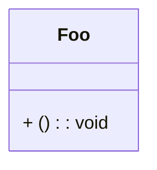

# Invalid Class Diagrams

This file contains invalid class test fixtures with:
- GitHub render attempts
- Error from mermaid-cli
- Error/output from our linter

> Note: Auto-generated by `scripts/generate-invalid-preview.js`. Do not edit manually.

## Table of Contents

1. [Invalid Relation](#1-invalid-relation)
2. [Member Malformed](#2-member-malformed)
3. [Missing Rbrace](#3-missing-rbrace)
4. [Quoted Name Double In Double](#4-quoted-name-double-in-double)
5. [Relation Missing Target](#5-relation-missing-target)

---

## Summary

| # | Diagram | mermaid-cli | maid | Auto-fix? |
|---:|---|:---:|:---:|:---:|
| 1 | [Invalid Relation](#1-invalid-relation) | INVALID | INVALID | — |
| 2 | [Member Malformed](#2-member-malformed) | VALID | INVALID | — |
| 3 | [Missing Rbrace](#3-missing-rbrace) | INVALID | INVALID | — |
| 4 | [Quoted Name Double In Double](#4-quoted-name-double-in-double) | INVALID | INVALID | — |
| 5 | [Relation Missing Target](#5-relation-missing-target) | INVALID | INVALID | — |

---

## 1. Invalid Relation

📄 **Source**: [`invalid-relation.mmd`](./invalid/invalid-relation.mmd)

### GitHub Render Attempt

> **Note**: This invalid diagram may not render or may render incorrectly.

```mermaid
classDiagram
Foo -> Bar : wrong arrow


```

### mermaid-cli Result: INVALID

```
Error: Parse error on line 2:
classDiagramFoo -> Bar : wrong arrow
-------------------^
Expecting 'LINE', 'DOTTED_LINE', got 'ALPHA'
Parser3.parseError (node_modules/mermaid/dist/mermaid.js:127920:28)
    at #evaluate (node_modules/puppeteer-core/lib/esm/puppeteer/cdp/ExecutionContext.js:388:19)
    at async ExecutionContext.evaluate (node_modules/puppeteer-core/lib/esm/puppeteer/cdp/ExecutionContext.js:275:16)
    at async IsolatedWorld.evaluate (node_modules/puppeteer-core/lib/esm/puppeteer/cdp/IsolatedWorld.js:97:16)
    at async CdpJSHandle.evaluate (node_modules/puppeteer-core/lib/esm/puppeteer/api/JSHandle.js:146:20)
    at async CdpElementHandle.evaluate (node_modules/puppeteer-core/lib/esm/puppeteer/api/ElementHandle.js:340:20)
    at async CdpElementHandle.$eval (node_modules/puppeteer-core/lib/esm/puppeteer/api/ElementHandle.js:494:24)
    at async CdpFrame.$eval (node_modules/puppeteer-core/lib/esm/puppeteer/api/Frame.js:450:20)
    at async CdpPage.$eval (node_modules/puppeteer-core/lib/esm/puppeteer/api/Page.js:450:20)
    at async renderMermaid (node_modules/@mermaid-js/mermaid-cli/src/index.js:266:22)
    at fromText (node_modules/mermaid/dist/mermaid.js:153955:21)
```

### maid Result: INVALID

```
file://node_modules/chevrotain/lib/src/parse/parser/parser.js:140
                throw new Error(`Parser Definition Errors detected:\n ${defErrorsMsgs.join("\n-------------------------------\n")}`);
                      ^

Error: Parser Definition Errors detected:
 ->OPTION<-
appears more than once (2 times) in the top level rule: ->relationStmt<-.
For further details see: https://chevrotain.io/docs/FAQ.html#NUMERICAL_SUFFIXES

-------------------------------
->OPTION2<-
appears more than once (2 times) in the top level rule: ->relationStmt<-.
For further details see: https://chevrotain.io/docs/FAQ.html#NUMERICAL_SUFFIXES

    at file://node_modules/chevrotain/lib/src/parse/parser/parser.js:140:23
    at ClassParser.TRACE_INIT (file://node_modules/chevrotain/lib/src/parse/parser/traits/perf_tracer.js:44:20)
    at ClassParser.performSelfAnalysis (file://node_modules/chevrotain/lib/src/parse/parser/parser.js:66:14)
    at new ClassParser (file://out/diagrams/class/parser.js:156:14)
    at file://out/diagrams/class/parser.js:159:31
    at ModuleJob.run (node:internal/modules/esm/module_job:371:25)
    at async onImport.tracePromise.__proto__ (node:internal/modules/esm/loader:683:26)
    at async asyncRunEntryPointWithESMLoader (node:internal/modules/run_main:101:5)

Node.js v24.7.0
```

### maid Auto-fix (`--fix`) Preview

No auto-fix changes (safe level).

### maid Auto-fix (`--fix=all`) Preview

No auto-fix changes (all level).

<details>
<summary>View source code</summary>

```
classDiagram
Foo -> Bar : wrong arrow


```
</details>

---

## 2. Member Malformed

📄 **Source**: [`member-malformed.mmd`](./invalid/member-malformed.mmd)

### GitHub Render Attempt

> **Note**: This invalid diagram may not render or may render incorrectly.



### mermaid-cli Result: VALID

### maid Result: INVALID

```
file://node_modules/chevrotain/lib/src/parse/parser/parser.js:140
                throw new Error(`Parser Definition Errors detected:\n ${defErrorsMsgs.join("\n-------------------------------\n")}`);
                      ^

Error: Parser Definition Errors detected:
 ->OPTION<-
appears more than once (2 times) in the top level rule: ->relationStmt<-.
For further details see: https://chevrotain.io/docs/FAQ.html#NUMERICAL_SUFFIXES

-------------------------------
->OPTION2<-
appears more than once (2 times) in the top level rule: ->relationStmt<-.
For further details see: https://chevrotain.io/docs/FAQ.html#NUMERICAL_SUFFIXES

    at file://node_modules/chevrotain/lib/src/parse/parser/parser.js:140:23
    at ClassParser.TRACE_INIT (file://node_modules/chevrotain/lib/src/parse/parser/traits/perf_tracer.js:44:20)
    at ClassParser.performSelfAnalysis (file://node_modules/chevrotain/lib/src/parse/parser/parser.js:66:14)
    at new ClassParser (file://out/diagrams/class/parser.js:156:14)
    at file://out/diagrams/class/parser.js:159:31
    at ModuleJob.run (node:internal/modules/esm/module_job:371:25)
    at async onImport.tracePromise.__proto__ (node:internal/modules/esm/loader:683:26)
    at async asyncRunEntryPointWithESMLoader (node:internal/modules/run_main:101:5)

Node.js v24.7.0
```

### maid Auto-fix (`--fix`) Preview

No auto-fix changes (safe level).

### maid Auto-fix (`--fix=all`) Preview

No auto-fix changes (all level).

<details>
<summary>View source code</summary>

```
classDiagram
class Foo {
  + () : void
}


```
</details>

---

## 3. Missing Rbrace

📄 **Source**: [`missing-rbrace.mmd`](./invalid/missing-rbrace.mmd)

### GitHub Render Attempt

> **Note**: This invalid diagram may not render or may render incorrectly.

```mermaid
classDiagram
class Foo {
  +bar()


```

### mermaid-cli Result: INVALID

```
Error: Parse error on line 3:
...ss Foo {  +bar()
-------------------^
Expecting 'STRUCT_STOP', 'MEMBER', got 'EOF_IN_STRUCT'
Parser3.parseError (node_modules/mermaid/dist/mermaid.js:127920:28)
    at #evaluate (node_modules/puppeteer-core/lib/esm/puppeteer/cdp/ExecutionContext.js:388:19)
    at async ExecutionContext.evaluate (node_modules/puppeteer-core/lib/esm/puppeteer/cdp/ExecutionContext.js:275:16)
    at async IsolatedWorld.evaluate (node_modules/puppeteer-core/lib/esm/puppeteer/cdp/IsolatedWorld.js:97:16)
    at async CdpJSHandle.evaluate (node_modules/puppeteer-core/lib/esm/puppeteer/api/JSHandle.js:146:20)
    at async CdpElementHandle.evaluate (node_modules/puppeteer-core/lib/esm/puppeteer/api/ElementHandle.js:340:20)
    at async CdpElementHandle.$eval (node_modules/puppeteer-core/lib/esm/puppeteer/api/ElementHandle.js:494:24)
    at async CdpFrame.$eval (node_modules/puppeteer-core/lib/esm/puppeteer/api/Frame.js:450:20)
    at async CdpPage.$eval (node_modules/puppeteer-core/lib/esm/puppeteer/api/Page.js:450:20)
    at async renderMermaid (node_modules/@mermaid-js/mermaid-cli/src/index.js:266:22)
    at fromText (node_modules/mermaid/dist/mermaid.js:153955:21)
```

### maid Result: INVALID

```
file://node_modules/chevrotain/lib/src/parse/parser/parser.js:140
                throw new Error(`Parser Definition Errors detected:\n ${defErrorsMsgs.join("\n-------------------------------\n")}`);
                      ^

Error: Parser Definition Errors detected:
 ->OPTION<-
appears more than once (2 times) in the top level rule: ->relationStmt<-.
For further details see: https://chevrotain.io/docs/FAQ.html#NUMERICAL_SUFFIXES

-------------------------------
->OPTION2<-
appears more than once (2 times) in the top level rule: ->relationStmt<-.
For further details see: https://chevrotain.io/docs/FAQ.html#NUMERICAL_SUFFIXES

    at file://node_modules/chevrotain/lib/src/parse/parser/parser.js:140:23
    at ClassParser.TRACE_INIT (file://node_modules/chevrotain/lib/src/parse/parser/traits/perf_tracer.js:44:20)
    at ClassParser.performSelfAnalysis (file://node_modules/chevrotain/lib/src/parse/parser/parser.js:66:14)
    at new ClassParser (file://out/diagrams/class/parser.js:156:14)
    at file://out/diagrams/class/parser.js:159:31
    at ModuleJob.run (node:internal/modules/esm/module_job:371:25)
    at async onImport.tracePromise.__proto__ (node:internal/modules/esm/loader:683:26)
    at async asyncRunEntryPointWithESMLoader (node:internal/modules/run_main:101:5)

Node.js v24.7.0
```

### maid Auto-fix (`--fix`) Preview

No auto-fix changes (safe level).

### maid Auto-fix (`--fix=all`) Preview

No auto-fix changes (all level).

<details>
<summary>View source code</summary>

```
classDiagram
class Foo {
  +bar()


```
</details>

---

## 4. Quoted Name Double In Double

📄 **Source**: [`quoted-name-double-in-double.mmd`](./invalid/quoted-name-double-in-double.mmd)

### GitHub Render Attempt

> **Note**: This invalid diagram may not render or may render incorrectly.

```mermaid
classDiagram
class "Logger "core"" as L


```

### mermaid-cli Result: INVALID

```
Error: Parse error on line 2:
classDiagramclass "Logger "core"" as L
-------------------^
Expecting 'ALPHA', 'NUM', 'MINUS', 'UNICODE_TEXT', 'BQUOTE_STR', got 'STR'
Parser3.parseError (node_modules/mermaid/dist/mermaid.js:127920:28)
    at #evaluate (node_modules/puppeteer-core/lib/esm/puppeteer/cdp/ExecutionContext.js:388:19)
    at async ExecutionContext.evaluate (node_modules/puppeteer-core/lib/esm/puppeteer/cdp/ExecutionContext.js:275:16)
    at async IsolatedWorld.evaluate (node_modules/puppeteer-core/lib/esm/puppeteer/cdp/IsolatedWorld.js:97:16)
    at async CdpJSHandle.evaluate (node_modules/puppeteer-core/lib/esm/puppeteer/api/JSHandle.js:146:20)
    at async CdpElementHandle.evaluate (node_modules/puppeteer-core/lib/esm/puppeteer/api/ElementHandle.js:340:20)
    at async CdpElementHandle.$eval (node_modules/puppeteer-core/lib/esm/puppeteer/api/ElementHandle.js:494:24)
    at async CdpFrame.$eval (node_modules/puppeteer-core/lib/esm/puppeteer/api/Frame.js:450:20)
    at async CdpPage.$eval (node_modules/puppeteer-core/lib/esm/puppeteer/api/Page.js:450:20)
    at async renderMermaid (node_modules/@mermaid-js/mermaid-cli/src/index.js:266:22)
    at fromText (node_modules/mermaid/dist/mermaid.js:153955:21)
```

### maid Result: INVALID

```
file://node_modules/chevrotain/lib/src/parse/parser/parser.js:140
                throw new Error(`Parser Definition Errors detected:\n ${defErrorsMsgs.join("\n-------------------------------\n")}`);
                      ^

Error: Parser Definition Errors detected:
 ->OPTION<-
appears more than once (2 times) in the top level rule: ->relationStmt<-.
For further details see: https://chevrotain.io/docs/FAQ.html#NUMERICAL_SUFFIXES

-------------------------------
->OPTION2<-
appears more than once (2 times) in the top level rule: ->relationStmt<-.
For further details see: https://chevrotain.io/docs/FAQ.html#NUMERICAL_SUFFIXES

    at file://node_modules/chevrotain/lib/src/parse/parser/parser.js:140:23
    at ClassParser.TRACE_INIT (file://node_modules/chevrotain/lib/src/parse/parser/traits/perf_tracer.js:44:20)
    at ClassParser.performSelfAnalysis (file://node_modules/chevrotain/lib/src/parse/parser/parser.js:66:14)
    at new ClassParser (file://out/diagrams/class/parser.js:156:14)
    at file://out/diagrams/class/parser.js:159:31
    at ModuleJob.run (node:internal/modules/esm/module_job:371:25)
    at async onImport.tracePromise.__proto__ (node:internal/modules/esm/loader:683:26)
    at async asyncRunEntryPointWithESMLoader (node:internal/modules/run_main:101:5)

Node.js v24.7.0
```

### maid Auto-fix (`--fix`) Preview

No auto-fix changes (safe level).

### maid Auto-fix (`--fix=all`) Preview

No auto-fix changes (all level).

<details>
<summary>View source code</summary>

```
classDiagram
class "Logger "core"" as L


```
</details>

---

## 5. Relation Missing Target

📄 **Source**: [`relation-missing-target.mmd`](./invalid/relation-missing-target.mmd)

### GitHub Render Attempt

> **Note**: This invalid diagram may not render or may render incorrectly.

```mermaid
classDiagram
Foo <|-- : extends


```

### mermaid-cli Result: INVALID

```
Error: Parse error on line 2:
...assDiagramFoo <|-- : extends
----------------------^
Expecting 'STR', 'ALPHA', 'AGGREGATION', 'EXTENSION', 'COMPOSITION', 'DEPENDENCY', 'LOLLIPOP', 'NUM', 'MINUS', 'UNICODE_TEXT', 'BQUOTE_STR', got 'LABEL'
Parser3.parseError (node_modules/mermaid/dist/mermaid.js:127920:28)
    at #evaluate (node_modules/puppeteer-core/lib/esm/puppeteer/cdp/ExecutionContext.js:388:19)
    at async ExecutionContext.evaluate (node_modules/puppeteer-core/lib/esm/puppeteer/cdp/ExecutionContext.js:275:16)
    at async IsolatedWorld.evaluate (node_modules/puppeteer-core/lib/esm/puppeteer/cdp/IsolatedWorld.js:97:16)
    at async CdpJSHandle.evaluate (node_modules/puppeteer-core/lib/esm/puppeteer/api/JSHandle.js:146:20)
    at async CdpElementHandle.evaluate (node_modules/puppeteer-core/lib/esm/puppeteer/api/ElementHandle.js:340:20)
    at async CdpElementHandle.$eval (node_modules/puppeteer-core/lib/esm/puppeteer/api/ElementHandle.js:494:24)
    at async CdpFrame.$eval (node_modules/puppeteer-core/lib/esm/puppeteer/api/Frame.js:450:20)
    at async CdpPage.$eval (node_modules/puppeteer-core/lib/esm/puppeteer/api/Page.js:450:20)
    at async renderMermaid (node_modules/@mermaid-js/mermaid-cli/src/index.js:266:22)
    at fromText (node_modules/mermaid/dist/mermaid.js:153955:21)
```

### maid Result: INVALID

```
file://node_modules/chevrotain/lib/src/parse/parser/parser.js:140
                throw new Error(`Parser Definition Errors detected:\n ${defErrorsMsgs.join("\n-------------------------------\n")}`);
                      ^

Error: Parser Definition Errors detected:
 ->OPTION<-
appears more than once (2 times) in the top level rule: ->relationStmt<-.
For further details see: https://chevrotain.io/docs/FAQ.html#NUMERICAL_SUFFIXES

-------------------------------
->OPTION2<-
appears more than once (2 times) in the top level rule: ->relationStmt<-.
For further details see: https://chevrotain.io/docs/FAQ.html#NUMERICAL_SUFFIXES

    at file://node_modules/chevrotain/lib/src/parse/parser/parser.js:140:23
    at ClassParser.TRACE_INIT (file://node_modules/chevrotain/lib/src/parse/parser/traits/perf_tracer.js:44:20)
    at ClassParser.performSelfAnalysis (file://node_modules/chevrotain/lib/src/parse/parser/parser.js:66:14)
    at new ClassParser (file://out/diagrams/class/parser.js:156:14)
    at file://out/diagrams/class/parser.js:159:31
    at ModuleJob.run (node:internal/modules/esm/module_job:371:25)
    at async onImport.tracePromise.__proto__ (node:internal/modules/esm/loader:683:26)
    at async asyncRunEntryPointWithESMLoader (node:internal/modules/run_main:101:5)

Node.js v24.7.0
```

### maid Auto-fix (`--fix`) Preview

No auto-fix changes (safe level).

### maid Auto-fix (`--fix=all`) Preview

No auto-fix changes (all level).

<details>
<summary>View source code</summary>

```
classDiagram
Foo <|-- : extends


```
</details>

---

## Notes

This document captures outputs from both tools for each fixture. Use the summary table above to spot mismatches.

Generated by scripts/generate-invalid-preview.js (deterministic output)

## How to Regenerate

```bash
node scripts/generate-invalid-preview.js class
```
