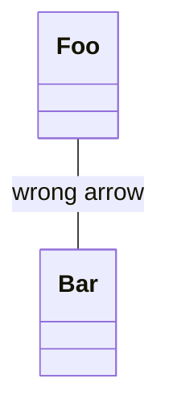
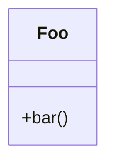
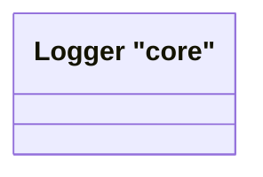

# Invalid Class Diagrams

This file contains invalid class test fixtures with:
- GitHub render attempts
- Error from mermaid-cli
- Error/output from our linter

> Note: Auto-generated by `scripts/generate-previews.js`. Do not edit manually.

## Table of Contents

1. [Generics And Types](#1-generics-and-types)
2. [Interface Double Quoted With Alias](#2-interface-double-quoted-with-alias)
3. [Interface Double Quoted](#3-interface-double-quoted)
4. [Invalid Relation](#4-invalid-relation)
5. [Missing Rbrace](#5-missing-rbrace)
6. [Namespace Missing Rbrace](#6-namespace-missing-rbrace)
7. [Quoted Name Double In Double](#7-quoted-name-double-in-double)
8. [Relation Missing Target](#8-relation-missing-target)

---

## Summary

| # | Diagram | mermaid-cli | maid | Auto-fix? |
|---:|---|:---:|:---:|:---:|
| 1 | [generics and types](#1-generics-and-types) | INVALID | INVALID | — |
| 2 | [interface double quoted with alias](#2-interface-double-quoted-with-alias) | INVALID | INVALID | ❌ safe |
| 3 | [interface double quoted](#3-interface-double-quoted) | INVALID | INVALID | ✅ safe |
| 4 | [invalid relation](#4-invalid-relation) | INVALID | INVALID | ✅ safe |
| 5 | [missing rbrace](#5-missing-rbrace) | INVALID | INVALID | ✅ safe |
| 6 | [namespace missing rbrace](#6-namespace-missing-rbrace) | INVALID | INVALID | ❌ safe |
| 7 | [quoted name double in double](#7-quoted-name-double-in-double) | INVALID | INVALID | ✅ safe |
| 8 | [relation missing target](#8-relation-missing-target) | INVALID | INVALID | — |

---

## 1. Generics And Types

📄 **Source**: [`generics-and-types.mmd`](./invalid/generics-and-types.mmd)

### GitHub Render Attempt

> **Note**: This invalid diagram may not render or may render incorrectly.

```mermaid
classDiagram
class Map
class Pair
Map <|-- Pair
class Service
class Client
Client ..> Service : uses
%% Generics in class names / member types (Mermaid CLI may not support these)
class Repo
Repo : get(): Result<string,int>
Repo : put(item: Pair<string,int>): void
class Node
Node <|-- Tree
Tree : root: Node<string>


```

### mermaid-cli Result: INVALID

```
Error: Parse error on line 9:
...ss RepoRepo : get(): Result<string,int>
----------------------^
Expecting 'NEWLINE', 'EOF', got 'LABEL'
Parser3.parseError (node_modules/mermaid/dist/mermaid.js:127920:28)
    at #evaluate (node_modules/puppeteer-core/lib/esm/puppeteer/cdp/ExecutionContext.js:388:19)
    at async ExecutionContext.evaluate (node_modules/puppeteer-core/lib/esm/puppeteer/cdp/ExecutionContext.js:275:16)
    at async IsolatedWorld.evaluate (node_modules/puppeteer-core/lib/esm/puppeteer/cdp/IsolatedWorld.js:97:16)
    at async CdpJSHandle.evaluate (node_modules/puppeteer-core/lib/esm/puppeteer/api/JSHandle.js:146:20)
    at async CdpElementHandle.evaluate (node_modules/puppeteer-core/lib/esm/puppeteer/api/ElementHandle.js:340:20)
    at async CdpElementHandle.$eval (node_modules/puppeteer-core/lib/esm/puppeteer/api/ElementHandle.js:494:24)
    at async CdpFrame.$eval (node_modules/puppeteer-core/lib/esm/puppeteer/api/Frame.js:450:20)
    at async CdpPage.$eval (node_modules/puppeteer-core/lib/esm/puppeteer/api/Page.js:450:20)
    at async renderMermaid (node_modules/@mermaid-js/mermaid-cli/src/index.js:266:22)
    at fromText (node_modules/mermaid/dist/mermaid.js:153955:21)
```

### maid Result: INVALID

```
error: Redundant input, expecting EOF but found: <string,int>
at test-fixtures/class/invalid/generics-and-types.mmd:10:21
   9 | class Repo
  10 | Repo : get(): Result<string,int>
     |                     ^^^^^^^^^^^^
  11 | Repo : put(item: Pair<string,int>): void
```

### maid Auto-fix (`--fix`) Preview

No auto-fix changes (safe level).

### maid Auto-fix (`--fix=all`) Preview

No auto-fix changes (all level).

<details>
<summary>View source code</summary>

```
classDiagram
class Map
class Pair
Map <|-- Pair
class Service
class Client
Client ..> Service : uses
%% Generics in class names / member types (Mermaid CLI may not support these)
class Repo
Repo : get(): Result<string,int>
Repo : put(item: Pair<string,int>): void
class Node
Node <|-- Tree
Tree : root: Node<string>


```
</details>

---

## 2. Interface Double Quoted With Alias

📄 **Source**: [`interface-double-quoted-with-alias.mmd`](./invalid/interface-double-quoted-with-alias.mmd)

### GitHub Render Attempt

> **Note**: This invalid diagram may not render or may render incorrectly.

```mermaid
classDiagram
    interface "IStorage Adapter" as ISA

```

### mermaid-cli Result: INVALID

```
Error: Parse error on line 2:
... "IStorage Adapter" as ISA
-----------------------^
Expecting 'AGGREGATION', 'EXTENSION', 'COMPOSITION', 'DEPENDENCY', 'LOLLIPOP', 'LINE', 'DOTTED_LINE', got 'ALPHA'
Parser3.parseError (node_modules/mermaid/dist/mermaid.js:127920:28)
    at #evaluate (node_modules/puppeteer-core/lib/esm/puppeteer/cdp/ExecutionContext.js:388:19)
    at async ExecutionContext.evaluate (node_modules/puppeteer-core/lib/esm/puppeteer/cdp/ExecutionContext.js:275:16)
    at async IsolatedWorld.evaluate (node_modules/puppeteer-core/lib/esm/puppeteer/cdp/IsolatedWorld.js:97:16)
    at async CdpJSHandle.evaluate (node_modules/puppeteer-core/lib/esm/puppeteer/api/JSHandle.js:146:20)
    at async CdpElementHandle.evaluate (node_modules/puppeteer-core/lib/esm/puppeteer/api/ElementHandle.js:340:20)
    at async CdpElementHandle.$eval (node_modules/puppeteer-core/lib/esm/puppeteer/api/ElementHandle.js:494:24)
    at async CdpFrame.$eval (node_modules/puppeteer-core/lib/esm/puppeteer/api/Frame.js:450:20)
    at async CdpPage.$eval (node_modules/puppeteer-core/lib/esm/puppeteer/api/Page.js:450:20)
    at async renderMermaid (node_modules/@mermaid-js/mermaid-cli/src/index.js:266:22)
    at fromText (node_modules/mermaid/dist/mermaid.js:153955:21)
```

### maid Result: INVALID

```
error[CL-INTERFACE-NAME-DOUBLE-QUOTED]: Double-quoted interface name is not supported. Use backticks for names with spaces/punctuation, or use a label.
at test-fixtures/class/invalid/interface-double-quoted-with-alias.mmd:2:15
  1 | classDiagram
  2 |     interface "IStorage Adapter" as ISA
    |               ^^^^^^^^^^^^^^^^^^
  3 | 
hint: Example: interface `IStorage Adapter` as ISA  or  interface ISA["IStorage Adapter"]
```

### maid Auto-fix (`--fix`) Preview

```mermaid
classDiagram
    interface ISA["IStorage Adapter"]

```

### maid Auto-fix (`--fix=all`) Preview

Shown above (safe changes applied).

<details>
<summary>View source code</summary>

```
classDiagram
    interface "IStorage Adapter" as ISA

```
</details>

---

## 3. Interface Double Quoted

📄 **Source**: [`interface-double-quoted.mmd`](./invalid/interface-double-quoted.mmd)

### GitHub Render Attempt

> **Note**: This invalid diagram may not render or may render incorrectly.

```mermaid
classDiagram
    interface "IStorage Adapter"

```

### mermaid-cli Result: INVALID

```
Error: Parse error on line 2:
...e "IStorage Adapter"
-----------------------^
Expecting 'AGGREGATION', 'EXTENSION', 'COMPOSITION', 'DEPENDENCY', 'LOLLIPOP', 'LINE', 'DOTTED_LINE', got 'NEWLINE'
Parser3.parseError (node_modules/mermaid/dist/mermaid.js:127920:28)
    at #evaluate (node_modules/puppeteer-core/lib/esm/puppeteer/cdp/ExecutionContext.js:388:19)
    at async ExecutionContext.evaluate (node_modules/puppeteer-core/lib/esm/puppeteer/cdp/ExecutionContext.js:275:16)
    at async IsolatedWorld.evaluate (node_modules/puppeteer-core/lib/esm/puppeteer/cdp/IsolatedWorld.js:97:16)
    at async CdpJSHandle.evaluate (node_modules/puppeteer-core/lib/esm/puppeteer/api/JSHandle.js:146:20)
    at async CdpElementHandle.evaluate (node_modules/puppeteer-core/lib/esm/puppeteer/api/ElementHandle.js:340:20)
    at async CdpElementHandle.$eval (node_modules/puppeteer-core/lib/esm/puppeteer/api/ElementHandle.js:494:24)
    at async CdpFrame.$eval (node_modules/puppeteer-core/lib/esm/puppeteer/api/Frame.js:450:20)
    at async CdpPage.$eval (node_modules/puppeteer-core/lib/esm/puppeteer/api/Page.js:450:20)
    at async renderMermaid (node_modules/@mermaid-js/mermaid-cli/src/index.js:266:22)
    at fromText (node_modules/mermaid/dist/mermaid.js:153955:21)
```

### maid Result: INVALID

```
error[CL-INTERFACE-NAME-DOUBLE-QUOTED]: Double-quoted interface name is not supported. Use backticks for names with spaces/punctuation, or use a label.
at test-fixtures/class/invalid/interface-double-quoted.mmd:2:15
  1 | classDiagram
  2 |     interface "IStorage Adapter"
    |               ^^^^^^^^^^^^^^^^^^
  3 | 
hint: Example: interface `IStorage Adapter` as ISA  or  interface ISA["IStorage Adapter"]
```

### maid Auto-fix (`--fix`) Preview

```mermaid
classDiagram
    interface `IStorage Adapter`

```

### maid Auto-fix (`--fix=all`) Preview

Shown above (safe changes applied).

<details>
<summary>View source code</summary>

```
classDiagram
    interface "IStorage Adapter"

```
</details>

---

## 4. Invalid Relation

📄 **Source**: [`invalid-relation.mmd`](./invalid/invalid-relation.mmd)

### GitHub Render Attempt

> **Note**: This invalid diagram may not render or may render incorrectly.

```mermaid
classDiagram
Foo -> Bar : wrong arrow


```

### mermaid-cli Result: INVALID

```
Error: Parse error on line 2:
classDiagramFoo -> Bar : wrong arrow
-------------------^
Expecting 'LINE', 'DOTTED_LINE', got 'ALPHA'
Parser3.parseError (node_modules/mermaid/dist/mermaid.js:127920:28)
    at #evaluate (node_modules/puppeteer-core/lib/esm/puppeteer/cdp/ExecutionContext.js:388:19)
    at async ExecutionContext.evaluate (node_modules/puppeteer-core/lib/esm/puppeteer/cdp/ExecutionContext.js:275:16)
    at async IsolatedWorld.evaluate (node_modules/puppeteer-core/lib/esm/puppeteer/cdp/IsolatedWorld.js:97:16)
    at async CdpJSHandle.evaluate (node_modules/puppeteer-core/lib/esm/puppeteer/api/JSHandle.js:146:20)
    at async CdpElementHandle.evaluate (node_modules/puppeteer-core/lib/esm/puppeteer/api/ElementHandle.js:340:20)
    at async CdpElementHandle.$eval (node_modules/puppeteer-core/lib/esm/puppeteer/api/ElementHandle.js:494:24)
    at async CdpFrame.$eval (node_modules/puppeteer-core/lib/esm/puppeteer/api/Frame.js:450:20)
    at async CdpPage.$eval (node_modules/puppeteer-core/lib/esm/puppeteer/api/Page.js:450:20)
    at async renderMermaid (node_modules/@mermaid-js/mermaid-cli/src/index.js:266:22)
    at fromText (node_modules/mermaid/dist/mermaid.js:153955:21)
```

### maid Result: INVALID

```
error[CL-REL-INVALID]: Invalid relationship operator '->'. Use <|--, *--, o--, --, ..> or ..|>.
at test-fixtures/class/invalid/invalid-relation.mmd:2:5
  1 | classDiagram
  2 | Foo -> Bar : wrong arrow
    |     ^^
  3 | 
hint: Example: Foo <|-- Bar
```

### maid Auto-fix (`--fix`) Preview



### maid Auto-fix (`--fix=all`) Preview

Shown above (safe changes applied).

<details>
<summary>View source code</summary>

```
classDiagram
Foo -> Bar : wrong arrow


```
</details>

---

## 5. Missing Rbrace

📄 **Source**: [`missing-rbrace.mmd`](./invalid/missing-rbrace.mmd)

### GitHub Render Attempt

> **Note**: This invalid diagram may not render or may render incorrectly.

```mermaid
classDiagram
class Foo {
  +bar()


```

### mermaid-cli Result: INVALID

```
Error: Parse error on line 3:
...ss Foo {  +bar()
-------------------^
Expecting 'STRUCT_STOP', 'MEMBER', got 'EOF_IN_STRUCT'
Parser3.parseError (node_modules/mermaid/dist/mermaid.js:127920:28)
    at #evaluate (node_modules/puppeteer-core/lib/esm/puppeteer/cdp/ExecutionContext.js:388:19)
    at async ExecutionContext.evaluate (node_modules/puppeteer-core/lib/esm/puppeteer/cdp/ExecutionContext.js:275:16)
    at async IsolatedWorld.evaluate (node_modules/puppeteer-core/lib/esm/puppeteer/cdp/IsolatedWorld.js:97:16)
    at async CdpJSHandle.evaluate (node_modules/puppeteer-core/lib/esm/puppeteer/api/JSHandle.js:146:20)
    at async CdpElementHandle.evaluate (node_modules/puppeteer-core/lib/esm/puppeteer/api/ElementHandle.js:340:20)
    at async CdpElementHandle.$eval (node_modules/puppeteer-core/lib/esm/puppeteer/api/ElementHandle.js:494:24)
    at async CdpFrame.$eval (node_modules/puppeteer-core/lib/esm/puppeteer/api/Frame.js:450:20)
    at async CdpPage.$eval (node_modules/puppeteer-core/lib/esm/puppeteer/api/Page.js:450:20)
    at async renderMermaid (node_modules/@mermaid-js/mermaid-cli/src/index.js:266:22)
    at fromText (node_modules/mermaid/dist/mermaid.js:153955:21)
```

### maid Result: INVALID

```
error[CL-BLOCK-MISSING-RBRACE]: Missing '}' to close class block.
at test-fixtures/class/invalid/missing-rbrace.mmd:5:1
  2 | class Foo {  ← start of 'class'
    | …
  5 | 
  6 | }  ← insert '}' here
hint: Close the block: class Foo { ... }
```

### maid Auto-fix (`--fix`) Preview



### maid Auto-fix (`--fix=all`) Preview

Shown above (safe changes applied).

<details>
<summary>View source code</summary>

```
classDiagram
class Foo {
  +bar()


```
</details>

---

## 6. Namespace Missing Rbrace

📄 **Source**: [`namespace-missing-rbrace.mmd`](./invalid/namespace-missing-rbrace.mmd)

### GitHub Render Attempt

> **Note**: This invalid diagram may not render or may render incorrectly.

```mermaid
classDiagram
    namespace "Core Classes" {
        class Engine
        class Wheel

    class Display

```

### mermaid-cli Result: INVALID

```
Error: Parse error on line 2:
...gram    namespace "Core Classes" {    
----------------------^
Expecting 'ALPHA', 'NUM', 'MINUS', 'UNICODE_TEXT', 'BQUOTE_STR', got 'STR'
Parser3.parseError (node_modules/mermaid/dist/mermaid.js:127920:28)
    at #evaluate (node_modules/puppeteer-core/lib/esm/puppeteer/cdp/ExecutionContext.js:388:19)
    at async ExecutionContext.evaluate (node_modules/puppeteer-core/lib/esm/puppeteer/cdp/ExecutionContext.js:275:16)
    at async IsolatedWorld.evaluate (node_modules/puppeteer-core/lib/esm/puppeteer/cdp/IsolatedWorld.js:97:16)
    at async CdpJSHandle.evaluate (node_modules/puppeteer-core/lib/esm/puppeteer/api/JSHandle.js:146:20)
    at async CdpElementHandle.evaluate (node_modules/puppeteer-core/lib/esm/puppeteer/api/ElementHandle.js:340:20)
    at async CdpElementHandle.$eval (node_modules/puppeteer-core/lib/esm/puppeteer/api/ElementHandle.js:494:24)
    at async CdpFrame.$eval (node_modules/puppeteer-core/lib/esm/puppeteer/api/Frame.js:450:20)
    at async CdpPage.$eval (node_modules/puppeteer-core/lib/esm/puppeteer/api/Page.js:450:20)
    at async renderMermaid (node_modules/@mermaid-js/mermaid-cli/src/index.js:266:22)
    at fromText (node_modules/mermaid/dist/mermaid.js:153955:21)
```

### maid Result: INVALID

```
error[CL-NAMESPACE-MISSING-RBRACE]: Missing '}' to close namespace block.
at test-fixtures/class/invalid/namespace-missing-rbrace.mmd:7:1
  6 |     class Display
  7 | 
    | ^
hint: Close the block: namespace "Name" { ... }
```

### maid Auto-fix (`--fix`) Preview

```mermaid
classDiagram
    namespace "Core Classes" {
        class Engine
        class Wheel

    }
    class Display

```

### maid Auto-fix (`--fix=all`) Preview

Shown above (safe changes applied).

<details>
<summary>View source code</summary>

```
classDiagram
    namespace "Core Classes" {
        class Engine
        class Wheel

    class Display

```
</details>

---

## 7. Quoted Name Double In Double

📄 **Source**: [`quoted-name-double-in-double.mmd`](./invalid/quoted-name-double-in-double.mmd)

### GitHub Render Attempt

> **Note**: This invalid diagram may not render or may render incorrectly.

```mermaid
classDiagram
class "Logger "core"" as L


```

### mermaid-cli Result: INVALID

```
Error: Parse error on line 2:
classDiagramclass "Logger "core"" as L
-------------------^
Expecting 'ALPHA', 'NUM', 'MINUS', 'UNICODE_TEXT', 'BQUOTE_STR', got 'STR'
Parser3.parseError (node_modules/mermaid/dist/mermaid.js:127920:28)
    at #evaluate (node_modules/puppeteer-core/lib/esm/puppeteer/cdp/ExecutionContext.js:388:19)
    at async ExecutionContext.evaluate (node_modules/puppeteer-core/lib/esm/puppeteer/cdp/ExecutionContext.js:275:16)
    at async IsolatedWorld.evaluate (node_modules/puppeteer-core/lib/esm/puppeteer/cdp/IsolatedWorld.js:97:16)
    at async CdpJSHandle.evaluate (node_modules/puppeteer-core/lib/esm/puppeteer/api/JSHandle.js:146:20)
    at async CdpElementHandle.evaluate (node_modules/puppeteer-core/lib/esm/puppeteer/api/ElementHandle.js:340:20)
    at async CdpElementHandle.$eval (node_modules/puppeteer-core/lib/esm/puppeteer/api/ElementHandle.js:494:24)
    at async CdpFrame.$eval (node_modules/puppeteer-core/lib/esm/puppeteer/api/Frame.js:450:20)
    at async CdpPage.$eval (node_modules/puppeteer-core/lib/esm/puppeteer/api/Page.js:450:20)
    at async renderMermaid (node_modules/@mermaid-js/mermaid-cli/src/index.js:266:22)
    at fromText (node_modules/mermaid/dist/mermaid.js:153955:21)
```

### maid Result: INVALID

```
error[CL-NAME-DOUBLE-QUOTED]: Double-quoted class name is not supported. Use backticks for names with spaces/punctuation, or use a label.
at test-fixtures/class/invalid/quoted-name-double-in-double.mmd:2:7
  1 | classDiagram
  2 | class "Logger "core"" as L
    |       ^^^^^^^^^
  3 | 
hint: Example: class `Logger "core"` as L  or  class L["Logger "core""]
```

### maid Auto-fix (`--fix`) Preview



### maid Auto-fix (`--fix=all`) Preview

Shown above (safe changes applied).

<details>
<summary>View source code</summary>

```
classDiagram
class "Logger "core"" as L


```
</details>

---

## 8. Relation Missing Target

📄 **Source**: [`relation-missing-target.mmd`](./invalid/relation-missing-target.mmd)

### GitHub Render Attempt

> **Note**: This invalid diagram may not render or may render incorrectly.

```mermaid
classDiagram
Foo <|-- : extends


```

### mermaid-cli Result: INVALID

```
Error: Parse error on line 2:
...assDiagramFoo <|-- : extends
----------------------^
Expecting 'STR', 'ALPHA', 'AGGREGATION', 'EXTENSION', 'COMPOSITION', 'DEPENDENCY', 'LOLLIPOP', 'NUM', 'MINUS', 'UNICODE_TEXT', 'BQUOTE_STR', got 'LABEL'
Parser3.parseError (node_modules/mermaid/dist/mermaid.js:127920:28)
    at #evaluate (node_modules/puppeteer-core/lib/esm/puppeteer/cdp/ExecutionContext.js:388:19)
    at async ExecutionContext.evaluate (node_modules/puppeteer-core/lib/esm/puppeteer/cdp/ExecutionContext.js:275:16)
    at async IsolatedWorld.evaluate (node_modules/puppeteer-core/lib/esm/puppeteer/cdp/IsolatedWorld.js:97:16)
    at async CdpJSHandle.evaluate (node_modules/puppeteer-core/lib/esm/puppeteer/api/JSHandle.js:146:20)
    at async CdpElementHandle.evaluate (node_modules/puppeteer-core/lib/esm/puppeteer/api/ElementHandle.js:340:20)
    at async CdpElementHandle.$eval (node_modules/puppeteer-core/lib/esm/puppeteer/api/ElementHandle.js:494:24)
    at async CdpFrame.$eval (node_modules/puppeteer-core/lib/esm/puppeteer/api/Frame.js:450:20)
    at async CdpPage.$eval (node_modules/puppeteer-core/lib/esm/puppeteer/api/Page.js:450:20)
    at async renderMermaid (node_modules/@mermaid-js/mermaid-cli/src/index.js:266:22)
    at fromText (node_modules/mermaid/dist/mermaid.js:153955:21)
```

### maid Result: INVALID

```
error[CL-REL-MALFORMED]: Malformed relationship. Provide a target class before the label.
at test-fixtures/class/invalid/relation-missing-target.mmd:2:10
  1 | classDiagram
  2 | Foo <|-- : extends
    |          ^
  3 | 
hint: Use: A <|-- B : label
```

### maid Auto-fix (`--fix`) Preview

No auto-fix changes (safe level).

### maid Auto-fix (`--fix=all`) Preview

No auto-fix changes (all level).

<details>
<summary>View source code</summary>

```
classDiagram
Foo <|-- : extends


```
</details>

---

