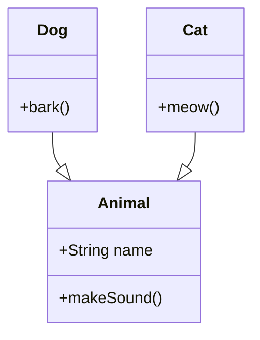
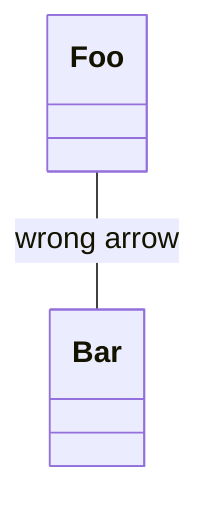
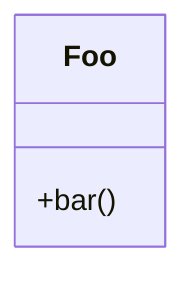
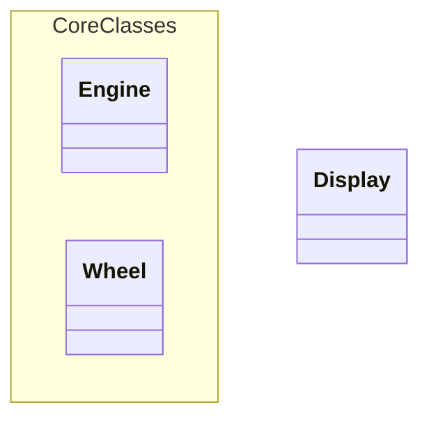
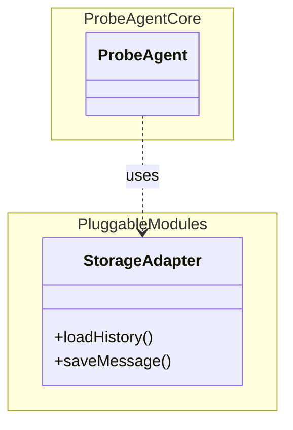
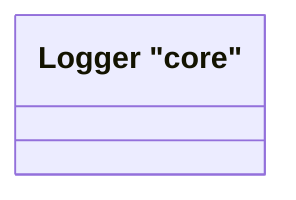

# Invalid Class Diagrams

This file contains invalid class test fixtures with:
- GitHub render attempts
- Error from mermaid-cli
- Error/output from our linter

> Note: Auto-generated by `scripts/generate-previews.js`. Do not edit manually.

## Table of Contents

1. [Generics And Types](#1-generics-and-types)
2. [Interface Example](#2-interface-example)
3. [Invalid Relation](#3-invalid-relation)
4. [Missing Rbrace](#4-missing-rbrace)
5. [Namespace Missing Rbrace](#5-namespace-missing-rbrace)
6. [Namespace Quoted And Interface Keyword](#6-namespace-quoted-and-interface-keyword)
7. [Quoted Name Double In Double](#7-quoted-name-double-in-double)
8. [Relation Missing Target](#8-relation-missing-target)

---

## Summary

| # | Diagram | mermaid-cli | maid | Auto-fix? |
|---:|---|:---:|:---:|:---:|
| 1 | [generics and types](#1-generics-and-types) | INVALID | INVALID | — |
| 2 | [interface example](#2-interface-example) | INVALID | INVALID | ✅ safe |
| 3 | [invalid relation](#3-invalid-relation) | INVALID | INVALID | ✅ safe |
| 4 | [missing rbrace](#4-missing-rbrace) | INVALID | INVALID | ✅ safe |
| 5 | [namespace missing rbrace](#5-namespace-missing-rbrace) | INVALID | INVALID | ✅ safe |
| 6 | [namespace quoted and interface keyword](#6-namespace-quoted-and-interface-keyword) | INVALID | INVALID | ✅ safe |
| 7 | [quoted name double in double](#7-quoted-name-double-in-double) | INVALID | INVALID | ✅ safe |
| 8 | [relation missing target](#8-relation-missing-target) | INVALID | INVALID | — |

---

## 1. Generics And Types

📄 **Source**: [`generics-and-types.mmd`](./invalid/generics-and-types.mmd)

### GitHub Render Attempt

> **Note**: This invalid diagram may not render or may render incorrectly.

```mermaid
classDiagram
class Map
class Pair
Map <|-- Pair
class Service
class Client
Client ..> Service : uses
%% Generics in class names / member types (Mermaid CLI may not support these)
class Repo
Repo : get(): Result<string,int>
Repo : put(item: Pair<string,int>): void
class Node
Node <|-- Tree
Tree : root: Node<string>


```

### Error Comparison: mermaid-cli vs maid

<table>
<tr>
<th width="50%">mermaid-cli</th>
<th width="50%">maid</th>
</tr>
<tr>
<td valign="top">

**Result**: ❌ INVALID

```
Error: Parse error on line 9:
```

</td>
<td valign="top">

**Result**: ❌ INVALID

```
error: Redundant input, expecting EOF but found: <string,int>
at test-fixtures/class/invalid/generics-and-types.mmd:10:21
   9 | class Repo
  10 | Repo : get(): Result<string,int>
     |                     ^^^^^^^^^^^^
  11 | Repo : put(item: Pair<string,int>): void
```

</td>
</tr>
</table>

### maid Auto-fix (`--fix`) Preview

No auto-fix changes (safe level).

### maid Auto-fix (`--fix=all`) Preview

No auto-fix changes (all level).

<details>
<summary>View source code</summary>

```
classDiagram
class Map
class Pair
Map <|-- Pair
class Service
class Client
Client ..> Service : uses
%% Generics in class names / member types (Mermaid CLI may not support these)
class Repo
Repo : get(): Result<string,int>
Repo : put(item: Pair<string,int>): void
class Node
Node <|-- Tree
Tree : root: Node<string>


```
</details>

---

## 2. Interface Example

📄 **Source**: [`interface-example.mmd`](./invalid/interface-example.mmd)

### GitHub Render Attempt

> **Note**: This invalid diagram may not render or may render incorrectly.

```mermaid
classDiagram
    interface Animal {
        +String name
        +makeSound()
    }

    class Dog {
        +bark()
    }

    class Cat {
        +meow()
    }

    Dog --|> Animal
    Cat --|> Animal

```

### Error Comparison: mermaid-cli vs maid

<table>
<tr>
<th width="50%">mermaid-cli</th>
<th width="50%">maid</th>
</tr>
<tr>
<td valign="top">

**Result**: ❌ INVALID

```
Error: Lexical error on line 2. Unrecognized text.
```

</td>
<td valign="top">

**Result**: ❌ INVALID

```
error[CL-INTERFACE-KEYWORD-UNSUPPORTED]: The "interface" keyword is not supported by mermaid.js. Use the <<interface>> annotation instead.
at test-fixtures/class/invalid/interface-example.mmd:2:5
   1 | classDiagram
   2 |     interface Animal {
     |     ^^^^^^^^^
   3 |         +String name
hint: Auto-fix converts to "class". Then manually add: <<interface>> ClassName after the class definition
```

</td>
</tr>
</table>

### maid Auto-fix (`--fix`) Preview



### maid Auto-fix (`--fix=all`) Preview

Shown above (safe changes applied).

<details>
<summary>View source code</summary>

```
classDiagram
    interface Animal {
        +String name
        +makeSound()
    }

    class Dog {
        +bark()
    }

    class Cat {
        +meow()
    }

    Dog --|> Animal
    Cat --|> Animal

```
</details>

---

## 3. Invalid Relation

📄 **Source**: [`invalid-relation.mmd`](./invalid/invalid-relation.mmd)

### GitHub Render Attempt

> **Note**: This invalid diagram may not render or may render incorrectly.

```mermaid
classDiagram
Foo -> Bar : wrong arrow


```

### Error Comparison: mermaid-cli vs maid

<table>
<tr>
<th width="50%">mermaid-cli</th>
<th width="50%">maid</th>
</tr>
<tr>
<td valign="top">

**Result**: ❌ INVALID

```
Error: Parse error on line 2:
```

</td>
<td valign="top">

**Result**: ❌ INVALID

```
error[CL-REL-INVALID]: Invalid relationship operator '->'. Use <|--, *--, o--, --, ..> or ..|>.
at test-fixtures/class/invalid/invalid-relation.mmd:2:5
  1 | classDiagram
  2 | Foo -> Bar : wrong arrow
    |     ^^
  3 | 
hint: Example: Foo <|-- Bar
```

</td>
</tr>
</table>

### maid Auto-fix (`--fix`) Preview



### maid Auto-fix (`--fix=all`) Preview

Shown above (safe changes applied).

<details>
<summary>View source code</summary>

```
classDiagram
Foo -> Bar : wrong arrow


```
</details>

---

## 4. Missing Rbrace

📄 **Source**: [`missing-rbrace.mmd`](./invalid/missing-rbrace.mmd)

### GitHub Render Attempt

> **Note**: This invalid diagram may not render or may render incorrectly.

```mermaid
classDiagram
class Foo {
  +bar()


```

### Error Comparison: mermaid-cli vs maid

<table>
<tr>
<th width="50%">mermaid-cli</th>
<th width="50%">maid</th>
</tr>
<tr>
<td valign="top">

**Result**: ❌ INVALID

```
Error: Parse error on line 3:
```

</td>
<td valign="top">

**Result**: ❌ INVALID

```
error[CL-BLOCK-MISSING-RBRACE]: Missing '}' to close class block.
at test-fixtures/class/invalid/missing-rbrace.mmd:5:1
  2 | class Foo {  ← start of 'class'
    | …
  5 | 
  6 | }  ← insert '}' here
hint: Close the block: class Foo { ... }
```

</td>
</tr>
</table>

### maid Auto-fix (`--fix`) Preview



### maid Auto-fix (`--fix=all`) Preview

Shown above (safe changes applied).

<details>
<summary>View source code</summary>

```
classDiagram
class Foo {
  +bar()


```
</details>

---

## 5. Namespace Missing Rbrace

📄 **Source**: [`namespace-missing-rbrace.mmd`](./invalid/namespace-missing-rbrace.mmd)

### GitHub Render Attempt

> **Note**: This invalid diagram may not render or may render incorrectly.

```mermaid
classDiagram
    namespace "Core Classes" {
        class Engine
        class Wheel

    class Display

```

### Error Comparison: mermaid-cli vs maid

<table>
<tr>
<th width="50%">mermaid-cli</th>
<th width="50%">maid</th>
</tr>
<tr>
<td valign="top">

**Result**: ❌ INVALID

```
Error: Parse error on line 2:
```

</td>
<td valign="top">

**Result**: ❌ INVALID

```
error[CL-NAMESPACE-NAME-QUOTED]: Quoted namespace names are not supported by mermaid.js. Use an unquoted identifier.
at test-fixtures/class/invalid/namespace-missing-rbrace.mmd:2:15
  1 | classDiagram
  2 |     namespace "Core Classes" {
    |               ^^^^^^^^^^^^^^
  3 |         class Engine
hint: Change: namespace "ProbeAgent Core" { ... } → namespace ProbeAgentCore { ... }

error[CL-NAMESPACE-MISSING-RBRACE]: Missing '}' to close namespace block.
at test-fixtures/class/invalid/namespace-missing-rbrace.mmd:7:1
  6 |     class Display
  7 | 
    | ^
hint: Close the block: namespace "Name" { ... }
```

</td>
</tr>
</table>

### maid Auto-fix (`--fix`) Preview



### maid Auto-fix (`--fix=all`) Preview

Shown above (safe changes applied).

<details>
<summary>View source code</summary>

```
classDiagram
    namespace "Core Classes" {
        class Engine
        class Wheel

    class Display

```
</details>

---

## 6. Namespace Quoted And Interface Keyword

📄 **Source**: [`namespace-quoted-and-interface-keyword.mmd`](./invalid/namespace-quoted-and-interface-keyword.mmd)

### GitHub Render Attempt

> **Note**: This invalid diagram may not render or may render incorrectly.

```mermaid
classDiagram
    title ProbeAgent Architecture

    namespace "ProbeAgent Core" {
        class ProbeAgent
    }

    namespace "Pluggable Modules" {
        interface StorageAdapter {
            +loadHistory()
            +saveMessage()
        }
    }

    ProbeAgent ..> StorageAdapter : uses

```

### Error Comparison: mermaid-cli vs maid

<table>
<tr>
<th width="50%">mermaid-cli</th>
<th width="50%">maid</th>
</tr>
<tr>
<td valign="top">

**Result**: ❌ INVALID

```
Error: Parse error on line 4:
```

</td>
<td valign="top">

**Result**: ❌ INVALID

```
error[CL-NAMESPACE-NAME-QUOTED]: Quoted namespace names are not supported by mermaid.js. Use an unquoted identifier.
at test-fixtures/class/invalid/namespace-quoted-and-interface-keyword.mmd:4:15
   3 | 
   4 |     namespace "ProbeAgent Core" {
     |               ^^^^^^^^^^^^^^^^^
   5 |         class ProbeAgent
hint: Change: namespace "ProbeAgent Core" { ... } → namespace ProbeAgentCore { ... }

error[CL-NAMESPACE-NAME-QUOTED]: Quoted namespace names are not supported by mermaid.js. Use an unquoted identifier.
at test-fixtures/class/invalid/namespace-quoted-and-interface-keyword.mmd:8:15
   7 | 
   8 |     namespace "Pluggable Modules" {
     |               ^^^^^^^^^^^^^^^^^^^
   9 |         interface StorageAdapter {
hint: Change: namespace "ProbeAgent Core" { ... } → namespace ProbeAgentCore { ... }

error[CL-INTERFACE-KEYWORD-UNSUPPORTED]: The "interface" keyword is not supported by mermaid.js. Use the <<interface>> annotation instead.
at test-fixtures/class/invalid/namespace-quoted-and-interface-keyword.mmd:9:9
   8 |     namespace "Pluggable Modules" {
   9 |         interface StorageAdapter {
     |         ^^^^^^^^^
  10 |             +loadHistory()
hint: Auto-fix converts to "class". Then manually add: <<interface>> ClassName after the class definition
```

</td>
</tr>
</table>

### maid Auto-fix (`--fix`) Preview



### maid Auto-fix (`--fix=all`) Preview

Shown above (safe changes applied).

<details>
<summary>View source code</summary>

```
classDiagram
    title ProbeAgent Architecture

    namespace "ProbeAgent Core" {
        class ProbeAgent
    }

    namespace "Pluggable Modules" {
        interface StorageAdapter {
            +loadHistory()
            +saveMessage()
        }
    }

    ProbeAgent ..> StorageAdapter : uses

```
</details>

---

## 7. Quoted Name Double In Double

📄 **Source**: [`quoted-name-double-in-double.mmd`](./invalid/quoted-name-double-in-double.mmd)

### GitHub Render Attempt

> **Note**: This invalid diagram may not render or may render incorrectly.

```mermaid
classDiagram
class "Logger "core"" as L


```

### Error Comparison: mermaid-cli vs maid

<table>
<tr>
<th width="50%">mermaid-cli</th>
<th width="50%">maid</th>
</tr>
<tr>
<td valign="top">

**Result**: ❌ INVALID

```
Error: Parse error on line 2:
```

</td>
<td valign="top">

**Result**: ❌ INVALID

```
error[CL-NAME-DOUBLE-QUOTED]: Double-quoted class name is not supported. Use backticks for names with spaces/punctuation, or use a label.
at test-fixtures/class/invalid/quoted-name-double-in-double.mmd:2:7
  1 | classDiagram
  2 | class "Logger "core"" as L
    |       ^^^^^^^^^
  3 | 
hint: Example: class `Logger "core"` as L  or  class L["Logger "core""]
```

</td>
</tr>
</table>

### maid Auto-fix (`--fix`) Preview



### maid Auto-fix (`--fix=all`) Preview

Shown above (safe changes applied).

<details>
<summary>View source code</summary>

```
classDiagram
class "Logger "core"" as L


```
</details>

---

## 8. Relation Missing Target

📄 **Source**: [`relation-missing-target.mmd`](./invalid/relation-missing-target.mmd)

### GitHub Render Attempt

> **Note**: This invalid diagram may not render or may render incorrectly.

```mermaid
classDiagram
Foo <|-- : extends


```

### Error Comparison: mermaid-cli vs maid

<table>
<tr>
<th width="50%">mermaid-cli</th>
<th width="50%">maid</th>
</tr>
<tr>
<td valign="top">

**Result**: ❌ INVALID

```
Error: Parse error on line 2:
```

</td>
<td valign="top">

**Result**: ❌ INVALID

```
error[CL-REL-MALFORMED]: Malformed relationship. Provide a target class before the label.
at test-fixtures/class/invalid/relation-missing-target.mmd:2:10
  1 | classDiagram
  2 | Foo <|-- : extends
    |          ^
  3 | 
hint: Use: A <|-- B : label
```

</td>
</tr>
</table>

### maid Auto-fix (`--fix`) Preview

No auto-fix changes (safe level).

### maid Auto-fix (`--fix=all`) Preview

No auto-fix changes (all level).

<details>
<summary>View source code</summary>

```
classDiagram
Foo <|-- : extends


```
</details>

---

