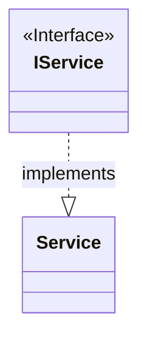
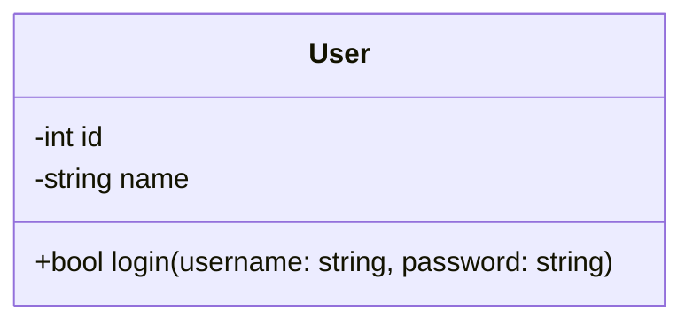
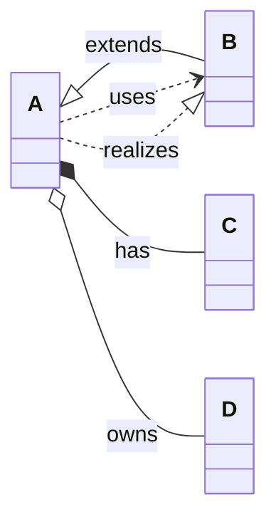
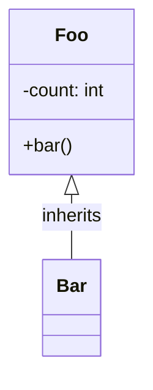

# Valid Class Diagrams

This file contains all valid class test fixtures rendered as Mermaid diagrams.
These diagrams are validated to be 100% compatible with mermaid-cli.

> **Note**: This file is auto-generated by `scripts/generate-preview.js`. Do not edit manually.

## Table of Contents

1. [Alias And Stereotype](#1-alias-and-stereotype)
2. [Inline Members And Attrs](#2-inline-members-and-attrs)
3. [Members Inline](#3-members-inline)
4. [Relations Advanced](#4-relations-advanced)
5. [Relations All](#5-relations-all)
6. [Simple](#6-simple)
7. [Stereotype And Alias](#7-stereotype-and-alias)

---

## 1. Alias And Stereotype

📄 **Source**: [`alias-and-stereotype.mmd`](./valid/alias-and-stereotype.mmd)



<details>
<summary>View source code</summary>

```
classDiagram
class IService <<Interface>>
class Service
IService ..|> Service : implements

```
</details>

---

## 2. Inline Members And Attrs

📄 **Source**: [`inline-members-and-attrs.mmd`](./valid/inline-members-and-attrs.mmd)



<details>
<summary>View source code</summary>

```
classDiagram
class User {
  +bool login(username: string, password: string)
  -int id
  -string name
}

```
</details>

---

## 3. Members Inline

📄 **Source**: [`members-inline.mmd`](./valid/members-inline.mmd)

```mermaid
classDiagram
User: +login(username: string, password: string) : bool
User: -id: int


```

<details>
<summary>View source code</summary>

```
classDiagram
User: +login(username: string, password: string) : bool
User: -id: int


```
</details>

---

## 4. Relations Advanced

📄 **Source**: [`relations-advanced.mmd`](./valid/relations-advanced.mmd)

```mermaid
classDiagram
class A
class B
class C
class D
class Client
class IService
class Impl

A *--o B
A o--* C
A o--o D
A *--* C
Client --() IService
IService ()-- Impl

A "1" -- "many" B
A "0..1" ..> "1" C

# dotted realization both ways (via ..|>)
Client ..|> IService

```

<details>
<summary>View source code</summary>

```
classDiagram
class A
class B
class C
class D
class Client
class IService
class Impl

A *--o B
A o--* C
A o--o D
A *--* C
Client --() IService
IService ()-- Impl

A "1" -- "many" B
A "0..1" ..> "1" C

# dotted realization both ways (via ..|>)
Client ..|> IService

```
</details>

---

## 5. Relations All

📄 **Source**: [`relations-all.mmd`](./valid/relations-all.mmd)



<details>
<summary>View source code</summary>

```
classDiagram
direction LR
class A
class B
class C
class D
A <|-- B : extends
A *-- C : has
A o-- D : owns
A ..> B : uses
A ..|> B : realizes


```
</details>

---

## 6. Simple

📄 **Source**: [`simple.mmd`](./valid/simple.mmd)



<details>
<summary>View source code</summary>

```
classDiagram
class Foo {
  +bar()
  -count: int
}
Foo <|-- Bar : inherits
class Bar


```
</details>

---

## 7. Stereotype And Alias

📄 **Source**: [`stereotype-and-alias.mmd`](./valid/stereotype-and-alias.mmd)

```mermaid
classDiagram
direction LR
class "IService" <<Interface>> as IService
class Service {
  +doWork(task: string): void
}
IService ..|> Service : implements


```

<details>
<summary>View source code</summary>

```
classDiagram
direction LR
class "IService" <<Interface>> as IService
class Service {
  +doWork(task: string): void
}
IService ..|> Service : implements


```
</details>

---

## Validation Status

All diagrams in this file have been validated against:
- ✅ Our Mermaid linter
- ✅ Official mermaid-cli
- ✅ GitHub's Mermaid renderer

Generated by scripts/generate-preview.js (deterministic output)

## How to Regenerate

```bash
node scripts/generate-preview.js class
```
