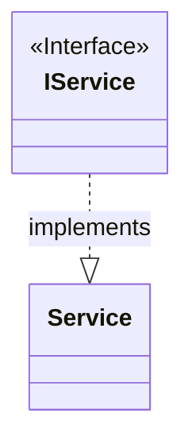
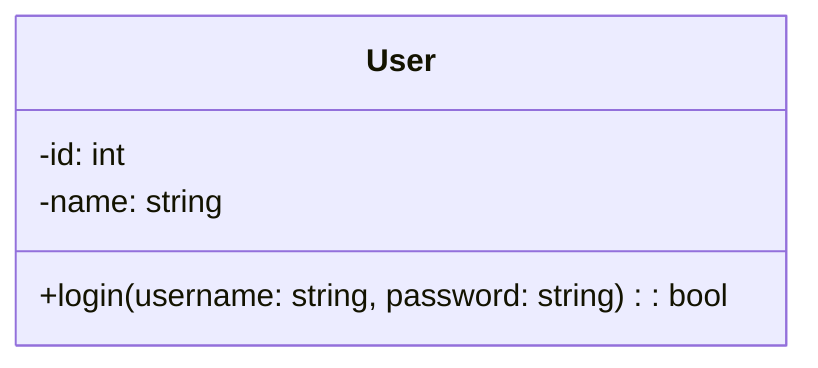
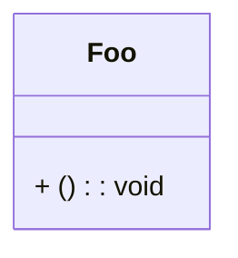
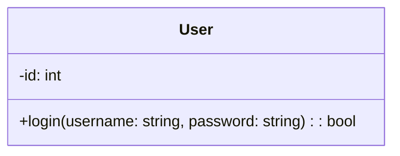
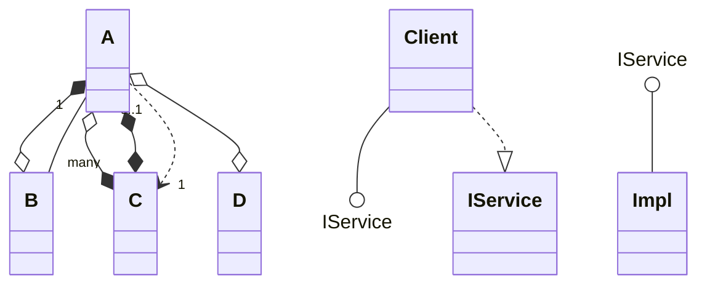
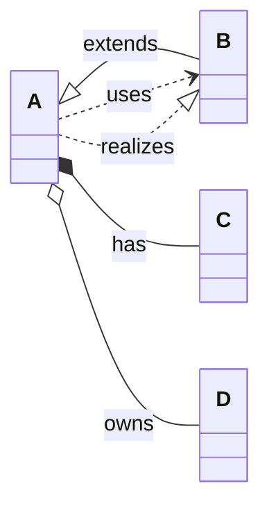
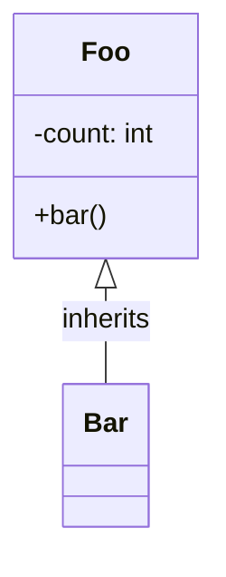
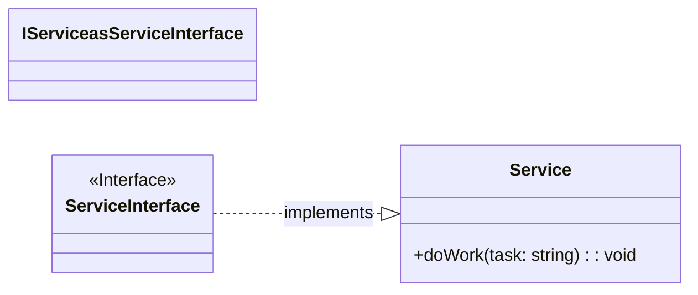

# Valid Class Diagrams

This file contains all valid class test fixtures rendered with Mermaid.

> **Note**: This file is auto-generated by `scripts/generate-previews.js`. Do not edit manually.

## Table of Contents

1. [alias and stereotype](#1-alias-and-stereotype)
2. [inline members and attrs](#2-inline-members-and-attrs)
3. [member without name](#3-member-without-name)
4. [members inline](#4-members-inline)
5. [relations advanced](#5-relations-advanced)
6. [relations all](#6-relations-all)
7. [simple](#7-simple)
8. [stereotype and alias](#8-stereotype-and-alias)

---

## 1. Alias And Stereotype

📄 **Source**: [`alias-and-stereotype.mmd`](./valid/alias-and-stereotype.mmd)

### Rendered Output (Mermaid)



<details>
<summary>View source code</summary>

```
classDiagram
class IService {
  <<Interface>>
}
class Service
IService ..|> Service : implements

```
</details>

---

## 2. Inline Members And Attrs

📄 **Source**: [`inline-members-and-attrs.mmd`](./valid/inline-members-and-attrs.mmd)

### Rendered Output (Mermaid)



<details>
<summary>View source code</summary>

```
classDiagram
class User {
  +login(username: string, password: string): bool
  -id: int
  -name: string
}

```
</details>

---

## 3. Member Without Name

📄 **Source**: [`member-without-name.mmd`](./valid/member-without-name.mmd)

### Rendered Output (Mermaid)



<details>
<summary>View source code</summary>

```
classDiagram
class Foo {
  + () : void
}


```
</details>

---

## 4. Members Inline

📄 **Source**: [`members-inline.mmd`](./valid/members-inline.mmd)

### Rendered Output (Mermaid)



<details>
<summary>View source code</summary>

```
classDiagram
class User {
  +login(username: string, password: string): bool
  -id: int
}

```
</details>

---

## 5. Relations Advanced

📄 **Source**: [`relations-advanced.mmd`](./valid/relations-advanced.mmd)

### Rendered Output (Mermaid)



<details>
<summary>View source code</summary>

```
classDiagram
class A
class B
class C
class D
class Client
class IService
class Impl

A *--o B
A o--* C
A o--o D
A *--* C
Client --() IService
IService ()-- Impl

A "1" -- "many" B
A "0..1" ..> "1" C

%% dotted realization both ways (via ..|>)
Client ..|> IService

```
</details>

---

## 6. Relations All

📄 **Source**: [`relations-all.mmd`](./valid/relations-all.mmd)

### Rendered Output (Mermaid)



<details>
<summary>View source code</summary>

```
classDiagram
direction LR
class A
class B
class C
class D
A <|-- B : extends
A *-- C : has
A o-- D : owns
A ..> B : uses
A ..|> B : realizes


```
</details>

---

## 7. Simple

📄 **Source**: [`simple.mmd`](./valid/simple.mmd)

### Rendered Output (Mermaid)



<details>
<summary>View source code</summary>

```
classDiagram
class Foo {
  +bar()
  -count: int
}
Foo <|-- Bar : inherits
class Bar


```
</details>

---

## 8. Stereotype And Alias

📄 **Source**: [`stereotype-and-alias.mmd`](./valid/stereotype-and-alias.mmd)

### Rendered Output (Mermaid)



<details>
<summary>View source code</summary>

```
classDiagram
direction LR
class IService as ServiceInterface
class ServiceInterface {
  <<Interface>>
}
class Service {
  +doWork(task: string): void
}
ServiceInterface ..|> Service : implements

```
</details>

---

