# Valid Class Diagrams

This file contains all valid class test fixtures rendered with both Mermaid and our Maid renderer.

> **Note**: This file is auto-generated by `scripts/generate-previews.js`. Do not edit manually.

## Renderer Comparison

| Renderer | Description |
|----------|-------------|
| **Mermaid** | Official Mermaid.js renderer (GitHub/mermaid-cli) |
| **Maid** | Our experimental renderer (only for supported types) |

## Table of Contents

1. [alias and stereotype](#1-alias-and-stereotype)
2. [inline members and attrs](#2-inline-members-and-attrs)
3. [member without name](#3-member-without-name)
4. [members inline](#4-members-inline)
5. [namespace and title](#5-namespace-and-title)
6. [namespace only](#6-namespace-only)
7. [notes on class](#7-notes-on-class)
8. [relations advanced](#8-relations-advanced)
9. [relations all](#9-relations-all)
10. [relations dual end labels](#10-relations-dual-end-labels)
11. [relations dual end steep](#11-relations-dual-end-steep)
12. [relations leftward](#12-relations-leftward)
13. [simple](#13-simple)
14. [stereotype and alias](#14-stereotype-and-alias)
15. [title only](#15-title-only)

---

## 1. Alias And Stereotype

📄 **Source**: [`alias-and-stereotype.mmd`](./valid/alias-and-stereotype.mmd)

### Rendered Output

<table>
<tr>
<th width="50%">Mermaid (Official)</th>
<th width="50%">Maid (Experimental)</th>
</tr>
<tr>
<td>

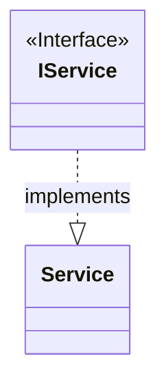

</td>
<td>

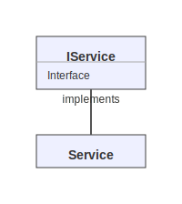

</td>
</tr>
</table>

<details>
<summary>View source code</summary>

```
classDiagram
class IService {
  <<Interface>>
}
class Service
IService ..|> Service : implements

```
</details>

---

## 2. Inline Members And Attrs

📄 **Source**: [`inline-members-and-attrs.mmd`](./valid/inline-members-and-attrs.mmd)

### Rendered Output

<table>
<tr>
<th width="50%">Mermaid (Official)</th>
<th width="50%">Maid (Experimental)</th>
</tr>
<tr>
<td>

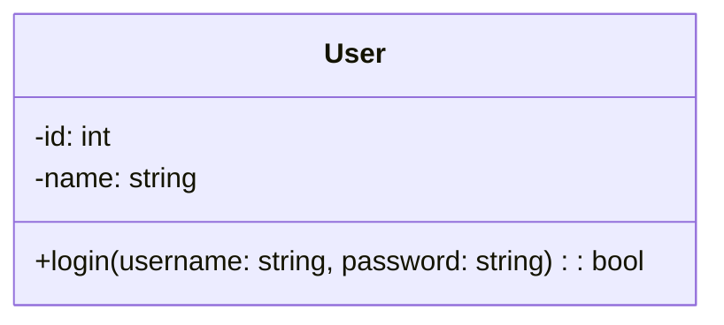

</td>
<td>

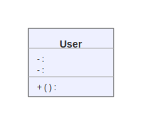

</td>
</tr>
</table>

<details>
<summary>View source code</summary>

```
classDiagram
class User {
  +login(username: string, password: string): bool
  -id: int
  -name: string
}

```
</details>

---

## 3. Member Without Name

📄 **Source**: [`member-without-name.mmd`](./valid/member-without-name.mmd)

### Rendered Output

<table>
<tr>
<th width="50%">Mermaid (Official)</th>
<th width="50%">Maid (Experimental)</th>
</tr>
<tr>
<td>

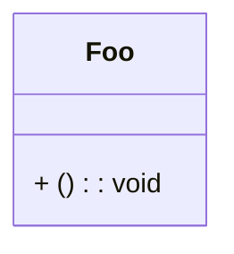

</td>
<td>

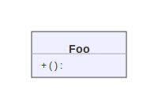

</td>
</tr>
</table>

<details>
<summary>View source code</summary>

```
classDiagram
class Foo {
  + () : void
}


```
</details>

---

## 4. Members Inline

📄 **Source**: [`members-inline.mmd`](./valid/members-inline.mmd)

### Rendered Output

<table>
<tr>
<th width="50%">Mermaid (Official)</th>
<th width="50%">Maid (Experimental)</th>
</tr>
<tr>
<td>

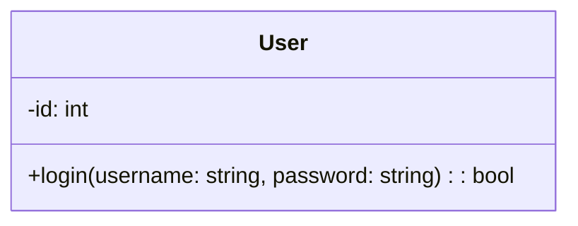

</td>
<td>

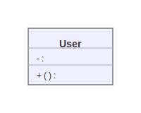

</td>
</tr>
</table>

<details>
<summary>View source code</summary>

```
classDiagram
class User {
  +login(username: string, password: string): bool
  -id: int
}

```
</details>

---

## 5. Namespace And Title

📄 **Source**: [`namespace-and-title.mmd`](./valid/namespace-and-title.mmd)

### Rendered Output

<table>
<tr>
<th width="50%">Mermaid (Official)</th>
<th width="50%">Maid (Experimental)</th>
</tr>
<tr>
<td>

```mermaid
classDiagram
    title ProbeAgent Architecture with Pluggable Components

    namespace ProbeAgentCore {
        class ProbeAgent
    }

    namespace PluggableModules {
        class StorageAdapter {
            +loadHistory()
            +saveMessage()
            +clearHistory()
        }
        <<interface>> StorageAdapter
        class HookManager {
            +on()
            +emit()
        }
    }

    namespace DefaultImplementations {
        class InMemoryStorageAdapter
    }

    namespace CustomImplementationsExamples {
        class PostgresStorageAdapter
        class CustomLogger
    }

    InMemoryStorageAdapter --|> StorageAdapter : implements
    PostgresStorageAdapter --|> StorageAdapter : implements
    CustomLogger -- HookManager : "subscribes to"
    ProbeAgent ..> StorageAdapter : uses
    ProbeAgent ..> HookManager : uses

```

</td>
<td>

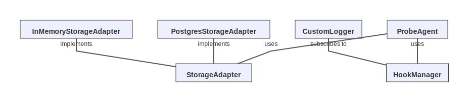

</td>
</tr>
</table>

<details>
<summary>View source code</summary>

```
classDiagram
    title ProbeAgent Architecture with Pluggable Components

    namespace ProbeAgentCore {
        class ProbeAgent
    }

    namespace PluggableModules {
        class StorageAdapter {
            +loadHistory()
            +saveMessage()
            +clearHistory()
        }
        <<interface>> StorageAdapter
        class HookManager {
            +on()
            +emit()
        }
    }

    namespace DefaultImplementations {
        class InMemoryStorageAdapter
    }

    namespace CustomImplementationsExamples {
        class PostgresStorageAdapter
        class CustomLogger
    }

    InMemoryStorageAdapter --|> StorageAdapter : implements
    PostgresStorageAdapter --|> StorageAdapter : implements
    CustomLogger -- HookManager : "subscribes to"
    ProbeAgent ..> StorageAdapter : uses
    ProbeAgent ..> HookManager : uses

```
</details>

---

## 6. Namespace Only

📄 **Source**: [`namespace-only.mmd`](./valid/namespace-only.mmd)

### Rendered Output

<table>
<tr>
<th width="50%">Mermaid (Official)</th>
<th width="50%">Maid (Experimental)</th>
</tr>
<tr>
<td>

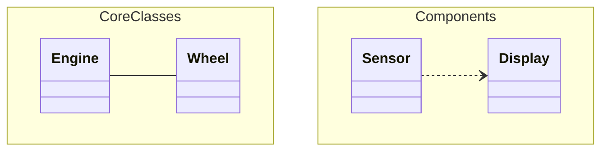

</td>
<td>


</td>
</tr>
</table>

<details>
<summary>View source code</summary>

```
classDiagram
    namespace CoreClasses {
        class Engine
        class Wheel
    }

    namespace Components {
        class Sensor
        class Display
    }

    Engine -- Wheel
    Sensor ..> Display

```
</details>

---

## 7. Notes On Class

📄 **Source**: [`notes-on-class.mmd`](./valid/notes-on-class.mmd)

### Rendered Output

<table>
<tr>
<th width="50%">Mermaid (Official)</th>
<th width="50%">Maid (Experimental)</th>
</tr>
<tr>
<td>

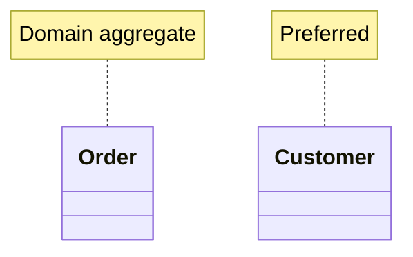

</td>
<td>


</td>
</tr>
</table>

<details>
<summary>View source code</summary>

```
classDiagram
class Order
note for Order "Domain aggregate"
class Customer
note for Customer "Preferred"


```
</details>

---

## 8. Relations Advanced

📄 **Source**: [`relations-advanced.mmd`](./valid/relations-advanced.mmd)

### Rendered Output

<table>
<tr>
<th width="50%">Mermaid (Official)</th>
<th width="50%">Maid (Experimental)</th>
</tr>
<tr>
<td>

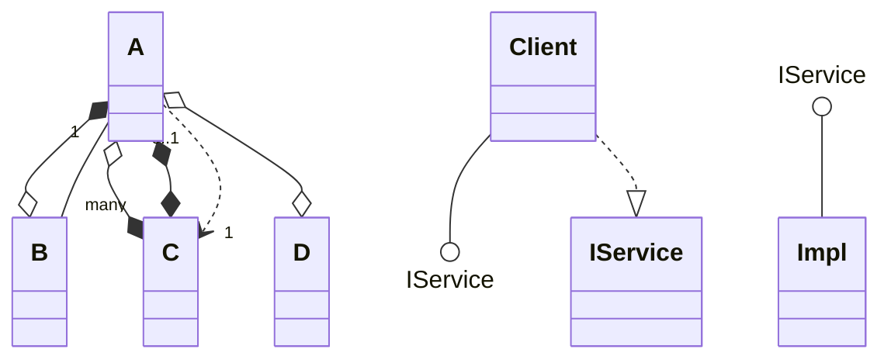

</td>
<td>

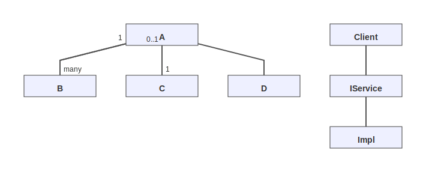

</td>
</tr>
</table>

<details>
<summary>View source code</summary>

```
classDiagram
class A
class B
class C
class D
class Client
class IService
class Impl

A *--o B
A o--* C
A o--o D
A *--* C
Client --() IService
IService ()-- Impl

A "1" -- "many" B
A "0..1" ..> "1" C

%% dotted realization both ways (via ..|>)
Client ..|> IService

```
</details>

---

## 9. Relations All

📄 **Source**: [`relations-all.mmd`](./valid/relations-all.mmd)

### Rendered Output

<table>
<tr>
<th width="50%">Mermaid (Official)</th>
<th width="50%">Maid (Experimental)</th>
</tr>
<tr>
<td>

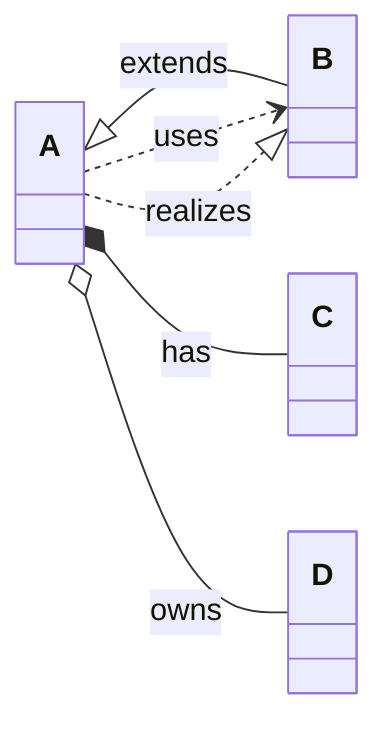

</td>
<td>

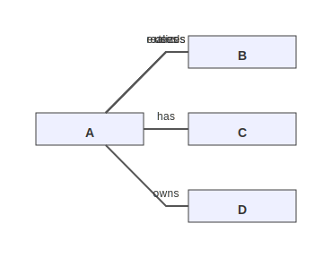

</td>
</tr>
</table>

<details>
<summary>View source code</summary>

```
classDiagram
direction LR
class A
class B
class C
class D
A <|-- B : extends
A *-- C : has
A o-- D : owns
A ..> B : uses
A ..|> B : realizes


```
</details>

---

## 10. Relations Dual End Labels

📄 **Source**: [`relations-dual-end-labels.mmd`](./valid/relations-dual-end-labels.mmd)

### Rendered Output

<table>
<tr>
<th width="50%">Mermaid (Official)</th>
<th width="50%">Maid (Experimental)</th>
</tr>
<tr>
<td>

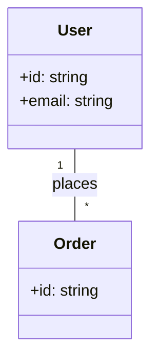

</td>
<td>

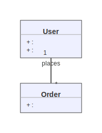

</td>
</tr>
</table>

<details>
<summary>View source code</summary>

```
classDiagram
  class User {
    +id: string
    +email: string
  }
  class Order {
    +id: string
  }
  User "1" -- "*" Order : places

```
</details>

---

## 11. Relations Dual End Steep

📄 **Source**: [`relations-dual-end-steep.mmd`](./valid/relations-dual-end-steep.mmd)

### Rendered Output

<table>
<tr>
<th width="50%">Mermaid (Official)</th>
<th width="50%">Maid (Experimental)</th>
</tr>
<tr>
<td>

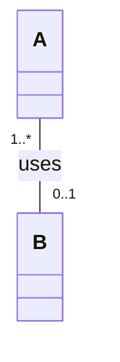

</td>
<td>

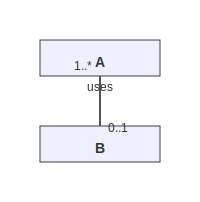

</td>
</tr>
</table>

<details>
<summary>View source code</summary>

```
classDiagram
  class A
  class B
  A "1..*" -- "0..1" B : uses


```
</details>

---

## 12. Relations Leftward

📄 **Source**: [`relations-leftward.mmd`](./valid/relations-leftward.mmd)

### Rendered Output

<table>
<tr>
<th width="50%">Mermaid (Official)</th>
<th width="50%">Maid (Experimental)</th>
</tr>
<tr>
<td>

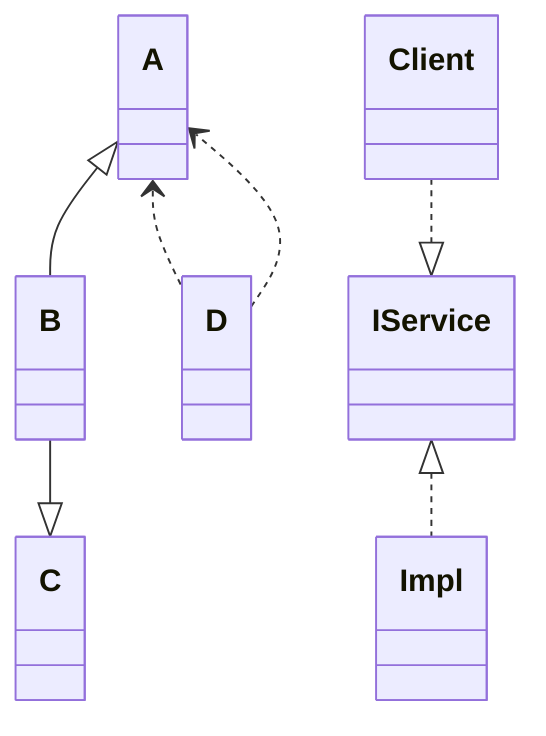

</td>
<td>

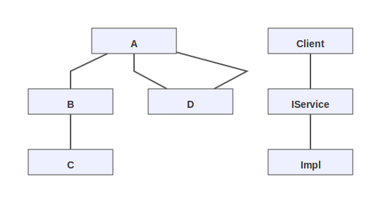

</td>
</tr>
</table>

<details>
<summary>View source code</summary>

```
classDiagram
class A
class B
class C
class D
A <|-- B
B --|> C
A <.. D
D ..> A
Client ..|> IService
IService <|.. Impl


```
</details>

---

## 13. Simple

📄 **Source**: [`simple.mmd`](./valid/simple.mmd)

### Rendered Output

<table>
<tr>
<th width="50%">Mermaid (Official)</th>
<th width="50%">Maid (Experimental)</th>
</tr>
<tr>
<td>

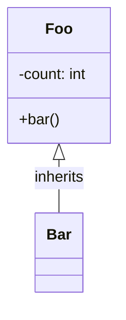

</td>
<td>

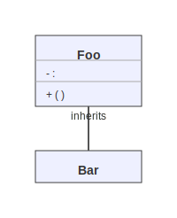

</td>
</tr>
</table>

<details>
<summary>View source code</summary>

```
classDiagram
class Foo {
  +bar()
  -count: int
}
Foo <|-- Bar : inherits
class Bar


```
</details>

---

## 14. Stereotype And Alias

📄 **Source**: [`stereotype-and-alias.mmd`](./valid/stereotype-and-alias.mmd)

### Rendered Output

<table>
<tr>
<th width="50%">Mermaid (Official)</th>
<th width="50%">Maid (Experimental)</th>
</tr>
<tr>
<td>

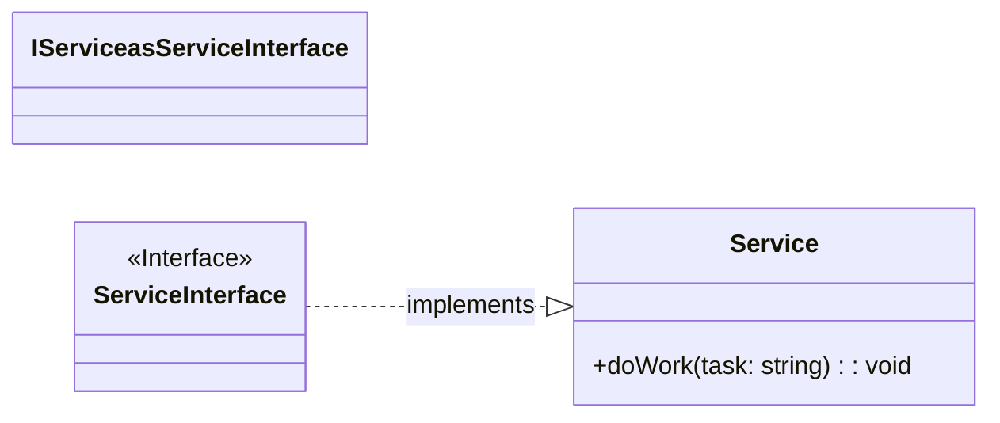

</td>
<td>

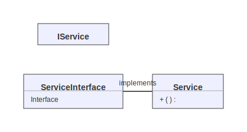

</td>
</tr>
</table>

<details>
<summary>View source code</summary>

```
classDiagram
direction LR
class IService as ServiceInterface
class ServiceInterface {
  <<Interface>>
}
class Service {
  +doWork(task: string): void
}
ServiceInterface ..|> Service : implements

```
</details>

---

## 15. Title Only

📄 **Source**: [`title-only.mmd`](./valid/title-only.mmd)

### Rendered Output

<table>
<tr>
<th width="50%">Mermaid (Official)</th>
<th width="50%">Maid (Experimental)</th>
</tr>
<tr>
<td>

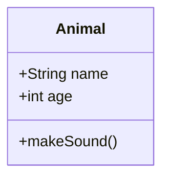

</td>
<td>

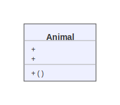

</td>
</tr>
</table>

<details>
<summary>View source code</summary>

```
classDiagram
    title Simple Class Diagram

    class Animal {
        +String name
        +int age
        +makeSound()
    }

```
</details>

---

