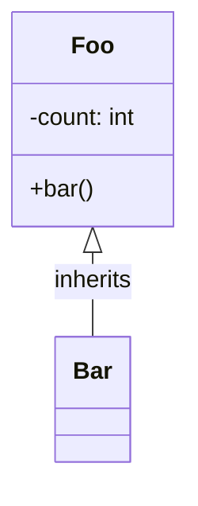

# Valid Class Diagrams

This file contains all valid class test fixtures rendered as Mermaid diagrams.
These diagrams are validated to be 100% compatible with mermaid-cli.

> **Note**: This file is auto-generated by `scripts/generate-preview.js`. Do not edit manually.

## Table of Contents

1. [Members Inline](#1-members-inline)
2. [Simple](#2-simple)
3. [Stereotype And Alias](#3-stereotype-and-alias)

---

## 1. Members Inline

📄 **Source**: [`members-inline.mmd`](./valid/members-inline.mmd)

```mermaid
classDiagram
User: +login(username: string, password: string) : bool
User: -id: int


```

<details>
<summary>View source code</summary>

```
classDiagram
User: +login(username: string, password: string) : bool
User: -id: int


```
</details>

---

## 2. Simple

📄 **Source**: [`simple.mmd`](./valid/simple.mmd)



<details>
<summary>View source code</summary>

```
classDiagram
class Foo {
  +bar()
  -count: int
}
Foo <|-- Bar : inherits
class Bar


```
</details>

---

## 3. Stereotype And Alias

📄 **Source**: [`stereotype-and-alias.mmd`](./valid/stereotype-and-alias.mmd)

```mermaid
classDiagram
direction LR
class "IService" <<Interface>> as IService
class Service {
  +doWork(task: string): void
}
IService ..|> Service : implements


```

<details>
<summary>View source code</summary>

```
classDiagram
direction LR
class "IService" <<Interface>> as IService
class Service {
  +doWork(task: string): void
}
IService ..|> Service : implements


```
</details>

---

## Validation Status

All diagrams in this file have been validated against:
- ✅ Our Mermaid linter
- ✅ Official mermaid-cli
- ✅ GitHub's Mermaid renderer

Generated by scripts/generate-preview.js (deterministic output)

## How to Regenerate

```bash
node scripts/generate-preview.js class
```
