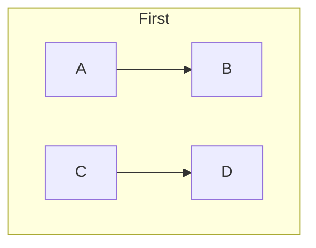

# Invalid Flowchart Diagrams

This file contains all invalid flowchart test fixtures with their GitHub render attempts.
These diagrams demonstrate various syntax errors and how GitHub's Mermaid renderer handles them.

> **Note**: This file is auto-generated by `scripts/generate-invalid-preview.js`. Do not edit manually.
> 
> ⚠️ **Warning**: These diagrams are intentionally invalid. They may:
> - Not render at all (showing error messages)
> - Render incorrectly or partially
> - Cause unexpected visual results

## Table of Contents

1. [Duplicate Subgraph](#1-duplicate-subgraph)
2. [Empty Diagram](#2-empty-diagram)
3. [Invalid Arrow](#3-invalid-arrow)
4. [Invalid Class](#4-invalid-class)
5. [Invalid Node Syntax](#5-invalid-node-syntax)
6. [Invalid Subgraph](#6-invalid-subgraph)
7. [Missing Arrow](#7-missing-arrow)
8. [Mixed Brackets](#8-mixed-brackets)
9. [No Diagram Type](#9-no-diagram-type)
10. [Special Chars](#10-special-chars)
11. [Unclosed Bracket](#11-unclosed-bracket)
12. [Unmatched End](#12-unmatched-end)
13. [Wrong Direction](#13-wrong-direction)

---

## 1. Duplicate Subgraph

📄 **Source**: [`duplicate-subgraph.mmd`](./invalid/duplicate-subgraph.mmd)

❌ **Error**: Duplicate subgraph IDs are not allowed.

### GitHub Render Attempt

> **Note**: This invalid diagram may not render or may render incorrectly.



<details>
<summary>View source code</summary>

```
flowchart TD
    subgraph same[First]
        A --> B
    end
    subgraph same[Second]
        C --> D
    end
```
</details>

---

## 2. Empty Diagram

📄 **Source**: [`empty-diagram.mmd`](./invalid/empty-diagram.mmd)

❌ **Error**: Diagram must contain at least one statement after declaration.

### GitHub Render Attempt

> **Note**: This invalid diagram may not render or may render incorrectly.

```mermaid
flowchart TD
```

<details>
<summary>View source code</summary>

```
flowchart TD
```
</details>

---

## 3. Invalid Arrow

📄 **Source**: [`invalid-arrow.mmd`](./invalid/invalid-arrow.mmd)

❌ **Error**: Single arrow `->` is invalid. Use `-->` instead.

### GitHub Render Attempt

> **Note**: This invalid diagram may not render or may render incorrectly.

```mermaid
flowchart TD
    A -> B
    B --> C
```

<details>
<summary>View source code</summary>

```
flowchart TD
    A -> B
    B --> C
```
</details>

---

## 4. Invalid Class

📄 **Source**: [`invalid-class.mmd`](./invalid/invalid-class.mmd)

❌ **Error**: Class statement requires both node ID(s) and class name.

### GitHub Render Attempt

> **Note**: This invalid diagram may not render or may render incorrectly.

```mermaid
flowchart TD
    A --> B
    class A
```

<details>
<summary>View source code</summary>

```
flowchart TD
    A --> B
    class A
```
</details>

---

## 5. Invalid Node Syntax

📄 **Source**: [`invalid-node-syntax.mmd`](./invalid/invalid-node-syntax.mmd)

❌ **Error**: Incomplete node syntax with unclosed brackets.

### GitHub Render Attempt

> **Note**: This invalid diagram may not render or may render incorrectly.

```mermaid
flowchart TD
    A(( --> B
    B --> C
```

<details>
<summary>View source code</summary>

```
flowchart TD
    A(( --> B
    B --> C
```
</details>

---

## 6. Invalid Subgraph

📄 **Source**: [`invalid-subgraph.mmd`](./invalid/invalid-subgraph.mmd)

❌ **Error**: Subgraph must have an ID or title.

### GitHub Render Attempt

> **Note**: This invalid diagram may not render or may render incorrectly.

```mermaid
flowchart TD
    subgraph
        A --> B
    end
```

<details>
<summary>View source code</summary>

```
flowchart TD
    subgraph
        A --> B
    end
```
</details>

---

## 7. Missing Arrow

📄 **Source**: [`missing-arrow.mmd`](./invalid/missing-arrow.mmd)

❌ **Error**: Nodes on the same line must be connected with arrows.

### GitHub Render Attempt

> **Note**: This invalid diagram may not render or may render incorrectly.

```mermaid
flowchart TD
    A B
```

<details>
<summary>View source code</summary>

```
flowchart TD
    A B
```
</details>

---

## 8. Mixed Brackets

📄 **Source**: [`mixed-brackets.mmd`](./invalid/mixed-brackets.mmd)

❌ **Error**: Mixing bracket types like `[text)` is not allowed.

### GitHub Render Attempt

> **Note**: This invalid diagram may not render or may render incorrectly.

```mermaid
flowchart LR
    A[Text] --> B(Text]
    B --> C
```

<details>
<summary>View source code</summary>

```
flowchart LR
    A[Text] --> B(Text]
    B --> C
```
</details>

---

## 9. No Diagram Type

📄 **Source**: [`no-diagram-type.mmd`](./invalid/no-diagram-type.mmd)

❌ **Error**: Diagram must start with `graph` or `flowchart`.

### GitHub Render Attempt

> **Note**: This invalid diagram may not render or may render incorrectly.

```mermaid
A --> B
B --> C
```

<details>
<summary>View source code</summary>

```
A --> B
B --> C
```
</details>

---

## 10. Special Chars

📄 **Source**: [`special-chars.mmd`](./invalid/special-chars.mmd)

❌ **Error**: Escaped quotes with backslash not supported in node labels.

### GitHub Render Attempt

> **Note**: This invalid diagram may not render or may render incorrectly.

```mermaid
flowchart LR
    A["Node with quotes"] --> B["Another \"quoted\" node"]
    B --> C[Node with #35; special &amp; chars]
    C --> D["Multi
    line
    text"]
```

<details>
<summary>View source code</summary>

```
flowchart LR
    A["Node with quotes"] --> B["Another \"quoted\" node"]
    B --> C[Node with #35; special &amp; chars]
    C --> D["Multi
    line
    text"]
```
</details>

---

## 11. Unclosed Bracket

📄 **Source**: [`unclosed-bracket.mmd`](./invalid/unclosed-bracket.mmd)

❌ **Error**: All brackets must be properly closed.

### GitHub Render Attempt

> **Note**: This invalid diagram may not render or may render incorrectly.

```mermaid
flowchart LR
    A[Start --> B
    B --> C
```

<details>
<summary>View source code</summary>

```
flowchart LR
    A[Start --> B
    B --> C
```
</details>

---

## 12. Unmatched End

📄 **Source**: [`unmatched-end.mmd`](./invalid/unmatched-end.mmd)

❌ **Error**: `end` keyword without matching `subgraph`.

### GitHub Render Attempt

> **Note**: This invalid diagram may not render or may render incorrectly.

```mermaid
flowchart TD
    A --> B
    end
```

<details>
<summary>View source code</summary>

```
flowchart TD
    A --> B
    end
```
</details>

---

## 13. Wrong Direction

📄 **Source**: [`wrong-direction.mmd`](./invalid/wrong-direction.mmd)

❌ **Error**: Invalid direction. Must be one of: TD, TB, BT, RL, LR.

### GitHub Render Attempt

> **Note**: This invalid diagram may not render or may render incorrectly.

```mermaid
flowchart XY
    A --> B
```

<details>
<summary>View source code</summary>

```
flowchart XY
    A --> B
```
</details>

---

## Validation Status

All diagrams in this file are confirmed to be invalid by:
- ❌ Our Mermaid linter (correctly rejects)
- ❌ Official mermaid-cli (correctly rejects)

Last generated: 2025-09-29T10:09:07.838Z

## How to Regenerate

```bash
node scripts/generate-invalid-preview.js flowchart
```
