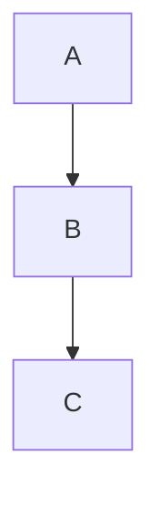
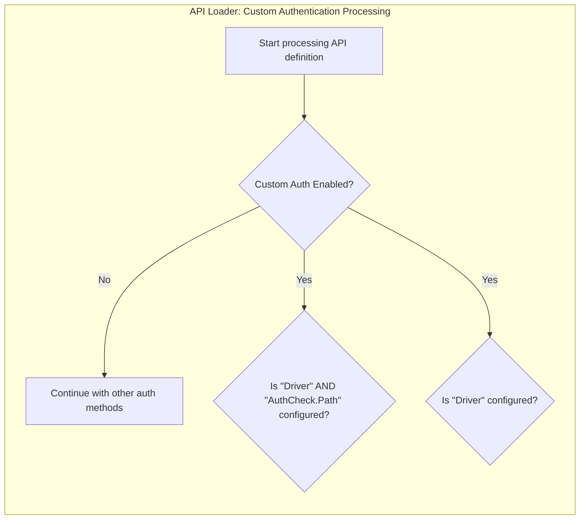
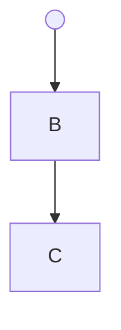
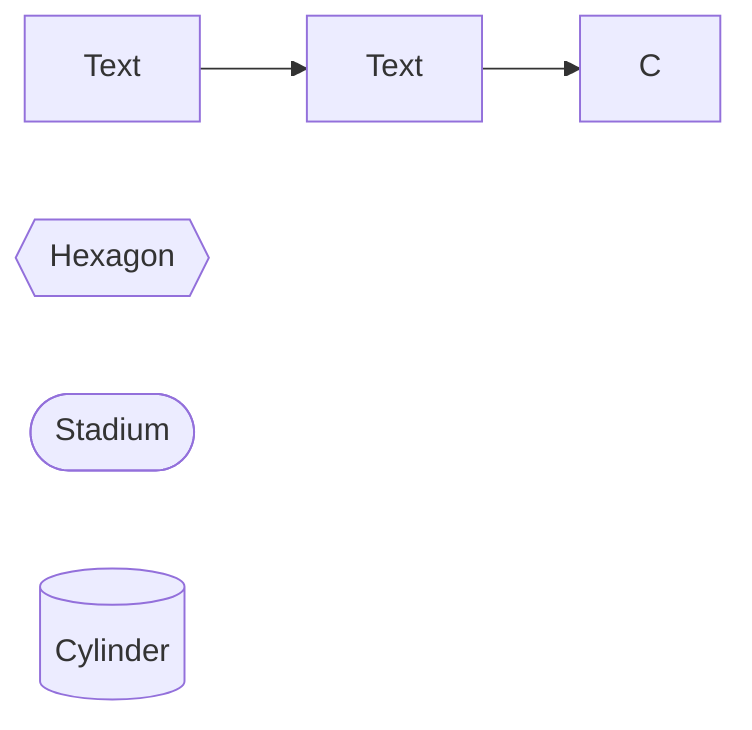
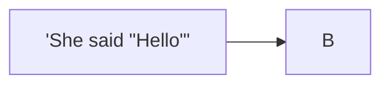

# Invalid Flowchart Diagrams

This file contains invalid flowchart test fixtures with:
- GitHub render attempts
- Error from mermaid-cli
- Error/output from our linter

> Note: Auto-generated by `scripts/generate-previews.js`. Do not edit manually.

## Table of Contents

1. [Edge Label Parens](#1-edge-label-parens)
2. [Empty Nodes](#2-empty-nodes)
3. [Escaped Quotes In Decision](#3-escaped-quotes-in-decision)
4. [Interactions Click Href](#4-interactions-click-href)
5. [Invalid Arrow](#5-invalid-arrow)
6. [Invalid Class](#6-invalid-class)
7. [Invalid Node Syntax](#7-invalid-node-syntax)
8. [Invalid Subgraph](#8-invalid-subgraph)
9. [Missing Arrow](#9-missing-arrow)
10. [Mixed Brackets](#10-mixed-brackets)
11. [No Diagram Type](#11-no-diagram-type)
12. [Quotes Double Inside Single](#12-quotes-double-inside-single)
13. [Typed Shapes Unknowns](#13-typed-shapes-unknowns)
14. [Unclosed Bracket](#14-unclosed-bracket)
15. [Unclosed Quote In Label](#15-unclosed-quote-in-label)
16. [Unescaped Quotes In Decision](#16-unescaped-quotes-in-decision)
17. [Unmatched End](#17-unmatched-end)
18. [Unquoted Label With Quotes](#18-unquoted-label-with-quotes)
19. [Wrong Direction](#19-wrong-direction)

---

## Summary

| # | Diagram | mermaid-cli | maid | Auto-fix? |
|---:|---|:---:|:---:|:---:|
| 1 | [edge label parens](#1-edge-label-parens) | INVALID | INVALID | — |
| 2 | [empty nodes](#2-empty-nodes) | INVALID | INVALID | ✅ safe |
| 3 | [escaped quotes in decision](#3-escaped-quotes-in-decision) | INVALID | INVALID | ✅ safe |
| 4 | [interactions click href](#4-interactions-click-href) | INVALID | INVALID | — |
| 5 | [invalid arrow](#5-invalid-arrow) | INVALID | INVALID | ✅ safe |
| 6 | [invalid class](#6-invalid-class) | INVALID | INVALID | — |
| 7 | [invalid node syntax](#7-invalid-node-syntax) | INVALID | INVALID | ✅ safe |
| 8 | [invalid subgraph](#8-invalid-subgraph) | INVALID | INVALID | — |
| 9 | [missing arrow](#9-missing-arrow) | INVALID | INVALID | — |
| 10 | [mixed brackets](#10-mixed-brackets) | INVALID | INVALID | ✅ safe |
| 11 | [no diagram type](#11-no-diagram-type) | INVALID | INVALID | — |
| 12 | [quotes double inside single](#12-quotes-double-inside-single) | INVALID | INVALID | ✅ safe |
| 13 | [typed shapes unknowns](#13-typed-shapes-unknowns) | INVALID | INVALID | — |
| 14 | [unclosed bracket](#14-unclosed-bracket) | INVALID | INVALID | ✅ safe |
| 15 | [unclosed quote in label](#15-unclosed-quote-in-label) | INVALID | INVALID | ✅ all |
| 16 | [unescaped quotes in decision](#16-unescaped-quotes-in-decision) | INVALID | INVALID | ✅ safe |
| 17 | [unmatched end](#17-unmatched-end) | INVALID | INVALID | — |
| 18 | [unquoted label with quotes](#18-unquoted-label-with-quotes) | INVALID | INVALID | ✅ safe |
| 19 | [wrong direction](#19-wrong-direction) | INVALID | INVALID | — |

---

## 1. Edge Label Parens

📄 **Source**: [`edge-label-parens.mmd`](./invalid/edge-label-parens.mmd)

### GitHub Render Attempt

> **Note**: This invalid diagram may not render or may render incorrectly.

```mermaid
flowchart TD
    A -->|optional (external)| B


```

### mermaid-cli Result: INVALID

```
Error: Parse error on line 2:
...    A -->|optional (external)| B
----------------------^
Expecting 'SQE', 'DOUBLECIRCLEEND', 'PE', '-)', 'STADIUMEND', 'SUBROUTINEEND', 'PIPE', 'CYLINDEREND', 'DIAMOND_STOP', 'TAGEND', 'TRAPEND', 'INVTRAPEND', 'UNICODE_TEXT', 'TEXT', 'TAGSTART', got 'PS'
Parser3.parseError (node_modules/mermaid/dist/mermaid.js:91236:28)
    at #evaluate (node_modules/puppeteer-core/lib/esm/puppeteer/cdp/ExecutionContext.js:388:19)
    at async ExecutionContext.evaluate (node_modules/puppeteer-core/lib/esm/puppeteer/cdp/ExecutionContext.js:275:16)
    at async IsolatedWorld.evaluate (node_modules/puppeteer-core/lib/esm/puppeteer/cdp/IsolatedWorld.js:97:16)
    at async CdpJSHandle.evaluate (node_modules/puppeteer-core/lib/esm/puppeteer/api/JSHandle.js:146:20)
    at async CdpElementHandle.evaluate (node_modules/puppeteer-core/lib/esm/puppeteer/api/ElementHandle.js:340:20)
    at async CdpElementHandle.$eval (node_modules/puppeteer-core/lib/esm/puppeteer/api/ElementHandle.js:494:24)
    at async CdpFrame.$eval (node_modules/puppeteer-core/lib/esm/puppeteer/api/Frame.js:450:20)
    at async CdpPage.$eval (node_modules/puppeteer-core/lib/esm/puppeteer/api/Page.js:450:20)
    at async renderMermaid (node_modules/@mermaid-js/mermaid-cli/src/index.js:266:22)
    at fromText (node_modules/mermaid/dist/mermaid.js:153955:21)
```

### maid Result: INVALID

```
error: Expecting token of type --> Pipe <-- but found --> '(' <--
at test-fixtures/flowchart/invalid/edge-label-parens.mmd:2:20
  1 | flowchart TD
  2 |     A -->|optional (external)| B
    |                    ^
  3 |
```

### maid Auto-fix (`--fix`) Preview

No auto-fix changes (safe level).

### maid Auto-fix (`--fix=all`) Preview

No auto-fix changes (all level).

<details>
<summary>View source code</summary>

```
flowchart TD
    A -->|optional (external)| B


```
</details>

---

## 2. Empty Nodes

📄 **Source**: [`empty-nodes.mmd`](./invalid/empty-nodes.mmd)

### GitHub Render Attempt

> **Note**: This invalid diagram may not render or may render incorrectly.

```mermaid
flowchart TD
    A[""] --> B[" "]
    B --> C[]
```

### mermaid-cli Result: INVALID

```
Error: Parse error on line 2:
...lowchart TD    A[""] --> B[" "]    B -
----------------------^
Expecting 'TAGEND', 'STR', 'MD_STR', 'UNICODE_TEXT', 'TEXT', 'TAGSTART', got 'SQE'
Parser3.parseError (node_modules/mermaid/dist/mermaid.js:91236:28)
    at #evaluate (node_modules/puppeteer-core/lib/esm/puppeteer/cdp/ExecutionContext.js:388:19)
    at async ExecutionContext.evaluate (node_modules/puppeteer-core/lib/esm/puppeteer/cdp/ExecutionContext.js:275:16)
    at async IsolatedWorld.evaluate (node_modules/puppeteer-core/lib/esm/puppeteer/cdp/IsolatedWorld.js:97:16)
    at async CdpJSHandle.evaluate (node_modules/puppeteer-core/lib/esm/puppeteer/api/JSHandle.js:146:20)
    at async CdpElementHandle.evaluate (node_modules/puppeteer-core/lib/esm/puppeteer/api/ElementHandle.js:340:20)
    at async CdpElementHandle.$eval (node_modules/puppeteer-core/lib/esm/puppeteer/api/ElementHandle.js:494:24)
    at async CdpFrame.$eval (node_modules/puppeteer-core/lib/esm/puppeteer/api/Frame.js:450:20)
    at async CdpPage.$eval (node_modules/puppeteer-core/lib/esm/puppeteer/api/Page.js:450:20)
    at async renderMermaid (node_modules/@mermaid-js/mermaid-cli/src/index.js:266:22)
    at fromText (node_modules/mermaid/dist/mermaid.js:153955:21)
```

### maid Result: INVALID

```
error[FL-NODE-EMPTY]: Empty label inside a shape (only empty quotes/whitespace).
at test-fixtures/flowchart/invalid/empty-nodes.mmd:2:7
  1 | flowchart TD
  2 |     A[""] --> B[" "]
    |       ^
  3 |     B --> C[]
hint: Provide non-empty text, e.g., A["Start"] or A[Start]. If you want no label, omit the brackets and just use A.

error[FL-NODE-EMPTY]: Empty label inside a shape (only empty quotes/whitespace).
at test-fixtures/flowchart/invalid/empty-nodes.mmd:2:17
  1 | flowchart TD
  2 |     A[""] --> B[" "]
    |                 ^
  3 |     B --> C[]
hint: Provide non-empty text, e.g., A["Start"] or A[Start]. If you want no label, omit the brackets and just use A.

error[FL-NODE-EMPTY]: Empty label inside a shape.
at test-fixtures/flowchart/invalid/empty-nodes.mmd:3:12
  2 |     A[""] --> B[" "]
  3 |     B --> C[]
    |            ^
hint: Write non-empty text inside the brackets, e.g., A["Start"] or A[Start]. If you want no label, omit the brackets and just use A.
```

### maid Auto-fix (`--fix`) Preview



### maid Auto-fix (`--fix=all`) Preview

Shown above (safe changes applied).

<details>
<summary>View source code</summary>

```
flowchart TD
    A[""] --> B[" "]
    B --> C[]
```
</details>

---

## 3. Escaped Quotes In Decision

📄 **Source**: [`escaped-quotes-in-decision.mmd`](./invalid/escaped-quotes-in-decision.mmd)

### GitHub Render Attempt

> **Note**: This invalid diagram may not render or may render incorrectly.

```mermaid
flowchart TD
    subgraph API_Loader_Custom_Authentication_Processing[API Loader: Custom Authentication Processing]
        direction TB
        A[Start processing API definition] --> B{Custom Auth Enabled?}
        B -- No --> C[Continue with other auth methods]
        B -- Yes --> D{"Is \"Driver\" AND \"AuthCheck.Path\" configured?"}
        B -- Yes --> E{"Is "Driver" configured?"}
    end

```

### mermaid-cli Result: INVALID

```
Error: Parse error on line 6:
...--> D{"Is \"Driver\" AND \"AuthCheck.Pat
-----------------------^
Expecting 'SQE', 'DOUBLECIRCLEEND', 'PE', '-)', 'STADIUMEND', 'SUBROUTINEEND', 'PIPE', 'CYLINDEREND', 'DIAMOND_STOP', 'TAGEND', 'TRAPEND', 'INVTRAPEND', 'UNICODE_TEXT', 'TEXT', 'TAGSTART', got 'STR'
Parser3.parseError (node_modules/mermaid/dist/mermaid.js:91236:28)
    at #evaluate (node_modules/puppeteer-core/lib/esm/puppeteer/cdp/ExecutionContext.js:388:19)
    at async ExecutionContext.evaluate (node_modules/puppeteer-core/lib/esm/puppeteer/cdp/ExecutionContext.js:275:16)
    at async IsolatedWorld.evaluate (node_modules/puppeteer-core/lib/esm/puppeteer/cdp/IsolatedWorld.js:97:16)
    at async CdpJSHandle.evaluate (node_modules/puppeteer-core/lib/esm/puppeteer/api/JSHandle.js:146:20)
    at async CdpElementHandle.evaluate (node_modules/puppeteer-core/lib/esm/puppeteer/api/ElementHandle.js:340:20)
    at async CdpElementHandle.$eval (node_modules/puppeteer-core/lib/esm/puppeteer/api/ElementHandle.js:494:24)
    at async CdpFrame.$eval (node_modules/puppeteer-core/lib/esm/puppeteer/api/Frame.js:450:20)
    at async CdpPage.$eval (node_modules/puppeteer-core/lib/esm/puppeteer/api/Page.js:450:20)
    at async renderMermaid (node_modules/@mermaid-js/mermaid-cli/src/index.js:266:22)
    at fromText (node_modules/mermaid/dist/mermaid.js:153955:21)
```

### maid Result: INVALID

```
error[FL-LABEL-DOUBLE-IN-DOUBLE]: Double quotes inside a double-quoted label are not supported by Mermaid. Use &quot; for inner quotes.
at test-fixtures/flowchart/invalid/escaped-quotes-in-decision.mmd:7:35
  6 |         B -- Yes --> D{"Is \"Driver\" AND \"AuthCheck.Path\" configured?"}
  7 |         B -- Yes --> E{"Is "Driver" configured?"}
    |                                   ^
  8 |     end
hint: Example: D{"Is &quot;Driver&quot; and &quot;AuthCheck.Path&quot; configured?"}

warning[FL-LABEL-ESCAPED-QUOTE]: Escaped quotes (\") in node labels are accepted by Mermaid, but using &quot; is preferred for portability.
at test-fixtures/flowchart/invalid/escaped-quotes-in-decision.mmd:6:28
  5 |         B -- No --> C[Continue with other auth methods]
  6 |         B -- Yes --> D{"Is \"Driver\" AND \"AuthCheck.Path\" configured?"}
    |                            ^^
  7 |         B -- Yes --> E{"Is "Driver" configured?"}
hint: Prefer &quot; inside quoted labels, e.g., A["He said &quot;Hi&quot;"]
```

### maid Auto-fix (`--fix`) Preview



### maid Auto-fix (`--fix=all`) Preview

Shown above (safe changes applied).

<details>
<summary>View source code</summary>

```
flowchart TD
    subgraph API_Loader_Custom_Authentication_Processing[API Loader: Custom Authentication Processing]
        direction TB
        A[Start processing API definition] --> B{Custom Auth Enabled?}
        B -- No --> C[Continue with other auth methods]
        B -- Yes --> D{"Is \"Driver\" AND \"AuthCheck.Path\" configured?"}
        B -- Yes --> E{"Is "Driver" configured?"}
    end

```
</details>

---

## 4. Interactions Click Href

📄 **Source**: [`interactions-click-href.mmd`](./invalid/interactions-click-href.mmd)

### GitHub Render Attempt

> **Note**: This invalid diagram may not render or may render incorrectly.

```mermaid
flowchart TD
  A[Start] --> B[Next]
  click A href "https://example.com" "Open" _blank
  linkStyle 1 stroke:#f00,stroke-width:2px


```

### mermaid-cli Result: INVALID

```
TypeError: Cannot set properties of undefined (setting 'style')
node_modules/mermaid/dist/mermaid.js:45745:37
Array.forEach (<anonymous>)
    at #evaluate (node_modules/puppeteer-core/lib/esm/puppeteer/cdp/ExecutionContext.js:388:19)
    at async ExecutionContext.evaluate (node_modules/puppeteer-core/lib/esm/puppeteer/cdp/ExecutionContext.js:275:16)
    at async IsolatedWorld.evaluate (node_modules/puppeteer-core/lib/esm/puppeteer/cdp/IsolatedWorld.js:97:16)
    at async CdpJSHandle.evaluate (node_modules/puppeteer-core/lib/esm/puppeteer/api/JSHandle.js:146:20)
    at async CdpElementHandle.evaluate (node_modules/puppeteer-core/lib/esm/puppeteer/api/ElementHandle.js:340:20)
    at async CdpElementHandle.$eval (node_modules/puppeteer-core/lib/esm/puppeteer/api/ElementHandle.js:494:24)
    at async CdpFrame.$eval (node_modules/puppeteer-core/lib/esm/puppeteer/api/Frame.js:450:20)
    at async CdpPage.$eval (node_modules/puppeteer-core/lib/esm/puppeteer/api/Page.js:450:20)
    at async renderMermaid (node_modules/@mermaid-js/mermaid-cli/src/index.js:266:22)
    at fromText (node_modules/mermaid/dist/mermaid.js:153955:21)
```

### maid Result: INVALID

```
error[FL-INTERACTION-UNSUPPORTED]: Interaction statements ('click', 'linkStyle') are not supported in validation yet.
at test-fixtures/flowchart/invalid/interactions-click-href.mmd:1:1
  1 | flowchart TD
    | ^
  2 |   A[Start] --> B[Next]
hint: Remove the interaction line or validate rendering separately.

error[FL-INTERACTION-UNSUPPORTED]: Interaction statements ('click', 'linkStyle') are not supported in validation yet.
at test-fixtures/flowchart/invalid/interactions-click-href.mmd:1:1
  1 | flowchart TD
    | ^
  2 |   A[Start] --> B[Next]
hint: Remove the interaction line or validate rendering separately.
```

### maid Auto-fix (`--fix`) Preview

No auto-fix changes (safe level).

### maid Auto-fix (`--fix=all`) Preview

No auto-fix changes (all level).

<details>
<summary>View source code</summary>

```
flowchart TD
  A[Start] --> B[Next]
  click A href "https://example.com" "Open" _blank
  linkStyle 1 stroke:#f00,stroke-width:2px


```
</details>

---

## 5. Invalid Arrow

📄 **Source**: [`invalid-arrow.mmd`](./invalid/invalid-arrow.mmd)

### GitHub Render Attempt

> **Note**: This invalid diagram may not render or may render incorrectly.

```mermaid
flowchart TD
    A -> B
    B --> C
```

### mermaid-cli Result: INVALID

```
Error: Parse error on line 2:
flowchart TD    A -> B    B --> C
------------------^
Expecting 'SEMI', 'NEWLINE', 'EOF', 'AMP', 'START_LINK', 'LINK', 'LINK_ID', got 'MINUS'
Parser3.parseError (node_modules/mermaid/dist/mermaid.js:91236:28)
    at #evaluate (node_modules/puppeteer-core/lib/esm/puppeteer/cdp/ExecutionContext.js:388:19)
    at async ExecutionContext.evaluate (node_modules/puppeteer-core/lib/esm/puppeteer/cdp/ExecutionContext.js:275:16)
    at async IsolatedWorld.evaluate (node_modules/puppeteer-core/lib/esm/puppeteer/cdp/IsolatedWorld.js:97:16)
    at async CdpJSHandle.evaluate (node_modules/puppeteer-core/lib/esm/puppeteer/api/JSHandle.js:146:20)
    at async CdpElementHandle.evaluate (node_modules/puppeteer-core/lib/esm/puppeteer/api/ElementHandle.js:340:20)
    at async CdpElementHandle.$eval (node_modules/puppeteer-core/lib/esm/puppeteer/api/ElementHandle.js:494:24)
    at async CdpFrame.$eval (node_modules/puppeteer-core/lib/esm/puppeteer/api/Frame.js:450:20)
    at async CdpPage.$eval (node_modules/puppeteer-core/lib/esm/puppeteer/api/Page.js:450:20)
    at async renderMermaid (node_modules/@mermaid-js/mermaid-cli/src/index.js:266:22)
    at fromText (node_modules/mermaid/dist/mermaid.js:153955:21)
```

### maid Result: INVALID

```
error[FL-ARROW-INVALID]: Invalid arrow syntax: -> (use --> instead)
at test-fixtures/flowchart/invalid/invalid-arrow.mmd:2:7
  1 | flowchart TD
  2 |     A -> B
    |       ^^
  3 |     B --> C
hint: Replace -> with -->, or use -- text --> for inline labels.
```

### maid Auto-fix (`--fix`) Preview


### maid Auto-fix (`--fix=all`) Preview

Shown above (safe changes applied).

<details>
<summary>View source code</summary>

```
flowchart TD
    A -> B
    B --> C
```
</details>

---

## 6. Invalid Class

📄 **Source**: [`invalid-class.mmd`](./invalid/invalid-class.mmd)

### GitHub Render Attempt

> **Note**: This invalid diagram may not render or may render incorrectly.

```mermaid
flowchart TD
    A --> B
    class A
```

### mermaid-cli Result: INVALID

```
Error: Parse error on line 3:
... A --> B    class A
----------------------^
Expecting 'SPACE', 'AMP', 'COLON', 'DOWN', 'DEFAULT', 'NUM', 'COMMA', 'NODE_STRING', 'BRKT', 'MINUS', 'MULT', 'UNICODE_TEXT', got 'NEWLINE'
Parser3.parseError (node_modules/mermaid/dist/mermaid.js:91236:28)
    at #evaluate (node_modules/puppeteer-core/lib/esm/puppeteer/cdp/ExecutionContext.js:388:19)
    at async ExecutionContext.evaluate (node_modules/puppeteer-core/lib/esm/puppeteer/cdp/ExecutionContext.js:275:16)
    at async IsolatedWorld.evaluate (node_modules/puppeteer-core/lib/esm/puppeteer/cdp/IsolatedWorld.js:97:16)
    at async CdpJSHandle.evaluate (node_modules/puppeteer-core/lib/esm/puppeteer/api/JSHandle.js:146:20)
    at async CdpElementHandle.evaluate (node_modules/puppeteer-core/lib/esm/puppeteer/api/ElementHandle.js:340:20)
    at async CdpElementHandle.$eval (node_modules/puppeteer-core/lib/esm/puppeteer/api/ElementHandle.js:494:24)
    at async CdpFrame.$eval (node_modules/puppeteer-core/lib/esm/puppeteer/api/Frame.js:450:20)
    at async CdpPage.$eval (node_modules/puppeteer-core/lib/esm/puppeteer/api/Page.js:450:20)
    at async renderMermaid (node_modules/@mermaid-js/mermaid-cli/src/index.js:266:22)
    at fromText (node_modules/mermaid/dist/mermaid.js:153955:21)
```

### maid Result: INVALID

```
error[FL-CLASS-MALFORMED]: Invalid class statement. Provide node id(s) then a class name.
at test-fixtures/flowchart/invalid/invalid-class.mmd:3:12
  2 |     A --> B
  3 |     class A
    |            ^
hint: Example: class A,B important
```

### maid Auto-fix (`--fix`) Preview

No auto-fix changes (safe level).

### maid Auto-fix (`--fix=all`) Preview

No auto-fix changes (all level).

<details>
<summary>View source code</summary>

```
flowchart TD
    A --> B
    class A
```
</details>

---

## 7. Invalid Node Syntax

📄 **Source**: [`invalid-node-syntax.mmd`](./invalid/invalid-node-syntax.mmd)

### GitHub Render Attempt

> **Note**: This invalid diagram may not render or may render incorrectly.

```mermaid
flowchart TD
    A(( --> B
    B --> C
```

### mermaid-cli Result: INVALID

```
Error: Parse error on line 4:
...( --> B    B --> C
---------------------^
Expecting 'SQE', 'DOUBLECIRCLEEND', 'PE', '-)', 'STADIUMEND', 'SUBROUTINEEND', 'PIPE', 'CYLINDEREND', 'DIAMOND_STOP', 'TAGEND', 'TRAPEND', 'INVTRAPEND', 'UNICODE_TEXT', 'TEXT', 'TAGSTART', got '1'
Parser3.parseError (node_modules/mermaid/dist/mermaid.js:91236:28)
    at #evaluate (node_modules/puppeteer-core/lib/esm/puppeteer/cdp/ExecutionContext.js:388:19)
    at async ExecutionContext.evaluate (node_modules/puppeteer-core/lib/esm/puppeteer/cdp/ExecutionContext.js:275:16)
    at async IsolatedWorld.evaluate (node_modules/puppeteer-core/lib/esm/puppeteer/cdp/IsolatedWorld.js:97:16)
    at async CdpJSHandle.evaluate (node_modules/puppeteer-core/lib/esm/puppeteer/api/JSHandle.js:146:20)
    at async CdpElementHandle.evaluate (node_modules/puppeteer-core/lib/esm/puppeteer/api/ElementHandle.js:340:20)
    at async CdpElementHandle.$eval (node_modules/puppeteer-core/lib/esm/puppeteer/api/ElementHandle.js:494:24)
    at async CdpFrame.$eval (node_modules/puppeteer-core/lib/esm/puppeteer/api/Frame.js:450:20)
    at async CdpPage.$eval (node_modules/puppeteer-core/lib/esm/puppeteer/api/Page.js:450:20)
    at async renderMermaid (node_modules/@mermaid-js/mermaid-cli/src/index.js:266:22)
    at fromText (node_modules/mermaid/dist/mermaid.js:153955:21)
```

### maid Result: INVALID

```
error[FL-NODE-UNCLOSED-BRACKET]: Unclosed '(( '. Add a matching '))'.
at test-fixtures/flowchart/invalid/invalid-node-syntax.mmd:2:9
  1 | flowchart TD
  2 |     A(( --> B
    |         ^^
  3 |     B --> C
hint: Example: A((Circle))
```

### maid Auto-fix (`--fix`) Preview



### maid Auto-fix (`--fix=all`) Preview

Shown above (safe changes applied).

<details>
<summary>View source code</summary>

```
flowchart TD
    A(( --> B
    B --> C
```
</details>

---

## 8. Invalid Subgraph

📄 **Source**: [`invalid-subgraph.mmd`](./invalid/invalid-subgraph.mmd)

### GitHub Render Attempt

> **Note**: This invalid diagram may not render or may render incorrectly.

```mermaid
flowchart TD
    subgraph
        A --> B
    end
```

### mermaid-cli Result: INVALID

```
TypeError: Cannot read properties of undefined (reading 'text')
FlowDB.addSubGraph (node_modules/mermaid/dist/mermaid.js:45974:26)
    at #evaluate (node_modules/puppeteer-core/lib/esm/puppeteer/cdp/ExecutionContext.js:388:19)
    at async ExecutionContext.evaluate (node_modules/puppeteer-core/lib/esm/puppeteer/cdp/ExecutionContext.js:275:16)
    at async IsolatedWorld.evaluate (node_modules/puppeteer-core/lib/esm/puppeteer/cdp/IsolatedWorld.js:97:16)
    at async CdpJSHandle.evaluate (node_modules/puppeteer-core/lib/esm/puppeteer/api/JSHandle.js:146:20)
    at async CdpElementHandle.evaluate (node_modules/puppeteer-core/lib/esm/puppeteer/api/ElementHandle.js:340:20)
    at async CdpElementHandle.$eval (node_modules/puppeteer-core/lib/esm/puppeteer/api/ElementHandle.js:494:24)
    at async CdpFrame.$eval (node_modules/puppeteer-core/lib/esm/puppeteer/api/Frame.js:450:20)
    at async CdpPage.$eval (node_modules/puppeteer-core/lib/esm/puppeteer/api/Page.js:450:20)
    at async renderMermaid (node_modules/@mermaid-js/mermaid-cli/src/index.js:266:22)
    at fromText (node_modules/mermaid/dist/mermaid.js:153955:21)
```

### maid Result: INVALID

```
error[FL-SUBGRAPH-MISSING-HEADER]: Subgraph header is missing. Add an ID or a [Title] after the keyword.
at test-fixtures/flowchart/invalid/invalid-subgraph.mmd:2:13
  1 | flowchart TD
  2 |     subgraph
    |             ^
  3 |         A --> B
hint: Example: subgraph API [API Layer]
```

### maid Auto-fix (`--fix`) Preview

No auto-fix changes (safe level).

### maid Auto-fix (`--fix=all`) Preview

No auto-fix changes (all level).

<details>
<summary>View source code</summary>

```
flowchart TD
    subgraph
        A --> B
    end
```
</details>

---

## 9. Missing Arrow

📄 **Source**: [`missing-arrow.mmd`](./invalid/missing-arrow.mmd)

### GitHub Render Attempt

> **Note**: This invalid diagram may not render or may render incorrectly.

```mermaid
flowchart TD
    A B
```

### mermaid-cli Result: INVALID

```
Error: Parse error on line 2:
flowchart TD    A B
------------------^
Expecting 'SEMI', 'NEWLINE', 'EOF', 'AMP', 'START_LINK', 'LINK', 'LINK_ID', got 'NODE_STRING'
Parser3.parseError (node_modules/mermaid/dist/mermaid.js:91236:28)
    at #evaluate (node_modules/puppeteer-core/lib/esm/puppeteer/cdp/ExecutionContext.js:388:19)
    at async ExecutionContext.evaluate (node_modules/puppeteer-core/lib/esm/puppeteer/cdp/ExecutionContext.js:275:16)
    at async IsolatedWorld.evaluate (node_modules/puppeteer-core/lib/esm/puppeteer/cdp/IsolatedWorld.js:97:16)
    at async CdpJSHandle.evaluate (node_modules/puppeteer-core/lib/esm/puppeteer/api/JSHandle.js:146:20)
    at async CdpElementHandle.evaluate (node_modules/puppeteer-core/lib/esm/puppeteer/api/ElementHandle.js:340:20)
    at async CdpElementHandle.$eval (node_modules/puppeteer-core/lib/esm/puppeteer/api/ElementHandle.js:494:24)
    at async CdpFrame.$eval (node_modules/puppeteer-core/lib/esm/puppeteer/api/Frame.js:450:20)
    at async CdpPage.$eval (node_modules/puppeteer-core/lib/esm/puppeteer/api/Page.js:450:20)
    at async renderMermaid (node_modules/@mermaid-js/mermaid-cli/src/index.js:266:22)
    at fromText (node_modules/mermaid/dist/mermaid.js:153955:21)
```

### maid Result: INVALID

```
error: Expecting: one of these possible Token sequences:
  1. [NumberLiteral]
  2. [Identifier, NumberLiteral]
  3. [Identifier, AtSign]
  4. [Identifier, SquareOpen]
  5. [Identifier, DoubleSquareOpen]
  6. [Identifier, RoundOpen]
  7. [Identifier, DoubleRoundOpen]
  8. [Identifier, DiamondOpen]
  9. [Identifier, HexagonOpen]
  10. [Identifier, StadiumOpen]
  11. [Identifier, CylinderOpen]
  12. [Identifier, TripleColon]
  13. [Identifier, Ampersand]
  14. [Identifier, DottedLine]
  15. [Identifier, ThickLine]
  16. [Identifier, TwoDashes]
  17. [Identifier, Text]
  18. [Identifier, BiDirectionalArrow]
  19. [Identifier, CircleEndLine]
  20. [Identifier, CrossEndLine]
  21. [Identifier, ArrowRight]
  22. [Identifier, ArrowLeft]
  23. [Identifier, DottedArrowRight]
  24. [Identifier, DottedArrowLeft]
  25. [Identifier, ThickArrowRight]
  26. [Identifier, ThickArrowLeft]
  27. [Identifier, Line]
  28. [Identifier, InvalidArrow]
  29. [Identifier, Semicolon]
  30. [Identifier, Newline]
  31. [Identifier, EOF]
  32. [SubgraphKeyword]
  33. [Identifier, Direction]
  34. [ClassKeyword]
  35. [StyleKeyword]
  36. [ClassDefKeyword]
  37. [ClickKeyword]
  38. [LinkStyleKeyword]
  39. [Newline]
but found: 'A'
at test-fixtures/flowchart/invalid/missing-arrow.mmd:2:5
  1 | flowchart TD
  2 |     A B
    |     ^
```

### maid Auto-fix (`--fix`) Preview

No auto-fix changes (safe level).

### maid Auto-fix (`--fix=all`) Preview

No auto-fix changes (all level).

<details>
<summary>View source code</summary>

```
flowchart TD
    A B
```
</details>

---

## 10. Mixed Brackets

📄 **Source**: [`mixed-brackets.mmd`](./invalid/mixed-brackets.mmd)

### GitHub Render Attempt

> **Note**: This invalid diagram may not render or may render incorrectly.

```mermaid
flowchart LR
    A[Text] --> B(Text]
    B --> C
    X{{Hexagon]
    S([Stadium})
    Y[(Cylinder))

```

### mermaid-cli Result: INVALID

```
Error: Parse error on line 2:
...  A[Text] --> B(Text]    B --> C    X{
-----------------------^
Expecting 'PE', 'TAGEND', 'UNICODE_TEXT', 'TEXT', 'TAGSTART', got 'SQE'
Parser3.parseError (node_modules/mermaid/dist/mermaid.js:91236:28)
    at #evaluate (node_modules/puppeteer-core/lib/esm/puppeteer/cdp/ExecutionContext.js:388:19)
    at async ExecutionContext.evaluate (node_modules/puppeteer-core/lib/esm/puppeteer/cdp/ExecutionContext.js:275:16)
    at async IsolatedWorld.evaluate (node_modules/puppeteer-core/lib/esm/puppeteer/cdp/IsolatedWorld.js:97:16)
    at async CdpJSHandle.evaluate (node_modules/puppeteer-core/lib/esm/puppeteer/api/JSHandle.js:146:20)
    at async CdpElementHandle.evaluate (node_modules/puppeteer-core/lib/esm/puppeteer/api/ElementHandle.js:340:20)
    at async CdpElementHandle.$eval (node_modules/puppeteer-core/lib/esm/puppeteer/api/ElementHandle.js:494:24)
    at async CdpFrame.$eval (node_modules/puppeteer-core/lib/esm/puppeteer/api/Frame.js:450:20)
    at async CdpPage.$eval (node_modules/puppeteer-core/lib/esm/puppeteer/api/Page.js:450:20)
    at async renderMermaid (node_modules/@mermaid-js/mermaid-cli/src/index.js:266:22)
    at fromText (node_modules/mermaid/dist/mermaid.js:153955:21)
```

### maid Result: INVALID

```
error[FL-NODE-MIXED-BRACKETS]: Mismatched brackets: opened '(' but closed with ']'.
at test-fixtures/flowchart/invalid/mixed-brackets.mmd:2:23
  1 | flowchart LR
  2 |     A[Text] --> B(Text]
    |                       ^
  3 |     B --> C
hint: Close with ')' or change the opening bracket to '['.
```

### maid Auto-fix (`--fix`) Preview



### maid Auto-fix (`--fix=all`) Preview

Shown above (safe changes applied).

<details>
<summary>View source code</summary>

```
flowchart LR
    A[Text] --> B(Text]
    B --> C
    X{{Hexagon]
    S([Stadium})
    Y[(Cylinder))

```
</details>

---

## 11. No Diagram Type

📄 **Source**: [`no-diagram-type.mmd`](./invalid/no-diagram-type.mmd)

### GitHub Render Attempt

> **Note**: This invalid diagram may not render or may render incorrectly.

```mermaid
A --> B
B --> C
```

### mermaid-cli Result: INVALID

```
UnknownDiagramError: No diagram type detected matching given configuration for text: A --> B
B --> C
detectType (node_modules/mermaid/dist/mermaid.js:20437:15)
    at $eval ($eval at renderMermaid (node_modules/@mermaid-js/mermaid-cli/src/index.js:266:33), <anonymous>:48:45)
    at #evaluate (node_modules/puppeteer-core/lib/esm/puppeteer/cdp/ExecutionContext.js:388:19)
    at async ExecutionContext.evaluate (node_modules/puppeteer-core/lib/esm/puppeteer/cdp/ExecutionContext.js:275:16)
    at async IsolatedWorld.evaluate (node_modules/puppeteer-core/lib/esm/puppeteer/cdp/IsolatedWorld.js:97:16)
    at async CdpJSHandle.evaluate (node_modules/puppeteer-core/lib/esm/puppeteer/api/JSHandle.js:146:20)
    at async CdpElementHandle.evaluate (node_modules/puppeteer-core/lib/esm/puppeteer/api/ElementHandle.js:340:20)
    at async CdpElementHandle.$eval (node_modules/puppeteer-core/lib/esm/puppeteer/api/ElementHandle.js:494:24)
    at async CdpFrame.$eval (node_modules/puppeteer-core/lib/esm/puppeteer/api/Frame.js:450:20)
    at async CdpPage.$eval (node_modules/puppeteer-core/lib/esm/puppeteer/api/Page.js:450:20)
    at async renderMermaid (node_modules/@mermaid-js/mermaid-cli/src/index.js:266:22)
```

### maid Result: INVALID

```
error[GEN-HEADER-INVALID]: Diagram must start with "graph", "flowchart", "pie", "sequenceDiagram", "classDiagram" or "stateDiagram[-v2]"
at test-fixtures/flowchart/invalid/no-diagram-type.mmd:1:1
  1 | A --> B
    | ^
  2 | B --> C
hint: Start with: flowchart TD | pie | sequenceDiagram | classDiagram | stateDiagram-v2.
```

### maid Auto-fix (`--fix`) Preview

No auto-fix changes (safe level).

### maid Auto-fix (`--fix=all`) Preview

No auto-fix changes (all level).

<details>
<summary>View source code</summary>

```
A --> B
B --> C
```
</details>

---

## 12. Quotes Double Inside Single

📄 **Source**: [`quotes-double-inside-single.mmd`](./invalid/quotes-double-inside-single.mmd)

### GitHub Render Attempt

> **Note**: This invalid diagram may not render or may render incorrectly.

```mermaid
flowchart LR
  A['She said "Hello"'] --> B


```

### mermaid-cli Result: INVALID

```
Error: Parse error on line 2:
...t LR  A['She said "Hello"'] --> B
----------------------^
Expecting 'SQE', 'DOUBLECIRCLEEND', 'PE', '-)', 'STADIUMEND', 'SUBROUTINEEND', 'PIPE', 'CYLINDEREND', 'DIAMOND_STOP', 'TAGEND', 'TRAPEND', 'INVTRAPEND', 'UNICODE_TEXT', 'TEXT', 'TAGSTART', got 'STR'
Parser3.parseError (node_modules/mermaid/dist/mermaid.js:91236:28)
    at #evaluate (node_modules/puppeteer-core/lib/esm/puppeteer/cdp/ExecutionContext.js:388:19)
    at async ExecutionContext.evaluate (node_modules/puppeteer-core/lib/esm/puppeteer/cdp/ExecutionContext.js:275:16)
    at async IsolatedWorld.evaluate (node_modules/puppeteer-core/lib/esm/puppeteer/cdp/IsolatedWorld.js:97:16)
    at async CdpJSHandle.evaluate (node_modules/puppeteer-core/lib/esm/puppeteer/api/JSHandle.js:146:20)
    at async CdpElementHandle.evaluate (node_modules/puppeteer-core/lib/esm/puppeteer/api/ElementHandle.js:340:20)
    at async CdpElementHandle.$eval (node_modules/puppeteer-core/lib/esm/puppeteer/api/ElementHandle.js:494:24)
    at async CdpFrame.$eval (node_modules/puppeteer-core/lib/esm/puppeteer/api/Frame.js:450:20)
    at async CdpPage.$eval (node_modules/puppeteer-core/lib/esm/puppeteer/api/Page.js:450:20)
    at async renderMermaid (node_modules/@mermaid-js/mermaid-cli/src/index.js:266:22)
    at fromText (node_modules/mermaid/dist/mermaid.js:153955:21)
```

### maid Result: INVALID

```
error[FL-LABEL-DOUBLE-IN-SINGLE]: Double quotes inside a single-quoted label are not supported by Mermaid. Replace inner " with &quot; or use a double-quoted label with &quot;.
at test-fixtures/flowchart/invalid/quotes-double-inside-single.mmd:2:15
  1 | flowchart LR
  2 |   A['She said "Hello"'] --> B
    |               ^
  3 | 
hint: Change to "She said &quot;Hello&quot;" or replace inner " with &quot;.
```

### maid Auto-fix (`--fix`) Preview



### maid Auto-fix (`--fix=all`) Preview

Shown above (safe changes applied).

<details>
<summary>View source code</summary>

```
flowchart LR
  A['She said "Hello"'] --> B


```
</details>

---

## 13. Typed Shapes Unknowns

📄 **Source**: [`typed-shapes-unknowns.mmd`](./invalid/typed-shapes-unknowns.mmd)

### GitHub Render Attempt

> **Note**: This invalid diagram may not render or may render incorrectly.

```mermaid
flowchart TD
  A@{ shape: rhombus, label: "X" }
  B@{ shape: rect, padding: "ten" }
  C@{ shape: rect, label: X }
  D@{ badKey: 1, shape: rect }


```

### mermaid-cli Result: INVALID

```
Error: No such shape: rhombus.
FlowDB.addVertex (node_modules/mermaid/dist/mermaid.js:45607:23)
    at #evaluate (node_modules/puppeteer-core/lib/esm/puppeteer/cdp/ExecutionContext.js:388:19)
    at async ExecutionContext.evaluate (node_modules/puppeteer-core/lib/esm/puppeteer/cdp/ExecutionContext.js:275:16)
    at async IsolatedWorld.evaluate (node_modules/puppeteer-core/lib/esm/puppeteer/cdp/IsolatedWorld.js:97:16)
    at async CdpJSHandle.evaluate (node_modules/puppeteer-core/lib/esm/puppeteer/api/JSHandle.js:146:20)
    at async CdpElementHandle.evaluate (node_modules/puppeteer-core/lib/esm/puppeteer/api/ElementHandle.js:340:20)
    at async CdpElementHandle.$eval (node_modules/puppeteer-core/lib/esm/puppeteer/api/ElementHandle.js:494:24)
    at async CdpFrame.$eval (node_modules/puppeteer-core/lib/esm/puppeteer/api/Frame.js:450:20)
    at async CdpPage.$eval (node_modules/puppeteer-core/lib/esm/puppeteer/api/Page.js:450:20)
    at async renderMermaid (node_modules/@mermaid-js/mermaid-cli/src/index.js:266:22)
    at fromText (node_modules/mermaid/dist/mermaid.js:153955:21)
```

### maid Result: INVALID

```
error[FL-TYPED-SHAPE-UNKNOWN]: Unknown shape 'rhombus' in '@{ shape: … }'.
at test-fixtures/flowchart/invalid/typed-shapes-unknowns.mmd:2:14
  1 | flowchart TD
  2 |   A@{ shape: rhombus, label: "X" }
    |              ^
  3 |   B@{ shape: rect, padding: "ten" }
hint: Use one of: rect, round, stadium, subroutine, circle, cylinder, diamond, trapezoid, parallelogram, hexagon, lean-l, lean-r, icon, image

warning[FL-TYPED-NUMERIC-EXPECTED]: 'padding' expects a number (optionally with px).
at test-fixtures/flowchart/invalid/typed-shapes-unknowns.mmd:3:29
  2 |   A@{ shape: rhombus, label: "X" }
  3 |   B@{ shape: rect, padding: "ten" }
    |                             ^
  4 |   C@{ shape: rect, label: X }
hint: Use: padding: 8 or padding: "8px"

warning[FL-TYPED-LABEL-NOT-STRING]: Typed-shape 'label' should be a quoted string.
at test-fixtures/flowchart/invalid/typed-shapes-unknowns.mmd:4:27
  3 |   B@{ shape: rect, padding: "ten" }
  4 |   C@{ shape: rect, label: X }
    |                           ^
  5 |   D@{ badKey: 1, shape: rect }
hint: Example: A@{ shape: rect, label: "Start" }

warning[FL-TYPED-KEY-UNKNOWN]: Unknown typed-shape key 'badKey'.
at test-fixtures/flowchart/invalid/typed-shapes-unknowns.mmd:5:7
  4 |   C@{ shape: rect, label: X }
  5 |   D@{ badKey: 1, shape: rect }
    |       ^
  6 | 
hint: Allowed keys: shape, label, padding, cornerRadius, icon, image
```

### maid Auto-fix (`--fix`) Preview

No auto-fix changes (safe level).

### maid Auto-fix (`--fix=all`) Preview

No auto-fix changes (all level).

<details>
<summary>View source code</summary>

```
flowchart TD
  A@{ shape: rhombus, label: "X" }
  B@{ shape: rect, padding: "ten" }
  C@{ shape: rect, label: X }
  D@{ badKey: 1, shape: rect }


```
</details>

---

## 14. Unclosed Bracket

📄 **Source**: [`unclosed-bracket.mmd`](./invalid/unclosed-bracket.mmd)

### GitHub Render Attempt

> **Note**: This invalid diagram may not render or may render incorrectly.

```mermaid
flowchart LR
    A[Start --> B
    B --> C
```

### mermaid-cli Result: INVALID

```
Error: Parse error on line 4:
...t --> B    B --> C
---------------------^
Expecting 'SQE', 'DOUBLECIRCLEEND', 'PE', '-)', 'STADIUMEND', 'SUBROUTINEEND', 'PIPE', 'CYLINDEREND', 'DIAMOND_STOP', 'TAGEND', 'TRAPEND', 'INVTRAPEND', 'UNICODE_TEXT', 'TEXT', 'TAGSTART', got '1'
Parser3.parseError (node_modules/mermaid/dist/mermaid.js:91236:28)
    at #evaluate (node_modules/puppeteer-core/lib/esm/puppeteer/cdp/ExecutionContext.js:388:19)
    at async ExecutionContext.evaluate (node_modules/puppeteer-core/lib/esm/puppeteer/cdp/ExecutionContext.js:275:16)
    at async IsolatedWorld.evaluate (node_modules/puppeteer-core/lib/esm/puppeteer/cdp/IsolatedWorld.js:97:16)
    at async CdpJSHandle.evaluate (node_modules/puppeteer-core/lib/esm/puppeteer/api/JSHandle.js:146:20)
    at async CdpElementHandle.evaluate (node_modules/puppeteer-core/lib/esm/puppeteer/api/ElementHandle.js:340:20)
    at async CdpElementHandle.$eval (node_modules/puppeteer-core/lib/esm/puppeteer/api/ElementHandle.js:494:24)
    at async CdpFrame.$eval (node_modules/puppeteer-core/lib/esm/puppeteer/api/Frame.js:450:20)
    at async CdpPage.$eval (node_modules/puppeteer-core/lib/esm/puppeteer/api/Page.js:450:20)
    at async renderMermaid (node_modules/@mermaid-js/mermaid-cli/src/index.js:266:22)
    at fromText (node_modules/mermaid/dist/mermaid.js:153955:21)
```

### maid Result: INVALID

```
error[FL-NODE-UNCLOSED-BRACKET]: Unclosed '['. Add a matching ']' before the arrow or newline.
at test-fixtures/flowchart/invalid/unclosed-bracket.mmd:2:13
  1 | flowchart LR
  2 |     A[Start --> B
    |             ^
  3 |     B --> C
hint: Example: A[Label] --> B
```

### maid Auto-fix (`--fix`) Preview

```mermaid
flowchart LR
    A[Start ]--> B
    B --> C
```

### maid Auto-fix (`--fix=all`) Preview

Shown above (safe changes applied).

<details>
<summary>View source code</summary>

```
flowchart LR
    A[Start --> B
    B --> C
```
</details>

---

## 15. Unclosed Quote In Label

📄 **Source**: [`unclosed-quote-in-label.mmd`](./invalid/unclosed-quote-in-label.mmd)

### GitHub Render Attempt

> **Note**: This invalid diagram may not render or may render incorrectly.

```mermaid
flowchart TD
  A["Unclosed label]
  A --> B


```

### mermaid-cli Result: INVALID

```
Error: Parse error on line 6:
... label]  A --> B
-------------------^
Expecting 'SQE', 'DOUBLECIRCLEEND', 'PE', '-)', 'STADIUMEND', 'SUBROUTINEEND', 'PIPE', 'CYLINDEREND', 'DIAMOND_STOP', 'TAGEND', 'TRAPEND', 'INVTRAPEND', 'UNICODE_TEXT', 'TEXT', 'TAGSTART', got '1'
Parser3.parseError (node_modules/mermaid/dist/mermaid.js:91236:28)
    at #evaluate (node_modules/puppeteer-core/lib/esm/puppeteer/cdp/ExecutionContext.js:388:19)
    at async ExecutionContext.evaluate (node_modules/puppeteer-core/lib/esm/puppeteer/cdp/ExecutionContext.js:275:16)
    at async IsolatedWorld.evaluate (node_modules/puppeteer-core/lib/esm/puppeteer/cdp/IsolatedWorld.js:97:16)
    at async CdpJSHandle.evaluate (node_modules/puppeteer-core/lib/esm/puppeteer/api/JSHandle.js:146:20)
    at async CdpElementHandle.evaluate (node_modules/puppeteer-core/lib/esm/puppeteer/api/ElementHandle.js:340:20)
    at async CdpElementHandle.$eval (node_modules/puppeteer-core/lib/esm/puppeteer/api/ElementHandle.js:494:24)
    at async CdpFrame.$eval (node_modules/puppeteer-core/lib/esm/puppeteer/api/Frame.js:450:20)
    at async CdpPage.$eval (node_modules/puppeteer-core/lib/esm/puppeteer/api/Page.js:450:20)
    at async renderMermaid (node_modules/@mermaid-js/mermaid-cli/src/index.js:266:22)
    at fromText (node_modules/mermaid/dist/mermaid.js:153955:21)
```

### maid Result: INVALID

```
error[FL-QUOTE-UNCLOSED]: Unclosed quote in node label.
at test-fixtures/flowchart/invalid/unclosed-quote-in-label.mmd:2:5
  1 | flowchart TD
  2 |   A["Unclosed label]
    |     ^
  3 |   A --> B
hint: Close the quote: A["Label"]
```

### maid Auto-fix (`--fix`) Preview

No auto-fix changes (safe level).

### maid Auto-fix (`--fix=all`) Preview

```mermaid
flowchart TD
  A["Unclosed label"]
  A --> B


```

<details>
<summary>View source code</summary>

```
flowchart TD
  A["Unclosed label]
  A --> B


```
</details>

---

## 16. Unescaped Quotes In Decision

📄 **Source**: [`unescaped-quotes-in-decision.mmd`](./invalid/unescaped-quotes-in-decision.mmd)

### GitHub Render Attempt

> **Note**: This invalid diagram may not render or may render incorrectly.

```mermaid
flowchart TD
    A[Start] --> B{Custom Auth Enabled?}
    B -- Yes --> C{"Is "Driver" configured?"}


```

### mermaid-cli Result: INVALID

```
Error: Parse error on line 3:
...s --> C{"Is "Driver" configured?"}
-----------------------^
Expecting 'SQE', 'DOUBLECIRCLEEND', 'PE', '-)', 'STADIUMEND', 'SUBROUTINEEND', 'PIPE', 'CYLINDEREND', 'DIAMOND_STOP', 'TAGEND', 'TRAPEND', 'INVTRAPEND', 'UNICODE_TEXT', 'TEXT', 'TAGSTART', got 'STR'
Parser3.parseError (node_modules/mermaid/dist/mermaid.js:91236:28)
    at #evaluate (node_modules/puppeteer-core/lib/esm/puppeteer/cdp/ExecutionContext.js:388:19)
    at async ExecutionContext.evaluate (node_modules/puppeteer-core/lib/esm/puppeteer/cdp/ExecutionContext.js:275:16)
    at async IsolatedWorld.evaluate (node_modules/puppeteer-core/lib/esm/puppeteer/cdp/IsolatedWorld.js:97:16)
    at async CdpJSHandle.evaluate (node_modules/puppeteer-core/lib/esm/puppeteer/api/JSHandle.js:146:20)
    at async CdpElementHandle.evaluate (node_modules/puppeteer-core/lib/esm/puppeteer/api/ElementHandle.js:340:20)
    at async CdpElementHandle.$eval (node_modules/puppeteer-core/lib/esm/puppeteer/api/ElementHandle.js:494:24)
    at async CdpFrame.$eval (node_modules/puppeteer-core/lib/esm/puppeteer/api/Frame.js:450:20)
    at async CdpPage.$eval (node_modules/puppeteer-core/lib/esm/puppeteer/api/Page.js:450:20)
    at async renderMermaid (node_modules/@mermaid-js/mermaid-cli/src/index.js:266:22)
    at fromText (node_modules/mermaid/dist/mermaid.js:153955:21)
```

### maid Result: INVALID

```
error[FL-LABEL-DOUBLE-IN-DOUBLE]: Double quotes inside a double-quoted label are not supported by Mermaid. Use &quot; for inner quotes.
at test-fixtures/flowchart/invalid/unescaped-quotes-in-decision.mmd:3:31
  2 |     A[Start] --> B{Custom Auth Enabled?}
  3 |     B -- Yes --> C{"Is "Driver" configured?"}
    |                               ^
  4 | 
hint: Example: D{"Is &quot;Driver&quot; and &quot;AuthCheck.Path&quot; configured?"}
```

### maid Auto-fix (`--fix`) Preview

```mermaid
flowchart TD
    A[Start] --> B{Custom Auth Enabled?}
    B -- Yes --> C{"Is &quot;Driver&quot; configured?"}


```

### maid Auto-fix (`--fix=all`) Preview

Shown above (safe changes applied).

<details>
<summary>View source code</summary>

```
flowchart TD
    A[Start] --> B{Custom Auth Enabled?}
    B -- Yes --> C{"Is "Driver" configured?"}


```
</details>

---

## 17. Unmatched End

📄 **Source**: [`unmatched-end.mmd`](./invalid/unmatched-end.mmd)

### GitHub Render Attempt

> **Note**: This invalid diagram may not render or may render incorrectly.

```mermaid
flowchart TD
    A --> B
    end
```

### mermaid-cli Result: INVALID

```
Error: Parse error on line 3:
... TD    A --> B    end
---------------------^
Expecting 'SEMI', 'NEWLINE', 'SPACE', 'EOF', 'subgraph', 'acc_title', 'acc_descr', 'acc_descr_multiline_value', 'AMP', 'COLON', 'STYLE', 'LINKSTYLE', 'CLASSDEF', 'CLASS', 'CLICK', 'DOWN', 'DEFAULT', 'NUM', 'COMMA', 'NODE_STRING', 'BRKT', 'MINUS', 'MULT', 'UNICODE_TEXT', 'direction_tb', 'direction_bt', 'direction_rl', 'direction_lr', got 'end'
Parser3.parseError (node_modules/mermaid/dist/mermaid.js:91236:28)
    at #evaluate (node_modules/puppeteer-core/lib/esm/puppeteer/cdp/ExecutionContext.js:388:19)
    at async ExecutionContext.evaluate (node_modules/puppeteer-core/lib/esm/puppeteer/cdp/ExecutionContext.js:275:16)
    at async IsolatedWorld.evaluate (node_modules/puppeteer-core/lib/esm/puppeteer/cdp/IsolatedWorld.js:97:16)
    at async CdpJSHandle.evaluate (node_modules/puppeteer-core/lib/esm/puppeteer/api/JSHandle.js:146:20)
    at async CdpElementHandle.evaluate (node_modules/puppeteer-core/lib/esm/puppeteer/api/ElementHandle.js:340:20)
    at async CdpElementHandle.$eval (node_modules/puppeteer-core/lib/esm/puppeteer/api/ElementHandle.js:494:24)
    at async CdpFrame.$eval (node_modules/puppeteer-core/lib/esm/puppeteer/api/Frame.js:450:20)
    at async CdpPage.$eval (node_modules/puppeteer-core/lib/esm/puppeteer/api/Page.js:450:20)
    at async renderMermaid (node_modules/@mermaid-js/mermaid-cli/src/index.js:266:22)
    at fromText (node_modules/mermaid/dist/mermaid.js:153955:21)
```

### maid Result: INVALID

```
error[FL-END-WITHOUT-SUBGRAPH]: 'end' without a matching 'subgraph'.
at test-fixtures/flowchart/invalid/unmatched-end.mmd:3:5
  2 |     A --> B
  3 |     end
    |     ^^^
hint: Remove this end or add a subgraph above.
```

### maid Auto-fix (`--fix`) Preview

No auto-fix changes (safe level).

### maid Auto-fix (`--fix=all`) Preview

No auto-fix changes (all level).

<details>
<summary>View source code</summary>

```
flowchart TD
    A --> B
    end
```
</details>

---

## 18. Unquoted Label With Quotes

📄 **Source**: [`unquoted-label-with-quotes.mmd`](./invalid/unquoted-label-with-quotes.mmd)

### GitHub Render Attempt

> **Note**: This invalid diagram may not render or may render incorrectly.

```mermaid
flowchart TD
    A[Application Start] --> B{Check for --debug flag or VISOR_DEBUG env var};
    B -- Yes --> C[Configure Logger: Level = DEBUG];
    B -- No --> D[Configure Logger: Level = INFO];
    
    subgraph "Runtime Execution"
        E[Component e.g., CheckExecutionEngine] --> F[Calls logger.debug("message", data)];
        F --> G{Logger: Is current level DEBUG?};
        G -- Yes --> H[Format and write message to stderr];
        G -- No --> I[Discard message];
    end

    C --> E;
    D --> E;
    H --> J[End];
    I --> J[End];


```

### mermaid-cli Result: INVALID

```
Error: Parse error on line 7:
...F[Calls logger.debug("message", data)];
-----------------------^
Expecting 'SQE', 'DOUBLECIRCLEEND', 'PE', '-)', 'STADIUMEND', 'SUBROUTINEEND', 'PIPE', 'CYLINDEREND', 'DIAMOND_STOP', 'TAGEND', 'TRAPEND', 'INVTRAPEND', 'UNICODE_TEXT', 'TEXT', 'TAGSTART', got 'PS'
Parser3.parseError (node_modules/mermaid/dist/mermaid.js:91236:28)
    at #evaluate (node_modules/puppeteer-core/lib/esm/puppeteer/cdp/ExecutionContext.js:388:19)
    at async ExecutionContext.evaluate (node_modules/puppeteer-core/lib/esm/puppeteer/cdp/ExecutionContext.js:275:16)
    at async IsolatedWorld.evaluate (node_modules/puppeteer-core/lib/esm/puppeteer/cdp/IsolatedWorld.js:97:16)
    at async CdpJSHandle.evaluate (node_modules/puppeteer-core/lib/esm/puppeteer/api/JSHandle.js:146:20)
    at async CdpElementHandle.evaluate (node_modules/puppeteer-core/lib/esm/puppeteer/api/ElementHandle.js:340:20)
    at async CdpElementHandle.$eval (node_modules/puppeteer-core/lib/esm/puppeteer/api/ElementHandle.js:494:24)
    at async CdpFrame.$eval (node_modules/puppeteer-core/lib/esm/puppeteer/api/Frame.js:450:20)
    at async CdpPage.$eval (node_modules/puppeteer-core/lib/esm/puppeteer/api/Page.js:450:20)
    at async renderMermaid (node_modules/@mermaid-js/mermaid-cli/src/index.js:266:22)
    at fromText (node_modules/mermaid/dist/mermaid.js:153955:21)
```

### maid Result: INVALID

```
error[FL-NODE-UNCLOSED-BRACKET]: Unclosed '['. Add a matching ']' before the arrow or newline.
at test-fixtures/flowchart/invalid/unquoted-label-with-quotes.mmd:7:74
   6 |     subgraph "Runtime Execution"
   7 |         E[Component e.g., CheckExecutionEngine] --> F[Calls logger.debug("message", data)];
     |                                                                          ^
   8 |         F --> G{Logger: Is current level DEBUG?};
hint: Example: A[Label] --> B
```

### maid Auto-fix (`--fix`) Preview

```mermaid
flowchart TD
    A[Application Start] --> B{Check for --debug flag or VISOR_DEBUG env var};
    B -- Yes --> C[Configure Logger: Level = DEBUG];
    B -- No --> D[Configure Logger: Level = INFO];
    
    subgraph "Runtime Execution"
        E[Component e.g., CheckExecutionEngine] --> F["Calls logger.debug(&quot;message&quot;, data)"];
        F --> G{Logger: Is current level DEBUG?};
        G -- Yes --> H[Format and write message to stderr];
        G -- No --> I[Discard message];
    end

    C --> E;
    D --> E;
    H --> J[End];
    I --> J[End];


```

### maid Auto-fix (`--fix=all`) Preview

Shown above (safe changes applied).

<details>
<summary>View source code</summary>

```
flowchart TD
    A[Application Start] --> B{Check for --debug flag or VISOR_DEBUG env var};
    B -- Yes --> C[Configure Logger: Level = DEBUG];
    B -- No --> D[Configure Logger: Level = INFO];
    
    subgraph "Runtime Execution"
        E[Component e.g., CheckExecutionEngine] --> F[Calls logger.debug("message", data)];
        F --> G{Logger: Is current level DEBUG?};
        G -- Yes --> H[Format and write message to stderr];
        G -- No --> I[Discard message];
    end

    C --> E;
    D --> E;
    H --> J[End];
    I --> J[End];


```
</details>

---

## 19. Wrong Direction

📄 **Source**: [`wrong-direction.mmd`](./invalid/wrong-direction.mmd)

### GitHub Render Attempt

> **Note**: This invalid diagram may not render or may render incorrectly.

```mermaid
flowchart XY
    A --> B
```

### mermaid-cli Result: INVALID

```
Error: Lexical error on line 1. Unrecognized text.
flowchart XY    A --> B
---------^
Parser3.parseError (node_modules/mermaid/dist/mermaid.js:91236:28)
    at #evaluate (node_modules/puppeteer-core/lib/esm/puppeteer/cdp/ExecutionContext.js:388:19)
    at async ExecutionContext.evaluate (node_modules/puppeteer-core/lib/esm/puppeteer/cdp/ExecutionContext.js:275:16)
    at async IsolatedWorld.evaluate (node_modules/puppeteer-core/lib/esm/puppeteer/cdp/IsolatedWorld.js:97:16)
    at async CdpJSHandle.evaluate (node_modules/puppeteer-core/lib/esm/puppeteer/api/JSHandle.js:146:20)
    at async CdpElementHandle.evaluate (node_modules/puppeteer-core/lib/esm/puppeteer/api/ElementHandle.js:340:20)
    at async CdpElementHandle.$eval (node_modules/puppeteer-core/lib/esm/puppeteer/api/ElementHandle.js:494:24)
    at async CdpFrame.$eval (node_modules/puppeteer-core/lib/esm/puppeteer/api/Frame.js:450:20)
    at async CdpPage.$eval (node_modules/puppeteer-core/lib/esm/puppeteer/api/Page.js:450:20)
    at async renderMermaid (node_modules/@mermaid-js/mermaid-cli/src/index.js:266:22)
    at fromText (node_modules/mermaid/dist/mermaid.js:153955:21)
```

### maid Result: INVALID

```
error[FL-DIR-INVALID]: Invalid direction 'XY'. Use one of: TD, TB, BT, RL, LR.
at test-fixtures/flowchart/invalid/wrong-direction.mmd:1:11
  1 | flowchart XY
    |           ^^
  2 |     A --> B
hint: Try 'TD' (top-down) or 'LR' (left-to-right).
```

### maid Auto-fix (`--fix`) Preview

No auto-fix changes (safe level).

### maid Auto-fix (`--fix=all`) Preview

No auto-fix changes (all level).

<details>
<summary>View source code</summary>

```
flowchart XY
    A --> B
```
</details>

---

