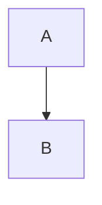

# Invalid Flowchart Diagrams

This file contains invalid flowchart test fixtures with:
- GitHub render attempts
- Error from mermaid-cli
- Error/output from our linter

> Note: Auto-generated by `scripts/generate-invalid-preview.js`. Do not edit manually.

## Table of Contents

1. [Empty Diagram](#1-empty-diagram)
2. [Empty Nodes](#2-empty-nodes)
3. [Escaped Quotes In Decision](#3-escaped-quotes-in-decision)
4. [Invalid Arrow](#4-invalid-arrow)
5. [Invalid Class](#5-invalid-class)
6. [Invalid Node Syntax](#6-invalid-node-syntax)
7. [Invalid Subgraph](#7-invalid-subgraph)
8. [Missing Arrow](#8-missing-arrow)
9. [Mixed Brackets](#9-mixed-brackets)
10. [No Diagram Type](#10-no-diagram-type)
11. [Quotes Double Inside Single](#11-quotes-double-inside-single)
12. [Special Chars](#12-special-chars)
13. [Unclosed Bracket](#13-unclosed-bracket)
14. [Unclosed Quote In Label](#14-unclosed-quote-in-label)
15. [Unescaped Quotes In Decision](#15-unescaped-quotes-in-decision)
16. [Unmatched End](#16-unmatched-end)
17. [Unquoted Label With Quotes](#17-unquoted-label-with-quotes)
18. [Wrong Direction](#18-wrong-direction)

---

## Summary

| # | Diagram | mermaid-cli | maid | Auto-fix? |
|---:|---|:---:|:---:|:---:|
| 1 | [Empty Diagram](#1-empty-diagram) | VALID | VALID | — |
| 2 | [Empty Nodes](#2-empty-nodes) | INVALID | INVALID | ✅ safe |
| 3 | [Escaped Quotes In Decision](#3-escaped-quotes-in-decision) | INVALID | INVALID | — |
| 4 | [Invalid Arrow](#4-invalid-arrow) | INVALID | INVALID | ✅ safe |
| 5 | [Invalid Class](#5-invalid-class) | INVALID | INVALID | — |
| 6 | [Invalid Node Syntax](#6-invalid-node-syntax) | INVALID | INVALID | — |
| 7 | [Invalid Subgraph](#7-invalid-subgraph) | INVALID | INVALID | — |
| 8 | [Missing Arrow](#8-missing-arrow) | INVALID | INVALID | ✅ all |
| 9 | [Mixed Brackets](#9-mixed-brackets) | INVALID | INVALID | — |
| 10 | [No Diagram Type](#10-no-diagram-type) | INVALID | INVALID | — |
| 11 | [Quotes Double Inside Single](#11-quotes-double-inside-single) | INVALID | INVALID | ✅ safe |
| 12 | [Special Chars](#12-special-chars) | INVALID | INVALID | — |
| 13 | [Unclosed Bracket](#13-unclosed-bracket) | INVALID | INVALID | ✅ all |
| 14 | [Unclosed Quote In Label](#14-unclosed-quote-in-label) | INVALID | INVALID | ✅ all |
| 15 | [Unescaped Quotes In Decision](#15-unescaped-quotes-in-decision) | INVALID | INVALID | ✅ safe |
| 16 | [Unmatched End](#16-unmatched-end) | INVALID | INVALID | — |
| 17 | [Unquoted Label With Quotes](#17-unquoted-label-with-quotes) | INVALID | INVALID | ✅ all |
| 18 | [Wrong Direction](#18-wrong-direction) | INVALID | INVALID | — |

---

## 1. Empty Diagram

📄 **Source**: [`empty-diagram.mmd`](./invalid/empty-diagram.mmd)

❌ **Error**: Diagram must contain at least one statement after declaration.

### GitHub Render Attempt

> **Note**: This invalid diagram may not render or may render incorrectly.

```mermaid
flowchart TD
```

### mermaid-cli Result: VALID

### maid Result: VALID

### maid Auto-fix (`--fix`) Preview

No auto-fix changes (safe level).

### maid Auto-fix (`--fix=all`) Preview

No auto-fix changes (all level).

<details>
<summary>View source code</summary>

```
flowchart TD
```
</details>

---

## 2. Empty Nodes

📄 **Source**: [`empty-nodes.mmd`](./invalid/empty-nodes.mmd)

### GitHub Render Attempt

> **Note**: This invalid diagram may not render or may render incorrectly.

```mermaid
flowchart TD
    A[""] --> B[" "]
    B --> C[]
```

### mermaid-cli Result: INVALID

```
Error: Parse error on line 2:
...lowchart TD    A[""] --> B[" "]    B -
----------------------^
Expecting 'TAGEND', 'STR', 'MD_STR', 'UNICODE_TEXT', 'TEXT', 'TAGSTART', got 'SQE'
Parser3.parseError (node_modules/mermaid/dist/mermaid.js:91236:28)
    at #evaluate (node_modules/puppeteer-core/lib/esm/puppeteer/cdp/ExecutionContext.js:388:19)
    at async ExecutionContext.evaluate (node_modules/puppeteer-core/lib/esm/puppeteer/cdp/ExecutionContext.js:275:16)
    at async IsolatedWorld.evaluate (node_modules/puppeteer-core/lib/esm/puppeteer/cdp/IsolatedWorld.js:97:16)
    at async CdpJSHandle.evaluate (node_modules/puppeteer-core/lib/esm/puppeteer/api/JSHandle.js:146:20)
    at async CdpElementHandle.evaluate (node_modules/puppeteer-core/lib/esm/puppeteer/api/ElementHandle.js:340:20)
    at async CdpElementHandle.$eval (node_modules/puppeteer-core/lib/esm/puppeteer/api/ElementHandle.js:494:24)
    at async CdpFrame.$eval (node_modules/puppeteer-core/lib/esm/puppeteer/api/Frame.js:450:20)
    at async CdpPage.$eval (node_modules/puppeteer-core/lib/esm/puppeteer/api/Page.js:450:20)
    at async renderMermaid (node_modules/@mermaid-js/mermaid-cli/src/index.js:266:22)
    at fromText (node_modules/mermaid/dist/mermaid.js:153955:21)
```

### maid Result: INVALID

```
error[FL-NODE-EMPTY]: Empty label inside a shape (only empty quotes/whitespace).
at test-fixtures/flowchart/invalid/empty-nodes.mmd:2:7
  1 | flowchart TD
  2 |     A[""] --> B[" "]
    |       ^
  3 |     B --> C[]
hint: Provide non-empty text, e.g., A["Start"] or A[Start]. If you want no label, omit the brackets and just use A.

error[FL-NODE-EMPTY]: Empty label inside a shape (only empty quotes/whitespace).
at test-fixtures/flowchart/invalid/empty-nodes.mmd:2:17
  1 | flowchart TD
  2 |     A[""] --> B[" "]
    |                 ^
  3 |     B --> C[]
hint: Provide non-empty text, e.g., A["Start"] or A[Start]. If you want no label, omit the brackets and just use A.

error[FL-NODE-EMPTY]: Empty label inside a shape.
at test-fixtures/flowchart/invalid/empty-nodes.mmd:3:12
  2 |     A[""] --> B[" "]
  3 |     B --> C[]
    |            ^
hint: Write non-empty text inside the brackets, e.g., A["Start"] or A[Start]. If you want no label, omit the brackets and just use A.
```

### maid Auto-fix (`--fix`) Preview


### maid Auto-fix (`--fix=all`) Preview


<details>
<summary>View source code</summary>

```
flowchart TD
    A[""] --> B[" "]
    B --> C[]
```
</details>

---

## 3. Escaped Quotes In Decision

📄 **Source**: [`escaped-quotes-in-decision.mmd`](./invalid/escaped-quotes-in-decision.mmd)

### GitHub Render Attempt

> **Note**: This invalid diagram may not render or may render incorrectly.

```mermaid
flowchart TD
    subgraph API_Loader_Custom_Authentication_Processing[API Loader: Custom Authentication Processing]
        direction TB
        A[Start processing API definition] --> B{Custom Auth Enabled?}
        B -- No --> C[Continue with other auth methods]
        B -- Yes --> D{"Is \"Driver\" AND \"AuthCheck.Path\" configured?"}
        B -- Yes --> E{"Is "Driver" configured?"}
    end

```

### mermaid-cli Result: INVALID

```
Error: Parse error on line 6:
...--> D{"Is \"Driver\" AND \"AuthCheck.Pat
-----------------------^
Expecting 'SQE', 'DOUBLECIRCLEEND', 'PE', '-)', 'STADIUMEND', 'SUBROUTINEEND', 'PIPE', 'CYLINDEREND', 'DIAMOND_STOP', 'TAGEND', 'TRAPEND', 'INVTRAPEND', 'UNICODE_TEXT', 'TEXT', 'TAGSTART', got 'STR'
Parser3.parseError (node_modules/mermaid/dist/mermaid.js:91236:28)
    at #evaluate (node_modules/puppeteer-core/lib/esm/puppeteer/cdp/ExecutionContext.js:388:19)
    at async ExecutionContext.evaluate (node_modules/puppeteer-core/lib/esm/puppeteer/cdp/ExecutionContext.js:275:16)
    at async IsolatedWorld.evaluate (node_modules/puppeteer-core/lib/esm/puppeteer/cdp/IsolatedWorld.js:97:16)
    at async CdpJSHandle.evaluate (node_modules/puppeteer-core/lib/esm/puppeteer/api/JSHandle.js:146:20)
    at async CdpElementHandle.evaluate (node_modules/puppeteer-core/lib/esm/puppeteer/api/ElementHandle.js:340:20)
    at async CdpElementHandle.$eval (node_modules/puppeteer-core/lib/esm/puppeteer/api/ElementHandle.js:494:24)
    at async CdpFrame.$eval (node_modules/puppeteer-core/lib/esm/puppeteer/api/Frame.js:450:20)
    at async CdpPage.$eval (node_modules/puppeteer-core/lib/esm/puppeteer/api/Page.js:450:20)
    at async renderMermaid (node_modules/@mermaid-js/mermaid-cli/src/index.js:266:22)
    at fromText (node_modules/mermaid/dist/mermaid.js:153955:21)
```

### maid Result: INVALID

```
error[FL-LABEL-ESCAPED-QUOTE]: Escaped quotes (\") in node labels are not supported by Mermaid. Use &quot; instead.
at test-fixtures/flowchart/invalid/escaped-quotes-in-decision.mmd:6:28
  5 |         B -- No --> C[Continue with other auth methods]
  6 |         B -- Yes --> D{"Is \"Driver\" AND \"AuthCheck.Path\" configured?"}
    |                            ^^
  7 |         B -- Yes --> E{"Is "Driver" configured?"}
hint: Example: D{"Is &quot;Driver&quot; AND &quot;AuthCheck.Path&quot; configured?"}
```

### maid Auto-fix (`--fix`) Preview

No auto-fix changes (safe level).

### maid Auto-fix (`--fix=all`) Preview

No auto-fix changes (all level).

<details>
<summary>View source code</summary>

```
flowchart TD
    subgraph API_Loader_Custom_Authentication_Processing[API Loader: Custom Authentication Processing]
        direction TB
        A[Start processing API definition] --> B{Custom Auth Enabled?}
        B -- No --> C[Continue with other auth methods]
        B -- Yes --> D{"Is \"Driver\" AND \"AuthCheck.Path\" configured?"}
        B -- Yes --> E{"Is "Driver" configured?"}
    end

```
</details>

---

## 4. Invalid Arrow

📄 **Source**: [`invalid-arrow.mmd`](./invalid/invalid-arrow.mmd)

❌ **Error**: Single arrow `->` is invalid. Use `-->` instead.

### GitHub Render Attempt

> **Note**: This invalid diagram may not render or may render incorrectly.

```mermaid
flowchart TD
    A -> B
    B --> C
```

### mermaid-cli Result: INVALID

```
Error: Parse error on line 2:
flowchart TD    A -> B    B --> C
------------------^
Expecting 'SEMI', 'NEWLINE', 'EOF', 'AMP', 'START_LINK', 'LINK', 'LINK_ID', got 'MINUS'
Parser3.parseError (node_modules/mermaid/dist/mermaid.js:91236:28)
    at #evaluate (node_modules/puppeteer-core/lib/esm/puppeteer/cdp/ExecutionContext.js:388:19)
    at async ExecutionContext.evaluate (node_modules/puppeteer-core/lib/esm/puppeteer/cdp/ExecutionContext.js:275:16)
    at async IsolatedWorld.evaluate (node_modules/puppeteer-core/lib/esm/puppeteer/cdp/IsolatedWorld.js:97:16)
    at async CdpJSHandle.evaluate (node_modules/puppeteer-core/lib/esm/puppeteer/api/JSHandle.js:146:20)
    at async CdpElementHandle.evaluate (node_modules/puppeteer-core/lib/esm/puppeteer/api/ElementHandle.js:340:20)
    at async CdpElementHandle.$eval (node_modules/puppeteer-core/lib/esm/puppeteer/api/ElementHandle.js:494:24)
    at async CdpFrame.$eval (node_modules/puppeteer-core/lib/esm/puppeteer/api/Frame.js:450:20)
    at async CdpPage.$eval (node_modules/puppeteer-core/lib/esm/puppeteer/api/Page.js:450:20)
    at async renderMermaid (node_modules/@mermaid-js/mermaid-cli/src/index.js:266:22)
    at fromText (node_modules/mermaid/dist/mermaid.js:153955:21)
```

### maid Result: INVALID

```
error[FL-ARROW-INVALID]: Invalid arrow syntax: -> (use --> instead)
at test-fixtures/flowchart/invalid/invalid-arrow.mmd:2:7
  1 | flowchart TD
  2 |     A -> B
    |       ^^
  3 |     B --> C
hint: Replace -> with -->, or use -- text --> for inline labels.
```

### maid Auto-fix (`--fix`) Preview


### maid Auto-fix (`--fix=all`) Preview


<details>
<summary>View source code</summary>

```
flowchart TD
    A -> B
    B --> C
```
</details>

---

## 5. Invalid Class

📄 **Source**: [`invalid-class.mmd`](./invalid/invalid-class.mmd)

❌ **Error**: Class statement requires both node ID(s) and class name.

### GitHub Render Attempt

> **Note**: This invalid diagram may not render or may render incorrectly.

```mermaid
flowchart TD
    A --> B
    class A
```

### mermaid-cli Result: INVALID

```
Error: Parse error on line 3:
... A --> B    class A
----------------------^
Expecting 'SPACE', 'AMP', 'COLON', 'DOWN', 'DEFAULT', 'NUM', 'COMMA', 'NODE_STRING', 'BRKT', 'MINUS', 'MULT', 'UNICODE_TEXT', got 'NEWLINE'
Parser3.parseError (node_modules/mermaid/dist/mermaid.js:91236:28)
    at #evaluate (node_modules/puppeteer-core/lib/esm/puppeteer/cdp/ExecutionContext.js:388:19)
    at async ExecutionContext.evaluate (node_modules/puppeteer-core/lib/esm/puppeteer/cdp/ExecutionContext.js:275:16)
    at async IsolatedWorld.evaluate (node_modules/puppeteer-core/lib/esm/puppeteer/cdp/IsolatedWorld.js:97:16)
    at async CdpJSHandle.evaluate (node_modules/puppeteer-core/lib/esm/puppeteer/api/JSHandle.js:146:20)
    at async CdpElementHandle.evaluate (node_modules/puppeteer-core/lib/esm/puppeteer/api/ElementHandle.js:340:20)
    at async CdpElementHandle.$eval (node_modules/puppeteer-core/lib/esm/puppeteer/api/ElementHandle.js:494:24)
    at async CdpFrame.$eval (node_modules/puppeteer-core/lib/esm/puppeteer/api/Frame.js:450:20)
    at async CdpPage.$eval (node_modules/puppeteer-core/lib/esm/puppeteer/api/Page.js:450:20)
    at async renderMermaid (node_modules/@mermaid-js/mermaid-cli/src/index.js:266:22)
    at fromText (node_modules/mermaid/dist/mermaid.js:153955:21)
```

### maid Result: INVALID

```
error[FL-CLASS-MALFORMED]: Invalid class statement. Provide node id(s) then a class name.
at test-fixtures/flowchart/invalid/invalid-class.mmd:3:12
  2 |     A --> B
  3 |     class A
    |            ^
hint: Example: class A,B important
```

### maid Auto-fix (`--fix`) Preview

No auto-fix changes (safe level).

### maid Auto-fix (`--fix=all`) Preview

No auto-fix changes (all level).

<details>
<summary>View source code</summary>

```
flowchart TD
    A --> B
    class A
```
</details>

---

## 6. Invalid Node Syntax

📄 **Source**: [`invalid-node-syntax.mmd`](./invalid/invalid-node-syntax.mmd)

❌ **Error**: Incomplete node syntax with unclosed brackets.

### GitHub Render Attempt

> **Note**: This invalid diagram may not render or may render incorrectly.

```mermaid
flowchart TD
    A(( --> B
    B --> C
```

### mermaid-cli Result: INVALID

```
Error: Parse error on line 4:
...( --> B    B --> C
---------------------^
Expecting 'SQE', 'DOUBLECIRCLEEND', 'PE', '-)', 'STADIUMEND', 'SUBROUTINEEND', 'PIPE', 'CYLINDEREND', 'DIAMOND_STOP', 'TAGEND', 'TRAPEND', 'INVTRAPEND', 'UNICODE_TEXT', 'TEXT', 'TAGSTART', got '1'
Parser3.parseError (node_modules/mermaid/dist/mermaid.js:91236:28)
    at #evaluate (node_modules/puppeteer-core/lib/esm/puppeteer/cdp/ExecutionContext.js:388:19)
    at async ExecutionContext.evaluate (node_modules/puppeteer-core/lib/esm/puppeteer/cdp/ExecutionContext.js:275:16)
    at async IsolatedWorld.evaluate (node_modules/puppeteer-core/lib/esm/puppeteer/cdp/IsolatedWorld.js:97:16)
    at async CdpJSHandle.evaluate (node_modules/puppeteer-core/lib/esm/puppeteer/api/JSHandle.js:146:20)
    at async CdpElementHandle.evaluate (node_modules/puppeteer-core/lib/esm/puppeteer/api/ElementHandle.js:340:20)
    at async CdpElementHandle.$eval (node_modules/puppeteer-core/lib/esm/puppeteer/api/ElementHandle.js:494:24)
    at async CdpFrame.$eval (node_modules/puppeteer-core/lib/esm/puppeteer/api/Frame.js:450:20)
    at async CdpPage.$eval (node_modules/puppeteer-core/lib/esm/puppeteer/api/Page.js:450:20)
    at async renderMermaid (node_modules/@mermaid-js/mermaid-cli/src/index.js:266:22)
    at fromText (node_modules/mermaid/dist/mermaid.js:153955:21)
```

### maid Result: INVALID

```
error[FL-NODE-UNCLOSED-BRACKET]: Unclosed '(( '. Add a matching '))'.
at test-fixtures/flowchart/invalid/invalid-node-syntax.mmd:2:9
  1 | flowchart TD
  2 |     A(( --> B
    |         ^^
  3 |     B --> C
hint: Example: A((Circle))
```

### maid Auto-fix (`--fix`) Preview

No auto-fix changes (safe level).

### maid Auto-fix (`--fix=all`) Preview

No auto-fix changes (all level).

<details>
<summary>View source code</summary>

```
flowchart TD
    A(( --> B
    B --> C
```
</details>

---

## 7. Invalid Subgraph

📄 **Source**: [`invalid-subgraph.mmd`](./invalid/invalid-subgraph.mmd)

❌ **Error**: Subgraph must have an ID or title.

### GitHub Render Attempt

> **Note**: This invalid diagram may not render or may render incorrectly.

```mermaid
flowchart TD
    subgraph
        A --> B
    end
```

### mermaid-cli Result: INVALID

```
TypeError: Cannot read properties of undefined (reading 'text')
FlowDB.addSubGraph (node_modules/mermaid/dist/mermaid.js:45974:26)
    at #evaluate (node_modules/puppeteer-core/lib/esm/puppeteer/cdp/ExecutionContext.js:388:19)
    at async ExecutionContext.evaluate (node_modules/puppeteer-core/lib/esm/puppeteer/cdp/ExecutionContext.js:275:16)
    at async IsolatedWorld.evaluate (node_modules/puppeteer-core/lib/esm/puppeteer/cdp/IsolatedWorld.js:97:16)
    at async CdpJSHandle.evaluate (node_modules/puppeteer-core/lib/esm/puppeteer/api/JSHandle.js:146:20)
    at async CdpElementHandle.evaluate (node_modules/puppeteer-core/lib/esm/puppeteer/api/ElementHandle.js:340:20)
    at async CdpElementHandle.$eval (node_modules/puppeteer-core/lib/esm/puppeteer/api/ElementHandle.js:494:24)
    at async CdpFrame.$eval (node_modules/puppeteer-core/lib/esm/puppeteer/api/Frame.js:450:20)
    at async CdpPage.$eval (node_modules/puppeteer-core/lib/esm/puppeteer/api/Page.js:450:20)
    at async renderMermaid (node_modules/@mermaid-js/mermaid-cli/src/index.js:266:22)
    at fromText (node_modules/mermaid/dist/mermaid.js:153955:21)
```

### maid Result: INVALID

```
error[FL-SUBGRAPH-MISSING-HEADER]: Subgraph header is missing. Add an ID or a [Title] after the keyword.
at test-fixtures/flowchart/invalid/invalid-subgraph.mmd:2:13
  1 | flowchart TD
  2 |     subgraph
    |             ^
  3 |         A --> B
hint: Example: subgraph API [API Layer]
```

### maid Auto-fix (`--fix`) Preview

No auto-fix changes (safe level).

### maid Auto-fix (`--fix=all`) Preview

No auto-fix changes (all level).

<details>
<summary>View source code</summary>

```
flowchart TD
    subgraph
        A --> B
    end
```
</details>

---

## 8. Missing Arrow

📄 **Source**: [`missing-arrow.mmd`](./invalid/missing-arrow.mmd)

❌ **Error**: Nodes on the same line must be connected with arrows.

### GitHub Render Attempt

> **Note**: This invalid diagram may not render or may render incorrectly.

```mermaid
flowchart TD
    A B
```

### mermaid-cli Result: INVALID

```
Error: Parse error on line 2:
flowchart TD    A B
------------------^
Expecting 'SEMI', 'NEWLINE', 'EOF', 'AMP', 'START_LINK', 'LINK', 'LINK_ID', got 'NODE_STRING'
Parser3.parseError (node_modules/mermaid/dist/mermaid.js:91236:28)
    at #evaluate (node_modules/puppeteer-core/lib/esm/puppeteer/cdp/ExecutionContext.js:388:19)
    at async ExecutionContext.evaluate (node_modules/puppeteer-core/lib/esm/puppeteer/cdp/ExecutionContext.js:275:16)
    at async IsolatedWorld.evaluate (node_modules/puppeteer-core/lib/esm/puppeteer/cdp/IsolatedWorld.js:97:16)
    at async CdpJSHandle.evaluate (node_modules/puppeteer-core/lib/esm/puppeteer/api/JSHandle.js:146:20)
    at async CdpElementHandle.evaluate (node_modules/puppeteer-core/lib/esm/puppeteer/api/ElementHandle.js:340:20)
    at async CdpElementHandle.$eval (node_modules/puppeteer-core/lib/esm/puppeteer/api/ElementHandle.js:494:24)
    at async CdpFrame.$eval (node_modules/puppeteer-core/lib/esm/puppeteer/api/Frame.js:450:20)
    at async CdpPage.$eval (node_modules/puppeteer-core/lib/esm/puppeteer/api/Page.js:450:20)
    at async renderMermaid (node_modules/@mermaid-js/mermaid-cli/src/index.js:266:22)
    at fromText (node_modules/mermaid/dist/mermaid.js:153955:21)
```

### maid Result: INVALID

```
error[FL-LINK-MISSING]: Two nodes on one line must be connected with an arrow before 'B'.
at test-fixtures/flowchart/invalid/missing-arrow.mmd:2:7
  1 | flowchart TD
  2 |     A B
    |       ^
hint: Insert --> between nodes, e.g., A --> B.
```

### maid Auto-fix (`--fix`) Preview

No auto-fix changes (safe level).

### maid Auto-fix (`--fix=all`) Preview



<details>
<summary>View source code</summary>

```
flowchart TD
    A B
```
</details>

---

## 9. Mixed Brackets

📄 **Source**: [`mixed-brackets.mmd`](./invalid/mixed-brackets.mmd)

❌ **Error**: Mixing bracket types like `[text)` is not allowed.

### GitHub Render Attempt

> **Note**: This invalid diagram may not render or may render incorrectly.

```mermaid
flowchart LR
    A[Text] --> B(Text]
    B --> C
```

### mermaid-cli Result: INVALID

```
Error: Parse error on line 2:
...  A[Text] --> B(Text]    B --> C
-----------------------^
Expecting 'PE', 'TAGEND', 'UNICODE_TEXT', 'TEXT', 'TAGSTART', got 'SQE'
Parser3.parseError (node_modules/mermaid/dist/mermaid.js:91236:28)
    at #evaluate (node_modules/puppeteer-core/lib/esm/puppeteer/cdp/ExecutionContext.js:388:19)
    at async ExecutionContext.evaluate (node_modules/puppeteer-core/lib/esm/puppeteer/cdp/ExecutionContext.js:275:16)
    at async IsolatedWorld.evaluate (node_modules/puppeteer-core/lib/esm/puppeteer/cdp/IsolatedWorld.js:97:16)
    at async CdpJSHandle.evaluate (node_modules/puppeteer-core/lib/esm/puppeteer/api/JSHandle.js:146:20)
    at async CdpElementHandle.evaluate (node_modules/puppeteer-core/lib/esm/puppeteer/api/ElementHandle.js:340:20)
    at async CdpElementHandle.$eval (node_modules/puppeteer-core/lib/esm/puppeteer/api/ElementHandle.js:494:24)
    at async CdpFrame.$eval (node_modules/puppeteer-core/lib/esm/puppeteer/api/Frame.js:450:20)
    at async CdpPage.$eval (node_modules/puppeteer-core/lib/esm/puppeteer/api/Page.js:450:20)
    at async renderMermaid (node_modules/@mermaid-js/mermaid-cli/src/index.js:266:22)
    at fromText (node_modules/mermaid/dist/mermaid.js:153955:21)
```

### maid Result: INVALID

```
error[FL-NODE-MIXED-BRACKETS]: Mismatched brackets: opened '(' but closed with ']'.
at test-fixtures/flowchart/invalid/mixed-brackets.mmd:2:23
  1 | flowchart LR
  2 |     A[Text] --> B(Text]
    |                       ^
  3 |     B --> C
hint: Close with ')' or change the opening bracket to '['.
```

### maid Auto-fix (`--fix`) Preview

No auto-fix changes (safe level).

### maid Auto-fix (`--fix=all`) Preview

No auto-fix changes (all level).

<details>
<summary>View source code</summary>

```
flowchart LR
    A[Text] --> B(Text]
    B --> C
```
</details>

---

## 10. No Diagram Type

📄 **Source**: [`no-diagram-type.mmd`](./invalid/no-diagram-type.mmd)

❌ **Error**: Diagram must start with `graph` or `flowchart`.

### GitHub Render Attempt

> **Note**: This invalid diagram may not render or may render incorrectly.

```mermaid
A --> B
B --> C
```

### mermaid-cli Result: INVALID

```
UnknownDiagramError: No diagram type detected matching given configuration for text: A --> B
B --> C
detectType (node_modules/mermaid/dist/mermaid.js:20437:15)
    at $eval ($eval at renderMermaid (node_modules/@mermaid-js/mermaid-cli/src/index.js:266:33), <anonymous>:48:45)
    at #evaluate (node_modules/puppeteer-core/lib/esm/puppeteer/cdp/ExecutionContext.js:388:19)
    at async ExecutionContext.evaluate (node_modules/puppeteer-core/lib/esm/puppeteer/cdp/ExecutionContext.js:275:16)
    at async IsolatedWorld.evaluate (node_modules/puppeteer-core/lib/esm/puppeteer/cdp/IsolatedWorld.js:97:16)
    at async CdpJSHandle.evaluate (node_modules/puppeteer-core/lib/esm/puppeteer/api/JSHandle.js:146:20)
    at async CdpElementHandle.evaluate (node_modules/puppeteer-core/lib/esm/puppeteer/api/ElementHandle.js:340:20)
    at async CdpElementHandle.$eval (node_modules/puppeteer-core/lib/esm/puppeteer/api/ElementHandle.js:494:24)
    at async CdpFrame.$eval (node_modules/puppeteer-core/lib/esm/puppeteer/api/Frame.js:450:20)
    at async CdpPage.$eval (node_modules/puppeteer-core/lib/esm/puppeteer/api/Page.js:450:20)
    at async renderMermaid (node_modules/@mermaid-js/mermaid-cli/src/index.js:266:22)
```

### maid Result: INVALID

```
error[GEN-HEADER-INVALID]: Diagram must start with "graph", "flowchart", "pie", or "sequenceDiagram"
at test-fixtures/flowchart/invalid/no-diagram-type.mmd:1:1
  1 | A --> B
    | ^
  2 | B --> C
hint: Start your diagram with e.g. "flowchart TD", "pie", or "sequenceDiagram".
```

### maid Auto-fix (`--fix`) Preview

No auto-fix changes (safe level).

### maid Auto-fix (`--fix=all`) Preview

No auto-fix changes (all level).

<details>
<summary>View source code</summary>

```
A --> B
B --> C
```
</details>

---

## 11. Quotes Double Inside Single

📄 **Source**: [`quotes-double-inside-single.mmd`](./invalid/quotes-double-inside-single.mmd)

### GitHub Render Attempt

> **Note**: This invalid diagram may not render or may render incorrectly.

```mermaid
flowchart LR
  A['She said "Hello"'] --> B


```

### mermaid-cli Result: INVALID

```
Error: Parse error on line 2:
...t LR  A['She said "Hello"'] --> B
----------------------^
Expecting 'SQE', 'DOUBLECIRCLEEND', 'PE', '-)', 'STADIUMEND', 'SUBROUTINEEND', 'PIPE', 'CYLINDEREND', 'DIAMOND_STOP', 'TAGEND', 'TRAPEND', 'INVTRAPEND', 'UNICODE_TEXT', 'TEXT', 'TAGSTART', got 'STR'
Parser3.parseError (node_modules/mermaid/dist/mermaid.js:91236:28)
    at #evaluate (node_modules/puppeteer-core/lib/esm/puppeteer/cdp/ExecutionContext.js:388:19)
    at async ExecutionContext.evaluate (node_modules/puppeteer-core/lib/esm/puppeteer/cdp/ExecutionContext.js:275:16)
    at async IsolatedWorld.evaluate (node_modules/puppeteer-core/lib/esm/puppeteer/cdp/IsolatedWorld.js:97:16)
    at async CdpJSHandle.evaluate (node_modules/puppeteer-core/lib/esm/puppeteer/api/JSHandle.js:146:20)
    at async CdpElementHandle.evaluate (node_modules/puppeteer-core/lib/esm/puppeteer/api/ElementHandle.js:340:20)
    at async CdpElementHandle.$eval (node_modules/puppeteer-core/lib/esm/puppeteer/api/ElementHandle.js:494:24)
    at async CdpFrame.$eval (node_modules/puppeteer-core/lib/esm/puppeteer/api/Frame.js:450:20)
    at async CdpPage.$eval (node_modules/puppeteer-core/lib/esm/puppeteer/api/Page.js:450:20)
    at async renderMermaid (node_modules/@mermaid-js/mermaid-cli/src/index.js:266:22)
    at fromText (node_modules/mermaid/dist/mermaid.js:153955:21)
```

### maid Result: INVALID

```
error[FL-LABEL-DOUBLE-IN-SINGLE]: Double quotes inside a single-quoted label are not supported by Mermaid. Replace inner " with &quot; or use a double-quoted label with &quot;.
at test-fixtures/flowchart/invalid/quotes-double-inside-single.mmd:2:15
  1 | flowchart LR
  2 |   A['She said "Hello"'] --> B
    |               ^
  3 | 
hint: Change to "She said &quot;Hello&quot;" or replace inner " with &quot;.
```

### maid Auto-fix (`--fix`) Preview


### maid Auto-fix (`--fix=all`) Preview


<details>
<summary>View source code</summary>

```
flowchart LR
  A['She said "Hello"'] --> B


```
</details>

---

## 12. Special Chars

📄 **Source**: [`special-chars.mmd`](./invalid/special-chars.mmd)

❌ **Error**: Escaped quotes with backslash not supported in node labels.

### GitHub Render Attempt

> **Note**: This invalid diagram may not render or may render incorrectly.

```mermaid
flowchart LR
    A["Node with quotes"] --> B["Another \"quoted\" node"]
    B --> C[Node with #35; special &amp; chars]
    C --> D["Multi
    line
    text"]
```

### mermaid-cli Result: INVALID

```
Error: Parse error on line 2:
...["Another \"quoted\" node"]    B --> C[
-----------------------^
Expecting 'SQE', 'DOUBLECIRCLEEND', 'PE', '-)', 'STADIUMEND', 'SUBROUTINEEND', 'PIPE', 'CYLINDEREND', 'DIAMOND_STOP', 'TAGEND', 'TRAPEND', 'INVTRAPEND', 'UNICODE_TEXT', 'TEXT', 'TAGSTART', got 'STR'
Parser3.parseError (node_modules/mermaid/dist/mermaid.js:91236:28)
    at #evaluate (node_modules/puppeteer-core/lib/esm/puppeteer/cdp/ExecutionContext.js:388:19)
    at async ExecutionContext.evaluate (node_modules/puppeteer-core/lib/esm/puppeteer/cdp/ExecutionContext.js:275:16)
    at async IsolatedWorld.evaluate (node_modules/puppeteer-core/lib/esm/puppeteer/cdp/IsolatedWorld.js:97:16)
    at async CdpJSHandle.evaluate (node_modules/puppeteer-core/lib/esm/puppeteer/api/JSHandle.js:146:20)
    at async CdpElementHandle.evaluate (node_modules/puppeteer-core/lib/esm/puppeteer/api/ElementHandle.js:340:20)
    at async CdpElementHandle.$eval (node_modules/puppeteer-core/lib/esm/puppeteer/api/ElementHandle.js:494:24)
    at async CdpFrame.$eval (node_modules/puppeteer-core/lib/esm/puppeteer/api/Frame.js:450:20)
    at async CdpPage.$eval (node_modules/puppeteer-core/lib/esm/puppeteer/api/Page.js:450:20)
    at async renderMermaid (node_modules/@mermaid-js/mermaid-cli/src/index.js:266:22)
    at fromText (node_modules/mermaid/dist/mermaid.js:153955:21)
```

### maid Result: INVALID

```
error[FL-LABEL-ESCAPED-QUOTE]: Escaped quotes (\") in node labels are not supported by Mermaid. Use &quot; instead.
at test-fixtures/flowchart/invalid/special-chars.mmd:2:42
  1 | flowchart LR
  2 |     A["Node with quotes"] --> B["Another \"quoted\" node"]
    |                                          ^^
  3 |     B --> C[Node with #35; special &amp; chars]
hint: Prefer "He said &quot;Hi&quot;".
```

### maid Auto-fix (`--fix`) Preview

No auto-fix changes (safe level).

### maid Auto-fix (`--fix=all`) Preview

No auto-fix changes (all level).

<details>
<summary>View source code</summary>

```
flowchart LR
    A["Node with quotes"] --> B["Another \"quoted\" node"]
    B --> C[Node with #35; special &amp; chars]
    C --> D["Multi
    line
    text"]
```
</details>

---

## 13. Unclosed Bracket

📄 **Source**: [`unclosed-bracket.mmd`](./invalid/unclosed-bracket.mmd)

❌ **Error**: All brackets must be properly closed.

### GitHub Render Attempt

> **Note**: This invalid diagram may not render or may render incorrectly.

```mermaid
flowchart LR
    A[Start --> B
    B --> C
```

### mermaid-cli Result: INVALID

```
Error: Parse error on line 4:
...t --> B    B --> C
---------------------^
Expecting 'SQE', 'DOUBLECIRCLEEND', 'PE', '-)', 'STADIUMEND', 'SUBROUTINEEND', 'PIPE', 'CYLINDEREND', 'DIAMOND_STOP', 'TAGEND', 'TRAPEND', 'INVTRAPEND', 'UNICODE_TEXT', 'TEXT', 'TAGSTART', got '1'
Parser3.parseError (node_modules/mermaid/dist/mermaid.js:91236:28)
    at #evaluate (node_modules/puppeteer-core/lib/esm/puppeteer/cdp/ExecutionContext.js:388:19)
    at async ExecutionContext.evaluate (node_modules/puppeteer-core/lib/esm/puppeteer/cdp/ExecutionContext.js:275:16)
    at async IsolatedWorld.evaluate (node_modules/puppeteer-core/lib/esm/puppeteer/cdp/IsolatedWorld.js:97:16)
    at async CdpJSHandle.evaluate (node_modules/puppeteer-core/lib/esm/puppeteer/api/JSHandle.js:146:20)
    at async CdpElementHandle.evaluate (node_modules/puppeteer-core/lib/esm/puppeteer/api/ElementHandle.js:340:20)
    at async CdpElementHandle.$eval (node_modules/puppeteer-core/lib/esm/puppeteer/api/ElementHandle.js:494:24)
    at async CdpFrame.$eval (node_modules/puppeteer-core/lib/esm/puppeteer/api/Frame.js:450:20)
    at async CdpPage.$eval (node_modules/puppeteer-core/lib/esm/puppeteer/api/Page.js:450:20)
    at async renderMermaid (node_modules/@mermaid-js/mermaid-cli/src/index.js:266:22)
    at fromText (node_modules/mermaid/dist/mermaid.js:153955:21)
```

### maid Result: INVALID

```
error[FL-NODE-UNCLOSED-BRACKET]: Unclosed '['. Add a matching ']' before the arrow or newline.
at test-fixtures/flowchart/invalid/unclosed-bracket.mmd:2:13
  1 | flowchart LR
  2 |     A[Start --> B
    |             ^
  3 |     B --> C
hint: Example: A[Label] --> B
```

### maid Auto-fix (`--fix`) Preview

No auto-fix changes (safe level).

### maid Auto-fix (`--fix=all`) Preview

```mermaid
flowchart LR
    A[Start ]--> B
    B --> C
```

<details>
<summary>View source code</summary>

```
flowchart LR
    A[Start --> B
    B --> C
```
</details>

---

## 14. Unclosed Quote In Label

📄 **Source**: [`unclosed-quote-in-label.mmd`](./invalid/unclosed-quote-in-label.mmd)

### GitHub Render Attempt

> **Note**: This invalid diagram may not render or may render incorrectly.

```mermaid
flowchart TD
  A["Unclosed label]
  A --> B


```

### mermaid-cli Result: INVALID

```
Error: Parse error on line 6:
... label]  A --> B
-------------------^
Expecting 'SQE', 'DOUBLECIRCLEEND', 'PE', '-)', 'STADIUMEND', 'SUBROUTINEEND', 'PIPE', 'CYLINDEREND', 'DIAMOND_STOP', 'TAGEND', 'TRAPEND', 'INVTRAPEND', 'UNICODE_TEXT', 'TEXT', 'TAGSTART', got '1'
Parser3.parseError (node_modules/mermaid/dist/mermaid.js:91236:28)
    at #evaluate (node_modules/puppeteer-core/lib/esm/puppeteer/cdp/ExecutionContext.js:388:19)
    at async ExecutionContext.evaluate (node_modules/puppeteer-core/lib/esm/puppeteer/cdp/ExecutionContext.js:275:16)
    at async IsolatedWorld.evaluate (node_modules/puppeteer-core/lib/esm/puppeteer/cdp/IsolatedWorld.js:97:16)
    at async CdpJSHandle.evaluate (node_modules/puppeteer-core/lib/esm/puppeteer/api/JSHandle.js:146:20)
    at async CdpElementHandle.evaluate (node_modules/puppeteer-core/lib/esm/puppeteer/api/ElementHandle.js:340:20)
    at async CdpElementHandle.$eval (node_modules/puppeteer-core/lib/esm/puppeteer/api/ElementHandle.js:494:24)
    at async CdpFrame.$eval (node_modules/puppeteer-core/lib/esm/puppeteer/api/Frame.js:450:20)
    at async CdpPage.$eval (node_modules/puppeteer-core/lib/esm/puppeteer/api/Page.js:450:20)
    at async renderMermaid (node_modules/@mermaid-js/mermaid-cli/src/index.js:266:22)
    at fromText (node_modules/mermaid/dist/mermaid.js:153955:21)
```

### maid Result: INVALID

```
error[FL-QUOTE-UNCLOSED]: Unclosed quote in node label.
at test-fixtures/flowchart/invalid/unclosed-quote-in-label.mmd:2:5
  1 | flowchart TD
  2 |   A["Unclosed label]
    |     ^
  3 |   A --> B
hint: Close the quote: A["Label"]
```

### maid Auto-fix (`--fix`) Preview

No auto-fix changes (safe level).

### maid Auto-fix (`--fix=all`) Preview

```mermaid
flowchart TD
  A["Unclosed label"]
  A --> B


```

<details>
<summary>View source code</summary>

```
flowchart TD
  A["Unclosed label]
  A --> B


```
</details>

---

## 15. Unescaped Quotes In Decision

📄 **Source**: [`unescaped-quotes-in-decision.mmd`](./invalid/unescaped-quotes-in-decision.mmd)

### GitHub Render Attempt

> **Note**: This invalid diagram may not render or may render incorrectly.

```mermaid
flowchart TD
    A[Start] --> B{Custom Auth Enabled?}
    B -- Yes --> C{"Is "Driver" configured?"}


```

### mermaid-cli Result: INVALID

```
Error: Parse error on line 3:
...s --> C{"Is "Driver" configured?"}
-----------------------^
Expecting 'SQE', 'DOUBLECIRCLEEND', 'PE', '-)', 'STADIUMEND', 'SUBROUTINEEND', 'PIPE', 'CYLINDEREND', 'DIAMOND_STOP', 'TAGEND', 'TRAPEND', 'INVTRAPEND', 'UNICODE_TEXT', 'TEXT', 'TAGSTART', got 'STR'
Parser3.parseError (node_modules/mermaid/dist/mermaid.js:91236:28)
    at #evaluate (node_modules/puppeteer-core/lib/esm/puppeteer/cdp/ExecutionContext.js:388:19)
    at async ExecutionContext.evaluate (node_modules/puppeteer-core/lib/esm/puppeteer/cdp/ExecutionContext.js:275:16)
    at async IsolatedWorld.evaluate (node_modules/puppeteer-core/lib/esm/puppeteer/cdp/IsolatedWorld.js:97:16)
    at async CdpJSHandle.evaluate (node_modules/puppeteer-core/lib/esm/puppeteer/api/JSHandle.js:146:20)
    at async CdpElementHandle.evaluate (node_modules/puppeteer-core/lib/esm/puppeteer/api/ElementHandle.js:340:20)
    at async CdpElementHandle.$eval (node_modules/puppeteer-core/lib/esm/puppeteer/api/ElementHandle.js:494:24)
    at async CdpFrame.$eval (node_modules/puppeteer-core/lib/esm/puppeteer/api/Frame.js:450:20)
    at async CdpPage.$eval (node_modules/puppeteer-core/lib/esm/puppeteer/api/Page.js:450:20)
    at async renderMermaid (node_modules/@mermaid-js/mermaid-cli/src/index.js:266:22)
    at fromText (node_modules/mermaid/dist/mermaid.js:153955:21)
```

### maid Result: INVALID

```
error[FL-LABEL-DOUBLE-IN-DOUBLE]: Double quotes inside a double-quoted label are not supported by Mermaid. Use &quot; for inner quotes.
at test-fixtures/flowchart/invalid/unescaped-quotes-in-decision.mmd:3:31
  2 |     A[Start] --> B{Custom Auth Enabled?}
  3 |     B -- Yes --> C{"Is "Driver" configured?"}
    |                               ^
  4 | 
hint: Example: D{"Is &quot;Driver&quot; and &quot;AuthCheck.Path&quot; configured?"}
```

### maid Auto-fix (`--fix`) Preview

```mermaid
flowchart TD
    A[Start] --> B{Custom Auth Enabled?}
    B -- Yes --> C{"Is &quot;Driver&quot; configured?"}


```

### maid Auto-fix (`--fix=all`) Preview

```mermaid
flowchart TD
    A[Start] --> B{Custom Auth Enabled?}
    B -- Yes --> C{"Is &quot;Driver&quot; configured?"}


```

<details>
<summary>View source code</summary>

```
flowchart TD
    A[Start] --> B{Custom Auth Enabled?}
    B -- Yes --> C{"Is "Driver" configured?"}


```
</details>

---

## 16. Unmatched End

📄 **Source**: [`unmatched-end.mmd`](./invalid/unmatched-end.mmd)

❌ **Error**: `end` keyword without matching `subgraph`.

### GitHub Render Attempt

> **Note**: This invalid diagram may not render or may render incorrectly.

```mermaid
flowchart TD
    A --> B
    end
```

### mermaid-cli Result: INVALID

```
Error: Parse error on line 3:
... TD    A --> B    end
---------------------^
Expecting 'SEMI', 'NEWLINE', 'SPACE', 'EOF', 'subgraph', 'acc_title', 'acc_descr', 'acc_descr_multiline_value', 'AMP', 'COLON', 'STYLE', 'LINKSTYLE', 'CLASSDEF', 'CLASS', 'CLICK', 'DOWN', 'DEFAULT', 'NUM', 'COMMA', 'NODE_STRING', 'BRKT', 'MINUS', 'MULT', 'UNICODE_TEXT', 'direction_tb', 'direction_bt', 'direction_rl', 'direction_lr', got 'end'
Parser3.parseError (node_modules/mermaid/dist/mermaid.js:91236:28)
    at #evaluate (node_modules/puppeteer-core/lib/esm/puppeteer/cdp/ExecutionContext.js:388:19)
    at async ExecutionContext.evaluate (node_modules/puppeteer-core/lib/esm/puppeteer/cdp/ExecutionContext.js:275:16)
    at async IsolatedWorld.evaluate (node_modules/puppeteer-core/lib/esm/puppeteer/cdp/IsolatedWorld.js:97:16)
    at async CdpJSHandle.evaluate (node_modules/puppeteer-core/lib/esm/puppeteer/api/JSHandle.js:146:20)
    at async CdpElementHandle.evaluate (node_modules/puppeteer-core/lib/esm/puppeteer/api/ElementHandle.js:340:20)
    at async CdpElementHandle.$eval (node_modules/puppeteer-core/lib/esm/puppeteer/api/ElementHandle.js:494:24)
    at async CdpFrame.$eval (node_modules/puppeteer-core/lib/esm/puppeteer/api/Frame.js:450:20)
    at async CdpPage.$eval (node_modules/puppeteer-core/lib/esm/puppeteer/api/Page.js:450:20)
    at async renderMermaid (node_modules/@mermaid-js/mermaid-cli/src/index.js:266:22)
    at fromText (node_modules/mermaid/dist/mermaid.js:153955:21)
```

### maid Result: INVALID

```
error[FL-END-WITHOUT-SUBGRAPH]: 'end' without a matching 'subgraph'.
at test-fixtures/flowchart/invalid/unmatched-end.mmd:3:5
  2 |     A --> B
  3 |     end
    |     ^^^
hint: Remove this end or add a subgraph above.
```

### maid Auto-fix (`--fix`) Preview

No auto-fix changes (safe level).

### maid Auto-fix (`--fix=all`) Preview

No auto-fix changes (all level).

<details>
<summary>View source code</summary>

```
flowchart TD
    A --> B
    end
```
</details>

---

## 17. Unquoted Label With Quotes

📄 **Source**: [`unquoted-label-with-quotes.mmd`](./invalid/unquoted-label-with-quotes.mmd)

❌ **Error**: Label contains double quotes without quoting the whole label. Wrap the entire label in quotes or use &quot; for inner quotes.

### GitHub Render Attempt

> **Note**: This invalid diagram may not render or may render incorrectly.

```mermaid
flowchart TD
    A[Application Start] --> B{Check for --debug flag or VISOR_DEBUG env var};
    B -- Yes --> C[Configure Logger: Level = DEBUG];
    B -- No --> D[Configure Logger: Level = INFO];
    
    subgraph "Runtime Execution"
        E[Component e.g., CheckExecutionEngine] --> F[Calls logger.debug("message", data)];
        F --> G{Logger: Is current level DEBUG?};
        G -- Yes --> H[Format and write message to stderr];
        G -- No --> I[Discard message];
    end

    C --> E;
    D --> E;
    H --> J[End];
    I --> J[End];


```

### mermaid-cli Result: INVALID

```
Error: Parse error on line 7:
...F[Calls logger.debug("message", data)];
-----------------------^
Expecting 'SQE', 'DOUBLECIRCLEEND', 'PE', '-)', 'STADIUMEND', 'SUBROUTINEEND', 'PIPE', 'CYLINDEREND', 'DIAMOND_STOP', 'TAGEND', 'TRAPEND', 'INVTRAPEND', 'UNICODE_TEXT', 'TEXT', 'TAGSTART', got 'PS'
Parser3.parseError (node_modules/mermaid/dist/mermaid.js:91236:28)
    at #evaluate (node_modules/puppeteer-core/lib/esm/puppeteer/cdp/ExecutionContext.js:388:19)
    at async ExecutionContext.evaluate (node_modules/puppeteer-core/lib/esm/puppeteer/cdp/ExecutionContext.js:275:16)
    at async IsolatedWorld.evaluate (node_modules/puppeteer-core/lib/esm/puppeteer/cdp/IsolatedWorld.js:97:16)
    at async CdpJSHandle.evaluate (node_modules/puppeteer-core/lib/esm/puppeteer/api/JSHandle.js:146:20)
    at async CdpElementHandle.evaluate (node_modules/puppeteer-core/lib/esm/puppeteer/api/ElementHandle.js:340:20)
    at async CdpElementHandle.$eval (node_modules/puppeteer-core/lib/esm/puppeteer/api/ElementHandle.js:494:24)
    at async CdpFrame.$eval (node_modules/puppeteer-core/lib/esm/puppeteer/api/Frame.js:450:20)
    at async CdpPage.$eval (node_modules/puppeteer-core/lib/esm/puppeteer/api/Page.js:450:20)
    at async renderMermaid (node_modules/@mermaid-js/mermaid-cli/src/index.js:266:22)
    at fromText (node_modules/mermaid/dist/mermaid.js:153955:21)
```

### maid Result: INVALID

```
error[FL-NODE-UNCLOSED-BRACKET]: Unclosed '['. Add a matching ']' before the arrow or newline.
at test-fixtures/flowchart/invalid/unquoted-label-with-quotes.mmd:7:74
   6 |     subgraph "Runtime Execution"
   7 |         E[Component e.g., CheckExecutionEngine] --> F[Calls logger.debug("message", data)];
     |                                                                          ^
   8 |         F --> G{Logger: Is current level DEBUG?};
hint: Example: A[Label] --> B
```

### maid Auto-fix (`--fix`) Preview

No auto-fix changes (safe level).

### maid Auto-fix (`--fix=all`) Preview

```mermaid
flowchart TD
    A[Application Start] --> B{Check for --debug flag or VISOR_DEBUG env var};
    B -- Yes --> C[Configure Logger: Level = DEBUG];
    B -- No --> D[Configure Logger: Level = INFO];
    
    subgraph "Runtime Execution"
        E[Component e.g., CheckExecutionEngine] --> F["Calls logger.debug(&quot;message&quot;, data)"];
        F --> G{Logger: Is current level DEBUG?};
        G -- Yes --> H[Format and write message to stderr];
        G -- No --> I[Discard message];
    end

    C --> E;
    D --> E;
    H --> J[End];
    I --> J[End];


```

<details>
<summary>View source code</summary>

```
flowchart TD
    A[Application Start] --> B{Check for --debug flag or VISOR_DEBUG env var};
    B -- Yes --> C[Configure Logger: Level = DEBUG];
    B -- No --> D[Configure Logger: Level = INFO];
    
    subgraph "Runtime Execution"
        E[Component e.g., CheckExecutionEngine] --> F[Calls logger.debug("message", data)];
        F --> G{Logger: Is current level DEBUG?};
        G -- Yes --> H[Format and write message to stderr];
        G -- No --> I[Discard message];
    end

    C --> E;
    D --> E;
    H --> J[End];
    I --> J[End];


```
</details>

---

## 18. Wrong Direction

📄 **Source**: [`wrong-direction.mmd`](./invalid/wrong-direction.mmd)

❌ **Error**: Invalid direction. Must be one of: TD, TB, BT, RL, LR.

### GitHub Render Attempt

> **Note**: This invalid diagram may not render or may render incorrectly.

```mermaid
flowchart XY
    A --> B
```

### mermaid-cli Result: INVALID

```
Error: Lexical error on line 1. Unrecognized text.
flowchart XY    A --> B
---------^
Parser3.parseError (node_modules/mermaid/dist/mermaid.js:91236:28)
    at #evaluate (node_modules/puppeteer-core/lib/esm/puppeteer/cdp/ExecutionContext.js:388:19)
    at async ExecutionContext.evaluate (node_modules/puppeteer-core/lib/esm/puppeteer/cdp/ExecutionContext.js:275:16)
    at async IsolatedWorld.evaluate (node_modules/puppeteer-core/lib/esm/puppeteer/cdp/IsolatedWorld.js:97:16)
    at async CdpJSHandle.evaluate (node_modules/puppeteer-core/lib/esm/puppeteer/api/JSHandle.js:146:20)
    at async CdpElementHandle.evaluate (node_modules/puppeteer-core/lib/esm/puppeteer/api/ElementHandle.js:340:20)
    at async CdpElementHandle.$eval (node_modules/puppeteer-core/lib/esm/puppeteer/api/ElementHandle.js:494:24)
    at async CdpFrame.$eval (node_modules/puppeteer-core/lib/esm/puppeteer/api/Frame.js:450:20)
    at async CdpPage.$eval (node_modules/puppeteer-core/lib/esm/puppeteer/api/Page.js:450:20)
    at async renderMermaid (node_modules/@mermaid-js/mermaid-cli/src/index.js:266:22)
    at fromText (node_modules/mermaid/dist/mermaid.js:153955:21)
```

### maid Result: INVALID

```
error[FL-DIR-INVALID]: Invalid direction 'XY'. Use one of: TD, TB, BT, RL, LR.
at test-fixtures/flowchart/invalid/wrong-direction.mmd:1:11
  1 | flowchart XY
    |           ^^
  2 |     A --> B
hint: Try 'TD' (top-down) or 'LR' (left-to-right).
```

### maid Auto-fix (`--fix`) Preview

No auto-fix changes (safe level).

### maid Auto-fix (`--fix=all`) Preview

No auto-fix changes (all level).

<details>
<summary>View source code</summary>

```
flowchart XY
    A --> B
```
</details>

---

## Notes

This document captures outputs from both tools for each fixture. Use the summary table above to spot mismatches.

Generated by scripts/generate-invalid-preview.js (deterministic output)

## How to Regenerate

```bash
node scripts/generate-invalid-preview.js flowchart
```
