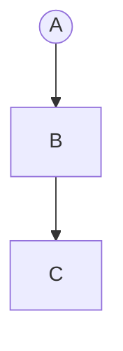

# Invalid Flowchart Diagrams

This file contains invalid flowchart test fixtures with:
- GitHub render attempts
- Error from mermaid-cli
- Error/output from our linter

> Note: Auto-generated by `scripts/generate-previews.js`. Do not edit manually.

## Table of Contents

1. [Curly In Quoted](#1-curly-in-quoted)
2. [Diamond Parens Unquoted](#2-diamond-parens-unquoted)
3. [Edge Label Parens](#3-edge-label-parens)
4. [Empty Nodes](#4-empty-nodes)
5. [Escaped Quotes In Decision](#5-escaped-quotes-in-decision)
6. [Interactions Click Call Missing Fn](#6-interactions-click-call-missing-fn)
7. [Interactions Click Call Parens](#7-interactions-click-call-parens)
8. [Interactions Click Href](#8-interactions-click-href)
9. [Interactions Linkstyle Multi](#9-interactions-linkstyle-multi)
10. [Interactions Linkstyle Ranges](#10-interactions-linkstyle-ranges)
11. [Invalid Arrow](#11-invalid-arrow)
12. [Invalid Class](#12-invalid-class)
13. [Invalid Node Syntax](#13-invalid-node-syntax)
14. [Invalid Subgraph](#14-invalid-subgraph)
15. [Link One Sided Marker](#15-link-one-sided-marker)
16. [Linkstyle Id Unknown](#16-linkstyle-id-unknown)
17. [Missing Arrow](#17-missing-arrow)
18. [Mixed Brackets](#18-mixed-brackets)
19. [Mixed Quotes In Labels](#19-mixed-quotes-in-labels)
20. [No Diagram Type](#20-no-diagram-type)
21. [Quotes Double Inside Single](#21-quotes-double-inside-single)
22. [Quotes In Node Labels](#22-quotes-in-node-labels)
23. [Round Parens Unquoted](#23-round-parens-unquoted)
24. [Title Unsupported](#24-title-unsupported)
25. [Typed Shapes All](#25-typed-shapes-all)
26. [Typed Shapes Unknowns](#26-typed-shapes-unknowns)
27. [Unclosed Bracket](#27-unclosed-bracket)
28. [Unclosed Quote In Label](#28-unclosed-quote-in-label)
29. [Unescaped Quotes In Decision](#29-unescaped-quotes-in-decision)
30. [Unmatched End](#30-unmatched-end)
31. [Unquoted Label With Quotes](#31-unquoted-label-with-quotes)
32. [Unquoted Parens In Labels](#32-unquoted-parens-in-labels)
33. [Unquoted Parens With Backticks](#33-unquoted-parens-with-backticks)
34. [Wrong Direction](#34-wrong-direction)

---

## Summary

| # | Diagram | mermaid-cli | maid | Auto-fix? |
|---:|---|:---:|:---:|:---:|
| 1 | [curly in quoted](#1-curly-in-quoted) | INVALID | INVALID | — |
| 2 | [diamond parens unquoted](#2-diamond-parens-unquoted) | INVALID | INVALID | ✅ safe |
| 3 | [edge label parens](#3-edge-label-parens) | INVALID | INVALID | — |
| 4 | [empty nodes](#4-empty-nodes) | INVALID | INVALID | ✅ safe |
| 5 | [escaped quotes in decision](#5-escaped-quotes-in-decision) | INVALID | INVALID | ✅ safe |
| 6 | [interactions click call missing fn](#6-interactions-click-call-missing-fn) | INVALID | INVALID | — |
| 7 | [interactions click call parens](#7-interactions-click-call-parens) | INVALID | INVALID | — |
| 8 | [interactions click href](#8-interactions-click-href) | INVALID | INVALID | — |
| 9 | [interactions linkstyle multi](#9-interactions-linkstyle-multi) | INVALID | INVALID | — |
| 10 | [interactions linkstyle ranges](#10-interactions-linkstyle-ranges) | INVALID | INVALID | — |
| 11 | [invalid arrow](#11-invalid-arrow) | INVALID | INVALID | ✅ safe |
| 12 | [invalid class](#12-invalid-class) | INVALID | INVALID | — |
| 13 | [invalid node syntax](#13-invalid-node-syntax) | INVALID | INVALID | ✅ all |
| 14 | [invalid subgraph](#14-invalid-subgraph) | INVALID | INVALID | — |
| 15 | [link one sided marker](#15-link-one-sided-marker) | INVALID | INVALID | ✅ safe |
| 16 | [linkstyle id unknown](#16-linkstyle-id-unknown) | INVALID | INVALID | — |
| 17 | [missing arrow](#17-missing-arrow) | INVALID | INVALID | ✅ all |
| 18 | [mixed brackets](#18-mixed-brackets) | INVALID | INVALID | ✅ safe |
| 19 | [mixed quotes in labels](#19-mixed-quotes-in-labels) | INVALID | INVALID | — |
| 20 | [no diagram type](#20-no-diagram-type) | INVALID | INVALID | — |
| 21 | [quotes double inside single](#21-quotes-double-inside-single) | INVALID | INVALID | ✅ safe |
| 22 | [quotes in node labels](#22-quotes-in-node-labels) | INVALID | INVALID | — |
| 23 | [round parens unquoted](#23-round-parens-unquoted) | INVALID | INVALID | — |
| 24 | [title unsupported](#24-title-unsupported) | INVALID | INVALID | ✅ all |
| 25 | [typed shapes all](#25-typed-shapes-all) | INVALID | INVALID | — |
| 26 | [typed shapes unknowns](#26-typed-shapes-unknowns) | INVALID | INVALID | — |
| 27 | [unclosed bracket](#27-unclosed-bracket) | INVALID | INVALID | ✅ safe |
| 28 | [unclosed quote in label](#28-unclosed-quote-in-label) | INVALID | INVALID | ✅ all |
| 29 | [unescaped quotes in decision](#29-unescaped-quotes-in-decision) | INVALID | INVALID | ✅ safe |
| 30 | [unmatched end](#30-unmatched-end) | INVALID | INVALID | — |
| 31 | [unquoted label with quotes](#31-unquoted-label-with-quotes) | INVALID | INVALID | ✅ safe |
| 32 | [unquoted parens in labels](#32-unquoted-parens-in-labels) | INVALID | INVALID | ✅ safe |
| 33 | [unquoted parens with backticks](#33-unquoted-parens-with-backticks) | INVALID | INVALID | ✅ safe |
| 34 | [wrong direction](#34-wrong-direction) | INVALID | INVALID | — |

---

## 1. Curly In Quoted

📄 **Source**: [`curly-in-quoted.mmd`](./invalid/curly-in-quoted.mmd)

### GitHub Render Attempt

> **Note**: This invalid diagram may not render or may render incorrectly.

```mermaid
flowchart TD
  A[Start]
  E2 --> S2[Append 'tyk-trace-{id}' tag to Analytics Record]
  A --> E2

```

### Error Comparison: mermaid-cli vs maid

<table>
<tr>
<th width="50%">mermaid-cli</th>
<th width="50%">maid</th>
</tr>
<tr>
<td valign="top">

**Result**: ❌ INVALID

```
Error: Parse error on line 3:
...2[Append 'tyk-trace-{id}' tag to Analyti
-----------------------^
Expecting 'SQE', 'DOUBLECIRCLEEND', 'PE', '-)', 'STADIUMEND', 'SUBROUTINEEND', 'PIPE', 'CYLINDEREND', 'DIAMOND_STOP', 'TAGEND', 'TRAPEND', 'INVTRAPEND', 'UNICODE_TEXT', 'TEXT', 'TAGSTART', got 'DIAMOND_START'
Parser3.parseError (node_modules/mermaid/dist/mermaid.js:91236:28)
    at #evaluate (node_modules/puppeteer-core/lib/esm/puppeteer/cdp/ExecutionContext.js:388:19)
    at async ExecutionContext.evaluate (node_modules/puppeteer-core/lib/esm/puppeteer/cdp/ExecutionContext.js:275:16)
    at async IsolatedWorld.evaluate (node_modules/puppeteer-core/lib/esm/puppeteer/cdp/IsolatedWorld.js:97:16)
    at async CdpJSHandle.evaluate (node_modules/puppeteer-core/lib/esm/puppeteer/api/JSHandle.js:146:20)
    at async CdpElementHandle.evaluate (node_modules/puppeteer-core/lib/esm/puppeteer/api/ElementHandle.js:340:20)
    at async CdpElementHandle.$eval (node_modules/puppeteer-core/lib/esm/puppeteer/api/ElementHandle.js:494:24)
    at async CdpFrame.$eval (node_modules/puppeteer-core/lib/esm/puppeteer/api/Frame.js:450:20)
    at async CdpPage.$eval (node_modules/puppeteer-core/lib/esm/puppeteer/api/Page.js:450:20)
    at async renderMermaid (node_modules/@mermaid-js/mermaid-cli/src/index.js:266:22)
    at fromText (node_modules/mermaid/dist/mermaid.js:153955:21)
```

</td>
<td valign="top">

**Result**: ❌ INVALID

```
error[FL-LABEL-QUOTE-IN-UNQUOTED]: Quotes are not allowed inside unquoted node labels. Use &quot; for quotes or wrap the entire label in quotes.
at test-fixtures/flowchart/invalid/curly-in-quoted.mmd:3:20
  2 |   A[Start]
  3 |   E2 --> S2[Append 'tyk-trace-{id}' tag to Analytics Record]
    |                    ^^^^^^^^^^^^^^^^
  4 |   A --> E2
hint: Example: I[Log &quot;processing N items&quot;] or I["Log \"processing N items\""]
```

</td>
</tr>
</table>

### maid Auto-fix (`--fix`) Preview

No auto-fix changes (safe level).

### maid Auto-fix (`--fix=all`) Preview

No auto-fix changes (all level).

<details>
<summary>View source code</summary>

```
flowchart TD
  A[Start]
  E2 --> S2[Append 'tyk-trace-{id}' tag to Analytics Record]
  A --> E2

```
</details>

---

## 2. Diamond Parens Unquoted

📄 **Source**: [`diamond-parens-unquoted.mmd`](./invalid/diamond-parens-unquoted.mmd)

### GitHub Render Attempt

> **Note**: This invalid diagram may not render or may render incorrectly.

```mermaid
flowchart TD
  C --> D{Return comment (even if only header exists)}


```

### Error Comparison: mermaid-cli vs maid

<table>
<tr>
<th width="50%">mermaid-cli</th>
<th width="50%">maid</th>
</tr>
<tr>
<td valign="top">

**Result**: ❌ INVALID

```
Error: Parse error on line 2:
...-> D{Return comment (even if only header
-----------------------^
Expecting 'SQE', 'DOUBLECIRCLEEND', 'PE', '-)', 'STADIUMEND', 'SUBROUTINEEND', 'PIPE', 'CYLINDEREND', 'DIAMOND_STOP', 'TAGEND', 'TRAPEND', 'INVTRAPEND', 'UNICODE_TEXT', 'TEXT', 'TAGSTART', got 'PS'
Parser3.parseError (node_modules/mermaid/dist/mermaid.js:91236:28)
    at #evaluate (node_modules/puppeteer-core/lib/esm/puppeteer/cdp/ExecutionContext.js:388:19)
    at async ExecutionContext.evaluate (node_modules/puppeteer-core/lib/esm/puppeteer/cdp/ExecutionContext.js:275:16)
    at async IsolatedWorld.evaluate (node_modules/puppeteer-core/lib/esm/puppeteer/cdp/IsolatedWorld.js:97:16)
    at async CdpJSHandle.evaluate (node_modules/puppeteer-core/lib/esm/puppeteer/api/JSHandle.js:146:20)
    at async CdpElementHandle.evaluate (node_modules/puppeteer-core/lib/esm/puppeteer/api/ElementHandle.js:340:20)
    at async CdpElementHandle.$eval (node_modules/puppeteer-core/lib/esm/puppeteer/api/ElementHandle.js:494:24)
    at async CdpFrame.$eval (node_modules/puppeteer-core/lib/esm/puppeteer/api/Frame.js:450:20)
    at async CdpPage.$eval (node_modules/puppeteer-core/lib/esm/puppeteer/api/Page.js:450:20)
    at async renderMermaid (node_modules/@mermaid-js/mermaid-cli/src/index.js:266:22)
    at fromText (node_modules/mermaid/dist/mermaid.js:153955:21)
```

</td>
<td valign="top">

**Result**: ❌ INVALID

```
error[FL-LABEL-PARENS-UNQUOTED]: Parentheses inside an unquoted label are not supported by Mermaid.
at test-fixtures/flowchart/invalid/diamond-parens-unquoted.mmd:2:26
  1 | flowchart TD
  2 |   C --> D{Return comment (even if only header exists)}
    |                          ^
  3 | 
hint: Wrap the label in quotes, e.g., A["Mark (X)"] — or replace ( and ) with HTML entities: &#40; and &#41;
```

</td>
</tr>
</table>

### maid Auto-fix (`--fix`) Preview


### maid Auto-fix (`--fix=all`) Preview

Shown above (safe changes applied).

<details>
<summary>View source code</summary>

```
flowchart TD
  C --> D{Return comment (even if only header exists)}


```
</details>

---

## 3. Edge Label Parens

📄 **Source**: [`edge-label-parens.mmd`](./invalid/edge-label-parens.mmd)

### GitHub Render Attempt

> **Note**: This invalid diagram may not render or may render incorrectly.

```mermaid
flowchart TD
    A -->|optional (external)| B


```

### Error Comparison: mermaid-cli vs maid

<table>
<tr>
<th width="50%">mermaid-cli</th>
<th width="50%">maid</th>
</tr>
<tr>
<td valign="top">

**Result**: ❌ INVALID

```
Error: Parse error on line 2:
...    A -->|optional (external)| B
----------------------^
Expecting 'SQE', 'DOUBLECIRCLEEND', 'PE', '-)', 'STADIUMEND', 'SUBROUTINEEND', 'PIPE', 'CYLINDEREND', 'DIAMOND_STOP', 'TAGEND', 'TRAPEND', 'INVTRAPEND', 'UNICODE_TEXT', 'TEXT', 'TAGSTART', got 'PS'
Parser3.parseError (node_modules/mermaid/dist/mermaid.js:91236:28)
    at #evaluate (node_modules/puppeteer-core/lib/esm/puppeteer/cdp/ExecutionContext.js:388:19)
    at async ExecutionContext.evaluate (node_modules/puppeteer-core/lib/esm/puppeteer/cdp/ExecutionContext.js:275:16)
    at async IsolatedWorld.evaluate (node_modules/puppeteer-core/lib/esm/puppeteer/cdp/IsolatedWorld.js:97:16)
    at async CdpJSHandle.evaluate (node_modules/puppeteer-core/lib/esm/puppeteer/api/JSHandle.js:146:20)
    at async CdpElementHandle.evaluate (node_modules/puppeteer-core/lib/esm/puppeteer/api/ElementHandle.js:340:20)
    at async CdpElementHandle.$eval (node_modules/puppeteer-core/lib/esm/puppeteer/api/ElementHandle.js:494:24)
    at async CdpFrame.$eval (node_modules/puppeteer-core/lib/esm/puppeteer/api/Frame.js:450:20)
    at async CdpPage.$eval (node_modules/puppeteer-core/lib/esm/puppeteer/api/Page.js:450:20)
    at async renderMermaid (node_modules/@mermaid-js/mermaid-cli/src/index.js:266:22)
    at fromText (node_modules/mermaid/dist/mermaid.js:153955:21)
```

</td>
<td valign="top">

**Result**: ❌ INVALID

```
error: Expecting token of type --> Pipe <-- but found --> '(' <--
at test-fixtures/flowchart/invalid/edge-label-parens.mmd:2:20
  1 | flowchart TD
  2 |     A -->|optional (external)| B
    |                    ^
  3 |
```

</td>
</tr>
</table>

### maid Auto-fix (`--fix`) Preview

No auto-fix changes (safe level).

### maid Auto-fix (`--fix=all`) Preview

No auto-fix changes (all level).

<details>
<summary>View source code</summary>

```
flowchart TD
    A -->|optional (external)| B


```
</details>

---

## 4. Empty Nodes

📄 **Source**: [`empty-nodes.mmd`](./invalid/empty-nodes.mmd)

### GitHub Render Attempt

> **Note**: This invalid diagram may not render or may render incorrectly.

```mermaid
flowchart TD
    A[""] --> B[" "]
    B --> C[]
```

### Error Comparison: mermaid-cli vs maid

<table>
<tr>
<th width="50%">mermaid-cli</th>
<th width="50%">maid</th>
</tr>
<tr>
<td valign="top">

**Result**: ❌ INVALID

```
Error: Parse error on line 2:
...lowchart TD    A[""] --> B[" "]    B -
----------------------^
Expecting 'TAGEND', 'STR', 'MD_STR', 'UNICODE_TEXT', 'TEXT', 'TAGSTART', got 'SQE'
Parser3.parseError (node_modules/mermaid/dist/mermaid.js:91236:28)
    at #evaluate (node_modules/puppeteer-core/lib/esm/puppeteer/cdp/ExecutionContext.js:388:19)
    at async ExecutionContext.evaluate (node_modules/puppeteer-core/lib/esm/puppeteer/cdp/ExecutionContext.js:275:16)
    at async IsolatedWorld.evaluate (node_modules/puppeteer-core/lib/esm/puppeteer/cdp/IsolatedWorld.js:97:16)
    at async CdpJSHandle.evaluate (node_modules/puppeteer-core/lib/esm/puppeteer/api/JSHandle.js:146:20)
    at async CdpElementHandle.evaluate (node_modules/puppeteer-core/lib/esm/puppeteer/api/ElementHandle.js:340:20)
    at async CdpElementHandle.$eval (node_modules/puppeteer-core/lib/esm/puppeteer/api/ElementHandle.js:494:24)
    at async CdpFrame.$eval (node_modules/puppeteer-core/lib/esm/puppeteer/api/Frame.js:450:20)
    at async CdpPage.$eval (node_modules/puppeteer-core/lib/esm/puppeteer/api/Page.js:450:20)
    at async renderMermaid (node_modules/@mermaid-js/mermaid-cli/src/index.js:266:22)
    at fromText (node_modules/mermaid/dist/mermaid.js:153955:21)
```

</td>
<td valign="top">

**Result**: ❌ INVALID

```
error[FL-NODE-EMPTY]: Empty label inside a shape (only empty quotes/whitespace).
at test-fixtures/flowchart/invalid/empty-nodes.mmd:2:7
  1 | flowchart TD
  2 |     A[""] --> B[" "]
    |       ^
  3 |     B --> C[]
hint: Provide non-empty text, e.g., A["Start"] or A[Start]. If you want no label, omit the brackets and just use A.

error[FL-NODE-EMPTY]: Empty label inside a shape (only empty quotes/whitespace).
at test-fixtures/flowchart/invalid/empty-nodes.mmd:2:17
  1 | flowchart TD
  2 |     A[""] --> B[" "]
    |                 ^
  3 |     B --> C[]
hint: Provide non-empty text, e.g., A["Start"] or A[Start]. If you want no label, omit the brackets and just use A.

error[FL-NODE-EMPTY]: Empty label inside a shape.
at test-fixtures/flowchart/invalid/empty-nodes.mmd:3:12
  2 |     A[""] --> B[" "]
  3 |     B --> C[]
    |            ^
hint: Write non-empty text inside the brackets, e.g., A["Start"] or A[Start]. If you want no label, omit the brackets and just use A.
```

</td>
</tr>
</table>

### maid Auto-fix (`--fix`) Preview


### maid Auto-fix (`--fix=all`) Preview

Shown above (safe changes applied).

<details>
<summary>View source code</summary>

```
flowchart TD
    A[""] --> B[" "]
    B --> C[]
```
</details>

---

## 5. Escaped Quotes In Decision

📄 **Source**: [`escaped-quotes-in-decision.mmd`](./invalid/escaped-quotes-in-decision.mmd)

### GitHub Render Attempt

> **Note**: This invalid diagram may not render or may render incorrectly.

```mermaid
flowchart TD
    subgraph API_Loader_Custom_Authentication_Processing[API Loader: Custom Authentication Processing]
        direction TB
        A[Start processing API definition] --> B{Custom Auth Enabled?}
        B -- No --> C[Continue with other auth methods]
        B -- Yes --> D{"Is \"Driver\" AND \"AuthCheck.Path\" configured?"}
        B -- Yes --> E{"Is "Driver" configured?"}
    end

```

### Error Comparison: mermaid-cli vs maid

<table>
<tr>
<th width="50%">mermaid-cli</th>
<th width="50%">maid</th>
</tr>
<tr>
<td valign="top">

**Result**: ❌ INVALID

```
Error: Parse error on line 6:
...--> D{"Is \"Driver\" AND \"AuthCheck.Pat
-----------------------^
Expecting 'SQE', 'DOUBLECIRCLEEND', 'PE', '-)', 'STADIUMEND', 'SUBROUTINEEND', 'PIPE', 'CYLINDEREND', 'DIAMOND_STOP', 'TAGEND', 'TRAPEND', 'INVTRAPEND', 'UNICODE_TEXT', 'TEXT', 'TAGSTART', got 'STR'
Parser3.parseError (node_modules/mermaid/dist/mermaid.js:91236:28)
    at #evaluate (node_modules/puppeteer-core/lib/esm/puppeteer/cdp/ExecutionContext.js:388:19)
    at async ExecutionContext.evaluate (node_modules/puppeteer-core/lib/esm/puppeteer/cdp/ExecutionContext.js:275:16)
    at async IsolatedWorld.evaluate (node_modules/puppeteer-core/lib/esm/puppeteer/cdp/IsolatedWorld.js:97:16)
    at async CdpJSHandle.evaluate (node_modules/puppeteer-core/lib/esm/puppeteer/api/JSHandle.js:146:20)
    at async CdpElementHandle.evaluate (node_modules/puppeteer-core/lib/esm/puppeteer/api/ElementHandle.js:340:20)
    at async CdpElementHandle.$eval (node_modules/puppeteer-core/lib/esm/puppeteer/api/ElementHandle.js:494:24)
    at async CdpFrame.$eval (node_modules/puppeteer-core/lib/esm/puppeteer/api/Frame.js:450:20)
    at async CdpPage.$eval (node_modules/puppeteer-core/lib/esm/puppeteer/api/Page.js:450:20)
    at async renderMermaid (node_modules/@mermaid-js/mermaid-cli/src/index.js:266:22)
    at fromText (node_modules/mermaid/dist/mermaid.js:153955:21)
```

</td>
<td valign="top">

**Result**: ❌ INVALID

```
error[FL-LABEL-DOUBLE-IN-DOUBLE]: Double quotes inside a double-quoted label are not supported by Mermaid. Use &quot; for inner quotes.
at test-fixtures/flowchart/invalid/escaped-quotes-in-decision.mmd:7:35
  6 |         B -- Yes --> D{"Is \"Driver\" AND \"AuthCheck.Path\" configured?"}
  7 |         B -- Yes --> E{"Is "Driver" configured?"}
    |                                   ^
  8 |     end
hint: Example: D{"Is &quot;Driver&quot; and &quot;AuthCheck.Path&quot; configured?"}

warning[FL-LABEL-ESCAPED-QUOTE]: Escaped quotes (\") in node labels are accepted by Mermaid, but using &quot; is preferred for portability.
at test-fixtures/flowchart/invalid/escaped-quotes-in-decision.mmd:6:28
  5 |         B -- No --> C[Continue with other auth methods]
  6 |         B -- Yes --> D{"Is \"Driver\" AND \"AuthCheck.Path\" configured?"}
    |                            ^^
  7 |         B -- Yes --> E{"Is "Driver" configured?"}
hint: Prefer &quot; inside quoted labels, e.g., A["He said &quot;Hi&quot;"]
```

</td>
</tr>
</table>

### maid Auto-fix (`--fix`) Preview


### maid Auto-fix (`--fix=all`) Preview

Shown above (safe changes applied).

<details>
<summary>View source code</summary>

```
flowchart TD
    subgraph API_Loader_Custom_Authentication_Processing[API Loader: Custom Authentication Processing]
        direction TB
        A[Start processing API definition] --> B{Custom Auth Enabled?}
        B -- No --> C[Continue with other auth methods]
        B -- Yes --> D{"Is \"Driver\" AND \"AuthCheck.Path\" configured?"}
        B -- Yes --> E{"Is "Driver" configured?"}
    end

```
</details>

---

## 6. Interactions Click Call Missing Fn

📄 **Source**: [`interactions-click-call-missing-fn.mmd`](./invalid/interactions-click-call-missing-fn.mmd)

### GitHub Render Attempt

> **Note**: This invalid diagram may not render or may render incorrectly.

```mermaid
flowchart TD
  A[Start]
  click A call "Tip only"


```

### Error Comparison: mermaid-cli vs maid

<table>
<tr>
<th width="50%">mermaid-cli</th>
<th width="50%">maid</th>
</tr>
<tr>
<td valign="top">

**Result**: ❌ INVALID

```
Error: Parse error on line 6:
...A call "Tip only"
--------------------^
Expecting 'SEMI', 'NEWLINE', 'SPACE', 'EOF', 'CALLBACKARGS', got 'CALLBACKNAME'
Parser3.parseError (node_modules/mermaid/dist/mermaid.js:91236:28)
    at #evaluate (node_modules/puppeteer-core/lib/esm/puppeteer/cdp/ExecutionContext.js:388:19)
    at async ExecutionContext.evaluate (node_modules/puppeteer-core/lib/esm/puppeteer/cdp/ExecutionContext.js:275:16)
    at async IsolatedWorld.evaluate (node_modules/puppeteer-core/lib/esm/puppeteer/cdp/IsolatedWorld.js:97:16)
    at async CdpJSHandle.evaluate (node_modules/puppeteer-core/lib/esm/puppeteer/api/JSHandle.js:146:20)
    at async CdpElementHandle.evaluate (node_modules/puppeteer-core/lib/esm/puppeteer/api/ElementHandle.js:340:20)
    at async CdpElementHandle.$eval (node_modules/puppeteer-core/lib/esm/puppeteer/api/ElementHandle.js:494:24)
    at async CdpFrame.$eval (node_modules/puppeteer-core/lib/esm/puppeteer/api/Frame.js:450:20)
    at async CdpPage.$eval (node_modules/puppeteer-core/lib/esm/puppeteer/api/Page.js:450:20)
    at async renderMermaid (node_modules/@mermaid-js/mermaid-cli/src/index.js:266:22)
    at fromText (node_modules/mermaid/dist/mermaid.js:153955:21)
```

</td>
<td valign="top">

**Result**: ❌ INVALID

```
error[FL-CLICK-CALL-NAME-MISSING]: 'click … call' requires a function name.
at test-fixtures/flowchart/invalid/interactions-click-call-missing-fn.mmd:3:11
  2 |   A[Start]
  3 |   click A call "Tip only"
    |           ^
  4 | 
hint: Example: click A call doThing()

error[FL-CLICK-CALL-EXTRA-TEXT]: Tooltip/text after 'call()' is not supported by Mermaid CLI.
at test-fixtures/flowchart/invalid/interactions-click-call-missing-fn.mmd:3:16
  2 |   A[Start]
  3 |   click A call "Tip only"
    |                ^
  4 | 
hint: Use: click A call doThing()
```

</td>
</tr>
</table>

### maid Auto-fix (`--fix`) Preview

No auto-fix changes (safe level).

### maid Auto-fix (`--fix=all`) Preview

No auto-fix changes (all level).

<details>
<summary>View source code</summary>

```
flowchart TD
  A[Start]
  click A call "Tip only"


```
</details>

---

## 7. Interactions Click Call Parens

📄 **Source**: [`interactions-click-call-parens.mmd`](./invalid/interactions-click-call-parens.mmd)

### GitHub Render Attempt

> **Note**: This invalid diagram may not render or may render incorrectly.

```mermaid
flowchart TD
  A[Start]
  click A call openDetails() "Open details" _blank


```

### Error Comparison: mermaid-cli vs maid

<table>
<tr>
<th width="50%">mermaid-cli</th>
<th width="50%">maid</th>
</tr>
<tr>
<td valign="top">

**Result**: ❌ INVALID

```
Error: Parse error on line 3:
...ils() "Open details" _blank
-----------------------^
Expecting 'SEMI', 'NEWLINE', 'EOF', got 'SPACE'
Parser3.parseError (node_modules/mermaid/dist/mermaid.js:91236:28)
    at #evaluate (node_modules/puppeteer-core/lib/esm/puppeteer/cdp/ExecutionContext.js:388:19)
    at async ExecutionContext.evaluate (node_modules/puppeteer-core/lib/esm/puppeteer/cdp/ExecutionContext.js:275:16)
    at async IsolatedWorld.evaluate (node_modules/puppeteer-core/lib/esm/puppeteer/cdp/IsolatedWorld.js:97:16)
    at async CdpJSHandle.evaluate (node_modules/puppeteer-core/lib/esm/puppeteer/api/JSHandle.js:146:20)
    at async CdpElementHandle.evaluate (node_modules/puppeteer-core/lib/esm/puppeteer/api/ElementHandle.js:340:20)
    at async CdpElementHandle.$eval (node_modules/puppeteer-core/lib/esm/puppeteer/api/ElementHandle.js:494:24)
    at async CdpFrame.$eval (node_modules/puppeteer-core/lib/esm/puppeteer/api/Frame.js:450:20)
    at async CdpPage.$eval (node_modules/puppeteer-core/lib/esm/puppeteer/api/Page.js:450:20)
    at async renderMermaid (node_modules/@mermaid-js/mermaid-cli/src/index.js:266:22)
    at fromText (node_modules/mermaid/dist/mermaid.js:153955:21)
```

</td>
<td valign="top">

**Result**: ❌ INVALID

```
error[FL-CLICK-CALL-EXTRA-TEXT]: Tooltip/text after 'call()' is not supported by Mermaid CLI.
at test-fixtures/flowchart/invalid/interactions-click-call-parens.mmd:3:30
  2 |   A[Start]
  3 |   click A call openDetails() "Open details" _blank
    |                              ^
  4 | 
hint: Use: click A call doThing()
```

</td>
</tr>
</table>

### maid Auto-fix (`--fix`) Preview

No auto-fix changes (safe level).

### maid Auto-fix (`--fix=all`) Preview

No auto-fix changes (all level).

<details>
<summary>View source code</summary>

```
flowchart TD
  A[Start]
  click A call openDetails() "Open details" _blank


```
</details>

---

## 8. Interactions Click Href

📄 **Source**: [`interactions-click-href.mmd`](./invalid/interactions-click-href.mmd)

### GitHub Render Attempt

> **Note**: This invalid diagram may not render or may render incorrectly.

```mermaid
flowchart TD
  A[Start] --> B[Next]
  click A href "https://example.com" "Open" _blank
  linkStyle 1 stroke:#f00,stroke-width:2px


```

### Error Comparison: mermaid-cli vs maid

<table>
<tr>
<th width="50%">mermaid-cli</th>
<th width="50%">maid</th>
</tr>
<tr>
<td valign="top">

**Result**: ❌ INVALID

```
TypeError: Cannot set properties of undefined (setting 'style')
node_modules/mermaid/dist/mermaid.js:45745:37
Array.forEach (<anonymous>)
    at #evaluate (node_modules/puppeteer-core/lib/esm/puppeteer/cdp/ExecutionContext.js:388:19)
    at async ExecutionContext.evaluate (node_modules/puppeteer-core/lib/esm/puppeteer/cdp/ExecutionContext.js:275:16)
    at async IsolatedWorld.evaluate (node_modules/puppeteer-core/lib/esm/puppeteer/cdp/IsolatedWorld.js:97:16)
    at async CdpJSHandle.evaluate (node_modules/puppeteer-core/lib/esm/puppeteer/api/JSHandle.js:146:20)
    at async CdpElementHandle.evaluate (node_modules/puppeteer-core/lib/esm/puppeteer/api/ElementHandle.js:340:20)
    at async CdpElementHandle.$eval (node_modules/puppeteer-core/lib/esm/puppeteer/api/ElementHandle.js:494:24)
    at async CdpFrame.$eval (node_modules/puppeteer-core/lib/esm/puppeteer/api/Frame.js:450:20)
    at async CdpPage.$eval (node_modules/puppeteer-core/lib/esm/puppeteer/api/Page.js:450:20)
    at async renderMermaid (node_modules/@mermaid-js/mermaid-cli/src/index.js:266:22)
    at fromText (node_modules/mermaid/dist/mermaid.js:153955:21)
```

</td>
<td valign="top">

**Result**: ❌ INVALID

```
error[FL-LINKSTYLE-INDEX-OUT-OF-RANGE]: linkStyle index 1 is out of range (0..0).
at test-fixtures/flowchart/invalid/interactions-click-href.mmd:4:13
  3 |   click A href "https://example.com" "Open" _blank
  4 |   linkStyle 1 stroke:#f00,stroke-width:2px
    |             ^
  5 | 
hint: Use an index between 0 and 0 or add more links first.
```

</td>
</tr>
</table>

### maid Auto-fix (`--fix`) Preview

No auto-fix changes (safe level).

### maid Auto-fix (`--fix=all`) Preview

No auto-fix changes (all level).

<details>
<summary>View source code</summary>

```
flowchart TD
  A[Start] --> B[Next]
  click A href "https://example.com" "Open" _blank
  linkStyle 1 stroke:#f00,stroke-width:2px


```
</details>

---

## 9. Interactions Linkstyle Multi

📄 **Source**: [`interactions-linkstyle-multi.mmd`](./invalid/interactions-linkstyle-multi.mmd)

### GitHub Render Attempt

> **Note**: This invalid diagram may not render or may render incorrectly.

```mermaid
flowchart TD
  A[Start] --> B[Next]
  B --> C[End]
  %% indices include duplicate and out-of-range; styles split across lines
  linkStyle 0, 0, 5
    stroke:#f00,
    stroke-width:2px


```

### Error Comparison: mermaid-cli vs maid

<table>
<tr>
<th width="50%">mermaid-cli</th>
<th width="50%">maid</th>
</tr>
<tr>
<td valign="top">

**Result**: ❌ INVALID

```
Error: Parse error on line 4:
...[End]  linkStyle 0, 0, 5    stroke:#f0
----------------------^
Expecting 'NUM', got 'SPACE'
Parser3.parseError (node_modules/mermaid/dist/mermaid.js:91236:28)
    at #evaluate (node_modules/puppeteer-core/lib/esm/puppeteer/cdp/ExecutionContext.js:388:19)
    at async ExecutionContext.evaluate (node_modules/puppeteer-core/lib/esm/puppeteer/cdp/ExecutionContext.js:275:16)
    at async IsolatedWorld.evaluate (node_modules/puppeteer-core/lib/esm/puppeteer/cdp/IsolatedWorld.js:97:16)
    at async CdpJSHandle.evaluate (node_modules/puppeteer-core/lib/esm/puppeteer/api/JSHandle.js:146:20)
    at async CdpElementHandle.evaluate (node_modules/puppeteer-core/lib/esm/puppeteer/api/ElementHandle.js:340:20)
    at async CdpElementHandle.$eval (node_modules/puppeteer-core/lib/esm/puppeteer/api/ElementHandle.js:494:24)
    at async CdpFrame.$eval (node_modules/puppeteer-core/lib/esm/puppeteer/api/Frame.js:450:20)
    at async CdpPage.$eval (node_modules/puppeteer-core/lib/esm/puppeteer/api/Page.js:450:20)
    at async renderMermaid (node_modules/@mermaid-js/mermaid-cli/src/index.js:266:22)
    at fromText (node_modules/mermaid/dist/mermaid.js:153955:21)
```

</td>
<td valign="top">

**Result**: ❌ INVALID

```
error[FL-LINKSTYLE-MULTILINE]: 'linkStyle' styles must be on the same line as the indices.
at test-fixtures/flowchart/invalid/interactions-linkstyle-multi.mmd:6:5
  5 |   linkStyle 0, 0, 5
  6 |     stroke:#f00,
    |     ^
  7 |     stroke-width:2px
hint: Example: linkStyle 0,1 stroke:#f00,stroke-width:2px
```

</td>
</tr>
</table>

### maid Auto-fix (`--fix`) Preview

No auto-fix changes (safe level).

### maid Auto-fix (`--fix=all`) Preview

No auto-fix changes (all level).

<details>
<summary>View source code</summary>

```
flowchart TD
  A[Start] --> B[Next]
  B --> C[End]
  %% indices include duplicate and out-of-range; styles split across lines
  linkStyle 0, 0, 5
    stroke:#f00,
    stroke-width:2px


```
</details>

---

## 10. Interactions Linkstyle Ranges

📄 **Source**: [`interactions-linkstyle-ranges.mmd`](./invalid/interactions-linkstyle-ranges.mmd)

### GitHub Render Attempt

> **Note**: This invalid diagram may not render or may render incorrectly.

```mermaid
flowchart TD
  A[Start] --> B[Next]
  B --> C[End]
  linkStyle 0:1 stroke:#f00,stroke-width:2px


```

### Error Comparison: mermaid-cli vs maid

<table>
<tr>
<th width="50%">mermaid-cli</th>
<th width="50%">maid</th>
</tr>
<tr>
<td valign="top">

**Result**: ❌ INVALID

```
Error: Parse error on line 4:
...C[End]  linkStyle 0:1 stroke:#f00,strok
----------------------^
Expecting 'SPACE', 'COMMA', got 'COLON'
Parser3.parseError (node_modules/mermaid/dist/mermaid.js:91236:28)
    at #evaluate (node_modules/puppeteer-core/lib/esm/puppeteer/cdp/ExecutionContext.js:388:19)
    at async ExecutionContext.evaluate (node_modules/puppeteer-core/lib/esm/puppeteer/cdp/ExecutionContext.js:275:16)
    at async IsolatedWorld.evaluate (node_modules/puppeteer-core/lib/esm/puppeteer/cdp/IsolatedWorld.js:97:16)
    at async CdpJSHandle.evaluate (node_modules/puppeteer-core/lib/esm/puppeteer/api/JSHandle.js:146:20)
    at async CdpElementHandle.evaluate (node_modules/puppeteer-core/lib/esm/puppeteer/api/ElementHandle.js:340:20)
    at async CdpElementHandle.$eval (node_modules/puppeteer-core/lib/esm/puppeteer/api/ElementHandle.js:494:24)
    at async CdpFrame.$eval (node_modules/puppeteer-core/lib/esm/puppeteer/api/Frame.js:450:20)
    at async CdpPage.$eval (node_modules/puppeteer-core/lib/esm/puppeteer/api/Page.js:450:20)
    at async renderMermaid (node_modules/@mermaid-js/mermaid-cli/src/index.js:266:22)
    at fromText (node_modules/mermaid/dist/mermaid.js:153955:21)
```

</td>
<td valign="top">

**Result**: ❌ INVALID

```
error[FL-LINKSTYLE-RANGE-NOT-SUPPORTED]: Ranges in 'linkStyle' indices are not supported. Use comma-separated indices.
at test-fixtures/flowchart/invalid/interactions-linkstyle-ranges.mmd:4:14
  3 |   B --> C[End]
  4 |   linkStyle 0:1 stroke:#f00,stroke-width:2px
    |              ^
  5 | 
hint: Example: linkStyle 0,1 stroke:#f00,stroke-width:2px
```

</td>
</tr>
</table>

### maid Auto-fix (`--fix`) Preview

No auto-fix changes (safe level).

### maid Auto-fix (`--fix=all`) Preview

No auto-fix changes (all level).

<details>
<summary>View source code</summary>

```
flowchart TD
  A[Start] --> B[Next]
  B --> C[End]
  linkStyle 0:1 stroke:#f00,stroke-width:2px


```
</details>

---

## 11. Invalid Arrow

📄 **Source**: [`invalid-arrow.mmd`](./invalid/invalid-arrow.mmd)

### GitHub Render Attempt

> **Note**: This invalid diagram may not render or may render incorrectly.

```mermaid
flowchart TD
    A -> B
    B --> C
```

### Error Comparison: mermaid-cli vs maid

<table>
<tr>
<th width="50%">mermaid-cli</th>
<th width="50%">maid</th>
</tr>
<tr>
<td valign="top">

**Result**: ❌ INVALID

```
Error: Parse error on line 2:
flowchart TD    A -> B    B --> C
------------------^
Expecting 'SEMI', 'NEWLINE', 'EOF', 'AMP', 'START_LINK', 'LINK', 'LINK_ID', got 'MINUS'
Parser3.parseError (node_modules/mermaid/dist/mermaid.js:91236:28)
    at #evaluate (node_modules/puppeteer-core/lib/esm/puppeteer/cdp/ExecutionContext.js:388:19)
    at async ExecutionContext.evaluate (node_modules/puppeteer-core/lib/esm/puppeteer/cdp/ExecutionContext.js:275:16)
    at async IsolatedWorld.evaluate (node_modules/puppeteer-core/lib/esm/puppeteer/cdp/IsolatedWorld.js:97:16)
    at async CdpJSHandle.evaluate (node_modules/puppeteer-core/lib/esm/puppeteer/api/JSHandle.js:146:20)
    at async CdpElementHandle.evaluate (node_modules/puppeteer-core/lib/esm/puppeteer/api/ElementHandle.js:340:20)
    at async CdpElementHandle.$eval (node_modules/puppeteer-core/lib/esm/puppeteer/api/ElementHandle.js:494:24)
    at async CdpFrame.$eval (node_modules/puppeteer-core/lib/esm/puppeteer/api/Frame.js:450:20)
    at async CdpPage.$eval (node_modules/puppeteer-core/lib/esm/puppeteer/api/Page.js:450:20)
    at async renderMermaid (node_modules/@mermaid-js/mermaid-cli/src/index.js:266:22)
    at fromText (node_modules/mermaid/dist/mermaid.js:153955:21)
```

</td>
<td valign="top">

**Result**: ❌ INVALID

```
error[FL-ARROW-INVALID]: Invalid arrow syntax: -> (use --> instead)
at test-fixtures/flowchart/invalid/invalid-arrow.mmd:2:7
  1 | flowchart TD
  2 |     A -> B
    |       ^^
  3 |     B --> C
hint: Replace -> with -->, or use -- text --> for inline labels.
```

</td>
</tr>
</table>

### maid Auto-fix (`--fix`) Preview


### maid Auto-fix (`--fix=all`) Preview

Shown above (safe changes applied).

<details>
<summary>View source code</summary>

```
flowchart TD
    A -> B
    B --> C
```
</details>

---

## 12. Invalid Class

📄 **Source**: [`invalid-class.mmd`](./invalid/invalid-class.mmd)

### GitHub Render Attempt

> **Note**: This invalid diagram may not render or may render incorrectly.

```mermaid
flowchart TD
    A --> B
    class A
```

### Error Comparison: mermaid-cli vs maid

<table>
<tr>
<th width="50%">mermaid-cli</th>
<th width="50%">maid</th>
</tr>
<tr>
<td valign="top">

**Result**: ❌ INVALID

```
Error: Parse error on line 3:
... A --> B    class A
----------------------^
Expecting 'SPACE', 'AMP', 'COLON', 'DOWN', 'DEFAULT', 'NUM', 'COMMA', 'NODE_STRING', 'BRKT', 'MINUS', 'MULT', 'UNICODE_TEXT', got 'NEWLINE'
Parser3.parseError (node_modules/mermaid/dist/mermaid.js:91236:28)
    at #evaluate (node_modules/puppeteer-core/lib/esm/puppeteer/cdp/ExecutionContext.js:388:19)
    at async ExecutionContext.evaluate (node_modules/puppeteer-core/lib/esm/puppeteer/cdp/ExecutionContext.js:275:16)
    at async IsolatedWorld.evaluate (node_modules/puppeteer-core/lib/esm/puppeteer/cdp/IsolatedWorld.js:97:16)
    at async CdpJSHandle.evaluate (node_modules/puppeteer-core/lib/esm/puppeteer/api/JSHandle.js:146:20)
    at async CdpElementHandle.evaluate (node_modules/puppeteer-core/lib/esm/puppeteer/api/ElementHandle.js:340:20)
    at async CdpElementHandle.$eval (node_modules/puppeteer-core/lib/esm/puppeteer/api/ElementHandle.js:494:24)
    at async CdpFrame.$eval (node_modules/puppeteer-core/lib/esm/puppeteer/api/Frame.js:450:20)
    at async CdpPage.$eval (node_modules/puppeteer-core/lib/esm/puppeteer/api/Page.js:450:20)
    at async renderMermaid (node_modules/@mermaid-js/mermaid-cli/src/index.js:266:22)
    at fromText (node_modules/mermaid/dist/mermaid.js:153955:21)
```

</td>
<td valign="top">

**Result**: ❌ INVALID

```
error[FL-CLASS-MALFORMED]: Invalid class statement. Provide node id(s) then a class name.
at test-fixtures/flowchart/invalid/invalid-class.mmd:3:12
  2 |     A --> B
  3 |     class A
    |            ^
hint: Example: class A,B important
```

</td>
</tr>
</table>

### maid Auto-fix (`--fix`) Preview

No auto-fix changes (safe level).

### maid Auto-fix (`--fix=all`) Preview

No auto-fix changes (all level).

<details>
<summary>View source code</summary>

```
flowchart TD
    A --> B
    class A
```
</details>

---

## 13. Invalid Node Syntax

📄 **Source**: [`invalid-node-syntax.mmd`](./invalid/invalid-node-syntax.mmd)

### GitHub Render Attempt

> **Note**: This invalid diagram may not render or may render incorrectly.

```mermaid
flowchart TD
    A(( --> B
    B --> C
```

### Error Comparison: mermaid-cli vs maid

<table>
<tr>
<th width="50%">mermaid-cli</th>
<th width="50%">maid</th>
</tr>
<tr>
<td valign="top">

**Result**: ❌ INVALID

```
Error: Parse error on line 4:
...( --> B    B --> C
---------------------^
Expecting 'SQE', 'DOUBLECIRCLEEND', 'PE', '-)', 'STADIUMEND', 'SUBROUTINEEND', 'PIPE', 'CYLINDEREND', 'DIAMOND_STOP', 'TAGEND', 'TRAPEND', 'INVTRAPEND', 'UNICODE_TEXT', 'TEXT', 'TAGSTART', got '1'
Parser3.parseError (node_modules/mermaid/dist/mermaid.js:91236:28)
    at #evaluate (node_modules/puppeteer-core/lib/esm/puppeteer/cdp/ExecutionContext.js:388:19)
    at async ExecutionContext.evaluate (node_modules/puppeteer-core/lib/esm/puppeteer/cdp/ExecutionContext.js:275:16)
    at async IsolatedWorld.evaluate (node_modules/puppeteer-core/lib/esm/puppeteer/cdp/IsolatedWorld.js:97:16)
    at async CdpJSHandle.evaluate (node_modules/puppeteer-core/lib/esm/puppeteer/api/JSHandle.js:146:20)
    at async CdpElementHandle.evaluate (node_modules/puppeteer-core/lib/esm/puppeteer/api/ElementHandle.js:340:20)
    at async CdpElementHandle.$eval (node_modules/puppeteer-core/lib/esm/puppeteer/api/ElementHandle.js:494:24)
    at async CdpFrame.$eval (node_modules/puppeteer-core/lib/esm/puppeteer/api/Frame.js:450:20)
    at async CdpPage.$eval (node_modules/puppeteer-core/lib/esm/puppeteer/api/Page.js:450:20)
    at async renderMermaid (node_modules/@mermaid-js/mermaid-cli/src/index.js:266:22)
    at fromText (node_modules/mermaid/dist/mermaid.js:153955:21)
```

</td>
<td valign="top">

**Result**: ❌ INVALID

```
error[FL-NODE-UNCLOSED-BRACKET]: Unclosed '(( '. Add a matching '))'.
at test-fixtures/flowchart/invalid/invalid-node-syntax.mmd:2:9
  1 | flowchart TD
  2 |     A(( --> B
    |         ^^
  3 |     B --> C
hint: Example: A((Circle))
```

</td>
</tr>
</table>

### maid Auto-fix (`--fix`) Preview

No auto-fix changes (safe level).

### maid Auto-fix (`--fix=all`) Preview



<details>
<summary>View source code</summary>

```
flowchart TD
    A(( --> B
    B --> C
```
</details>

---

## 14. Invalid Subgraph

📄 **Source**: [`invalid-subgraph.mmd`](./invalid/invalid-subgraph.mmd)

### GitHub Render Attempt

> **Note**: This invalid diagram may not render or may render incorrectly.

```mermaid
flowchart TD
    subgraph
        A --> B
    end
```

### Error Comparison: mermaid-cli vs maid

<table>
<tr>
<th width="50%">mermaid-cli</th>
<th width="50%">maid</th>
</tr>
<tr>
<td valign="top">

**Result**: ❌ INVALID

```
TypeError: Cannot read properties of undefined (reading 'text')
FlowDB.addSubGraph (node_modules/mermaid/dist/mermaid.js:45974:26)
    at #evaluate (node_modules/puppeteer-core/lib/esm/puppeteer/cdp/ExecutionContext.js:388:19)
    at async ExecutionContext.evaluate (node_modules/puppeteer-core/lib/esm/puppeteer/cdp/ExecutionContext.js:275:16)
    at async IsolatedWorld.evaluate (node_modules/puppeteer-core/lib/esm/puppeteer/cdp/IsolatedWorld.js:97:16)
    at async CdpJSHandle.evaluate (node_modules/puppeteer-core/lib/esm/puppeteer/api/JSHandle.js:146:20)
    at async CdpElementHandle.evaluate (node_modules/puppeteer-core/lib/esm/puppeteer/api/ElementHandle.js:340:20)
    at async CdpElementHandle.$eval (node_modules/puppeteer-core/lib/esm/puppeteer/api/ElementHandle.js:494:24)
    at async CdpFrame.$eval (node_modules/puppeteer-core/lib/esm/puppeteer/api/Frame.js:450:20)
    at async CdpPage.$eval (node_modules/puppeteer-core/lib/esm/puppeteer/api/Page.js:450:20)
    at async renderMermaid (node_modules/@mermaid-js/mermaid-cli/src/index.js:266:22)
    at fromText (node_modules/mermaid/dist/mermaid.js:153955:21)
```

</td>
<td valign="top">

**Result**: ❌ INVALID

```
error[FL-SUBGRAPH-MISSING-HEADER]: Subgraph header is missing. Add an ID or a [Title] after the keyword.
at test-fixtures/flowchart/invalid/invalid-subgraph.mmd:2:13
  1 | flowchart TD
  2 |     subgraph
    |             ^
  3 |         A --> B
hint: Example: subgraph API [API Layer]
```

</td>
</tr>
</table>

### maid Auto-fix (`--fix`) Preview

No auto-fix changes (safe level).

### maid Auto-fix (`--fix=all`) Preview

No auto-fix changes (all level).

<details>
<summary>View source code</summary>

```
flowchart TD
    subgraph
        A --> B
    end
```
</details>

---

## 15. Link One Sided Marker

📄 **Source**: [`link-one-sided-marker.mmd`](./invalid/link-one-sided-marker.mmd)

### GitHub Render Attempt

> **Note**: This invalid diagram may not render or may render incorrectly.

```mermaid
flowchart TD
  A --x--> B
  A --o--> C

```

### Error Comparison: mermaid-cli vs maid

<table>
<tr>
<th width="50%">mermaid-cli</th>
<th width="50%">maid</th>
</tr>
<tr>
<td valign="top">

**Result**: ❌ INVALID

```
Error: Parse error on line 2:
flowchart TD  A --x--> B  A --o--> C
-------------------^
Expecting 'AMP', 'COLON', 'PIPE', 'TESTSTR', 'DOWN', 'DEFAULT', 'NUM', 'COMMA', 'NODE_STRING', 'BRKT', 'MINUS', 'MULT', 'UNICODE_TEXT', got 'LINK'
Parser3.parseError (node_modules/mermaid/dist/mermaid.js:91236:28)
    at #evaluate (node_modules/puppeteer-core/lib/esm/puppeteer/cdp/ExecutionContext.js:388:19)
    at async ExecutionContext.evaluate (node_modules/puppeteer-core/lib/esm/puppeteer/cdp/ExecutionContext.js:275:16)
    at async IsolatedWorld.evaluate (node_modules/puppeteer-core/lib/esm/puppeteer/cdp/IsolatedWorld.js:97:16)
    at async CdpJSHandle.evaluate (node_modules/puppeteer-core/lib/esm/puppeteer/api/JSHandle.js:146:20)
    at async CdpElementHandle.evaluate (node_modules/puppeteer-core/lib/esm/puppeteer/api/ElementHandle.js:340:20)
    at async CdpElementHandle.$eval (node_modules/puppeteer-core/lib/esm/puppeteer/api/ElementHandle.js:494:24)
    at async CdpFrame.$eval (node_modules/puppeteer-core/lib/esm/puppeteer/api/Frame.js:450:20)
    at async CdpPage.$eval (node_modules/puppeteer-core/lib/esm/puppeteer/api/Page.js:450:20)
    at async renderMermaid (node_modules/@mermaid-js/mermaid-cli/src/index.js:266:22)
    at fromText (node_modules/mermaid/dist/mermaid.js:153955:21)
```

</td>
<td valign="top">

**Result**: ❌ INVALID

```
error[FL-LINK-UNSUPPORTED-MARKER]: Unsupported one-sided link marker 'x'. Use symmetric 'x--x' or a plain arrow with a label.
at test-fixtures/flowchart/invalid/link-one-sided-marker.mmd:2:7
  1 | flowchart TD
  2 |   A --x--> B
    |       ^
  3 |   A --o--> C
hint: Example: A x--x B  (or)  A --> B  and label it: A --|Skipped|--> B

error[FL-LINK-UNSUPPORTED-MARKER]: Unsupported one-sided link marker 'o'. Use symmetric 'o--o' or a plain arrow with a label.
at test-fixtures/flowchart/invalid/link-one-sided-marker.mmd:3:7
  2 |   A --x--> B
  3 |   A --o--> C
    |       ^
  4 | 
hint: Example: A o--o B  (or)  A --> B
```

</td>
</tr>
</table>

### maid Auto-fix (`--fix`) Preview

```mermaid
flowchart TD
  A ----> B
  A ----> C

```

### maid Auto-fix (`--fix=all`) Preview

Shown above (safe changes applied).

<details>
<summary>View source code</summary>

```
flowchart TD
  A --x--> B
  A --o--> C

```
</details>

---

## 16. Linkstyle Id Unknown

📄 **Source**: [`linkstyle-id-unknown.mmd`](./invalid/linkstyle-id-unknown.mmd)

### GitHub Render Attempt

> **Note**: This invalid diagram may not render or may render incorrectly.

```mermaid
flowchart TD
  A --> B
  linkStyle e999 stroke:#f00


```

### Error Comparison: mermaid-cli vs maid

<table>
<tr>
<th width="50%">mermaid-cli</th>
<th width="50%">maid</th>
</tr>
<tr>
<td valign="top">

**Result**: ❌ INVALID

```
Error: Parse error on line 3:
...A --> B  linkStyle e999 stroke:#f00
----------------------^
Expecting 'DEFAULT', 'NUM', got 'NODE_STRING'
Parser3.parseError (node_modules/mermaid/dist/mermaid.js:91236:28)
    at #evaluate (node_modules/puppeteer-core/lib/esm/puppeteer/cdp/ExecutionContext.js:388:19)
    at async ExecutionContext.evaluate (node_modules/puppeteer-core/lib/esm/puppeteer/cdp/ExecutionContext.js:275:16)
    at async IsolatedWorld.evaluate (node_modules/puppeteer-core/lib/esm/puppeteer/cdp/IsolatedWorld.js:97:16)
    at async CdpJSHandle.evaluate (node_modules/puppeteer-core/lib/esm/puppeteer/api/JSHandle.js:146:20)
    at async CdpElementHandle.evaluate (node_modules/puppeteer-core/lib/esm/puppeteer/api/ElementHandle.js:340:20)
    at async CdpElementHandle.$eval (node_modules/puppeteer-core/lib/esm/puppeteer/api/ElementHandle.js:494:24)
    at async CdpFrame.$eval (node_modules/puppeteer-core/lib/esm/puppeteer/api/Frame.js:450:20)
    at async CdpPage.$eval (node_modules/puppeteer-core/lib/esm/puppeteer/api/Page.js:450:20)
    at async renderMermaid (node_modules/@mermaid-js/mermaid-cli/src/index.js:266:22)
    at fromText (node_modules/mermaid/dist/mermaid.js:153955:21)
```

</td>
<td valign="top">

**Result**: ❌ INVALID

```
error: Expecting token of type --> NumberLiteral <-- but found --> 'e999' <--
at test-fixtures/flowchart/invalid/linkstyle-id-unknown.mmd:3:13
  2 |   A --> B
  3 |   linkStyle e999 stroke:#f00
    |             ^^^^
  4 |
```

</td>
</tr>
</table>

### maid Auto-fix (`--fix`) Preview

No auto-fix changes (safe level).

### maid Auto-fix (`--fix=all`) Preview

No auto-fix changes (all level).

<details>
<summary>View source code</summary>

```
flowchart TD
  A --> B
  linkStyle e999 stroke:#f00


```
</details>

---

## 17. Missing Arrow

📄 **Source**: [`missing-arrow.mmd`](./invalid/missing-arrow.mmd)

### GitHub Render Attempt

> **Note**: This invalid diagram may not render or may render incorrectly.

```mermaid
flowchart TD
    A B
```

### Error Comparison: mermaid-cli vs maid

<table>
<tr>
<th width="50%">mermaid-cli</th>
<th width="50%">maid</th>
</tr>
<tr>
<td valign="top">

**Result**: ❌ INVALID

```
Error: Parse error on line 2:
flowchart TD    A B
------------------^
Expecting 'SEMI', 'NEWLINE', 'EOF', 'AMP', 'START_LINK', 'LINK', 'LINK_ID', got 'NODE_STRING'
Parser3.parseError (node_modules/mermaid/dist/mermaid.js:91236:28)
    at #evaluate (node_modules/puppeteer-core/lib/esm/puppeteer/cdp/ExecutionContext.js:388:19)
    at async ExecutionContext.evaluate (node_modules/puppeteer-core/lib/esm/puppeteer/cdp/ExecutionContext.js:275:16)
    at async IsolatedWorld.evaluate (node_modules/puppeteer-core/lib/esm/puppeteer/cdp/IsolatedWorld.js:97:16)
    at async CdpJSHandle.evaluate (node_modules/puppeteer-core/lib/esm/puppeteer/api/JSHandle.js:146:20)
    at async CdpElementHandle.evaluate (node_modules/puppeteer-core/lib/esm/puppeteer/api/ElementHandle.js:340:20)
    at async CdpElementHandle.$eval (node_modules/puppeteer-core/lib/esm/puppeteer/api/ElementHandle.js:494:24)
    at async CdpFrame.$eval (node_modules/puppeteer-core/lib/esm/puppeteer/api/Frame.js:450:20)
    at async CdpPage.$eval (node_modules/puppeteer-core/lib/esm/puppeteer/api/Page.js:450:20)
    at async renderMermaid (node_modules/@mermaid-js/mermaid-cli/src/index.js:266:22)
    at fromText (node_modules/mermaid/dist/mermaid.js:153955:21)
```

</td>
<td valign="top">

**Result**: ❌ INVALID

```
error[FL-LINK-MISSING]: Two nodes on one line must be connected with an arrow.
at test-fixtures/flowchart/invalid/missing-arrow.mmd:2:7
  1 | flowchart TD
  2 |     A B
    |       ^
hint: Insert --> between nodes, e.g., A --> B.
```

</td>
</tr>
</table>

### maid Auto-fix (`--fix`) Preview

No auto-fix changes (safe level).

### maid Auto-fix (`--fix=all`) Preview

```mermaid
flowchart TD
    A  --> B
```

<details>
<summary>View source code</summary>

```
flowchart TD
    A B
```
</details>

---

## 18. Mixed Brackets

📄 **Source**: [`mixed-brackets.mmd`](./invalid/mixed-brackets.mmd)

### GitHub Render Attempt

> **Note**: This invalid diagram may not render or may render incorrectly.

```mermaid
flowchart LR
    A[Text] --> B(Text]
    B --> C
    X{{Hexagon]
    S([Stadium})
    Y[(Cylinder))

```

### Error Comparison: mermaid-cli vs maid

<table>
<tr>
<th width="50%">mermaid-cli</th>
<th width="50%">maid</th>
</tr>
<tr>
<td valign="top">

**Result**: ❌ INVALID

```
Error: Parse error on line 2:
...  A[Text] --> B(Text]    B --> C    X{
-----------------------^
Expecting 'PE', 'TAGEND', 'UNICODE_TEXT', 'TEXT', 'TAGSTART', got 'SQE'
Parser3.parseError (node_modules/mermaid/dist/mermaid.js:91236:28)
    at #evaluate (node_modules/puppeteer-core/lib/esm/puppeteer/cdp/ExecutionContext.js:388:19)
    at async ExecutionContext.evaluate (node_modules/puppeteer-core/lib/esm/puppeteer/cdp/ExecutionContext.js:275:16)
    at async IsolatedWorld.evaluate (node_modules/puppeteer-core/lib/esm/puppeteer/cdp/IsolatedWorld.js:97:16)
    at async CdpJSHandle.evaluate (node_modules/puppeteer-core/lib/esm/puppeteer/api/JSHandle.js:146:20)
    at async CdpElementHandle.evaluate (node_modules/puppeteer-core/lib/esm/puppeteer/api/ElementHandle.js:340:20)
    at async CdpElementHandle.$eval (node_modules/puppeteer-core/lib/esm/puppeteer/api/ElementHandle.js:494:24)
    at async CdpFrame.$eval (node_modules/puppeteer-core/lib/esm/puppeteer/api/Frame.js:450:20)
    at async CdpPage.$eval (node_modules/puppeteer-core/lib/esm/puppeteer/api/Page.js:450:20)
    at async renderMermaid (node_modules/@mermaid-js/mermaid-cli/src/index.js:266:22)
    at fromText (node_modules/mermaid/dist/mermaid.js:153955:21)
```

</td>
<td valign="top">

**Result**: ❌ INVALID

```
error[FL-NODE-MIXED-BRACKETS]: Mismatched brackets: opened '(' but closed with ']'.
at test-fixtures/flowchart/invalid/mixed-brackets.mmd:2:23
  1 | flowchart LR
  2 |     A[Text] --> B(Text]
    |                       ^
  3 |     B --> C
hint: Close with ')' or change the opening bracket to '['.
```

</td>
</tr>
</table>

### maid Auto-fix (`--fix`) Preview

```mermaid
flowchart LR
    A[Text] --> B[Text]
    B --> C
    X{{Hexagon}}
    S([Stadium])
    Y[(Cylinder)]

```

### maid Auto-fix (`--fix=all`) Preview

Shown above (safe changes applied).

<details>
<summary>View source code</summary>

```
flowchart LR
    A[Text] --> B(Text]
    B --> C
    X{{Hexagon]
    S([Stadium})
    Y[(Cylinder))

```
</details>

---

## 19. Mixed Quotes In Labels

📄 **Source**: [`mixed-quotes-in-labels.mmd`](./invalid/mixed-quotes-in-labels.mmd)

### GitHub Render Attempt

> **Note**: This invalid diagram may not render or may render incorrectly.

```mermaid
flowchart TD
    subgraph "Dependency Skip Evaluation"
        S1[Start Evaluation for Check 'C'] --> S2{For each dependency 'D' of "C"};
        S2 --> S3{Was 'D' skipped?};
        S3 -- Yes --> S4[Mark 'D' as failed];
        S3 -- No --> S5{Did 'D' have a fatal error?};
        S5 -- Yes --> S4;
        S5 -- No --> S2;
        S4 --> S6{Any dependencies marked as failed?};
        S2 -- all dependencies checked --> S6;
        S6 -- Yes --> S7["Skip Check 'C' (Reason: dependency_failed)"];
        S6 -- No --> S8[Execute Check 'C'];
    end

```

### Error Comparison: mermaid-cli vs maid

<table>
<tr>
<th width="50%">mermaid-cli</th>
<th width="50%">maid</th>
</tr>
<tr>
<td valign="top">

**Result**: ❌ INVALID

```
Error: Parse error on line 3:
... dependency 'D' of "C"};        S2 --> 
-----------------------^
Expecting 'SQE', 'DOUBLECIRCLEEND', 'PE', '-)', 'STADIUMEND', 'SUBROUTINEEND', 'PIPE', 'CYLINDEREND', 'DIAMOND_STOP', 'TAGEND', 'TRAPEND', 'INVTRAPEND', 'UNICODE_TEXT', 'TEXT', 'TAGSTART', got 'STR'
Parser3.parseError (node_modules/mermaid/dist/mermaid.js:91236:28)
    at #evaluate (node_modules/puppeteer-core/lib/esm/puppeteer/cdp/ExecutionContext.js:388:19)
    at async ExecutionContext.evaluate (node_modules/puppeteer-core/lib/esm/puppeteer/cdp/ExecutionContext.js:275:16)
    at async IsolatedWorld.evaluate (node_modules/puppeteer-core/lib/esm/puppeteer/cdp/IsolatedWorld.js:97:16)
    at async CdpJSHandle.evaluate (node_modules/puppeteer-core/lib/esm/puppeteer/api/JSHandle.js:146:20)
    at async CdpElementHandle.evaluate (node_modules/puppeteer-core/lib/esm/puppeteer/api/ElementHandle.js:340:20)
    at async CdpElementHandle.$eval (node_modules/puppeteer-core/lib/esm/puppeteer/api/ElementHandle.js:494:24)
    at async CdpFrame.$eval (node_modules/puppeteer-core/lib/esm/puppeteer/api/Frame.js:450:20)
    at async CdpPage.$eval (node_modules/puppeteer-core/lib/esm/puppeteer/api/Page.js:450:20)
    at async renderMermaid (node_modules/@mermaid-js/mermaid-cli/src/index.js:266:22)
    at fromText (node_modules/mermaid/dist/mermaid.js:153955:21)
```

</td>
<td valign="top">

**Result**: ❌ INVALID

```
error[FL-LABEL-QUOTE-IN-UNQUOTED]: Quotes are not allowed inside unquoted node labels. Use &quot; for quotes or wrap the entire label in quotes.
at test-fixtures/flowchart/invalid/mixed-quotes-in-labels.mmd:3:39
   2 |     subgraph "Dependency Skip Evaluation"
   3 |         S1[Start Evaluation for Check 'C'] --> S2{For each dependency 'D' of "C"};
     |                                       ^^^
   4 |         S2 --> S3{Was 'D' skipped?};
hint: Example: I[Log &quot;processing N items&quot;] or I["Log \"processing N items\""]
```

</td>
</tr>
</table>

### maid Auto-fix (`--fix`) Preview

No auto-fix changes (safe level).

### maid Auto-fix (`--fix=all`) Preview

No auto-fix changes (all level).

<details>
<summary>View source code</summary>

```
flowchart TD
    subgraph "Dependency Skip Evaluation"
        S1[Start Evaluation for Check 'C'] --> S2{For each dependency 'D' of "C"};
        S2 --> S3{Was 'D' skipped?};
        S3 -- Yes --> S4[Mark 'D' as failed];
        S3 -- No --> S5{Did 'D' have a fatal error?};
        S5 -- Yes --> S4;
        S5 -- No --> S2;
        S4 --> S6{Any dependencies marked as failed?};
        S2 -- all dependencies checked --> S6;
        S6 -- Yes --> S7["Skip Check 'C' (Reason: dependency_failed)"];
        S6 -- No --> S8[Execute Check 'C'];
    end

```
</details>

---

## 20. No Diagram Type

📄 **Source**: [`no-diagram-type.mmd`](./invalid/no-diagram-type.mmd)

### GitHub Render Attempt

> **Note**: This invalid diagram may not render or may render incorrectly.

```mermaid
A --> B
B --> C
```

### Error Comparison: mermaid-cli vs maid

<table>
<tr>
<th width="50%">mermaid-cli</th>
<th width="50%">maid</th>
</tr>
<tr>
<td valign="top">

**Result**: ❌ INVALID

```
UnknownDiagramError: No diagram type detected matching given configuration for text: A --> B
B --> C
detectType (node_modules/mermaid/dist/mermaid.js:20437:15)
    at $eval ($eval at renderMermaid (node_modules/@mermaid-js/mermaid-cli/src/index.js:266:33), <anonymous>:48:45)
    at #evaluate (node_modules/puppeteer-core/lib/esm/puppeteer/cdp/ExecutionContext.js:388:19)
    at async ExecutionContext.evaluate (node_modules/puppeteer-core/lib/esm/puppeteer/cdp/ExecutionContext.js:275:16)
    at async IsolatedWorld.evaluate (node_modules/puppeteer-core/lib/esm/puppeteer/cdp/IsolatedWorld.js:97:16)
    at async CdpJSHandle.evaluate (node_modules/puppeteer-core/lib/esm/puppeteer/api/JSHandle.js:146:20)
    at async CdpElementHandle.evaluate (node_modules/puppeteer-core/lib/esm/puppeteer/api/ElementHandle.js:340:20)
    at async CdpElementHandle.$eval (node_modules/puppeteer-core/lib/esm/puppeteer/api/ElementHandle.js:494:24)
    at async CdpFrame.$eval (node_modules/puppeteer-core/lib/esm/puppeteer/api/Frame.js:450:20)
    at async CdpPage.$eval (node_modules/puppeteer-core/lib/esm/puppeteer/api/Page.js:450:20)
    at async renderMermaid (node_modules/@mermaid-js/mermaid-cli/src/index.js:266:22)
```

</td>
<td valign="top">

**Result**: ❌ INVALID

```
error[GEN-HEADER-INVALID]: Diagram must start with "graph", "flowchart", "pie", "sequenceDiagram", "classDiagram" or "stateDiagram[-v2]"
at test-fixtures/flowchart/invalid/no-diagram-type.mmd:1:1
  1 | A --> B
    | ^
  2 | B --> C
hint: Start with: flowchart TD | pie | sequenceDiagram | classDiagram | stateDiagram-v2.
```

</td>
</tr>
</table>

### maid Auto-fix (`--fix`) Preview

No auto-fix changes (safe level).

### maid Auto-fix (`--fix=all`) Preview

No auto-fix changes (all level).

<details>
<summary>View source code</summary>

```
A --> B
B --> C
```
</details>

---

## 21. Quotes Double Inside Single

📄 **Source**: [`quotes-double-inside-single.mmd`](./invalid/quotes-double-inside-single.mmd)

### GitHub Render Attempt

> **Note**: This invalid diagram may not render or may render incorrectly.

```mermaid
flowchart LR
  A['She said "Hello"'] --> B


```

### Error Comparison: mermaid-cli vs maid

<table>
<tr>
<th width="50%">mermaid-cli</th>
<th width="50%">maid</th>
</tr>
<tr>
<td valign="top">

**Result**: ❌ INVALID

```
Error: Parse error on line 2:
...t LR  A['She said "Hello"'] --> B
----------------------^
Expecting 'SQE', 'DOUBLECIRCLEEND', 'PE', '-)', 'STADIUMEND', 'SUBROUTINEEND', 'PIPE', 'CYLINDEREND', 'DIAMOND_STOP', 'TAGEND', 'TRAPEND', 'INVTRAPEND', 'UNICODE_TEXT', 'TEXT', 'TAGSTART', got 'STR'
Parser3.parseError (node_modules/mermaid/dist/mermaid.js:91236:28)
    at #evaluate (node_modules/puppeteer-core/lib/esm/puppeteer/cdp/ExecutionContext.js:388:19)
    at async ExecutionContext.evaluate (node_modules/puppeteer-core/lib/esm/puppeteer/cdp/ExecutionContext.js:275:16)
    at async IsolatedWorld.evaluate (node_modules/puppeteer-core/lib/esm/puppeteer/cdp/IsolatedWorld.js:97:16)
    at async CdpJSHandle.evaluate (node_modules/puppeteer-core/lib/esm/puppeteer/api/JSHandle.js:146:20)
    at async CdpElementHandle.evaluate (node_modules/puppeteer-core/lib/esm/puppeteer/api/ElementHandle.js:340:20)
    at async CdpElementHandle.$eval (node_modules/puppeteer-core/lib/esm/puppeteer/api/ElementHandle.js:494:24)
    at async CdpFrame.$eval (node_modules/puppeteer-core/lib/esm/puppeteer/api/Frame.js:450:20)
    at async CdpPage.$eval (node_modules/puppeteer-core/lib/esm/puppeteer/api/Page.js:450:20)
    at async renderMermaid (node_modules/@mermaid-js/mermaid-cli/src/index.js:266:22)
    at fromText (node_modules/mermaid/dist/mermaid.js:153955:21)
```

</td>
<td valign="top">

**Result**: ❌ INVALID

```
error[FL-LABEL-DOUBLE-IN-SINGLE]: Double quotes inside a single-quoted label are not supported by Mermaid. Replace inner " with &quot; or use a double-quoted label with &quot;.
at test-fixtures/flowchart/invalid/quotes-double-inside-single.mmd:2:15
  1 | flowchart LR
  2 |   A['She said "Hello"'] --> B
    |               ^
  3 | 
hint: Change to "She said &quot;Hello&quot;" or replace inner " with &quot;.
```

</td>
</tr>
</table>

### maid Auto-fix (`--fix`) Preview

```mermaid
flowchart LR
  A['She said &quot;Hello&quot;'] --> B


```

### maid Auto-fix (`--fix=all`) Preview

Shown above (safe changes applied).

<details>
<summary>View source code</summary>

```
flowchart LR
  A['She said "Hello"'] --> B


```
</details>

---

## 22. Quotes In Node Labels

📄 **Source**: [`quotes-in-node-labels.mmd`](./invalid/quotes-in-node-labels.mmd)

### GitHub Render Attempt

> **Note**: This invalid diagram may not render or may render incorrectly.

```mermaid
graph TD
    subgraph CheckExecutionEngine
        A[Start processing check] --> B{"Does 'B' depend on a forEach check 'A'?"};
        B -->|No| C[Execute 'B' normally];
        B -->|Yes| D[Get forEach items from 'A's output];
        D --> E{Is the items array empty?};

        subgraph "New Logic Path (This PR)"
            E -->|Yes| F[Log "skipping check..."];
            F --> G[Return special empty result with forEach markers];
            G --> H[Propagate skip to downstream checks];
        end

        subgraph Existing Logic Path
            E -->|No| I[Log "processing N items..."];
            I --> J[Create and execute a task for each item];
            J --> K[Aggregate results];
            K --> L[Return combined results];
        end

        C --> Z[End];
        H --> Z;
        L --> Z;
    end

    style F fill:#d4edda,stroke:#c3e6cb
    style G fill:#d4edda,stroke:#c3e6cb
    style H fill:#d4edda,stroke:#c3e6cb
```

### Error Comparison: mermaid-cli vs maid

<table>
<tr>
<th width="50%">mermaid-cli</th>
<th width="50%">maid</th>
</tr>
<tr>
<td valign="top">

**Result**: ❌ INVALID

```
Error: Parse error on line 9:
...  E -->|Yes| F[Log "skipping check..."];
-----------------------^
Expecting 'SQE', 'DOUBLECIRCLEEND', 'PE', '-)', 'STADIUMEND', 'SUBROUTINEEND', 'PIPE', 'CYLINDEREND', 'DIAMOND_STOP', 'TAGEND', 'TRAPEND', 'INVTRAPEND', 'UNICODE_TEXT', 'TEXT', 'TAGSTART', got 'STR'
Parser3.parseError (node_modules/mermaid/dist/mermaid.js:91236:28)
    at #evaluate (node_modules/puppeteer-core/lib/esm/puppeteer/cdp/ExecutionContext.js:388:19)
    at async ExecutionContext.evaluate (node_modules/puppeteer-core/lib/esm/puppeteer/cdp/ExecutionContext.js:275:16)
    at async IsolatedWorld.evaluate (node_modules/puppeteer-core/lib/esm/puppeteer/cdp/IsolatedWorld.js:97:16)
    at async CdpJSHandle.evaluate (node_modules/puppeteer-core/lib/esm/puppeteer/api/JSHandle.js:146:20)
    at async CdpElementHandle.evaluate (node_modules/puppeteer-core/lib/esm/puppeteer/api/ElementHandle.js:340:20)
    at async CdpElementHandle.$eval (node_modules/puppeteer-core/lib/esm/puppeteer/api/ElementHandle.js:494:24)
    at async CdpFrame.$eval (node_modules/puppeteer-core/lib/esm/puppeteer/api/Frame.js:450:20)
    at async CdpPage.$eval (node_modules/puppeteer-core/lib/esm/puppeteer/api/Page.js:450:20)
    at async renderMermaid (node_modules/@mermaid-js/mermaid-cli/src/index.js:266:22)
    at fromText (node_modules/mermaid/dist/mermaid.js:153955:21)
```

</td>
<td valign="top">

**Result**: ❌ INVALID

```
error[FL-LABEL-QUOTE-IN-UNQUOTED]: Quotes are not allowed inside unquoted node labels. Use &quot; for quotes or wrap the entire label in quotes.
at test-fixtures/flowchart/invalid/quotes-in-node-labels.mmd:4:29
   3 |         A[Start processing check] --> B{"Does 'B' depend on a forEach check 'A'?"};
   4 |         B -->|No| C[Execute 'B' normally];
     |                             ^^^
   5 |         B -->|Yes| D[Get forEach items from 'A's output];
hint: Example: I[Log &quot;processing N items&quot;] or I["Log \"processing N items\""]
```

</td>
</tr>
</table>

### maid Auto-fix (`--fix`) Preview

No auto-fix changes (safe level).

### maid Auto-fix (`--fix=all`) Preview

No auto-fix changes (all level).

<details>
<summary>View source code</summary>

```
graph TD
    subgraph CheckExecutionEngine
        A[Start processing check] --> B{"Does 'B' depend on a forEach check 'A'?"};
        B -->|No| C[Execute 'B' normally];
        B -->|Yes| D[Get forEach items from 'A's output];
        D --> E{Is the items array empty?};

        subgraph "New Logic Path (This PR)"
            E -->|Yes| F[Log "skipping check..."];
            F --> G[Return special empty result with forEach markers];
            G --> H[Propagate skip to downstream checks];
        end

        subgraph Existing Logic Path
            E -->|No| I[Log "processing N items..."];
            I --> J[Create and execute a task for each item];
            J --> K[Aggregate results];
            K --> L[Return combined results];
        end

        C --> Z[End];
        H --> Z;
        L --> Z;
    end

    style F fill:#d4edda,stroke:#c3e6cb
    style G fill:#d4edda,stroke:#c3e6cb
    style H fill:#d4edda,stroke:#c3e6cb
```
</details>

---

## 23. Round Parens Unquoted

📄 **Source**: [`round-parens-unquoted.mmd`](./invalid/round-parens-unquoted.mmd)

### GitHub Render Attempt

> **Note**: This invalid diagram may not render or may render incorrectly.

```mermaid
flowchart TD
  B --> C(new CheckExecutionEngine(octokit));


```

### Error Comparison: mermaid-cli vs maid

<table>
<tr>
<th width="50%">mermaid-cli</th>
<th width="50%">maid</th>
</tr>
<tr>
<td valign="top">

**Result**: ❌ INVALID

```
Error: Parse error on line 2:
...CheckExecutionEngine(octokit));
-----------------------^
Expecting 'SQE', 'DOUBLECIRCLEEND', 'PE', '-)', 'STADIUMEND', 'SUBROUTINEEND', 'PIPE', 'CYLINDEREND', 'DIAMOND_STOP', 'TAGEND', 'TRAPEND', 'INVTRAPEND', 'UNICODE_TEXT', 'TEXT', 'TAGSTART', got 'PS'
Parser3.parseError (node_modules/mermaid/dist/mermaid.js:91236:28)
    at #evaluate (node_modules/puppeteer-core/lib/esm/puppeteer/cdp/ExecutionContext.js:388:19)
    at async ExecutionContext.evaluate (node_modules/puppeteer-core/lib/esm/puppeteer/cdp/ExecutionContext.js:275:16)
    at async IsolatedWorld.evaluate (node_modules/puppeteer-core/lib/esm/puppeteer/cdp/IsolatedWorld.js:97:16)
    at async CdpJSHandle.evaluate (node_modules/puppeteer-core/lib/esm/puppeteer/api/JSHandle.js:146:20)
    at async CdpElementHandle.evaluate (node_modules/puppeteer-core/lib/esm/puppeteer/api/ElementHandle.js:340:20)
    at async CdpElementHandle.$eval (node_modules/puppeteer-core/lib/esm/puppeteer/api/ElementHandle.js:494:24)
    at async CdpFrame.$eval (node_modules/puppeteer-core/lib/esm/puppeteer/api/Frame.js:450:20)
    at async CdpPage.$eval (node_modules/puppeteer-core/lib/esm/puppeteer/api/Page.js:450:20)
    at async renderMermaid (node_modules/@mermaid-js/mermaid-cli/src/index.js:266:22)
    at fromText (node_modules/mermaid/dist/mermaid.js:153955:21)
```

</td>
<td valign="top">

**Result**: ❌ INVALID

```
error[FL-LABEL-PARENS-UNQUOTED]: Parentheses inside an unquoted label are not supported by Mermaid.
at test-fixtures/flowchart/invalid/round-parens-unquoted.mmd:2:43
  1 | flowchart TD
  2 |   B --> C(new CheckExecutionEngine(octokit));
    |                                           ^^
  3 | 
hint: Wrap the label in quotes, e.g., A["Mark (X)"] — or replace ( and ) with HTML entities: &#40; and &#41;.
```

</td>
</tr>
</table>

### maid Auto-fix (`--fix`) Preview

No auto-fix changes (safe level).

### maid Auto-fix (`--fix=all`) Preview

No auto-fix changes (all level).

<details>
<summary>View source code</summary>

```
flowchart TD
  B --> C(new CheckExecutionEngine(octokit));


```
</details>

---

## 24. Title Unsupported

📄 **Source**: [`title-unsupported.mmd`](./invalid/title-unsupported.mmd)

### GitHub Render Attempt

> **Note**: This invalid diagram may not render or may render incorrectly.

```mermaid
flowchart TD
  title Dependency Relationship
  A[Alpha] --> B[Beta]

```

### Error Comparison: mermaid-cli vs maid

<table>
<tr>
<th width="50%">mermaid-cli</th>
<th width="50%">maid</th>
</tr>
<tr>
<td valign="top">

**Result**: ❌ INVALID

```
Error: Parse error on line 2:
...lowchart TD  title Dependency Relations
----------------------^
Expecting 'SEMI', 'NEWLINE', 'EOF', 'AMP', 'START_LINK', 'LINK', 'LINK_ID', got 'NODE_STRING'
Parser3.parseError (node_modules/mermaid/dist/mermaid.js:91236:28)
    at #evaluate (node_modules/puppeteer-core/lib/esm/puppeteer/cdp/ExecutionContext.js:388:19)
    at async ExecutionContext.evaluate (node_modules/puppeteer-core/lib/esm/puppeteer/cdp/ExecutionContext.js:275:16)
    at async IsolatedWorld.evaluate (node_modules/puppeteer-core/lib/esm/puppeteer/cdp/IsolatedWorld.js:97:16)
    at async CdpJSHandle.evaluate (node_modules/puppeteer-core/lib/esm/puppeteer/api/JSHandle.js:146:20)
    at async CdpElementHandle.evaluate (node_modules/puppeteer-core/lib/esm/puppeteer/api/ElementHandle.js:340:20)
    at async CdpElementHandle.$eval (node_modules/puppeteer-core/lib/esm/puppeteer/api/ElementHandle.js:494:24)
    at async CdpFrame.$eval (node_modules/puppeteer-core/lib/esm/puppeteer/api/Frame.js:450:20)
    at async CdpPage.$eval (node_modules/puppeteer-core/lib/esm/puppeteer/api/Page.js:450:20)
    at async renderMermaid (node_modules/@mermaid-js/mermaid-cli/src/index.js:266:22)
    at fromText (node_modules/mermaid/dist/mermaid.js:153955:21)
```

</td>
<td valign="top">

**Result**: ❌ INVALID

```
error[FL-META-UNSUPPORTED]: 'title' is not supported in flowcharts by the current Mermaid CLI.
at test-fixtures/flowchart/invalid/title-unsupported.mmd:2:3
  1 | flowchart TD
  2 |   title Dependency Relationship
    |   ^^^^^
  3 |   A[Alpha] --> B[Beta]
hint: Use a Markdown heading above the code block, or draw a labeled node at the top (e.g., T["Dependency Relationship"]).
```

</td>
</tr>
</table>

### maid Auto-fix (`--fix`) Preview

No auto-fix changes (safe level).

### maid Auto-fix (`--fix=all`) Preview

```mermaid
flowchart TD
  A[Alpha] --> B[Beta]

```

<details>
<summary>View source code</summary>

```
flowchart TD
  title Dependency Relationship
  A[Alpha] --> B[Beta]

```
</details>

---

## 25. Typed Shapes All

📄 **Source**: [`typed-shapes-all.mmd`](./invalid/typed-shapes-all.mmd)

### GitHub Render Attempt

> **Note**: This invalid diagram may not render or may render incorrectly.

```mermaid
flowchart LR
  A@{ shape: rect, label: "Rect" }
  B@{ shape: rounded, label: "Rounded" }
  C@{ shape: stadium, label: "Stadium" }
  D@{ shape: subroutine, label: "Subroutine" }
  E@{ shape: circle, label: "Circle" }
  F@{ shape: cylinder, label: "Cylinder" }
  G@{ shape: diamond, label: "Decision" }
  H@{ shape: hexagon, label: "Hexagon" }
  I@{ shape: parallelogram, label: "Para" }
  J@{ shape: trapezoid, label: "Trap" }
  K@{ shape: trapezoidAlt, label: "TrapAlt" }
  L@{ shape: "lean-l", label: "LeanL" }
  M@{ shape: "lean-r", label: "LeanR" }
  A --> B --> C --> D --> E --> F --> G --> H --> I --> J --> K --> L --> M


```

### Error Comparison: mermaid-cli vs maid

<table>
<tr>
<th width="50%">mermaid-cli</th>
<th width="50%">maid</th>
</tr>
<tr>
<td valign="top">

**Result**: ❌ INVALID

```
Error: No such shape: parallelogram.
FlowDB.addVertex (node_modules/mermaid/dist/mermaid.js:45607:23)
    at #evaluate (node_modules/puppeteer-core/lib/esm/puppeteer/cdp/ExecutionContext.js:388:19)
    at async ExecutionContext.evaluate (node_modules/puppeteer-core/lib/esm/puppeteer/cdp/ExecutionContext.js:275:16)
    at async IsolatedWorld.evaluate (node_modules/puppeteer-core/lib/esm/puppeteer/cdp/IsolatedWorld.js:97:16)
    at async CdpJSHandle.evaluate (node_modules/puppeteer-core/lib/esm/puppeteer/api/JSHandle.js:146:20)
    at async CdpElementHandle.evaluate (node_modules/puppeteer-core/lib/esm/puppeteer/api/ElementHandle.js:340:20)
    at async CdpElementHandle.$eval (node_modules/puppeteer-core/lib/esm/puppeteer/api/ElementHandle.js:494:24)
    at async CdpFrame.$eval (node_modules/puppeteer-core/lib/esm/puppeteer/api/Frame.js:450:20)
    at async CdpPage.$eval (node_modules/puppeteer-core/lib/esm/puppeteer/api/Page.js:450:20)
    at async renderMermaid (node_modules/@mermaid-js/mermaid-cli/src/index.js:266:22)
    at fromText (node_modules/mermaid/dist/mermaid.js:153955:21)
```

</td>
<td valign="top">

**Result**: ❌ INVALID

```
error[FL-TYPED-SHAPE-UNSUPPORTED]: Typed shape 'hexagon' is not supported by current Mermaid CLI.
at test-fixtures/flowchart/invalid/typed-shapes-all.mmd:9:14
   8 |   G@{ shape: diamond, label: "Decision" }
   9 |   H@{ shape: hexagon, label: "Hexagon" }
     |              ^
  10 |   I@{ shape: parallelogram, label: "Para" }
hint: Use one of: rect, rounded, diamond, circle, cylinder, stadium, subroutine, "lean-l", "lean-r"

error[FL-TYPED-SHAPE-UNSUPPORTED]: Typed shape 'parallelogram' is not supported by current Mermaid CLI.
at test-fixtures/flowchart/invalid/typed-shapes-all.mmd:10:14
   9 |   H@{ shape: hexagon, label: "Hexagon" }
  10 |   I@{ shape: parallelogram, label: "Para" }
     |              ^
  11 |   J@{ shape: trapezoid, label: "Trap" }
hint: Use one of: rect, rounded, diamond, circle, cylinder, stadium, subroutine, "lean-l", "lean-r"

error[FL-TYPED-SHAPE-UNSUPPORTED]: Typed shape 'trapezoid' is not supported by current Mermaid CLI.
at test-fixtures/flowchart/invalid/typed-shapes-all.mmd:11:14
  10 |   I@{ shape: parallelogram, label: "Para" }
  11 |   J@{ shape: trapezoid, label: "Trap" }
     |              ^
  12 |   K@{ shape: trapezoidAlt, label: "TrapAlt" }
hint: Use one of: rect, rounded, diamond, circle, cylinder, stadium, subroutine, "lean-l", "lean-r"

error[FL-TYPED-SHAPE-UNSUPPORTED]: Typed shape 'trapezoidAlt' is not supported by current Mermaid CLI.
at test-fixtures/flowchart/invalid/typed-shapes-all.mmd:12:14
  11 |   J@{ shape: trapezoid, label: "Trap" }
  12 |   K@{ shape: trapezoidAlt, label: "TrapAlt" }
     |              ^
  13 |   L@{ shape: "lean-l", label: "LeanL" }
hint: Use one of: rect, rounded, diamond, circle, cylinder, stadium, subroutine, "lean-l", "lean-r"
```

</td>
</tr>
</table>

### maid Auto-fix (`--fix`) Preview

No auto-fix changes (safe level).

### maid Auto-fix (`--fix=all`) Preview

No auto-fix changes (all level).

<details>
<summary>View source code</summary>

```
flowchart LR
  A@{ shape: rect, label: "Rect" }
  B@{ shape: rounded, label: "Rounded" }
  C@{ shape: stadium, label: "Stadium" }
  D@{ shape: subroutine, label: "Subroutine" }
  E@{ shape: circle, label: "Circle" }
  F@{ shape: cylinder, label: "Cylinder" }
  G@{ shape: diamond, label: "Decision" }
  H@{ shape: hexagon, label: "Hexagon" }
  I@{ shape: parallelogram, label: "Para" }
  J@{ shape: trapezoid, label: "Trap" }
  K@{ shape: trapezoidAlt, label: "TrapAlt" }
  L@{ shape: "lean-l", label: "LeanL" }
  M@{ shape: "lean-r", label: "LeanR" }
  A --> B --> C --> D --> E --> F --> G --> H --> I --> J --> K --> L --> M


```
</details>

---

## 26. Typed Shapes Unknowns

📄 **Source**: [`typed-shapes-unknowns.mmd`](./invalid/typed-shapes-unknowns.mmd)

### GitHub Render Attempt

> **Note**: This invalid diagram may not render or may render incorrectly.

```mermaid
flowchart TD
  A@{ shape: rhombus, label: "X" }
  B@{ shape: rect, padding: "ten" }
  C@{ shape: rect, label: X }
  D@{ badKey: 1, shape: rect }


```

### Error Comparison: mermaid-cli vs maid

<table>
<tr>
<th width="50%">mermaid-cli</th>
<th width="50%">maid</th>
</tr>
<tr>
<td valign="top">

**Result**: ❌ INVALID

```
Error: No such shape: rhombus.
FlowDB.addVertex (node_modules/mermaid/dist/mermaid.js:45607:23)
    at #evaluate (node_modules/puppeteer-core/lib/esm/puppeteer/cdp/ExecutionContext.js:388:19)
    at async ExecutionContext.evaluate (node_modules/puppeteer-core/lib/esm/puppeteer/cdp/ExecutionContext.js:275:16)
    at async IsolatedWorld.evaluate (node_modules/puppeteer-core/lib/esm/puppeteer/cdp/IsolatedWorld.js:97:16)
    at async CdpJSHandle.evaluate (node_modules/puppeteer-core/lib/esm/puppeteer/api/JSHandle.js:146:20)
    at async CdpElementHandle.evaluate (node_modules/puppeteer-core/lib/esm/puppeteer/api/ElementHandle.js:340:20)
    at async CdpElementHandle.$eval (node_modules/puppeteer-core/lib/esm/puppeteer/api/ElementHandle.js:494:24)
    at async CdpFrame.$eval (node_modules/puppeteer-core/lib/esm/puppeteer/api/Frame.js:450:20)
    at async CdpPage.$eval (node_modules/puppeteer-core/lib/esm/puppeteer/api/Page.js:450:20)
    at async renderMermaid (node_modules/@mermaid-js/mermaid-cli/src/index.js:266:22)
    at fromText (node_modules/mermaid/dist/mermaid.js:153955:21)
```

</td>
<td valign="top">

**Result**: ❌ INVALID

```
error[FL-TYPED-SHAPE-UNKNOWN]: Unknown shape 'rhombus' in '@{ shape: … }'.
at test-fixtures/flowchart/invalid/typed-shapes-unknowns.mmd:2:14
  1 | flowchart TD
  2 |   A@{ shape: rhombus, label: "X" }
    |              ^
  3 |   B@{ shape: rect, padding: "ten" }
hint: Use one of: rect, rounded, stadium, subroutine, circle, cylinder, diamond, trapezoid, parallelogram, hexagon, "lean-l", "lean-r", icon, image

warning[FL-TYPED-NUMERIC-EXPECTED]: 'padding' expects a number (optionally with px).
at test-fixtures/flowchart/invalid/typed-shapes-unknowns.mmd:3:29
  2 |   A@{ shape: rhombus, label: "X" }
  3 |   B@{ shape: rect, padding: "ten" }
    |                             ^
  4 |   C@{ shape: rect, label: X }
hint: Use: padding: 8 or padding: "8px"

warning[FL-TYPED-LABEL-NOT-STRING]: Typed-shape 'label' should be a quoted string.
at test-fixtures/flowchart/invalid/typed-shapes-unknowns.mmd:4:27
  3 |   B@{ shape: rect, padding: "ten" }
  4 |   C@{ shape: rect, label: X }
    |                           ^
  5 |   D@{ badKey: 1, shape: rect }
hint: Example: A@{ shape: rect, label: "Start" }

warning[FL-TYPED-KEY-UNKNOWN]: Unknown typed-shape key 'badKey'.
at test-fixtures/flowchart/invalid/typed-shapes-unknowns.mmd:5:7
  4 |   C@{ shape: rect, label: X }
  5 |   D@{ badKey: 1, shape: rect }
    |       ^
  6 | 
hint: Allowed keys: shape, label, padding, cornerRadius, icon, image
```

</td>
</tr>
</table>

### maid Auto-fix (`--fix`) Preview

No auto-fix changes (safe level).

### maid Auto-fix (`--fix=all`) Preview

No auto-fix changes (all level).

<details>
<summary>View source code</summary>

```
flowchart TD
  A@{ shape: rhombus, label: "X" }
  B@{ shape: rect, padding: "ten" }
  C@{ shape: rect, label: X }
  D@{ badKey: 1, shape: rect }


```
</details>

---

## 27. Unclosed Bracket

📄 **Source**: [`unclosed-bracket.mmd`](./invalid/unclosed-bracket.mmd)

### GitHub Render Attempt

> **Note**: This invalid diagram may not render or may render incorrectly.

```mermaid
flowchart LR
    A[Start --> B
    B --> C
```

### Error Comparison: mermaid-cli vs maid

<table>
<tr>
<th width="50%">mermaid-cli</th>
<th width="50%">maid</th>
</tr>
<tr>
<td valign="top">

**Result**: ❌ INVALID

```
Error: Parse error on line 4:
...t --> B    B --> C
---------------------^
Expecting 'SQE', 'DOUBLECIRCLEEND', 'PE', '-)', 'STADIUMEND', 'SUBROUTINEEND', 'PIPE', 'CYLINDEREND', 'DIAMOND_STOP', 'TAGEND', 'TRAPEND', 'INVTRAPEND', 'UNICODE_TEXT', 'TEXT', 'TAGSTART', got '1'
Parser3.parseError (node_modules/mermaid/dist/mermaid.js:91236:28)
    at #evaluate (node_modules/puppeteer-core/lib/esm/puppeteer/cdp/ExecutionContext.js:388:19)
    at async ExecutionContext.evaluate (node_modules/puppeteer-core/lib/esm/puppeteer/cdp/ExecutionContext.js:275:16)
    at async IsolatedWorld.evaluate (node_modules/puppeteer-core/lib/esm/puppeteer/cdp/IsolatedWorld.js:97:16)
    at async CdpJSHandle.evaluate (node_modules/puppeteer-core/lib/esm/puppeteer/api/JSHandle.js:146:20)
    at async CdpElementHandle.evaluate (node_modules/puppeteer-core/lib/esm/puppeteer/api/ElementHandle.js:340:20)
    at async CdpElementHandle.$eval (node_modules/puppeteer-core/lib/esm/puppeteer/api/ElementHandle.js:494:24)
    at async CdpFrame.$eval (node_modules/puppeteer-core/lib/esm/puppeteer/api/Frame.js:450:20)
    at async CdpPage.$eval (node_modules/puppeteer-core/lib/esm/puppeteer/api/Page.js:450:20)
    at async renderMermaid (node_modules/@mermaid-js/mermaid-cli/src/index.js:266:22)
    at fromText (node_modules/mermaid/dist/mermaid.js:153955:21)
```

</td>
<td valign="top">

**Result**: ❌ INVALID

```
error[FL-NODE-UNCLOSED-BRACKET]: Unclosed '['. Add a matching ']' before the arrow or newline.
at test-fixtures/flowchart/invalid/unclosed-bracket.mmd:2:13
  1 | flowchart LR
  2 |     A[Start --> B
    |             ^
  3 |     B --> C
hint: Example: A[Label] --> B
```

</td>
</tr>
</table>

### maid Auto-fix (`--fix`) Preview

```mermaid
flowchart LR
    A[Start]--> B
    B --> C
```

### maid Auto-fix (`--fix=all`) Preview

Shown above (safe changes applied).

<details>
<summary>View source code</summary>

```
flowchart LR
    A[Start --> B
    B --> C
```
</details>

---

## 28. Unclosed Quote In Label

📄 **Source**: [`unclosed-quote-in-label.mmd`](./invalid/unclosed-quote-in-label.mmd)

### GitHub Render Attempt

> **Note**: This invalid diagram may not render or may render incorrectly.

```mermaid
flowchart TD
  A["Unclosed label]
  A --> B


```

### Error Comparison: mermaid-cli vs maid

<table>
<tr>
<th width="50%">mermaid-cli</th>
<th width="50%">maid</th>
</tr>
<tr>
<td valign="top">

**Result**: ❌ INVALID

```
Error: Parse error on line 6:
... label]  A --> B
-------------------^
Expecting 'SQE', 'DOUBLECIRCLEEND', 'PE', '-)', 'STADIUMEND', 'SUBROUTINEEND', 'PIPE', 'CYLINDEREND', 'DIAMOND_STOP', 'TAGEND', 'TRAPEND', 'INVTRAPEND', 'UNICODE_TEXT', 'TEXT', 'TAGSTART', got '1'
Parser3.parseError (node_modules/mermaid/dist/mermaid.js:91236:28)
    at #evaluate (node_modules/puppeteer-core/lib/esm/puppeteer/cdp/ExecutionContext.js:388:19)
    at async ExecutionContext.evaluate (node_modules/puppeteer-core/lib/esm/puppeteer/cdp/ExecutionContext.js:275:16)
    at async IsolatedWorld.evaluate (node_modules/puppeteer-core/lib/esm/puppeteer/cdp/IsolatedWorld.js:97:16)
    at async CdpJSHandle.evaluate (node_modules/puppeteer-core/lib/esm/puppeteer/api/JSHandle.js:146:20)
    at async CdpElementHandle.evaluate (node_modules/puppeteer-core/lib/esm/puppeteer/api/ElementHandle.js:340:20)
    at async CdpElementHandle.$eval (node_modules/puppeteer-core/lib/esm/puppeteer/api/ElementHandle.js:494:24)
    at async CdpFrame.$eval (node_modules/puppeteer-core/lib/esm/puppeteer/api/Frame.js:450:20)
    at async CdpPage.$eval (node_modules/puppeteer-core/lib/esm/puppeteer/api/Page.js:450:20)
    at async renderMermaid (node_modules/@mermaid-js/mermaid-cli/src/index.js:266:22)
    at fromText (node_modules/mermaid/dist/mermaid.js:153955:21)
```

</td>
<td valign="top">

**Result**: ❌ INVALID

```
error[FL-QUOTE-UNCLOSED]: Unclosed quote in node label.
at test-fixtures/flowchart/invalid/unclosed-quote-in-label.mmd:2:5
  1 | flowchart TD
  2 |   A["Unclosed label]
    |     ^
  3 |   A --> B
hint: Close the quote: A["Label"]
```

</td>
</tr>
</table>

### maid Auto-fix (`--fix`) Preview

No auto-fix changes (safe level).

### maid Auto-fix (`--fix=all`) Preview

```mermaid
flowchart TD
  A["Unclosed label"]
  A --> B


```

<details>
<summary>View source code</summary>

```
flowchart TD
  A["Unclosed label]
  A --> B


```
</details>

---

## 29. Unescaped Quotes In Decision

📄 **Source**: [`unescaped-quotes-in-decision.mmd`](./invalid/unescaped-quotes-in-decision.mmd)

### GitHub Render Attempt

> **Note**: This invalid diagram may not render or may render incorrectly.

```mermaid
flowchart TD
    A[Start] --> B{Custom Auth Enabled?}
    B -- Yes --> C{"Is "Driver" configured?"}


```

### Error Comparison: mermaid-cli vs maid

<table>
<tr>
<th width="50%">mermaid-cli</th>
<th width="50%">maid</th>
</tr>
<tr>
<td valign="top">

**Result**: ❌ INVALID

```
Error: Parse error on line 3:
...s --> C{"Is "Driver" configured?"}
-----------------------^
Expecting 'SQE', 'DOUBLECIRCLEEND', 'PE', '-)', 'STADIUMEND', 'SUBROUTINEEND', 'PIPE', 'CYLINDEREND', 'DIAMOND_STOP', 'TAGEND', 'TRAPEND', 'INVTRAPEND', 'UNICODE_TEXT', 'TEXT', 'TAGSTART', got 'STR'
Parser3.parseError (node_modules/mermaid/dist/mermaid.js:91236:28)
    at #evaluate (node_modules/puppeteer-core/lib/esm/puppeteer/cdp/ExecutionContext.js:388:19)
    at async ExecutionContext.evaluate (node_modules/puppeteer-core/lib/esm/puppeteer/cdp/ExecutionContext.js:275:16)
    at async IsolatedWorld.evaluate (node_modules/puppeteer-core/lib/esm/puppeteer/cdp/IsolatedWorld.js:97:16)
    at async CdpJSHandle.evaluate (node_modules/puppeteer-core/lib/esm/puppeteer/api/JSHandle.js:146:20)
    at async CdpElementHandle.evaluate (node_modules/puppeteer-core/lib/esm/puppeteer/api/ElementHandle.js:340:20)
    at async CdpElementHandle.$eval (node_modules/puppeteer-core/lib/esm/puppeteer/api/ElementHandle.js:494:24)
    at async CdpFrame.$eval (node_modules/puppeteer-core/lib/esm/puppeteer/api/Frame.js:450:20)
    at async CdpPage.$eval (node_modules/puppeteer-core/lib/esm/puppeteer/api/Page.js:450:20)
    at async renderMermaid (node_modules/@mermaid-js/mermaid-cli/src/index.js:266:22)
    at fromText (node_modules/mermaid/dist/mermaid.js:153955:21)
```

</td>
<td valign="top">

**Result**: ❌ INVALID

```
error[FL-LABEL-DOUBLE-IN-DOUBLE]: Double quotes inside a double-quoted label are not supported by Mermaid. Use &quot; for inner quotes.
at test-fixtures/flowchart/invalid/unescaped-quotes-in-decision.mmd:3:31
  2 |     A[Start] --> B{Custom Auth Enabled?}
  3 |     B -- Yes --> C{"Is "Driver" configured?"}
    |                               ^
  4 | 
hint: Example: D{"Is &quot;Driver&quot; and &quot;AuthCheck.Path&quot; configured?"}
```

</td>
</tr>
</table>

### maid Auto-fix (`--fix`) Preview

```mermaid
flowchart TD
    A[Start] --> B{Custom Auth Enabled?}
    B -- Yes --> C{"Is &quot;Driver&quot; configured?"}


```

### maid Auto-fix (`--fix=all`) Preview

Shown above (safe changes applied).

<details>
<summary>View source code</summary>

```
flowchart TD
    A[Start] --> B{Custom Auth Enabled?}
    B -- Yes --> C{"Is "Driver" configured?"}


```
</details>

---

## 30. Unmatched End

📄 **Source**: [`unmatched-end.mmd`](./invalid/unmatched-end.mmd)

### GitHub Render Attempt

> **Note**: This invalid diagram may not render or may render incorrectly.

```mermaid
flowchart TD
    A --> B
    end
```

### Error Comparison: mermaid-cli vs maid

<table>
<tr>
<th width="50%">mermaid-cli</th>
<th width="50%">maid</th>
</tr>
<tr>
<td valign="top">

**Result**: ❌ INVALID

```
Error: Parse error on line 3:
... TD    A --> B    end
---------------------^
Expecting 'SEMI', 'NEWLINE', 'SPACE', 'EOF', 'subgraph', 'acc_title', 'acc_descr', 'acc_descr_multiline_value', 'AMP', 'COLON', 'STYLE', 'LINKSTYLE', 'CLASSDEF', 'CLASS', 'CLICK', 'DOWN', 'DEFAULT', 'NUM', 'COMMA', 'NODE_STRING', 'BRKT', 'MINUS', 'MULT', 'UNICODE_TEXT', 'direction_tb', 'direction_bt', 'direction_rl', 'direction_lr', got 'end'
Parser3.parseError (node_modules/mermaid/dist/mermaid.js:91236:28)
    at #evaluate (node_modules/puppeteer-core/lib/esm/puppeteer/cdp/ExecutionContext.js:388:19)
    at async ExecutionContext.evaluate (node_modules/puppeteer-core/lib/esm/puppeteer/cdp/ExecutionContext.js:275:16)
    at async IsolatedWorld.evaluate (node_modules/puppeteer-core/lib/esm/puppeteer/cdp/IsolatedWorld.js:97:16)
    at async CdpJSHandle.evaluate (node_modules/puppeteer-core/lib/esm/puppeteer/api/JSHandle.js:146:20)
    at async CdpElementHandle.evaluate (node_modules/puppeteer-core/lib/esm/puppeteer/api/ElementHandle.js:340:20)
    at async CdpElementHandle.$eval (node_modules/puppeteer-core/lib/esm/puppeteer/api/ElementHandle.js:494:24)
    at async CdpFrame.$eval (node_modules/puppeteer-core/lib/esm/puppeteer/api/Frame.js:450:20)
    at async CdpPage.$eval (node_modules/puppeteer-core/lib/esm/puppeteer/api/Page.js:450:20)
    at async renderMermaid (node_modules/@mermaid-js/mermaid-cli/src/index.js:266:22)
    at fromText (node_modules/mermaid/dist/mermaid.js:153955:21)
```

</td>
<td valign="top">

**Result**: ❌ INVALID

```
error[FL-END-WITHOUT-SUBGRAPH]: 'end' without a matching 'subgraph'.
at test-fixtures/flowchart/invalid/unmatched-end.mmd:3:5
  2 |     A --> B
  3 |     end
    |     ^^^
hint: Remove this end or add a subgraph above.
```

</td>
</tr>
</table>

### maid Auto-fix (`--fix`) Preview

No auto-fix changes (safe level).

### maid Auto-fix (`--fix=all`) Preview

No auto-fix changes (all level).

<details>
<summary>View source code</summary>

```
flowchart TD
    A --> B
    end
```
</details>

---

## 31. Unquoted Label With Quotes

📄 **Source**: [`unquoted-label-with-quotes.mmd`](./invalid/unquoted-label-with-quotes.mmd)

### GitHub Render Attempt

> **Note**: This invalid diagram may not render or may render incorrectly.

```mermaid
flowchart TD
    A[Application Start] --> B{Check for --debug flag or VISOR_DEBUG env var};
    B -- Yes --> C[Configure Logger: Level = DEBUG];
    B -- No --> D[Configure Logger: Level = INFO];
    
    subgraph "Runtime Execution"
        E[Component e.g., CheckExecutionEngine] --> F[Calls logger.debug("message", data)];
        F --> G{Logger: Is current level DEBUG?};
        G -- Yes --> H[Format and write message to stderr];
        G -- No --> I[Discard message];
    end

    C --> E;
    D --> E;
    H --> J[End];
    I --> J[End];


```

### Error Comparison: mermaid-cli vs maid

<table>
<tr>
<th width="50%">mermaid-cli</th>
<th width="50%">maid</th>
</tr>
<tr>
<td valign="top">

**Result**: ❌ INVALID

```
Error: Parse error on line 7:
...F[Calls logger.debug("message", data)];
-----------------------^
Expecting 'SQE', 'DOUBLECIRCLEEND', 'PE', '-)', 'STADIUMEND', 'SUBROUTINEEND', 'PIPE', 'CYLINDEREND', 'DIAMOND_STOP', 'TAGEND', 'TRAPEND', 'INVTRAPEND', 'UNICODE_TEXT', 'TEXT', 'TAGSTART', got 'PS'
Parser3.parseError (node_modules/mermaid/dist/mermaid.js:91236:28)
    at #evaluate (node_modules/puppeteer-core/lib/esm/puppeteer/cdp/ExecutionContext.js:388:19)
    at async ExecutionContext.evaluate (node_modules/puppeteer-core/lib/esm/puppeteer/cdp/ExecutionContext.js:275:16)
    at async IsolatedWorld.evaluate (node_modules/puppeteer-core/lib/esm/puppeteer/cdp/IsolatedWorld.js:97:16)
    at async CdpJSHandle.evaluate (node_modules/puppeteer-core/lib/esm/puppeteer/api/JSHandle.js:146:20)
    at async CdpElementHandle.evaluate (node_modules/puppeteer-core/lib/esm/puppeteer/api/ElementHandle.js:340:20)
    at async CdpElementHandle.$eval (node_modules/puppeteer-core/lib/esm/puppeteer/api/ElementHandle.js:494:24)
    at async CdpFrame.$eval (node_modules/puppeteer-core/lib/esm/puppeteer/api/Frame.js:450:20)
    at async CdpPage.$eval (node_modules/puppeteer-core/lib/esm/puppeteer/api/Page.js:450:20)
    at async renderMermaid (node_modules/@mermaid-js/mermaid-cli/src/index.js:266:22)
    at fromText (node_modules/mermaid/dist/mermaid.js:153955:21)
```

</td>
<td valign="top">

**Result**: ❌ INVALID

```
error[FL-LABEL-QUOTE-IN-UNQUOTED]: Quotes are not allowed inside unquoted node labels. Use &quot; for quotes or wrap the entire label in quotes.
at test-fixtures/flowchart/invalid/unquoted-label-with-quotes.mmd:7:74
   6 |     subgraph "Runtime Execution"
   7 |         E[Component e.g., CheckExecutionEngine] --> F[Calls logger.debug("message", data)];
     |                                                                          ^^^^^^^^^
   8 |         F --> G{Logger: Is current level DEBUG?};
hint: Example: I[Log &quot;processing N items&quot;] or I["Log \"processing N items\""]
```

</td>
</tr>
</table>

### maid Auto-fix (`--fix`) Preview

```mermaid
flowchart TD
    A[Application Start] --> B{Check for --debug flag or VISOR_DEBUG env var};
    B -- Yes --> C[Configure Logger: Level = DEBUG];
    B -- No --> D[Configure Logger: Level = INFO];
    
    subgraph "Runtime Execution"
        E[Component e.g., CheckExecutionEngine] --> F[Calls logger.debug&#40;&quot;message&quot;, data&#41;];
        F --> G{Logger: Is current level DEBUG?};
        G -- Yes --> H[Format and write message to stderr];
        G -- No --> I[Discard message];
    end

    C --> E;
    D --> E;
    H --> J[End];
    I --> J[End];


```

### maid Auto-fix (`--fix=all`) Preview

Shown above (safe changes applied).

<details>
<summary>View source code</summary>

```
flowchart TD
    A[Application Start] --> B{Check for --debug flag or VISOR_DEBUG env var};
    B -- Yes --> C[Configure Logger: Level = DEBUG];
    B -- No --> D[Configure Logger: Level = INFO];
    
    subgraph "Runtime Execution"
        E[Component e.g., CheckExecutionEngine] --> F[Calls logger.debug("message", data)];
        F --> G{Logger: Is current level DEBUG?};
        G -- Yes --> H[Format and write message to stderr];
        G -- No --> I[Discard message];
    end

    C --> E;
    D --> E;
    H --> J[End];
    I --> J[End];


```
</details>

---

## 32. Unquoted Parens In Labels

📄 **Source**: [`unquoted-parens-in-labels.mmd`](./invalid/unquoted-parens-in-labels.mmd)

### GitHub Render Attempt

> **Note**: This invalid diagram may not render or may render incorrectly.

```mermaid
flowchart TD
    %% This diagram produces FL-LABEL-PARENS-UNQUOTED errors.
    %% Mermaid does not support unquoted parentheses in labels.
    %% Use --fix to wrap labels with parentheses in quotes.
    subgraph "CommandCheckProvider: Output Processing"
        A[Execute Command] --> B{Get stdout};
        B --> C{Attempt JSON.parse(stdout)};
        C -- Success --> E[Output is Parsed JSON];
        C -- Fails --> D{Extract JSON from end of stdout};
        D -- Found --> F{Attempt JSON.parse(extracted)};
        D -- Not Found --> G[Output is Raw String];
        F -- Success --> E;
        F -- Fails --> G;
        E --> H[Apply transform_js/liquid];
        G --> H;
    end

    style A fill:#cde4ff
    style C fill:#ffe4b2
    style D fill:#ffe4b2
    style F fill:#ffe4b2
    style E fill:#d4edda
    style G fill:#f8d7da

```

### Error Comparison: mermaid-cli vs maid

<table>
<tr>
<th width="50%">mermaid-cli</th>
<th width="50%">maid</th>
</tr>
<tr>
<td valign="top">

**Result**: ❌ INVALID

```
Error: Parse error on line 4:
...C{Attempt JSON.parse(stdout)};        C
-----------------------^
Expecting 'SQE', 'DOUBLECIRCLEEND', 'PE', '-)', 'STADIUMEND', 'SUBROUTINEEND', 'PIPE', 'CYLINDEREND', 'DIAMOND_STOP', 'TAGEND', 'TRAPEND', 'INVTRAPEND', 'UNICODE_TEXT', 'TEXT', 'TAGSTART', got 'PS'
Parser3.parseError (node_modules/mermaid/dist/mermaid.js:91236:28)
    at #evaluate (node_modules/puppeteer-core/lib/esm/puppeteer/cdp/ExecutionContext.js:388:19)
    at async ExecutionContext.evaluate (node_modules/puppeteer-core/lib/esm/puppeteer/cdp/ExecutionContext.js:275:16)
    at async IsolatedWorld.evaluate (node_modules/puppeteer-core/lib/esm/puppeteer/cdp/IsolatedWorld.js:97:16)
    at async CdpJSHandle.evaluate (node_modules/puppeteer-core/lib/esm/puppeteer/api/JSHandle.js:146:20)
    at async CdpElementHandle.evaluate (node_modules/puppeteer-core/lib/esm/puppeteer/api/ElementHandle.js:340:20)
    at async CdpElementHandle.$eval (node_modules/puppeteer-core/lib/esm/puppeteer/api/ElementHandle.js:494:24)
    at async CdpFrame.$eval (node_modules/puppeteer-core/lib/esm/puppeteer/api/Frame.js:450:20)
    at async CdpPage.$eval (node_modules/puppeteer-core/lib/esm/puppeteer/api/Page.js:450:20)
    at async renderMermaid (node_modules/@mermaid-js/mermaid-cli/src/index.js:266:22)
    at fromText (node_modules/mermaid/dist/mermaid.js:153955:21)
```

</td>
<td valign="top">

**Result**: ❌ INVALID

```
error[FL-LABEL-PARENS-UNQUOTED]: Parentheses inside an unquoted label are not supported by Mermaid.
at test-fixtures/flowchart/invalid/unquoted-parens-in-labels.mmd:7:35
   6 |         A[Execute Command] --> B{Get stdout};
   7 |         B --> C{Attempt JSON.parse(stdout)};
     |                                   ^
   8 |         C -- Success --> E[Output is Parsed JSON];
hint: Wrap the label in quotes, e.g., A["Mark (X)"] — or replace ( and ) with HTML entities: &#40; and &#41;

error[FL-LABEL-PARENS-UNQUOTED]: Parentheses inside an unquoted label are not supported by Mermaid.
at test-fixtures/flowchart/invalid/unquoted-parens-in-labels.mmd:10:44
   9 |         C -- Fails --> D{Extract JSON from end of stdout};
  10 |         D -- Found --> F{Attempt JSON.parse(extracted)};
     |                                            ^
  11 |         D -- Not Found --> G[Output is Raw String];
hint: Wrap the label in quotes, e.g., A["Mark (X)"] — or replace ( and ) with HTML entities: &#40; and &#41;
```

</td>
</tr>
</table>

### maid Auto-fix (`--fix`) Preview

```mermaid
flowchart TD
    %% This diagram produces FL-LABEL-PARENS-UNQUOTED errors.
    %% Mermaid does not support unquoted parentheses in labels.
    %% Use --fix to wrap labels with parentheses in quotes.
    subgraph "CommandCheckProvider: Output Processing"
        A[Execute Command] --> B{Get stdout};
        B --> C{Attempt JSON.parse&#40;stdout&#41;};
        C -- Success --> E[Output is Parsed JSON];
        C -- Fails --> D{Extract JSON from end of stdout};
        D -- Found --> F{Attempt JSON.parse&#40;extracted&#41;};
        D -- Not Found --> G[Output is Raw String];
        F -- Success --> E;
        F -- Fails --> G;
        E --> H[Apply transform_js/liquid];
        G --> H;
    end

    style A fill:#cde4ff
    style C fill:#ffe4b2
    style D fill:#ffe4b2
    style F fill:#ffe4b2
    style E fill:#d4edda
    style G fill:#f8d7da

```

### maid Auto-fix (`--fix=all`) Preview

Shown above (safe changes applied).

<details>
<summary>View source code</summary>

```
flowchart TD
    %% This diagram produces FL-LABEL-PARENS-UNQUOTED errors.
    %% Mermaid does not support unquoted parentheses in labels.
    %% Use --fix to wrap labels with parentheses in quotes.
    subgraph "CommandCheckProvider: Output Processing"
        A[Execute Command] --> B{Get stdout};
        B --> C{Attempt JSON.parse(stdout)};
        C -- Success --> E[Output is Parsed JSON];
        C -- Fails --> D{Extract JSON from end of stdout};
        D -- Found --> F{Attempt JSON.parse(extracted)};
        D -- Not Found --> G[Output is Raw String];
        F -- Success --> E;
        F -- Fails --> G;
        E --> H[Apply transform_js/liquid];
        G --> H;
    end

    style A fill:#cde4ff
    style C fill:#ffe4b2
    style D fill:#ffe4b2
    style F fill:#ffe4b2
    style E fill:#d4edda
    style G fill:#f8d7da

```
</details>

---

## 33. Unquoted Parens With Backticks

📄 **Source**: [`unquoted-parens-with-backticks.mmd`](./invalid/unquoted-parens-with-backticks.mmd)

### GitHub Render Attempt

> **Note**: This invalid diagram may not render or may render incorrectly.

```mermaid
flowchart TD
  subgraph "Check Execution Flow"
    G[JS Expressions (`fail_if`, `value_js`)] -- read via `memory` object --> C
  end


```

### Error Comparison: mermaid-cli vs maid

<table>
<tr>
<th width="50%">mermaid-cli</th>
<th width="50%">maid</th>
</tr>
<tr>
<td valign="top">

**Result**: ❌ INVALID

```
Error: Parse error on line 3:
...   G[JS Expressions (`fail_if`, `value_j
-----------------------^
Expecting 'SQE', 'DOUBLECIRCLEEND', 'PE', '-)', 'STADIUMEND', 'SUBROUTINEEND', 'PIPE', 'CYLINDEREND', 'DIAMOND_STOP', 'TAGEND', 'TRAPEND', 'INVTRAPEND', 'UNICODE_TEXT', 'TEXT', 'TAGSTART', got 'PS'
Parser3.parseError (node_modules/mermaid/dist/mermaid.js:91236:28)
    at #evaluate (node_modules/puppeteer-core/lib/esm/puppeteer/cdp/ExecutionContext.js:388:19)
    at async ExecutionContext.evaluate (node_modules/puppeteer-core/lib/esm/puppeteer/cdp/ExecutionContext.js:275:16)
    at async IsolatedWorld.evaluate (node_modules/puppeteer-core/lib/esm/puppeteer/cdp/IsolatedWorld.js:97:16)
    at async CdpJSHandle.evaluate (node_modules/puppeteer-core/lib/esm/puppeteer/api/JSHandle.js:146:20)
    at async CdpElementHandle.evaluate (node_modules/puppeteer-core/lib/esm/puppeteer/api/ElementHandle.js:340:20)
    at async CdpElementHandle.$eval (node_modules/puppeteer-core/lib/esm/puppeteer/api/ElementHandle.js:494:24)
    at async CdpFrame.$eval (node_modules/puppeteer-core/lib/esm/puppeteer/api/Frame.js:450:20)
    at async CdpPage.$eval (node_modules/puppeteer-core/lib/esm/puppeteer/api/Page.js:450:20)
    at async renderMermaid (node_modules/@mermaid-js/mermaid-cli/src/index.js:266:22)
    at fromText (node_modules/mermaid/dist/mermaid.js:153955:21)
```

</td>
<td valign="top">

**Result**: ❌ INVALID

```
error[FL-LABEL-PARENS-UNQUOTED]: Parentheses inside an unquoted label are not supported by Mermaid.
at test-fixtures/flowchart/invalid/unquoted-parens-with-backticks.mmd:3:44
  2 |   subgraph "Check Execution Flow"
  3 |     G[JS Expressions (`fail_if`, `value_js`)] -- read via `memory` object --> C
    |                                            ^^
  4 |   end
hint: Wrap the label in quotes, e.g., A["Mark (X)"] — or replace ( and ) with HTML entities: &#40; and &#41;.
```

</td>
</tr>
</table>

### maid Auto-fix (`--fix`) Preview

```mermaid
flowchart TD
  subgraph "Check Execution Flow"
    G[JS Expressions &#40;fail_if, value_js&#41;] -- read via `memory` object --> C
  end


```

### maid Auto-fix (`--fix=all`) Preview

Shown above (safe changes applied).

<details>
<summary>View source code</summary>

```
flowchart TD
  subgraph "Check Execution Flow"
    G[JS Expressions (`fail_if`, `value_js`)] -- read via `memory` object --> C
  end


```
</details>

---

## 34. Wrong Direction

📄 **Source**: [`wrong-direction.mmd`](./invalid/wrong-direction.mmd)

### GitHub Render Attempt

> **Note**: This invalid diagram may not render or may render incorrectly.

```mermaid
flowchart XY
    A --> B
```

### Error Comparison: mermaid-cli vs maid

<table>
<tr>
<th width="50%">mermaid-cli</th>
<th width="50%">maid</th>
</tr>
<tr>
<td valign="top">

**Result**: ❌ INVALID

```
Error: Lexical error on line 1. Unrecognized text.
flowchart XY    A --> B
---------^
Parser3.parseError (node_modules/mermaid/dist/mermaid.js:91236:28)
    at #evaluate (node_modules/puppeteer-core/lib/esm/puppeteer/cdp/ExecutionContext.js:388:19)
    at async ExecutionContext.evaluate (node_modules/puppeteer-core/lib/esm/puppeteer/cdp/ExecutionContext.js:275:16)
    at async IsolatedWorld.evaluate (node_modules/puppeteer-core/lib/esm/puppeteer/cdp/IsolatedWorld.js:97:16)
    at async CdpJSHandle.evaluate (node_modules/puppeteer-core/lib/esm/puppeteer/api/JSHandle.js:146:20)
    at async CdpElementHandle.evaluate (node_modules/puppeteer-core/lib/esm/puppeteer/api/ElementHandle.js:340:20)
    at async CdpElementHandle.$eval (node_modules/puppeteer-core/lib/esm/puppeteer/api/ElementHandle.js:494:24)
    at async CdpFrame.$eval (node_modules/puppeteer-core/lib/esm/puppeteer/api/Frame.js:450:20)
    at async CdpPage.$eval (node_modules/puppeteer-core/lib/esm/puppeteer/api/Page.js:450:20)
    at async renderMermaid (node_modules/@mermaid-js/mermaid-cli/src/index.js:266:22)
    at fromText (node_modules/mermaid/dist/mermaid.js:153955:21)
```

</td>
<td valign="top">

**Result**: ❌ INVALID

```
error[FL-DIR-INVALID]: Invalid direction 'XY'. Use one of: TD, TB, BT, RL, LR.
at test-fixtures/flowchart/invalid/wrong-direction.mmd:1:11
  1 | flowchart XY
    |           ^^
  2 |     A --> B
hint: Try 'TD' (top-down) or 'LR' (left-to-right).
```

</td>
</tr>
</table>

### maid Auto-fix (`--fix`) Preview

No auto-fix changes (safe level).

### maid Auto-fix (`--fix=all`) Preview

No auto-fix changes (all level).

<details>
<summary>View source code</summary>

```
flowchart XY
    A --> B
```
</details>

---

