# Valid Flowchart Diagrams

This file contains all valid flowchart test fixtures rendered with both Mermaid and our Maid renderer.

> **Note**: This file is auto-generated by `scripts/generate-preview.js`. Do not edit manually.

## Renderer Comparison

| Renderer | Description |
|----------|-------------|
| **Mermaid** | Official Mermaid.js renderer (GitHub/mermaid-cli) |
| **Maid** | Our lightweight renderer using Chevrotain + Dagre |

## Table of Contents

1. [Chained Connections](#1-chained-connections)
2. [Comments](#2-comments)
3. [Complex Shapes](#3-complex-shapes)
4. [Custom Auth Subgraph](#4-custom-auth-subgraph)
5. [Duplicate Subgraph](#5-duplicate-subgraph)
6. [Link Styles](#6-link-styles)
7. [Long Text](#7-long-text)
8. [Mismatched Quotes](#8-mismatched-quotes)
9. [Multidirectional Arrows](#9-multidirectional-arrows)
10. [Nested Subgraphs](#10-nested-subgraphs)
11. [Node Ids Special](#11-node-ids-special)
12. [Only Nodes](#12-only-nodes)
13. [Quotes Single Inside Double](#13-quotes-single-inside-double)
14. [Simple Flow](#14-simple-flow)
15. [Special Arrows](#15-special-arrows)
16. [Styling Classes](#16-styling-classes)
17. [Subgraph Quoted Title](#17-subgraph-quoted-title)
18. [Subgraphs](#18-subgraphs)
19. [Undefined Node](#19-undefined-node)
20. [Unicode Text](#20-unicode-text)
21. [With Text](#21-with-text)

---

## 1. Chained Connections

📄 **Source**: [`chained-connections.mmd`](./valid/chained-connections.mmd)

> Chained node connections and multi-target syntax.

### Rendered Output

<table>
<tr>
<th width="50%">Mermaid (Official)</th>
<th width="50%">Maid (Our Renderer)</th>
</tr>
<tr>
<td>

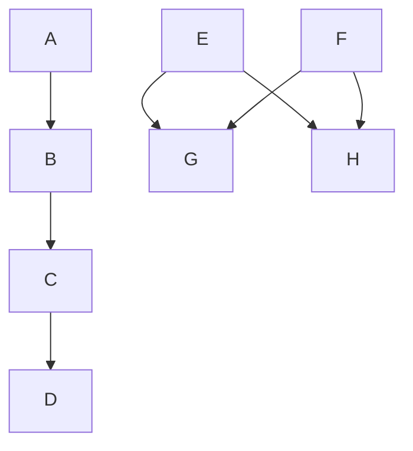

</td>
<td>

<svg xmlns="http://www.w3.org/2000/svg" width="430" height="390" viewBox="0 0 430 390">
  <defs>
    <marker id="arrow" markerWidth="10" markerHeight="10" refX="9" refY="3" orient="auto" markerUnits="strokeWidth">
      <path d="M0,0 L0,6 L9,3 z" fill="#333" />
    </marker>
    <marker id="circle-marker" markerWidth="6" markerHeight="6" refX="3" refY="3" orient="auto" markerUnits="strokeWidth">
      <circle cx="3" cy="3" r="3" fill="#333" />
    </marker>
  </defs>
  <path d="M80,80 L80,105 L80,130" stroke="#333" stroke-width="2" fill="none" marker-end="url(#arrow)" />
  <path d="M80,170 L80,195 L80,220" stroke="#333" stroke-width="2" fill="none" marker-end="url(#arrow)" />
  <path d="M80,260 L80,285 L80,310" stroke="#333" stroke-width="2" fill="none" marker-end="url(#arrow)" />
  <path d="M186.11111111111111,80 L150,105 L183.33333333333334,130" stroke="#333" stroke-width="2" fill="none" marker-end="url(#arrow)" />
  <path d="M246.11111111111111,80 L285,105 L321.1111111111111,130" stroke="#333" stroke-width="2" fill="none" marker-end="url(#arrow)" />
  <path d="M313.8888888888889,80 L275,105 L238.88888888888889,130" stroke="#333" stroke-width="2" fill="none" marker-end="url(#arrow)" />
  <path d="M349.44444444444446,80 L355,105 L352.22222222222223,130" stroke="#333" stroke-width="2" fill="none" marker-end="url(#arrow)" />
  <g id="A">
    <rect x="40" y="40" width="80" height="40" rx="0" ry="0" stroke="#333" stroke-width="2" fill="#fff" />
    <text x="80" y="60" text-anchor="middle" dominant-baseline="middle" font-family="Arial, sans-serif" font-size="14" fill="#333">A</text>
  </g>
  <g id="B">
    <rect x="40" y="130" width="80" height="40" rx="0" ry="0" stroke="#333" stroke-width="2" fill="#fff" />
    <text x="80" y="150" text-anchor="middle" dominant-baseline="middle" font-family="Arial, sans-serif" font-size="14" fill="#333">B</text>
  </g>
  <g id="C">
    <rect x="40" y="220" width="80" height="40" rx="0" ry="0" stroke="#333" stroke-width="2" fill="#fff" />
    <text x="80" y="240" text-anchor="middle" dominant-baseline="middle" font-family="Arial, sans-serif" font-size="14" fill="#333">C</text>
  </g>
  <g id="D">
    <rect x="40" y="310" width="80" height="40" rx="0" ry="0" stroke="#333" stroke-width="2" fill="#fff" />
    <text x="80" y="330" text-anchor="middle" dominant-baseline="middle" font-family="Arial, sans-serif" font-size="14" fill="#333">D</text>
  </g>
  <g id="E">
    <rect x="175" y="40" width="80" height="40" rx="0" ry="0" stroke="#333" stroke-width="2" fill="#fff" />
    <text x="215" y="60" text-anchor="middle" dominant-baseline="middle" font-family="Arial, sans-serif" font-size="14" fill="#333">E</text>
  </g>
  <g id="F">
    <rect x="305" y="40" width="80" height="40" rx="0" ry="0" stroke="#333" stroke-width="2" fill="#fff" />
    <text x="345" y="60" text-anchor="middle" dominant-baseline="middle" font-family="Arial, sans-serif" font-size="14" fill="#333">F</text>
  </g>
  <g id="G">
    <rect x="170" y="130" width="80" height="40" rx="0" ry="0" stroke="#333" stroke-width="2" fill="#fff" />
    <text x="210" y="150" text-anchor="middle" dominant-baseline="middle" font-family="Arial, sans-serif" font-size="14" fill="#333">G</text>
  </g>
  <g id="H">
    <rect x="310" y="130" width="80" height="40" rx="0" ry="0" stroke="#333" stroke-width="2" fill="#fff" />
    <text x="350" y="150" text-anchor="middle" dominant-baseline="middle" font-family="Arial, sans-serif" font-size="14" fill="#333">H</text>
  </g>
</svg>

</td>
</tr>
</table>

<details>
<summary>View source code</summary>

```
flowchart TD
    A --> B --> C --> D
    E & F --> G & H
```
</details>

---

## 2. Comments

📄 **Source**: [`comments.mmd`](./valid/comments.mmd)

> Diagrams with comments.

### Rendered Output

<table>
<tr>
<th width="50%">Mermaid (Official)</th>
<th width="50%">Maid (Our Renderer)</th>
</tr>
<tr>
<td>

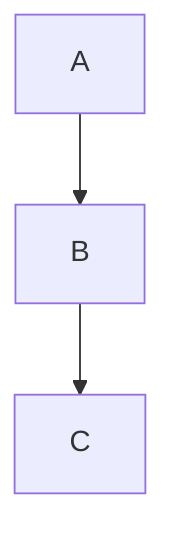

</td>
<td>

<svg xmlns="http://www.w3.org/2000/svg" width="160" height="300" viewBox="0 0 160 300">
  <defs>
    <marker id="arrow" markerWidth="10" markerHeight="10" refX="9" refY="3" orient="auto" markerUnits="strokeWidth">
      <path d="M0,0 L0,6 L9,3 z" fill="#333" />
    </marker>
    <marker id="circle-marker" markerWidth="6" markerHeight="6" refX="3" refY="3" orient="auto" markerUnits="strokeWidth">
      <circle cx="3" cy="3" r="3" fill="#333" />
    </marker>
  </defs>
  <path d="M80,80 L80,105 L80,130" stroke="#333" stroke-width="2" fill="none" marker-end="url(#arrow)" />
  <path d="M80,170 L80,195 L80,220" stroke="#333" stroke-width="2" fill="none" marker-end="url(#arrow)" />
  <g id="A">
    <rect x="40" y="40" width="80" height="40" rx="0" ry="0" stroke="#333" stroke-width="2" fill="#fff" />
    <text x="80" y="60" text-anchor="middle" dominant-baseline="middle" font-family="Arial, sans-serif" font-size="14" fill="#333">A</text>
  </g>
  <g id="B">
    <rect x="40" y="130" width="80" height="40" rx="0" ry="0" stroke="#333" stroke-width="2" fill="#fff" />
    <text x="80" y="150" text-anchor="middle" dominant-baseline="middle" font-family="Arial, sans-serif" font-size="14" fill="#333">B</text>
  </g>
  <g id="C">
    <rect x="40" y="220" width="80" height="40" rx="0" ry="0" stroke="#333" stroke-width="2" fill="#fff" />
    <text x="80" y="240" text-anchor="middle" dominant-baseline="middle" font-family="Arial, sans-serif" font-size="14" fill="#333">C</text>
  </g>
</svg>

</td>
</tr>
</table>

<details>
<summary>View source code</summary>

```
flowchart TD
    %% This is a comment
    A --> B
    %% Another comment
    B --> C
```
</details>

---

## 3. Complex Shapes

📄 **Source**: [`complex-shapes.mmd`](./valid/complex-shapes.mmd)

> Demonstrates all available node shapes in Mermaid.

### Rendered Output

<table>
<tr>
<th width="50%">Mermaid (Official)</th>
<th width="50%">Maid (Our Renderer)</th>
</tr>
<tr>
<td>


</td>
<td>

<svg xmlns="http://www.w3.org/2000/svg" width="329" height="938" viewBox="0 0 329 938">
  <defs>
    <marker id="arrow" markerWidth="10" markerHeight="10" refX="9" refY="3" orient="auto" markerUnits="strokeWidth">
      <path d="M0,0 L0,6 L9,3 z" fill="#333" />
    </marker>
    <marker id="circle-marker" markerWidth="6" markerHeight="6" refX="3" refY="3" orient="auto" markerUnits="strokeWidth">
      <circle cx="3" cy="3" r="3" fill="#333" />
    </marker>
  </defs>
  <path d="M159.5,80 L159.5,105 L159.5,130" stroke="#333" stroke-width="2" fill="none" marker-end="url(#arrow)" />
  <path d="M159.5,210 L159.5,235 L159.5,260" stroke="#333" stroke-width="2" fill="none" marker-end="url(#arrow)" />
  <g>
    <path d="M130.41525423728814,308 L88,343 L88,383" stroke="#333" stroke-width="2" fill="none" marker-end="url(#arrow)" />
    <rect x="58" y="333" width="60" height="20" fill="white" opacity="0.9" rx="3" />
    <text x="88" y="343" text-anchor="middle" dominant-baseline="middle" font-family="Arial, sans-serif" font-size="12" fill="#333">Link 1</text>
  </g>
  <g>
    <path d="M188.58474576271186,308 L231,343 L231,378" stroke="#333" stroke-width="2" fill="none" marker-end="url(#arrow)" />
    <rect x="201" y="333" width="60" height="20" fill="white" opacity="0.9" rx="3" />
    <text x="231" y="343" text-anchor="middle" dominant-baseline="middle" font-family="Arial, sans-serif" font-size="12" fill="#333">Link 2</text>
  </g>
  <path d="M88,423 L88,453 L123.04901960784314,478" stroke="#333" stroke-width="2" fill="none" marker-end="url(#arrow)" />
  <path d="M231,428 L231,453 L195.95098039215685,478" stroke="#333" stroke-width="2" fill="none" marker-end="url(#arrow)" />
  <path d="M141.65686274509804,530 L124.5,555 L124.5,600 L124.5,645 L142.35714285714286,670" stroke="#333" stroke-width="2" fill="none" marker-end="url(#arrow)" />
  <path d="M177.34313725490196,530 L194.5,555 L194.5,580" stroke="#333" stroke-width="2" fill="none" marker-end="url(#arrow)" />
  <path d="M194.5,620 L194.5,645 L176.64285714285714,670" stroke="#333" stroke-width="2" fill="none" marker-end="url(#arrow)" />
  <path d="M159.5,718 L159.5,743 L159.5,768" stroke="#333" stroke-width="2" fill="none" marker-end="url(#arrow)" />
  <path d="M159.5,808 L159.5,833 L159.5,858" stroke="#333" stroke-width="2" fill="none" marker-end="url(#arrow)" />
  <g id="A">
    <rect x="103.5" y="40" width="112" height="40" rx="0" ry="0" stroke="#333" stroke-width="2" fill="#fff" />
    <text x="159.5" y="60" text-anchor="middle" dominant-baseline="middle" font-family="Arial, sans-serif" font-size="14" fill="#333">Rectangle</text>
  </g>
  <g id="B">
    <circle cx="159.5" cy="170" r="40" stroke="#333" stroke-width="2" fill="#fff" />
    <text x="159.5" y="170" text-anchor="middle" dominant-baseline="middle" font-family="Arial, sans-serif" font-size="14" fill="#333">B</text>
  </g>
  <g id="C">
    <polygon points="159.5,260 211.5,284 159.5,308 107.5,284" stroke="#333" stroke-width="2" fill="#fff" />
    <text x="159.5" y="284" text-anchor="middle" dominant-baseline="middle" font-family="Arial, sans-serif" font-size="14" fill="#333">C</text>
  </g>
  <g id="D">
    <rect x="40" y="383" width="96" height="40" rx="20" ry="20" stroke="#333" stroke-width="2" fill="#fff" />
    <text x="88" y="403" text-anchor="middle" dominant-baseline="middle" font-family="Arial, sans-serif" font-size="14" fill="#333">D</text>
  </g>
  <g id="E">
    <g>
          <rect x="186" y="378" width="90" height="50" rx="0" ry="0" stroke="#333" stroke-width="2" fill="#fff" />
          <line x1="191" y1="378" x2="191" y2="428" stroke="#333" stroke-width="2" />
          <line x1="271" y1="378" x2="271" y2="428" stroke="#333" stroke-width="2" />
        </g>
    <text x="231" y="403" text-anchor="middle" dominant-baseline="middle" font-family="Arial, sans-serif" font-size="14" fill="#333">E</text>
  </g>
  <g id="F">
    <g>
          <ellipse cx="159.5" cy="488" rx="40" ry="10" stroke="#333" stroke-width="2" fill="#fff" />
          <rect x="119.5" y="488" width="80" height="32" stroke="none" fill="#fff" />
          <path d="M119.5,488 L119.5,520 A40,10 0 0,0 199.5,520 L199.5,488" stroke="#333" stroke-width="2" fill="none" />
        </g>
    <text x="159.5" y="504" text-anchor="middle" dominant-baseline="middle" font-family="Arial, sans-serif" font-size="14" fill="#333">F</text>
  </g>
  <g id="H">
    <polygon points="133.5,670 185.5,670 211.5,694 185.5,718 133.5,718 107.5,694" stroke="#333" stroke-width="2" fill="#fff" />
    <text x="159.5" y="694" text-anchor="middle" dominant-baseline="middle" font-family="Arial, sans-serif" font-size="14" fill="#333">H</text>
  </g>
  <g id="G">
    <rect x="154.5" y="580" width="80" height="40" rx="0" ry="0" stroke="#333" stroke-width="2" fill="#fff" />
    <text x="194.5" y="600" text-anchor="middle" dominant-baseline="middle" font-family="Arial, sans-serif" font-size="14" fill="#333">G</text>
  </g>
  <g id="I">
    <rect x="119.5" y="768" width="80" height="40" rx="0" ry="0" stroke="#333" stroke-width="2" fill="#fff" />
    <text x="159.5" y="788" text-anchor="middle" dominant-baseline="middle" font-family="Arial, sans-serif" font-size="14" fill="#333">I</text>
  </g>
  <g id="J">
    <rect x="119.5" y="858" width="80" height="40" rx="0" ry="0" stroke="#333" stroke-width="2" fill="#fff" />
    <text x="159.5" y="878" text-anchor="middle" dominant-baseline="middle" font-family="Arial, sans-serif" font-size="14" fill="#333">Alt</text>
  </g>
</svg>

</td>
</tr>
</table>

<details>
<summary>View source code</summary>

```
flowchart TB
    A[Rectangle] --> B((Circle))
    B --> C{Diamond}
    C -->|Link 1| D([Stadium])
    C -->|Link 2| E[[Subroutine]]
    D --> F[(Database)]
    E --> F
    F --> H{{Hexagon}}
    F --> G[/Parallelogram/]
    G --> H[\Parallelogram Alt\]
    H --> I[/Trapezoid\]
    I --> J[\Trapezoid Alt/]

```
</details>

---

## 4. Custom Auth Subgraph

📄 **Source**: [`custom-auth-subgraph.mmd`](./valid/custom-auth-subgraph.mmd)

> Custom authentication flow example.

### Rendered Output

<table>
<tr>
<th width="50%">Mermaid (Official)</th>
<th width="50%">Maid (Our Renderer)</th>
</tr>
<tr>
<td>

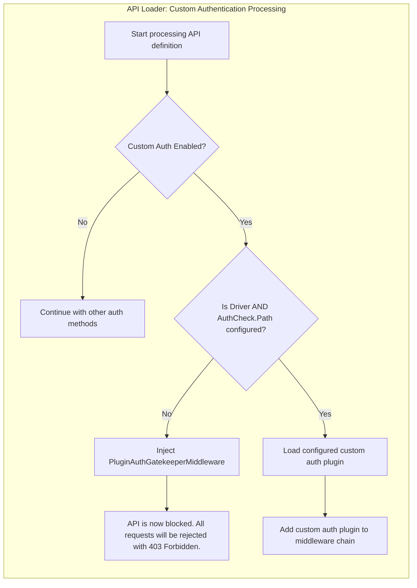

</td>
<td>

<svg xmlns="http://www.w3.org/2000/svg" width="1082" height="556" viewBox="0 0 1082 556">
  <defs>
    <marker id="arrow" markerWidth="10" markerHeight="10" refX="9" refY="3" orient="auto" markerUnits="strokeWidth">
      <path d="M0,0 L0,6 L9,3 z" fill="#333" />
    </marker>
    <marker id="circle-marker" markerWidth="6" markerHeight="6" refX="3" refY="3" orient="auto" markerUnits="strokeWidth">
      <circle cx="3" cy="3" r="3" fill="#333" />
    </marker>
  </defs>
  <path d="M466,110 L466,165 L466,190" stroke="#333" stroke-width="2" fill="none" marker-end="url(#arrow)" />
  <path d="M414,234.38400000000001 L341,263 L341,292" stroke="#333" stroke-width="2" fill="none" marker-end="url(#arrow)" />
  <path d="M518,234.38400000000001 L591,263 L591,288" stroke="#333" stroke-width="2" fill="none" marker-end="url(#arrow)" />
  <path d="M539,321.68821292775664 L328,361 L328,386" stroke="#333" stroke-width="2" fill="none" marker-end="url(#arrow)" />
  <path d="M328,426 L328,451 L328,476" stroke="#333" stroke-width="2" fill="none" marker-end="url(#arrow)" />
  <path d="M643,321.68821292775664 L854,361 L854,386" stroke="#333" stroke-width="2" fill="none" marker-end="url(#arrow)" />
  <path d="M854,426 L854,451 L854,476" stroke="#333" stroke-width="2" fill="none" marker-end="url(#arrow)" />
  <g id="A">
    <rect x="322" y="70" width="288" height="40" rx="0" ry="0" stroke="#333" stroke-width="2" fill="#fff" />
    <text x="466" y="90" text-anchor="middle" dominant-baseline="middle" font-family="Arial, sans-serif" font-size="14" fill="#333">Start processing API definition</text>
  </g>
  <g id="B">
    <polygon points="466,190 518,214 466,238 414,214" stroke="#333" stroke-width="2" fill="#fff" />
    <text x="466" y="214" text-anchor="middle" dominant-baseline="middle" font-family="Arial, sans-serif" font-size="14" fill="#333">B</text>
  </g>
  <g id="C">
    <rect x="193" y="292" width="296" height="40" rx="0" ry="0" stroke="#333" stroke-width="2" fill="#fff" />
    <text x="341" y="312" text-anchor="middle" dominant-baseline="middle" font-family="Arial, sans-serif" font-size="14" fill="#333">Continue with other auth methods</text>
  </g>
  <g id="D">
    <polygon points="591,288 643,312 591,336 539,312" stroke="#333" stroke-width="2" fill="#fff" />
    <text x="591" y="312" text-anchor="middle" dominant-baseline="middle" font-family="Arial, sans-serif" font-size="14" fill="#333">D</text>
  </g>
  <g id="E">
    <rect x="288" y="386" width="80" height="40" rx="0" ry="0" stroke="#333" stroke-width="2" fill="#fff" />
    <text x="328" y="406" text-anchor="middle" dominant-baseline="middle" font-family="Arial, sans-serif" font-size="14" fill="#333">E</text>
  </g>
  <g id="F">
    <rect x="40" y="476" width="576" height="40" rx="0" ry="0" stroke="#333" stroke-width="2" fill="#fff" />
    <text x="328" y="496" text-anchor="middle" dominant-baseline="middle" font-family="Arial, sans-serif" font-size="14" fill="#333">API is now blocked All requests will be rejected with Forbidden 403</text>
  </g>
  <g id="G">
    <rect x="814" y="386" width="80" height="40" rx="0" ry="0" stroke="#333" stroke-width="2" fill="#fff" />
    <text x="854" y="406" text-anchor="middle" dominant-baseline="middle" font-family="Arial, sans-serif" font-size="14" fill="#333">G</text>
  </g>
  <g id="H">
    <rect x="666" y="476" width="376" height="40" rx="0" ry="0" stroke="#333" stroke-width="2" fill="#fff" />
    <text x="854" y="496" text-anchor="middle" dominant-baseline="middle" font-family="Arial, sans-serif" font-size="14" fill="#333">Add custom auth plugin to middleware chain</text>
  </g>
</svg>

</td>
</tr>
</table>

<details>
<summary>View source code</summary>

```
flowchart TD
    subgraph API_Loader_Custom_Authentication_Processing[API Loader: Custom Authentication Processing]
        direction TB
        A[Start processing API definition] --> B{Custom Auth Enabled?}
        B -- No --> C[Continue with other auth methods]
        B -- Yes --> D{Is Driver AND AuthCheck.Path configured?}
        D -- No --> E[Inject PluginAuthGatekeeperMiddleware]
        E --> F[API is now blocked. All requests will be rejected with 403 Forbidden.]
        D -- Yes --> G[Load configured custom auth plugin]
        G --> H[Add custom auth plugin to middleware chain]
    end

```
</details>

---

## 5. Duplicate Subgraph

📄 **Source**: [`duplicate-subgraph.mmd`](./valid/duplicate-subgraph.mmd)

> Handling of duplicate subgraph names.

### Rendered Output

<table>
<tr>
<th width="50%">Mermaid (Official)</th>
<th width="50%">Maid (Our Renderer)</th>
</tr>
<tr>
<td>

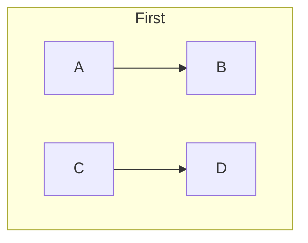

</td>
<td>

<svg xmlns="http://www.w3.org/2000/svg" width="490" height="270" viewBox="0 0 490 270">
  <defs>
    <marker id="arrow" markerWidth="10" markerHeight="10" refX="9" refY="3" orient="auto" markerUnits="strokeWidth">
      <path d="M0,0 L0,6 L9,3 z" fill="#333" />
    </marker>
    <marker id="circle-marker" markerWidth="6" markerHeight="6" refX="3" refY="3" orient="auto" markerUnits="strokeWidth">
      <circle cx="3" cy="3" r="3" fill="#333" />
    </marker>
  </defs>
  <path d="M80,110 L80,165 L80,190" stroke="#333" stroke-width="2" fill="none" marker-end="url(#arrow)" />
  <path d="M210,110 L210,165 L210,190" stroke="#333" stroke-width="2" fill="none" marker-end="url(#arrow)" />
  <g id="A">
    <rect x="40" y="70" width="80" height="40" rx="0" ry="0" stroke="#333" stroke-width="2" fill="#fff" />
    <text x="80" y="90" text-anchor="middle" dominant-baseline="middle" font-family="Arial, sans-serif" font-size="14" fill="#333">A</text>
  </g>
  <g id="B">
    <rect x="40" y="190" width="80" height="40" rx="0" ry="0" stroke="#333" stroke-width="2" fill="#fff" />
    <text x="80" y="210" text-anchor="middle" dominant-baseline="middle" font-family="Arial, sans-serif" font-size="14" fill="#333">B</text>
  </g>
  <g id="C">
    <rect x="170" y="70" width="80" height="40" rx="0" ry="0" stroke="#333" stroke-width="2" fill="#fff" />
    <text x="210" y="90" text-anchor="middle" dominant-baseline="middle" font-family="Arial, sans-serif" font-size="14" fill="#333">C</text>
  </g>
  <g id="D">
    <rect x="170" y="190" width="80" height="40" rx="0" ry="0" stroke="#333" stroke-width="2" fill="#fff" />
    <text x="210" y="210" text-anchor="middle" dominant-baseline="middle" font-family="Arial, sans-serif" font-size="14" fill="#333">D</text>
  </g>
</svg>

</td>
</tr>
</table>

<details>
<summary>View source code</summary>

```
flowchart TD
    subgraph same[First]
        A --> B
    end
    subgraph same[Second]
        C --> D
    end
```
</details>

---

## 6. Link Styles

📄 **Source**: [`link-styles.mmd`](./valid/link-styles.mmd)

> Different link and arrow styles.

### Rendered Output

<table>
<tr>
<th width="50%">Mermaid (Official)</th>
<th width="50%">Maid (Our Renderer)</th>
</tr>
<tr>
<td>

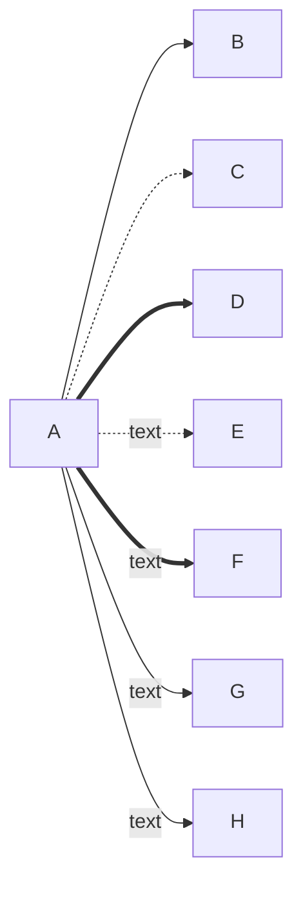

</td>
<td>

<svg xmlns="http://www.w3.org/2000/svg" width="322" height="670" viewBox="0 0 322 670">
  <defs>
    <marker id="arrow" markerWidth="10" markerHeight="10" refX="9" refY="3" orient="auto" markerUnits="strokeWidth">
      <path d="M0,0 L0,6 L9,3 z" fill="#333" />
    </marker>
    <marker id="circle-marker" markerWidth="6" markerHeight="6" refX="3" refY="3" orient="auto" markerUnits="strokeWidth">
      <circle cx="3" cy="3" r="3" fill="#333" />
    </marker>
  </defs>
  <path d="M86,310 L161,60 L202,60" stroke="#333" stroke-width="2" fill="none" marker-end="url(#arrow)" />
  <path d="M89,310 L161,150 L202,150" stroke="#333" stroke-width="2" fill="none" stroke-dasharray="5,5" marker-end="url(#arrow)" />
  <path d="M98,310 L161,240 L202,240" stroke="#333" stroke-width="3" fill="none" marker-end="url(#arrow)" />
  <path d="M120,330 L161,330 L202,330" stroke="#333" stroke-width="2" fill="none" marker-end="url(#arrow)" />
  <path d="M98,350 L161,420 L202,420" stroke="#333" stroke-width="2" fill="none" marker-end="url(#arrow)" />
  <path d="M89,350 L161,510 L202,510" stroke="#333" stroke-width="2" fill="none" marker-end="url(#arrow)" />
  <g>
    <path d="M86,350 L161,600 L202,600" stroke="#333" stroke-width="2" fill="none" marker-end="url(#arrow)" />
    <rect x="131" y="590" width="60" height="20" fill="white" opacity="0.9" rx="3" />
    <text x="161" y="600" text-anchor="middle" dominant-baseline="middle" font-family="Arial, sans-serif" font-size="12" fill="#333">text</text>
  </g>
  <g id="A">
    <rect x="40" y="310" width="80" height="40" rx="0" ry="0" stroke="#333" stroke-width="2" fill="#fff" />
    <text x="80" y="330" text-anchor="middle" dominant-baseline="middle" font-family="Arial, sans-serif" font-size="14" fill="#333">A</text>
  </g>
  <g id="B">
    <rect x="202" y="40" width="80" height="40" rx="0" ry="0" stroke="#333" stroke-width="2" fill="#fff" />
    <text x="242" y="60" text-anchor="middle" dominant-baseline="middle" font-family="Arial, sans-serif" font-size="14" fill="#333">B</text>
  </g>
  <g id="C">
    <rect x="202" y="130" width="80" height="40" rx="0" ry="0" stroke="#333" stroke-width="2" fill="#fff" />
    <text x="242" y="150" text-anchor="middle" dominant-baseline="middle" font-family="Arial, sans-serif" font-size="14" fill="#333">C</text>
  </g>
  <g id="D">
    <rect x="202" y="220" width="80" height="40" rx="0" ry="0" stroke="#333" stroke-width="2" fill="#fff" />
    <text x="242" y="240" text-anchor="middle" dominant-baseline="middle" font-family="Arial, sans-serif" font-size="14" fill="#333">D</text>
  </g>
  <g id="E">
    <rect x="202" y="310" width="80" height="40" rx="0" ry="0" stroke="#333" stroke-width="2" fill="#fff" />
    <text x="242" y="330" text-anchor="middle" dominant-baseline="middle" font-family="Arial, sans-serif" font-size="14" fill="#333">E</text>
  </g>
  <g id="F">
    <rect x="202" y="400" width="80" height="40" rx="0" ry="0" stroke="#333" stroke-width="2" fill="#fff" />
    <text x="242" y="420" text-anchor="middle" dominant-baseline="middle" font-family="Arial, sans-serif" font-size="14" fill="#333">F</text>
  </g>
  <g id="G">
    <rect x="202" y="490" width="80" height="40" rx="0" ry="0" stroke="#333" stroke-width="2" fill="#fff" />
    <text x="242" y="510" text-anchor="middle" dominant-baseline="middle" font-family="Arial, sans-serif" font-size="14" fill="#333">G</text>
  </g>
  <g id="H">
    <rect x="202" y="580" width="80" height="40" rx="0" ry="0" stroke="#333" stroke-width="2" fill="#fff" />
    <text x="242" y="600" text-anchor="middle" dominant-baseline="middle" font-family="Arial, sans-serif" font-size="14" fill="#333">H</text>
  </g>
</svg>

</td>
</tr>
</table>

<details>
<summary>View source code</summary>

```
flowchart LR
    A --> B
    A -.-> C
    A ==> D
    A -.text.-> E
    A ==text==> F
    A -- text --> G
    A -->|text| H
```
</details>

---

## 7. Long Text

📄 **Source**: [`long-text.mmd`](./valid/long-text.mmd)

> Nodes with long text content.

### Rendered Output

<table>
<tr>
<th width="50%">Mermaid (Official)</th>
<th width="50%">Maid (Our Renderer)</th>
</tr>
<tr>
<td>

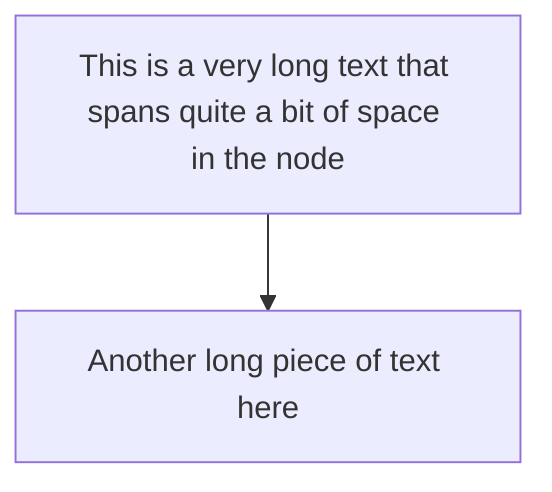

</td>
<td>

<svg xmlns="http://www.w3.org/2000/svg" width="664" height="210" viewBox="0 0 664 210">
  <defs>
    <marker id="arrow" markerWidth="10" markerHeight="10" refX="9" refY="3" orient="auto" markerUnits="strokeWidth">
      <path d="M0,0 L0,6 L9,3 z" fill="#333" />
    </marker>
    <marker id="circle-marker" markerWidth="6" markerHeight="6" refX="3" refY="3" orient="auto" markerUnits="strokeWidth">
      <circle cx="3" cy="3" r="3" fill="#333" />
    </marker>
  </defs>
  <path d="M332,80 L332,105 L332,130" stroke="#333" stroke-width="2" fill="none" marker-end="url(#arrow)" />
  <g id="A">
    <rect x="40" y="40" width="584" height="40" rx="0" ry="0" stroke="#333" stroke-width="2" fill="#fff" />
    <text x="332" y="60" text-anchor="middle" dominant-baseline="middle" font-family="Arial, sans-serif" font-size="14" fill="#333">This is a very long text that spans quite a bit of space in the node</text>
  </g>
  <g id="B">
    <rect x="188" y="130" width="288" height="40" rx="0" ry="0" stroke="#333" stroke-width="2" fill="#fff" />
    <text x="332" y="150" text-anchor="middle" dominant-baseline="middle" font-family="Arial, sans-serif" font-size="14" fill="#333">Another long piece of text here</text>
  </g>
</svg>

</td>
</tr>
</table>

<details>
<summary>View source code</summary>

```
flowchart TD
    A[This is a very long text that spans quite a bit of space in the node] --> B[Another long piece of text here]
```
</details>

---

## 8. Mismatched Quotes

📄 **Source**: [`mismatched-quotes.mmd`](./valid/mismatched-quotes.mmd)

### Rendered Output

<table>
<tr>
<th width="50%">Mermaid (Official)</th>
<th width="50%">Maid (Our Renderer)</th>
</tr>
<tr>
<td>

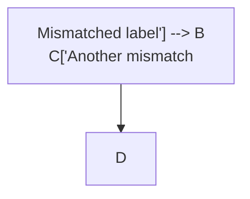

</td>
<td>

<svg xmlns="http://www.w3.org/2000/svg" width="488" height="210" viewBox="0 0 488 210">
  <defs>
    <marker id="arrow" markerWidth="10" markerHeight="10" refX="9" refY="3" orient="auto" markerUnits="strokeWidth">
      <path d="M0,0 L0,6 L9,3 z" fill="#333" />
    </marker>
    <marker id="circle-marker" markerWidth="6" markerHeight="6" refX="3" refY="3" orient="auto" markerUnits="strokeWidth">
      <circle cx="3" cy="3" r="3" fill="#333" />
    </marker>
  </defs>
  <path d="M244,80 L244,105 L244,130" stroke="#333" stroke-width="2" fill="none" marker-end="url(#arrow)" />
  <g id="A">
    <rect x="40" y="40" width="408" height="40" rx="0" ry="0" stroke="#333" stroke-width="2" fill="#fff" />
    <text x="244" y="60" text-anchor="middle" dominant-baseline="middle" font-family="Arial, sans-serif" font-size="14" fill="#333">Mismatched label&apos;] --&gt; B
  C[&apos;Another mismatch</text>
  </g>
  <g id="D">
    <rect x="204" y="130" width="80" height="40" rx="0" ry="0" stroke="#333" stroke-width="2" fill="#fff" />
    <text x="244" y="150" text-anchor="middle" dominant-baseline="middle" font-family="Arial, sans-serif" font-size="14" fill="#333">D</text>
  </g>
</svg>

</td>
</tr>
</table>

<details>
<summary>View source code</summary>

```
flowchart TD
  A["Mismatched label'] --> B
  C['Another mismatch"] --> D


```
</details>

---

## 9. Multidirectional Arrows

📄 **Source**: [`multidirectional-arrows.mmd`](./valid/multidirectional-arrows.mmd)

> Bidirectional and special endpoint arrows.

### Rendered Output

<table>
<tr>
<th width="50%">Mermaid (Official)</th>
<th width="50%">Maid (Our Renderer)</th>
</tr>
<tr>
<td>

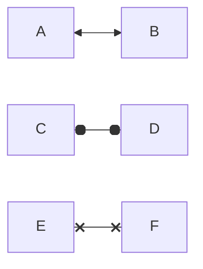

</td>
<td>

<svg xmlns="http://www.w3.org/2000/svg" width="290" height="300" viewBox="0 0 290 300">
  <defs>
    <marker id="arrow" markerWidth="10" markerHeight="10" refX="9" refY="3" orient="auto" markerUnits="strokeWidth">
      <path d="M0,0 L0,6 L9,3 z" fill="#333" />
    </marker>
    <marker id="circle-marker" markerWidth="6" markerHeight="6" refX="3" refY="3" orient="auto" markerUnits="strokeWidth">
      <circle cx="3" cy="3" r="3" fill="#333" />
    </marker>
  </defs>
  <path d="M120,60 L145,60 L170,60" stroke="#333" stroke-width="2" fill="none" marker-end="url(#arrow)" />
  <path d="M120,150 L145,150 L170,150" stroke="#333" stroke-width="2" fill="none" marker-end="url(#arrow)" />
  <path d="M120,240 L145,240 L170,240" stroke="#333" stroke-width="2" fill="none" marker-end="url(#arrow)" />
  <g id="A">
    <rect x="40" y="40" width="80" height="40" rx="0" ry="0" stroke="#333" stroke-width="2" fill="#fff" />
    <text x="80" y="60" text-anchor="middle" dominant-baseline="middle" font-family="Arial, sans-serif" font-size="14" fill="#333">A</text>
  </g>
  <g id="B">
    <rect x="170" y="40" width="80" height="40" rx="0" ry="0" stroke="#333" stroke-width="2" fill="#fff" />
    <text x="210" y="60" text-anchor="middle" dominant-baseline="middle" font-family="Arial, sans-serif" font-size="14" fill="#333">B</text>
  </g>
  <g id="C">
    <rect x="40" y="130" width="80" height="40" rx="0" ry="0" stroke="#333" stroke-width="2" fill="#fff" />
    <text x="80" y="150" text-anchor="middle" dominant-baseline="middle" font-family="Arial, sans-serif" font-size="14" fill="#333">C</text>
  </g>
  <g id="D">
    <rect x="170" y="130" width="80" height="40" rx="0" ry="0" stroke="#333" stroke-width="2" fill="#fff" />
    <text x="210" y="150" text-anchor="middle" dominant-baseline="middle" font-family="Arial, sans-serif" font-size="14" fill="#333">D</text>
  </g>
  <g id="E">
    <rect x="40" y="220" width="80" height="40" rx="0" ry="0" stroke="#333" stroke-width="2" fill="#fff" />
    <text x="80" y="240" text-anchor="middle" dominant-baseline="middle" font-family="Arial, sans-serif" font-size="14" fill="#333">E</text>
  </g>
  <g id="F">
    <rect x="170" y="220" width="80" height="40" rx="0" ry="0" stroke="#333" stroke-width="2" fill="#fff" />
    <text x="210" y="240" text-anchor="middle" dominant-baseline="middle" font-family="Arial, sans-serif" font-size="14" fill="#333">F</text>
  </g>
</svg>

</td>
</tr>
</table>

<details>
<summary>View source code</summary>

```
flowchart LR
    A <--> B
    C o--o D
    E x--x F
```
</details>

---

## 10. Nested Subgraphs

📄 **Source**: [`nested-subgraphs.mmd`](./valid/nested-subgraphs.mmd)

> Nested subgraphs with multiple levels.

### Rendered Output

<table>
<tr>
<th width="50%">Mermaid (Official)</th>
<th width="50%">Maid (Our Renderer)</th>
</tr>
<tr>
<td>

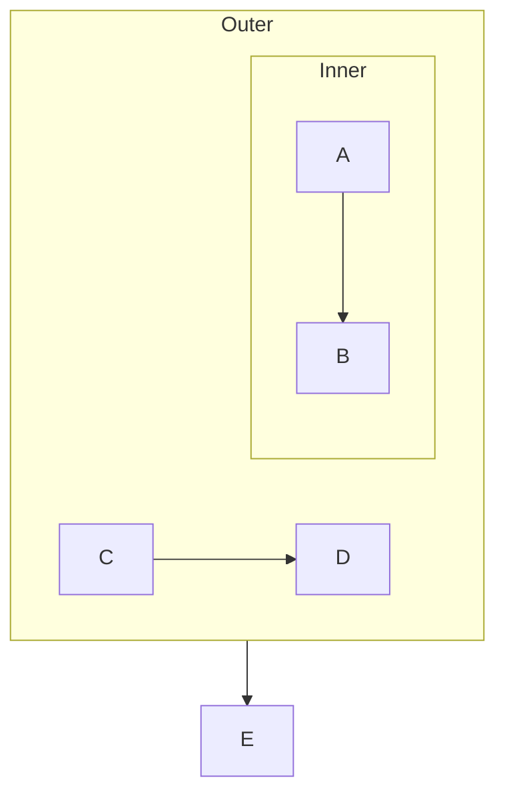

</td>
<td>

<svg xmlns="http://www.w3.org/2000/svg" width="690" height="270" viewBox="0 0 690 270">
  <defs>
    <marker id="arrow" markerWidth="10" markerHeight="10" refX="9" refY="3" orient="auto" markerUnits="strokeWidth">
      <path d="M0,0 L0,6 L9,3 z" fill="#333" />
    </marker>
    <marker id="circle-marker" markerWidth="6" markerHeight="6" refX="3" refY="3" orient="auto" markerUnits="strokeWidth">
      <circle cx="3" cy="3" r="3" fill="#333" />
    </marker>
  </defs>
  <path d="M80,110 L80,165 L80,190" stroke="#333" stroke-width="2" fill="none" marker-end="url(#arrow)" />
  <path d="M210,110 L210,165 L210,190" stroke="#333" stroke-width="2" fill="none" marker-end="url(#arrow)" />
  <path d="M375,140 L375,165 L375,190" stroke="#333" stroke-width="2" fill="none" marker-end="url(#arrow)" />
  <g id="A">
    <rect x="40" y="70" width="80" height="40" rx="0" ry="0" stroke="#333" stroke-width="2" fill="#fff" />
    <text x="80" y="90" text-anchor="middle" dominant-baseline="middle" font-family="Arial, sans-serif" font-size="14" fill="#333">A</text>
  </g>
  <g id="B">
    <rect x="40" y="190" width="80" height="40" rx="0" ry="0" stroke="#333" stroke-width="2" fill="#fff" />
    <text x="80" y="210" text-anchor="middle" dominant-baseline="middle" font-family="Arial, sans-serif" font-size="14" fill="#333">B</text>
  </g>
  <g id="C">
    <rect x="170" y="70" width="80" height="40" rx="0" ry="0" stroke="#333" stroke-width="2" fill="#fff" />
    <text x="210" y="90" text-anchor="middle" dominant-baseline="middle" font-family="Arial, sans-serif" font-size="14" fill="#333">C</text>
  </g>
  <g id="D">
    <rect x="170" y="190" width="80" height="40" rx="0" ry="0" stroke="#333" stroke-width="2" fill="#fff" />
    <text x="210" y="210" text-anchor="middle" dominant-baseline="middle" font-family="Arial, sans-serif" font-size="14" fill="#333">D</text>
  </g>
  <g id="E">
    <rect x="335" y="190" width="80" height="40" rx="0" ry="0" stroke="#333" stroke-width="2" fill="#fff" />
    <text x="375" y="210" text-anchor="middle" dominant-baseline="middle" font-family="Arial, sans-serif" font-size="14" fill="#333">E</text>
  </g>
</svg>

</td>
</tr>
</table>

<details>
<summary>View source code</summary>

```
flowchart TD
    subgraph outer[Outer]
        subgraph inner[Inner]
            A --> B
        end
        C --> D
    end
    outer --> E
```
</details>

---

## 11. Node Ids Special

📄 **Source**: [`node-ids-special.mmd`](./valid/node-ids-special.mmd)

> Special characters in node IDs.

### Rendered Output

<table>
<tr>
<th width="50%">Mermaid (Official)</th>
<th width="50%">Maid (Our Renderer)</th>
</tr>
<tr>
<td>

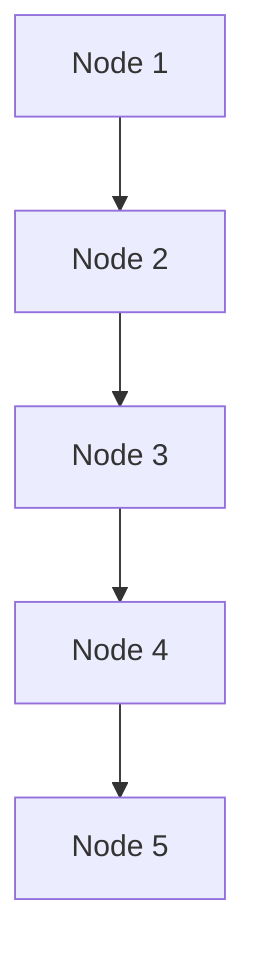

</td>
<td>

<svg xmlns="http://www.w3.org/2000/svg" width="160" height="480" viewBox="0 0 160 480">
  <defs>
    <marker id="arrow" markerWidth="10" markerHeight="10" refX="9" refY="3" orient="auto" markerUnits="strokeWidth">
      <path d="M0,0 L0,6 L9,3 z" fill="#333" />
    </marker>
    <marker id="circle-marker" markerWidth="6" markerHeight="6" refX="3" refY="3" orient="auto" markerUnits="strokeWidth">
      <circle cx="3" cy="3" r="3" fill="#333" />
    </marker>
  </defs>
  <path d="M80,80 L80,105 L80,130" stroke="#333" stroke-width="2" fill="none" marker-end="url(#arrow)" />
  <path d="M80,170 L80,195 L80,220" stroke="#333" stroke-width="2" fill="none" marker-end="url(#arrow)" />
  <path d="M80,260 L80,285 L80,310" stroke="#333" stroke-width="2" fill="none" marker-end="url(#arrow)" />
  <path d="M80,350 L80,375 L80,400" stroke="#333" stroke-width="2" fill="none" marker-end="url(#arrow)" />
  <g id="id1">
    <rect x="40" y="40" width="80" height="40" rx="0" ry="0" stroke="#333" stroke-width="2" fill="#fff" />
    <text x="80" y="60" text-anchor="middle" dominant-baseline="middle" font-family="Arial, sans-serif" font-size="14" fill="#333">id1</text>
  </g>
  <g id="id-2">
    <rect x="40" y="130" width="80" height="40" rx="0" ry="0" stroke="#333" stroke-width="2" fill="#fff" />
    <text x="80" y="150" text-anchor="middle" dominant-baseline="middle" font-family="Arial, sans-serif" font-size="14" fill="#333">id-2</text>
  </g>
  <g id="id_3">
    <rect x="40" y="220" width="80" height="40" rx="0" ry="0" stroke="#333" stroke-width="2" fill="#fff" />
    <text x="80" y="240" text-anchor="middle" dominant-baseline="middle" font-family="Arial, sans-serif" font-size="14" fill="#333">id_3</text>
  </g>
  <g id="ID4">
    <rect x="40" y="310" width="80" height="40" rx="0" ry="0" stroke="#333" stroke-width="2" fill="#fff" />
    <text x="80" y="330" text-anchor="middle" dominant-baseline="middle" font-family="Arial, sans-serif" font-size="14" fill="#333">ID4</text>
  </g>
  <g id="_id5">
    <rect x="40" y="400" width="80" height="40" rx="0" ry="0" stroke="#333" stroke-width="2" fill="#fff" />
    <text x="80" y="420" text-anchor="middle" dominant-baseline="middle" font-family="Arial, sans-serif" font-size="14" fill="#333">_id5</text>
  </g>
</svg>

</td>
</tr>
</table>

<details>
<summary>View source code</summary>

```
flowchart TD
    id1[Node 1]
    id-2[Node 2]
    id_3[Node 3]
    ID4[Node 4]
    _id5[Node 5]
    id1 --> id-2
    id-2 --> id_3
    id_3 --> ID4
    ID4 --> _id5
```
</details>

---

## 12. Only Nodes

📄 **Source**: [`only-nodes.mmd`](./valid/only-nodes.mmd)

> Nodes defined without any connections.

### Rendered Output

<table>
<tr>
<th width="50%">Mermaid (Official)</th>
<th width="50%">Maid (Our Renderer)</th>
</tr>
<tr>
<td>

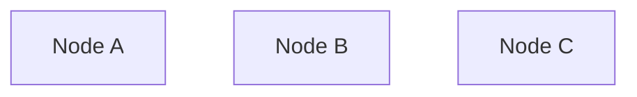

</td>
<td>

<svg xmlns="http://www.w3.org/2000/svg" width="444" height="120" viewBox="0 0 444 120">
  <defs>
    <marker id="arrow" markerWidth="10" markerHeight="10" refX="9" refY="3" orient="auto" markerUnits="strokeWidth">
      <path d="M0,0 L0,6 L9,3 z" fill="#333" />
    </marker>
    <marker id="circle-marker" markerWidth="6" markerHeight="6" refX="3" refY="3" orient="auto" markerUnits="strokeWidth">
      <circle cx="3" cy="3" r="3" fill="#333" />
    </marker>
  </defs>
  <g id="A">
    <rect x="40" y="40" width="88" height="40" rx="0" ry="0" stroke="#333" stroke-width="2" fill="#fff" />
    <text x="84" y="60" text-anchor="middle" dominant-baseline="middle" font-family="Arial, sans-serif" font-size="14" fill="#333">Node A</text>
  </g>
  <g id="B">
    <rect x="178" y="40" width="88" height="40" rx="0" ry="0" stroke="#333" stroke-width="2" fill="#fff" />
    <text x="222" y="60" text-anchor="middle" dominant-baseline="middle" font-family="Arial, sans-serif" font-size="14" fill="#333">Node B</text>
  </g>
  <g id="C">
    <rect x="316" y="40" width="88" height="40" rx="0" ry="0" stroke="#333" stroke-width="2" fill="#fff" />
    <text x="360" y="60" text-anchor="middle" dominant-baseline="middle" font-family="Arial, sans-serif" font-size="14" fill="#333">Node C</text>
  </g>
</svg>

</td>
</tr>
</table>

<details>
<summary>View source code</summary>

```
flowchart TD
    A[Node A]
    B[Node B]
    C[Node C]
```
</details>

---

## 13. Quotes Single Inside Double

📄 **Source**: [`quotes-single-inside-double.mmd`](./valid/quotes-single-inside-double.mmd)

### Rendered Output

<table>
<tr>
<th width="50%">Mermaid (Official)</th>
<th width="50%">Maid (Our Renderer)</th>
</tr>
<tr>
<td>

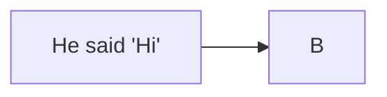

</td>
<td>

<svg xmlns="http://www.w3.org/2000/svg" width="346" height="120" viewBox="0 0 346 120">
  <defs>
    <marker id="arrow" markerWidth="10" markerHeight="10" refX="9" refY="3" orient="auto" markerUnits="strokeWidth">
      <path d="M0,0 L0,6 L9,3 z" fill="#333" />
    </marker>
    <marker id="circle-marker" markerWidth="6" markerHeight="6" refX="3" refY="3" orient="auto" markerUnits="strokeWidth">
      <circle cx="3" cy="3" r="3" fill="#333" />
    </marker>
  </defs>
  <path d="M176,60 L201,60 L226,60" stroke="#333" stroke-width="2" fill="none" marker-end="url(#arrow)" />
  <g id="A">
    <rect x="40" y="40" width="136" height="40" rx="0" ry="0" stroke="#333" stroke-width="2" fill="#fff" />
    <text x="108" y="60" text-anchor="middle" dominant-baseline="middle" font-family="Arial, sans-serif" font-size="14" fill="#333">He said &apos;Hi&apos;</text>
  </g>
  <g id="B">
    <rect x="226" y="40" width="80" height="40" rx="0" ry="0" stroke="#333" stroke-width="2" fill="#fff" />
    <text x="266" y="60" text-anchor="middle" dominant-baseline="middle" font-family="Arial, sans-serif" font-size="14" fill="#333">B</text>
  </g>
</svg>

</td>
</tr>
</table>

<details>
<summary>View source code</summary>

```
flowchart LR
  A["He said 'Hi'"] --> B


```
</details>

---

## 14. Simple Flow

📄 **Source**: [`simple-flow.mmd`](./valid/simple-flow.mmd)

> Basic flowchart with simple node connections.

### Rendered Output

<table>
<tr>
<th width="50%">Mermaid (Official)</th>
<th width="50%">Maid (Our Renderer)</th>
</tr>
<tr>
<td>

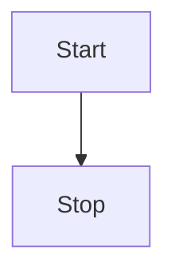

</td>
<td>

<svg xmlns="http://www.w3.org/2000/svg" width="160" height="210" viewBox="0 0 160 210">
  <defs>
    <marker id="arrow" markerWidth="10" markerHeight="10" refX="9" refY="3" orient="auto" markerUnits="strokeWidth">
      <path d="M0,0 L0,6 L9,3 z" fill="#333" />
    </marker>
    <marker id="circle-marker" markerWidth="6" markerHeight="6" refX="3" refY="3" orient="auto" markerUnits="strokeWidth">
      <circle cx="3" cy="3" r="3" fill="#333" />
    </marker>
  </defs>
  <path d="M80,80 L80,105 L80,130" stroke="#333" stroke-width="2" fill="none" marker-end="url(#arrow)" />
  <g id="Start">
    <rect x="40" y="40" width="80" height="40" rx="0" ry="0" stroke="#333" stroke-width="2" fill="#fff" />
    <text x="80" y="60" text-anchor="middle" dominant-baseline="middle" font-family="Arial, sans-serif" font-size="14" fill="#333">Start</text>
  </g>
  <g id="Stop">
    <rect x="40" y="130" width="80" height="40" rx="0" ry="0" stroke="#333" stroke-width="2" fill="#fff" />
    <text x="80" y="150" text-anchor="middle" dominant-baseline="middle" font-family="Arial, sans-serif" font-size="14" fill="#333">Stop</text>
  </g>
</svg>

</td>
</tr>
</table>

<details>
<summary>View source code</summary>

```
flowchart TD
    Start --> Stop
```
</details>

---

## 15. Special Arrows

📄 **Source**: [`special-arrows.mmd`](./valid/special-arrows.mmd)

> Various arrow types and directions.

### Rendered Output

<table>
<tr>
<th width="50%">Mermaid (Official)</th>
<th width="50%">Maid (Our Renderer)</th>
</tr>
<tr>
<td>

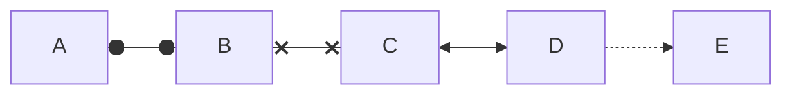

</td>
<td>

<svg xmlns="http://www.w3.org/2000/svg" width="680" height="120" viewBox="0 0 680 120">
  <defs>
    <marker id="arrow" markerWidth="10" markerHeight="10" refX="9" refY="3" orient="auto" markerUnits="strokeWidth">
      <path d="M0,0 L0,6 L9,3 z" fill="#333" />
    </marker>
    <marker id="circle-marker" markerWidth="6" markerHeight="6" refX="3" refY="3" orient="auto" markerUnits="strokeWidth">
      <circle cx="3" cy="3" r="3" fill="#333" />
    </marker>
  </defs>
  <path d="M120,60 L145,60 L170,60" stroke="#333" stroke-width="2" fill="none" marker-end="url(#arrow)" />
  <path d="M250,60 L275,60 L300,60" stroke="#333" stroke-width="2" fill="none" marker-end="url(#arrow)" />
  <path d="M380,60 L405,60 L430,60" stroke="#333" stroke-width="2" fill="none" marker-end="url(#arrow)" />
  <path d="M510,60 L535,60 L560,60" stroke="#333" stroke-width="2" fill="none" stroke-dasharray="5,5" marker-end="url(#arrow)" />
  <g id="A">
    <rect x="40" y="40" width="80" height="40" rx="0" ry="0" stroke="#333" stroke-width="2" fill="#fff" />
    <text x="80" y="60" text-anchor="middle" dominant-baseline="middle" font-family="Arial, sans-serif" font-size="14" fill="#333">A</text>
  </g>
  <g id="B">
    <rect x="170" y="40" width="80" height="40" rx="0" ry="0" stroke="#333" stroke-width="2" fill="#fff" />
    <text x="210" y="60" text-anchor="middle" dominant-baseline="middle" font-family="Arial, sans-serif" font-size="14" fill="#333">B</text>
  </g>
  <g id="C">
    <rect x="300" y="40" width="80" height="40" rx="0" ry="0" stroke="#333" stroke-width="2" fill="#fff" />
    <text x="340" y="60" text-anchor="middle" dominant-baseline="middle" font-family="Arial, sans-serif" font-size="14" fill="#333">C</text>
  </g>
  <g id="D">
    <rect x="430" y="40" width="80" height="40" rx="0" ry="0" stroke="#333" stroke-width="2" fill="#fff" />
    <text x="470" y="60" text-anchor="middle" dominant-baseline="middle" font-family="Arial, sans-serif" font-size="14" fill="#333">D</text>
  </g>
  <g id="E">
    <rect x="560" y="40" width="80" height="40" rx="0" ry="0" stroke="#333" stroke-width="2" fill="#fff" />
    <text x="600" y="60" text-anchor="middle" dominant-baseline="middle" font-family="Arial, sans-serif" font-size="14" fill="#333">E</text>
  </g>
</svg>

</td>
</tr>
</table>

<details>
<summary>View source code</summary>

```
flowchart LR
    A o--o B
    B x--x C
    C <--> D
    D -.-> E
```
</details>

---

## 16. Styling Classes

📄 **Source**: [`styling-classes.mmd`](./valid/styling-classes.mmd)

> CSS class definitions and styling.

### Rendered Output

<table>
<tr>
<th width="50%">Mermaid (Official)</th>
<th width="50%">Maid (Our Renderer)</th>
</tr>
<tr>
<td>

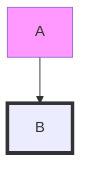

</td>
<td>

<svg xmlns="http://www.w3.org/2000/svg" width="160" height="210" viewBox="0 0 160 210">
  <defs>
    <marker id="arrow" markerWidth="10" markerHeight="10" refX="9" refY="3" orient="auto" markerUnits="strokeWidth">
      <path d="M0,0 L0,6 L9,3 z" fill="#333" />
    </marker>
    <marker id="circle-marker" markerWidth="6" markerHeight="6" refX="3" refY="3" orient="auto" markerUnits="strokeWidth">
      <circle cx="3" cy="3" r="3" fill="#333" />
    </marker>
  </defs>
  <path d="M80,80 L80,105 L80,130" stroke="#333" stroke-width="2" fill="none" marker-end="url(#arrow)" />
  <g id="A">
    <rect x="40" y="40" width="80" height="40" rx="0" ry="0" stroke="#333" stroke-width="2" fill="#fff" />
    <text x="80" y="60" text-anchor="middle" dominant-baseline="middle" font-family="Arial, sans-serif" font-size="14" fill="#333">A</text>
  </g>
  <g id="B">
    <rect x="40" y="130" width="80" height="40" rx="0" ry="0" stroke="#333" stroke-width="2" fill="#fff" />
    <text x="80" y="150" text-anchor="middle" dominant-baseline="middle" font-family="Arial, sans-serif" font-size="14" fill="#333">B</text>
  </g>
</svg>

</td>
</tr>
</table>

<details>
<summary>View source code</summary>

```
flowchart TD
    A:::classA --> B:::classB
    classDef classA fill:#f9f
    classDef classB stroke:#333,stroke-width:4px
```
</details>

---

## 17. Subgraph Quoted Title

📄 **Source**: [`subgraph-quoted-title.mmd`](./valid/subgraph-quoted-title.mmd)

### Rendered Output

<table>
<tr>
<th width="50%">Mermaid (Official)</th>
<th width="50%">Maid (Our Renderer)</th>
</tr>
<tr>
<td>

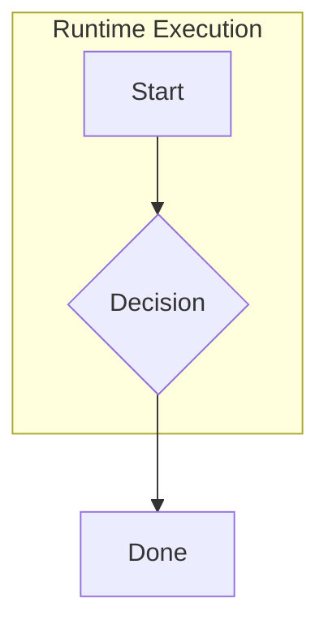

</td>
<td>

<svg xmlns="http://www.w3.org/2000/svg" width="372" height="368" viewBox="0 0 372 368">
  <defs>
    <marker id="arrow" markerWidth="10" markerHeight="10" refX="9" refY="3" orient="auto" markerUnits="strokeWidth">
      <path d="M0,0 L0,6 L9,3 z" fill="#333" />
    </marker>
    <marker id="circle-marker" markerWidth="6" markerHeight="6" refX="3" refY="3" orient="auto" markerUnits="strokeWidth">
      <circle cx="3" cy="3" r="3" fill="#333" />
    </marker>
  </defs>
  <path d="M92,110 L92,165 L92,190" stroke="#333" stroke-width="2" fill="none" marker-end="url(#arrow)" />
  <path d="M92,238 L92,263 L92,288" stroke="#333" stroke-width="2" fill="none" marker-end="url(#arrow)" />
  <g id="A">
    <rect x="52" y="70" width="80" height="40" rx="0" ry="0" stroke="#333" stroke-width="2" fill="#fff" />
    <text x="92" y="90" text-anchor="middle" dominant-baseline="middle" font-family="Arial, sans-serif" font-size="14" fill="#333">Start</text>
  </g>
  <g id="B">
    <polygon points="92,190 144,214 92,238 40,214" stroke="#333" stroke-width="2" fill="#fff" />
    <text x="92" y="214" text-anchor="middle" dominant-baseline="middle" font-family="Arial, sans-serif" font-size="14" fill="#333">B</text>
  </g>
  <g id="C">
    <rect x="52" y="288" width="80" height="40" rx="0" ry="0" stroke="#333" stroke-width="2" fill="#fff" />
    <text x="92" y="308" text-anchor="middle" dominant-baseline="middle" font-family="Arial, sans-serif" font-size="14" fill="#333">Done</text>
  </g>
</svg>

</td>
</tr>
</table>

<details>
<summary>View source code</summary>

```
flowchart TD
  subgraph "Runtime Execution"
    A[Start] --> B{Decision}
  end
  B --> C[Done]


```
</details>

---

## 18. Subgraphs

📄 **Source**: [`subgraphs.mmd`](./valid/subgraphs.mmd)

> Shows subgraph grouping functionality.

### Rendered Output

<table>
<tr>
<th width="50%">Mermaid (Official)</th>
<th width="50%">Maid (Our Renderer)</th>
</tr>
<tr>
<td>

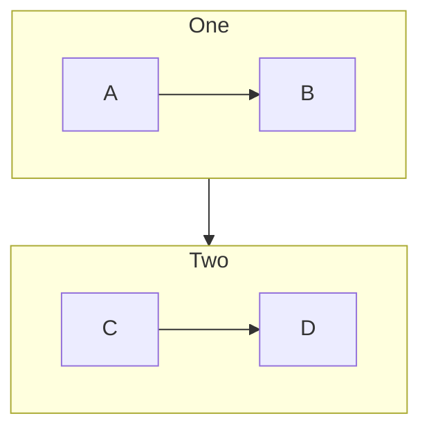

</td>
<td>

<svg xmlns="http://www.w3.org/2000/svg" width="490" height="330" viewBox="0 0 490 330">
  <defs>
    <marker id="arrow" markerWidth="10" markerHeight="10" refX="9" refY="3" orient="auto" markerUnits="strokeWidth">
      <path d="M0,0 L0,6 L9,3 z" fill="#333" />
    </marker>
    <marker id="circle-marker" markerWidth="6" markerHeight="6" refX="3" refY="3" orient="auto" markerUnits="strokeWidth">
      <circle cx="3" cy="3" r="3" fill="#333" />
    </marker>
  </defs>
  <path d="M80,110 L80,165 L80,220" stroke="#333" stroke-width="2" fill="none" marker-end="url(#arrow)" />
  <path d="M210,110 L210,165 L210,220" stroke="#333" stroke-width="2" fill="none" marker-end="url(#arrow)" />
  <path d="M375,140 L375,165 L375,190" stroke="#333" stroke-width="2" fill="none" marker-end="url(#arrow)" />
  <g id="A">
    <rect x="40" y="70" width="80" height="40" rx="0" ry="0" stroke="#333" stroke-width="2" fill="#fff" />
    <text x="80" y="90" text-anchor="middle" dominant-baseline="middle" font-family="Arial, sans-serif" font-size="14" fill="#333">A</text>
  </g>
  <g id="B">
    <rect x="40" y="220" width="80" height="40" rx="0" ry="0" stroke="#333" stroke-width="2" fill="#fff" />
    <text x="80" y="240" text-anchor="middle" dominant-baseline="middle" font-family="Arial, sans-serif" font-size="14" fill="#333">B</text>
  </g>
  <g id="C">
    <rect x="170" y="70" width="80" height="40" rx="0" ry="0" stroke="#333" stroke-width="2" fill="#fff" />
    <text x="210" y="90" text-anchor="middle" dominant-baseline="middle" font-family="Arial, sans-serif" font-size="14" fill="#333">C</text>
  </g>
  <g id="D">
    <rect x="170" y="220" width="80" height="40" rx="0" ry="0" stroke="#333" stroke-width="2" fill="#fff" />
    <text x="210" y="240" text-anchor="middle" dominant-baseline="middle" font-family="Arial, sans-serif" font-size="14" fill="#333">D</text>
  </g>
</svg>

</td>
</tr>
</table>

<details>
<summary>View source code</summary>

```
flowchart TD
    subgraph one[One]
        A --> B
    end
    subgraph two[Two]
        C --> D
    end
    one --> two
```
</details>

---

## 19. Undefined Node

📄 **Source**: [`undefined-node.mmd`](./valid/undefined-node.mmd)

> Auto-creation of nodes when referenced in links.

### Rendered Output

<table>
<tr>
<th width="50%">Mermaid (Official)</th>
<th width="50%">Maid (Our Renderer)</th>
</tr>
<tr>
<td>

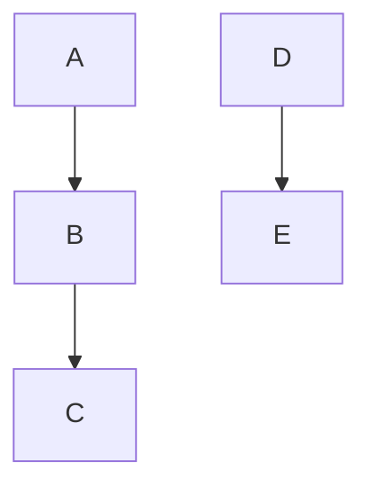

</td>
<td>

<svg xmlns="http://www.w3.org/2000/svg" width="290" height="300" viewBox="0 0 290 300">
  <defs>
    <marker id="arrow" markerWidth="10" markerHeight="10" refX="9" refY="3" orient="auto" markerUnits="strokeWidth">
      <path d="M0,0 L0,6 L9,3 z" fill="#333" />
    </marker>
    <marker id="circle-marker" markerWidth="6" markerHeight="6" refX="3" refY="3" orient="auto" markerUnits="strokeWidth">
      <circle cx="3" cy="3" r="3" fill="#333" />
    </marker>
  </defs>
  <path d="M80,80 L80,105 L80,130" stroke="#333" stroke-width="2" fill="none" marker-end="url(#arrow)" />
  <path d="M80,170 L80,195 L80,220" stroke="#333" stroke-width="2" fill="none" marker-end="url(#arrow)" />
  <path d="M210,80 L210,105 L210,130" stroke="#333" stroke-width="2" fill="none" marker-end="url(#arrow)" />
  <g id="A">
    <rect x="40" y="40" width="80" height="40" rx="0" ry="0" stroke="#333" stroke-width="2" fill="#fff" />
    <text x="80" y="60" text-anchor="middle" dominant-baseline="middle" font-family="Arial, sans-serif" font-size="14" fill="#333">A</text>
  </g>
  <g id="B">
    <rect x="40" y="130" width="80" height="40" rx="0" ry="0" stroke="#333" stroke-width="2" fill="#fff" />
    <text x="80" y="150" text-anchor="middle" dominant-baseline="middle" font-family="Arial, sans-serif" font-size="14" fill="#333">B</text>
  </g>
  <g id="C">
    <rect x="40" y="220" width="80" height="40" rx="0" ry="0" stroke="#333" stroke-width="2" fill="#fff" />
    <text x="80" y="240" text-anchor="middle" dominant-baseline="middle" font-family="Arial, sans-serif" font-size="14" fill="#333">C</text>
  </g>
  <g id="D">
    <rect x="170" y="40" width="80" height="40" rx="0" ry="0" stroke="#333" stroke-width="2" fill="#fff" />
    <text x="210" y="60" text-anchor="middle" dominant-baseline="middle" font-family="Arial, sans-serif" font-size="14" fill="#333">D</text>
  </g>
  <g id="E">
    <rect x="170" y="130" width="80" height="40" rx="0" ry="0" stroke="#333" stroke-width="2" fill="#fff" />
    <text x="210" y="150" text-anchor="middle" dominant-baseline="middle" font-family="Arial, sans-serif" font-size="14" fill="#333">E</text>
  </g>
</svg>

</td>
</tr>
</table>

<details>
<summary>View source code</summary>

```
flowchart TD
    A --> B
    B --> C
    D --> E
```
</details>

---

## 20. Unicode Text

📄 **Source**: [`unicode-text.mmd`](./valid/unicode-text.mmd)

> Unicode characters and emojis in node text.

### Rendered Output

<table>
<tr>
<th width="50%">Mermaid (Official)</th>
<th width="50%">Maid (Our Renderer)</th>
</tr>
<tr>
<td>


</td>
<td>

<svg xmlns="http://www.w3.org/2000/svg" width="420" height="120" viewBox="0 0 420 120">
  <defs>
    <marker id="arrow" markerWidth="10" markerHeight="10" refX="9" refY="3" orient="auto" markerUnits="strokeWidth">
      <path d="M0,0 L0,6 L9,3 z" fill="#333" />
    </marker>
    <marker id="circle-marker" markerWidth="6" markerHeight="6" refX="3" refY="3" orient="auto" markerUnits="strokeWidth">
      <circle cx="3" cy="3" r="3" fill="#333" />
    </marker>
  </defs>
  <path d="M120,60 L145,60 L170,60" stroke="#333" stroke-width="2" fill="none" marker-end="url(#arrow)" />
  <path d="M250,60 L275,60 L300,60" stroke="#333" stroke-width="2" fill="none" marker-end="url(#arrow)" />
  <g id="A">
    <rect x="40" y="40" width="80" height="40" rx="0" ry="0" stroke="#333" stroke-width="2" fill="#fff" />
    <text x="80" y="60" text-anchor="middle" dominant-baseline="middle" font-family="Arial, sans-serif" font-size="14" fill="#333">A</text>
  </g>
  <g id="B">
    <rect x="170" y="40" width="80" height="40" rx="0" ry="0" stroke="#333" stroke-width="2" fill="#fff" />
    <text x="210" y="60" text-anchor="middle" dominant-baseline="middle" font-family="Arial, sans-serif" font-size="14" fill="#333">B</text>
  </g>
  <g id="C">
    <rect x="300" y="40" width="80" height="40" rx="0" ry="0" stroke="#333" stroke-width="2" fill="#fff" />
    <text x="340" y="60" text-anchor="middle" dominant-baseline="middle" font-family="Arial, sans-serif" font-size="14" fill="#333">C</text>
  </g>
</svg>

</td>
</tr>
</table>

<details>
<summary>View source code</summary>

```
flowchart LR
    A[Hello 世界]
    B[Emoji 😀]
    C[Symbols ★☆♦♠]
    A --> B
    B --> C
```
</details>

---

## 21. With Text

📄 **Source**: [`with-text.mmd`](./valid/with-text.mmd)

> Flowchart with text labels and decision nodes.

### Rendered Output

<table>
<tr>
<th width="50%">Mermaid (Official)</th>
<th width="50%">Maid (Our Renderer)</th>
</tr>
<tr>
<td>

```mermaid
flowchart LR
    A[Start Process] --> B{Decision}
    B -->|Yes| C[Do something]
    B -->|No| D[Do something else]
    C --> E[End]
    D --> E
```

</td>
<td>

<svg xmlns="http://www.w3.org/2000/svg" width="662" height="220" viewBox="0 0 662 220">
  <defs>
    <marker id="arrow" markerWidth="10" markerHeight="10" refX="9" refY="3" orient="auto" markerUnits="strokeWidth">
      <path d="M0,0 L0,6 L9,3 z" fill="#333" />
    </marker>
    <marker id="circle-marker" markerWidth="6" markerHeight="6" refX="3" refY="3" orient="auto" markerUnits="strokeWidth">
      <circle cx="3" cy="3" r="3" fill="#333" />
    </marker>
  </defs>
  <path d="M184,105 L209,105 L234,105" stroke="#333" stroke-width="2" fill="none" marker-end="url(#arrow)" />
  <g>
    <path d="M333.4666666666667,81 L375,60 L412,60" stroke="#333" stroke-width="2" fill="none" marker-end="url(#arrow)" />
    <rect x="345" y="50" width="60" height="20" fill="white" opacity="0.9" rx="3" />
    <text x="375" y="60" text-anchor="middle" dominant-baseline="middle" font-family="Arial, sans-serif" font-size="12" fill="#333">Yes</text>
  </g>
  <g>
    <path d="M333.4666666666667,129 L375,150 L412,150" stroke="#333" stroke-width="2" fill="none" marker-end="url(#arrow)" />
    <rect x="345" y="140" width="60" height="20" fill="white" opacity="0.9" rx="3" />
    <text x="375" y="150" text-anchor="middle" dominant-baseline="middle" font-family="Arial, sans-serif" font-size="12" fill="#333">No</text>
  </g>
  <path d="M492,60 L517,60 L553.1111111111111,85" stroke="#333" stroke-width="2" fill="none" marker-end="url(#arrow)" />
  <path d="M492,150 L517,150 L553.1111111111111,125" stroke="#333" stroke-width="2" fill="none" marker-end="url(#arrow)" />
  <g id="A">
    <rect x="40" y="85" width="144" height="40" rx="0" ry="0" stroke="#333" stroke-width="2" fill="#fff" />
    <text x="112" y="105" text-anchor="middle" dominant-baseline="middle" font-family="Arial, sans-serif" font-size="14" fill="#333">Start Process</text>
  </g>
  <g id="B">
    <polygon points="286,81 338,105 286,129 234,105" stroke="#333" stroke-width="2" fill="#fff" />
    <text x="286" y="105" text-anchor="middle" dominant-baseline="middle" font-family="Arial, sans-serif" font-size="14" fill="#333">B</text>
  </g>
  <g id="C">
    <rect x="412" y="40" width="80" height="40" rx="0" ry="0" stroke="#333" stroke-width="2" fill="#fff" />
    <text x="452" y="60" text-anchor="middle" dominant-baseline="middle" font-family="Arial, sans-serif" font-size="14" fill="#333">C</text>
  </g>
  <g id="D">
    <rect x="412" y="130" width="80" height="40" rx="0" ry="0" stroke="#333" stroke-width="2" fill="#fff" />
    <text x="452" y="150" text-anchor="middle" dominant-baseline="middle" font-family="Arial, sans-serif" font-size="14" fill="#333">D</text>
  </g>
  <g id="E">
    <rect x="542" y="85" width="80" height="40" rx="0" ry="0" stroke="#333" stroke-width="2" fill="#fff" />
    <text x="582" y="105" text-anchor="middle" dominant-baseline="middle" font-family="Arial, sans-serif" font-size="14" fill="#333">E</text>
  </g>
</svg>

</td>
</tr>
</table>

<details>
<summary>View source code</summary>

```
flowchart LR
    A[Start Process] --> B{Decision}
    B -->|Yes| C[Do something]
    B -->|No| D[Do something else]
    C --> E[End]
    D --> E
```
</details>

---

## Validation Status

All diagrams in this file have been validated against:
- ✅ Our Mermaid linter
- ✅ Official mermaid-cli
- ✅ GitHub's Mermaid renderer

Generated by scripts/generate-preview.js (deterministic output)

## How to Regenerate

```bash
node scripts/generate-preview.js flowchart
```
