# Valid Flowchart Diagrams

This file contains all valid flowchart test fixtures rendered with both Mermaid and our Maid renderer.

> **Note**: This file is auto-generated by `scripts/generate-previews.js`. Do not edit manually.

## Renderer Comparison

| Renderer | Description |
|----------|-------------|
| **Mermaid** | Official Mermaid.js renderer (GitHub/mermaid-cli) |
| **Maid** | Our experimental renderer (only for supported types) |

## Table of Contents

1. [br in label](#1-br-in-label)
2. [chained connections](#2-chained-connections)
3. [comments](#3-comments)
4. [complex shapes](#4-complex-shapes)
5. [custom auth subgraph](#5-custom-auth-subgraph)
6. [duplicate subgraph](#6-duplicate-subgraph)
7. [empty diagram](#7-empty-diagram)
8. [link styles](#8-link-styles)
9. [long text](#9-long-text)
10. [mismatched quotes](#10-mismatched-quotes)
11. [multidirectional arrows](#11-multidirectional-arrows)
12. [nested subgraphs lr](#12-nested-subgraphs-lr)
13. [nested subgraphs](#13-nested-subgraphs)
14. [node ids special](#14-node-ids-special)
15. [node to subgraph](#15-node-to-subgraph)
16. [only nodes](#16-only-nodes)
17. [quotes single inside double](#17-quotes-single-inside-double)
18. [simple flow](#18-simple-flow)
19. [special arrows](#19-special-arrows)
20. [special chars](#20-special-chars)
21. [styling classes](#21-styling-classes)
22. [subgraph quoted title](#22-subgraph-quoted-title)
23. [subgraph to node](#23-subgraph-to-node)
24. [subgraph to subgraph lr](#24-subgraph-to-subgraph-lr)
25. [subgraph to subgraph](#25-subgraph-to-subgraph)
26. [subgraphs](#26-subgraphs)
27. [undefined node](#27-undefined-node)
28. [unicode text](#28-unicode-text)
29. [with text](#29-with-text)

---

## 1. Br In Label

📄 **Source**: [`br-in-label.mmd`](./valid/br-in-label.mmd)

### Rendered Output

<table>
<tr>
<th width="50%">Mermaid (Official)</th>
<th width="50%">Maid (Experimental)</th>
</tr>
<tr>
<td>

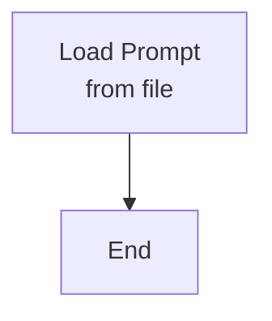

</td>
<td>

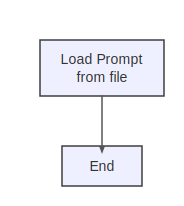

</td>
</tr>
</table>

<details>
<summary>View source code</summary>

```
flowchart TD
    A[Load Prompt<br/>from file] --> B[End]


```
</details>

---

## 2. Chained Connections

📄 **Source**: [`chained-connections.mmd`](./valid/chained-connections.mmd)

### Rendered Output

<table>
<tr>
<th width="50%">Mermaid (Official)</th>
<th width="50%">Maid (Experimental)</th>
</tr>
<tr>
<td>

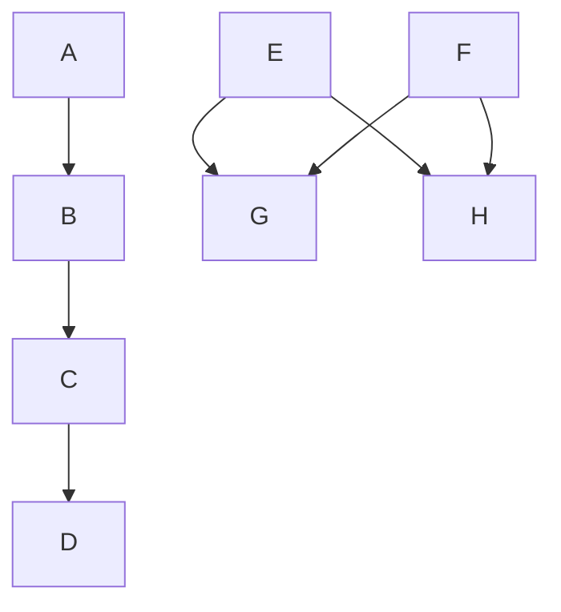

</td>
<td>


</td>
</tr>
</table>

<details>
<summary>View source code</summary>

```
flowchart TD
    A --> B --> C --> D
    E & F --> G & H
```
</details>

---

## 3. Comments

📄 **Source**: [`comments.mmd`](./valid/comments.mmd)

### Rendered Output

<table>
<tr>
<th width="50%">Mermaid (Official)</th>
<th width="50%">Maid (Experimental)</th>
</tr>
<tr>
<td>

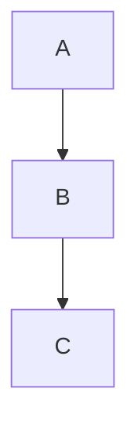

</td>
<td>


</td>
</tr>
</table>

<details>
<summary>View source code</summary>

```
flowchart TD
    %% This is a comment
    A --> B
    %% Another comment
    B --> C
```
</details>

---

## 4. Complex Shapes

📄 **Source**: [`complex-shapes.mmd`](./valid/complex-shapes.mmd)

### Rendered Output

<table>
<tr>
<th width="50%">Mermaid (Official)</th>
<th width="50%">Maid (Experimental)</th>
</tr>
<tr>
<td>


</td>
<td>


</td>
</tr>
</table>

<details>
<summary>View source code</summary>

```
flowchart TB
    A[Rectangle] --> B((Circle))
    B --> C{Diamond}
    C -->|Link 1| D([Stadium])
    C -->|Link 2| E[[Subroutine]]
    D --> F[(Database)]
    E --> F
    F --> H{{Hexagon}}
    F --> G[/Parallelogram/]
    G --> H[\Parallelogram Alt\]
    H --> I[/Trapezoid\]
    I --> J[\Trapezoid Alt/]

```
</details>

---

## 5. Custom Auth Subgraph

📄 **Source**: [`custom-auth-subgraph.mmd`](./valid/custom-auth-subgraph.mmd)

### Rendered Output

<table>
<tr>
<th width="50%">Mermaid (Official)</th>
<th width="50%">Maid (Experimental)</th>
</tr>
<tr>
<td>

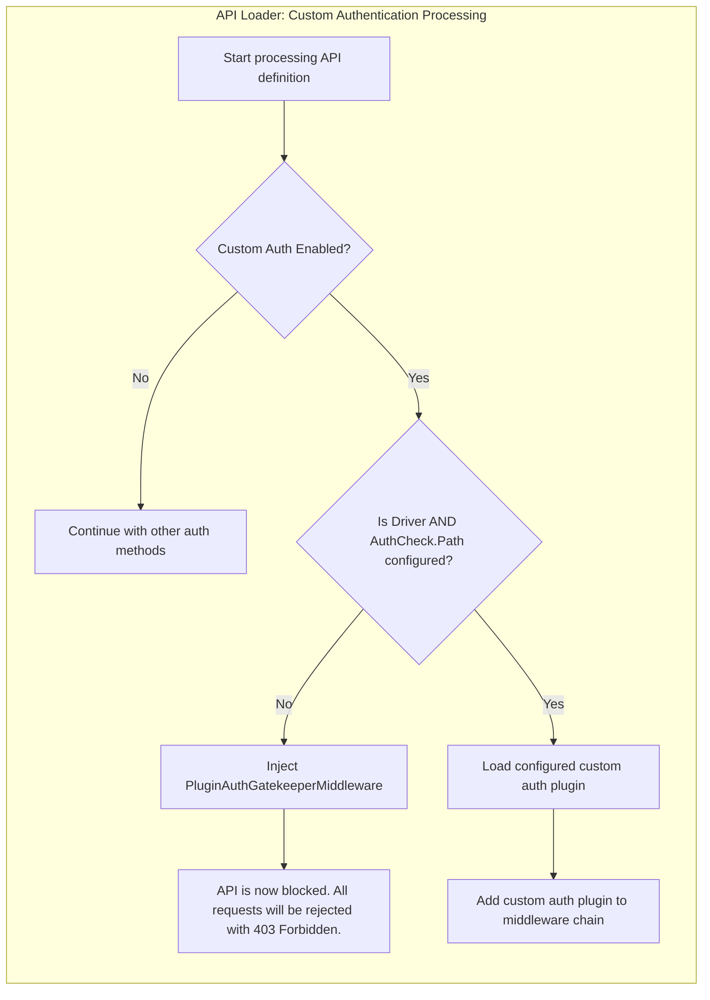

</td>
<td>


</td>
</tr>
</table>

<details>
<summary>View source code</summary>

```
flowchart TD
    subgraph API_Loader_Custom_Authentication_Processing[API Loader: Custom Authentication Processing]
        direction TB
        A[Start processing API definition] --> B{Custom Auth Enabled?}
        B -- No --> C[Continue with other auth methods]
        B -- Yes --> D{Is Driver AND AuthCheck.Path configured?}
        D -- No --> E[Inject PluginAuthGatekeeperMiddleware]
        E --> F[API is now blocked. All requests will be rejected with 403 Forbidden.]
        D -- Yes --> G[Load configured custom auth plugin]
        G --> H[Add custom auth plugin to middleware chain]
    end

```
</details>

---

## 6. Duplicate Subgraph

📄 **Source**: [`duplicate-subgraph.mmd`](./valid/duplicate-subgraph.mmd)

### Rendered Output

<table>
<tr>
<th width="50%">Mermaid (Official)</th>
<th width="50%">Maid (Experimental)</th>
</tr>
<tr>
<td>

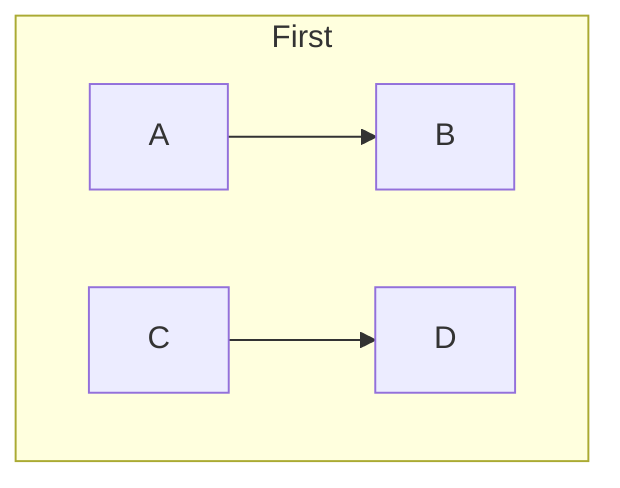

</td>
<td>


</td>
</tr>
</table>

<details>
<summary>View source code</summary>

```
flowchart TD
    subgraph same[First]
        A --> B
    end
    subgraph same[Second]
        C --> D
    end
```
</details>

---

## 7. Empty Diagram

📄 **Source**: [`empty-diagram.mmd`](./valid/empty-diagram.mmd)

### Rendered Output

<table>
<tr>
<th width="50%">Mermaid (Official)</th>
<th width="50%">Maid (Experimental)</th>
</tr>
<tr>
<td>

```mermaid
flowchart TD


```

</td>
<td>


</td>
</tr>
</table>

<details>
<summary>View source code</summary>

```
flowchart TD


```
</details>

---

## 8. Link Styles

📄 **Source**: [`link-styles.mmd`](./valid/link-styles.mmd)

### Rendered Output

<table>
<tr>
<th width="50%">Mermaid (Official)</th>
<th width="50%">Maid (Experimental)</th>
</tr>
<tr>
<td>

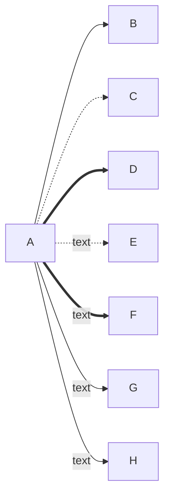

</td>
<td>


</td>
</tr>
</table>

<details>
<summary>View source code</summary>

```
flowchart LR
    A --> B
    A -.-> C
    A ==> D
    A -.text.-> E
    A ==text==> F
    A -- text --> G
    A -->|text| H
```
</details>

---

## 9. Long Text

📄 **Source**: [`long-text.mmd`](./valid/long-text.mmd)

### Rendered Output

<table>
<tr>
<th width="50%">Mermaid (Official)</th>
<th width="50%">Maid (Experimental)</th>
</tr>
<tr>
<td>

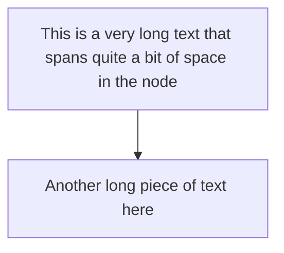

</td>
<td>


</td>
</tr>
</table>

<details>
<summary>View source code</summary>

```
flowchart TD
    A[This is a very long text that spans quite a bit of space in the node] --> B[Another long piece of text here]
```
</details>

---

## 10. Mismatched Quotes

📄 **Source**: [`mismatched-quotes.mmd`](./valid/mismatched-quotes.mmd)

### Rendered Output

<table>
<tr>
<th width="50%">Mermaid (Official)</th>
<th width="50%">Maid (Experimental)</th>
</tr>
<tr>
<td>

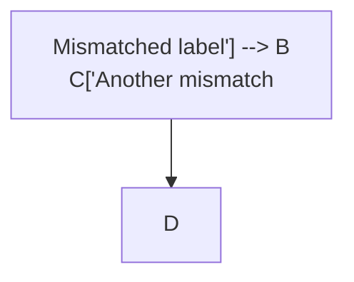

</td>
<td>


</td>
</tr>
</table>

<details>
<summary>View source code</summary>

```
flowchart TD
  A["Mismatched label'] --> B
  C['Another mismatch"] --> D


```
</details>

---

## 11. Multidirectional Arrows

📄 **Source**: [`multidirectional-arrows.mmd`](./valid/multidirectional-arrows.mmd)

### Rendered Output

<table>
<tr>
<th width="50%">Mermaid (Official)</th>
<th width="50%">Maid (Experimental)</th>
</tr>
<tr>
<td>

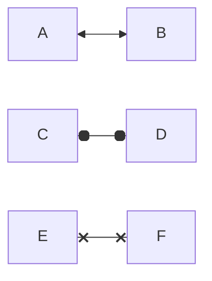

</td>
<td>


</td>
</tr>
</table>

<details>
<summary>View source code</summary>

```
flowchart LR
    A <--> B
    C o--o D
    E x--x F
```
</details>

---

## 12. Nested Subgraphs Lr

📄 **Source**: [`nested-subgraphs-lr.mmd`](./valid/nested-subgraphs-lr.mmd)

### Rendered Output

<table>
<tr>
<th width="50%">Mermaid (Official)</th>
<th width="50%">Maid (Experimental)</th>
</tr>
<tr>
<td>

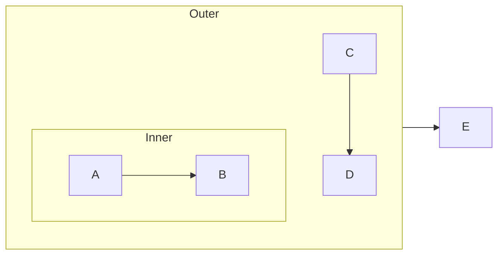

</td>
<td>

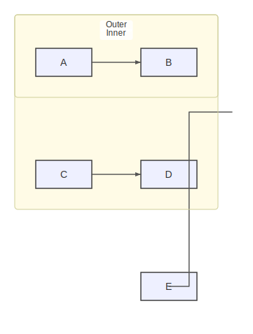

</td>
</tr>
</table>

<details>
<summary>View source code</summary>

```
flowchart LR
    subgraph outer[Outer]
        subgraph inner[Inner]
            A --> B
        end
        C --> D
    end
    outer --> E


```
</details>

---

## 13. Nested Subgraphs

📄 **Source**: [`nested-subgraphs.mmd`](./valid/nested-subgraphs.mmd)

### Rendered Output

<table>
<tr>
<th width="50%">Mermaid (Official)</th>
<th width="50%">Maid (Experimental)</th>
</tr>
<tr>
<td>

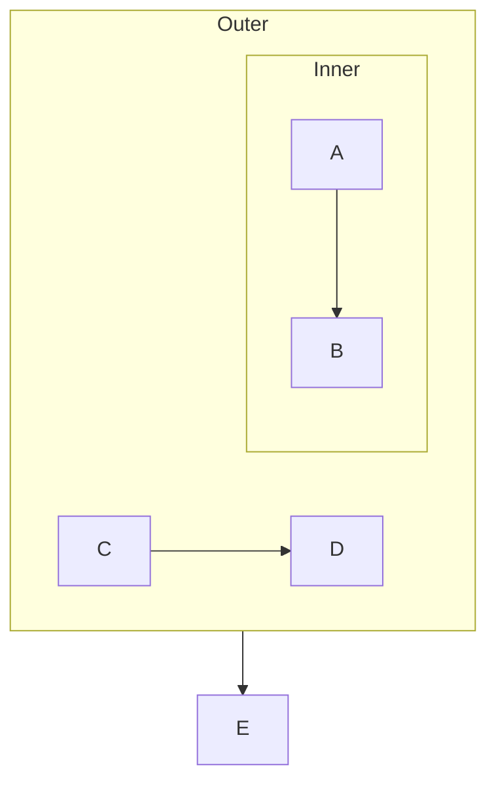

</td>
<td>


</td>
</tr>
</table>

<details>
<summary>View source code</summary>

```
flowchart TD
    subgraph outer[Outer]
        subgraph inner[Inner]
            A --> B
        end
        C --> D
    end
    outer --> E
```
</details>

---

## 14. Node Ids Special

📄 **Source**: [`node-ids-special.mmd`](./valid/node-ids-special.mmd)

### Rendered Output

<table>
<tr>
<th width="50%">Mermaid (Official)</th>
<th width="50%">Maid (Experimental)</th>
</tr>
<tr>
<td>

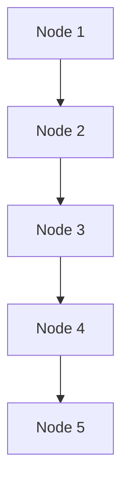

</td>
<td>


</td>
</tr>
</table>

<details>
<summary>View source code</summary>

```
flowchart TD
    id1[Node 1]
    id-2[Node 2]
    id_3[Node 3]
    ID4[Node 4]
    _id5[Node 5]
    id1 --> id-2
    id-2 --> id_3
    id_3 --> ID4
    ID4 --> _id5
```
</details>

---

## 15. Node To Subgraph

📄 **Source**: [`node-to-subgraph.mmd`](./valid/node-to-subgraph.mmd)

### Rendered Output

<table>
<tr>
<th width="50%">Mermaid (Official)</th>
<th width="50%">Maid (Experimental)</th>
</tr>
<tr>
<td>

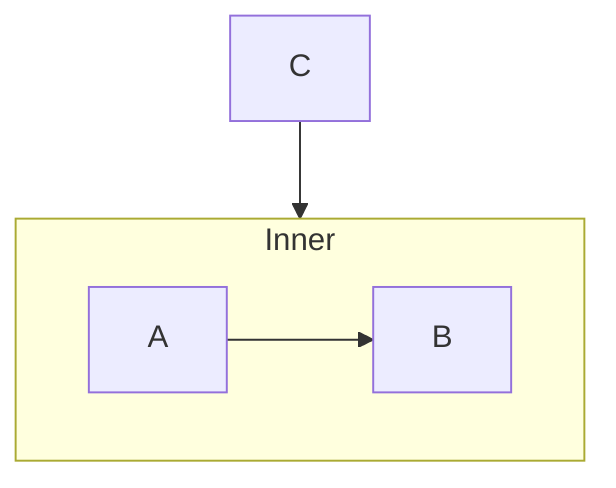

</td>
<td>

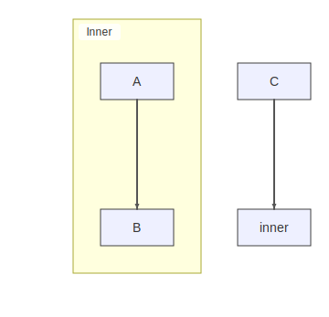

</td>
</tr>
</table>

<details>
<summary>View source code</summary>

```
flowchart TD
  subgraph inner[Inner]
    A --> B
  end
  C --> inner


```
</details>

---

## 16. Only Nodes

📄 **Source**: [`only-nodes.mmd`](./valid/only-nodes.mmd)

### Rendered Output

<table>
<tr>
<th width="50%">Mermaid (Official)</th>
<th width="50%">Maid (Experimental)</th>
</tr>
<tr>
<td>

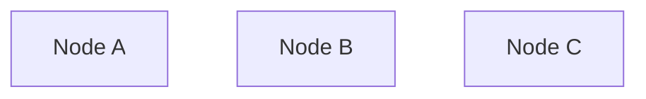

</td>
<td>


</td>
</tr>
</table>

<details>
<summary>View source code</summary>

```
flowchart TD
    A[Node A]
    B[Node B]
    C[Node C]
```
</details>

---

## 17. Quotes Single Inside Double

📄 **Source**: [`quotes-single-inside-double.mmd`](./valid/quotes-single-inside-double.mmd)

### Rendered Output

<table>
<tr>
<th width="50%">Mermaid (Official)</th>
<th width="50%">Maid (Experimental)</th>
</tr>
<tr>
<td>

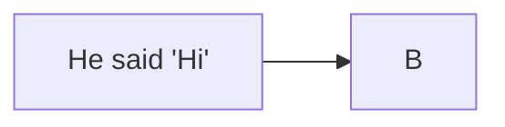

</td>
<td>


</td>
</tr>
</table>

<details>
<summary>View source code</summary>

```
flowchart LR
  A["He said 'Hi'"] --> B


```
</details>

---

## 18. Simple Flow

📄 **Source**: [`simple-flow.mmd`](./valid/simple-flow.mmd)

### Rendered Output

<table>
<tr>
<th width="50%">Mermaid (Official)</th>
<th width="50%">Maid (Experimental)</th>
</tr>
<tr>
<td>

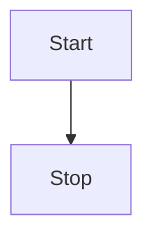

</td>
<td>


</td>
</tr>
</table>

<details>
<summary>View source code</summary>

```
flowchart TD
    Start --> Stop
```
</details>

---

## 19. Special Arrows

📄 **Source**: [`special-arrows.mmd`](./valid/special-arrows.mmd)

### Rendered Output

<table>
<tr>
<th width="50%">Mermaid (Official)</th>
<th width="50%">Maid (Experimental)</th>
</tr>
<tr>
<td>

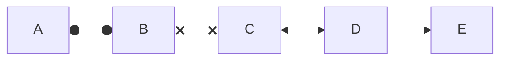

</td>
<td>


</td>
</tr>
</table>

<details>
<summary>View source code</summary>

```
flowchart LR
    A o--o B
    B x--x C
    C <--> D
    D -.-> E
```
</details>

---

## 20. Special Chars

📄 **Source**: [`special-chars.mmd`](./valid/special-chars.mmd)

### Rendered Output

<table>
<tr>
<th width="50%">Mermaid (Official)</th>
<th width="50%">Maid (Experimental)</th>
</tr>
<tr>
<td>

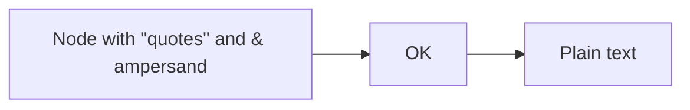

</td>
<td>

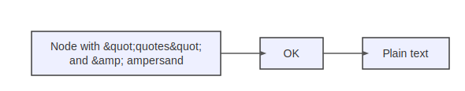

</td>
</tr>
</table>

<details>
<summary>View source code</summary>

```
flowchart LR
    A["Node with &quot;quotes&quot; and &amp; ampersand"] --> B["OK"]
    B --> C[Plain text]

```
</details>

---

## 21. Styling Classes

📄 **Source**: [`styling-classes.mmd`](./valid/styling-classes.mmd)

### Rendered Output

<table>
<tr>
<th width="50%">Mermaid (Official)</th>
<th width="50%">Maid (Experimental)</th>
</tr>
<tr>
<td>

```mermaid
flowchart TD
    A:::classA --> B:::classB
    classDef classA fill:#f9f
    classDef classB stroke:#333,stroke-width:4px
```

</td>
<td>


</td>
</tr>
</table>

<details>
<summary>View source code</summary>

```
flowchart TD
    A:::classA --> B:::classB
    classDef classA fill:#f9f
    classDef classB stroke:#333,stroke-width:4px
```
</details>

---

## 22. Subgraph Quoted Title

📄 **Source**: [`subgraph-quoted-title.mmd`](./valid/subgraph-quoted-title.mmd)

### Rendered Output

<table>
<tr>
<th width="50%">Mermaid (Official)</th>
<th width="50%">Maid (Experimental)</th>
</tr>
<tr>
<td>

```mermaid
flowchart TD
  subgraph "Runtime Execution"
    A[Start] --> B{Decision}
  end
  B --> C[Done]


```

</td>
<td>


</td>
</tr>
</table>

<details>
<summary>View source code</summary>

```
flowchart TD
  subgraph "Runtime Execution"
    A[Start] --> B{Decision}
  end
  B --> C[Done]


```
</details>

---

## 23. Subgraph To Node

📄 **Source**: [`subgraph-to-node.mmd`](./valid/subgraph-to-node.mmd)

### Rendered Output

<table>
<tr>
<th width="50%">Mermaid (Official)</th>
<th width="50%">Maid (Experimental)</th>
</tr>
<tr>
<td>

```mermaid
flowchart TD
  subgraph outer[Outer]
    A --> B
  end
  outer --> C


```

</td>
<td>

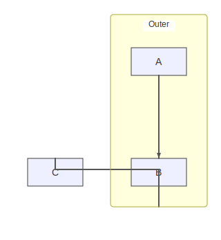

</td>
</tr>
</table>

<details>
<summary>View source code</summary>

```
flowchart TD
  subgraph outer[Outer]
    A --> B
  end
  outer --> C


```
</details>

---

## 24. Subgraph To Subgraph Lr

📄 **Source**: [`subgraph-to-subgraph-lr.mmd`](./valid/subgraph-to-subgraph-lr.mmd)

### Rendered Output

<table>
<tr>
<th width="50%">Mermaid (Official)</th>
<th width="50%">Maid (Experimental)</th>
</tr>
<tr>
<td>

```mermaid
flowchart LR
  subgraph A1[Group A]
    A --> B
  end
  subgraph B1[Group B]
    C --> D
  end
  A1 --> B1


```

</td>
<td>

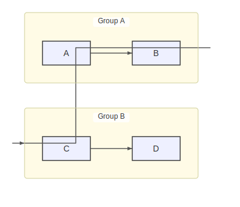

</td>
</tr>
</table>

<details>
<summary>View source code</summary>

```
flowchart LR
  subgraph A1[Group A]
    A --> B
  end
  subgraph B1[Group B]
    C --> D
  end
  A1 --> B1


```
</details>

---

## 25. Subgraph To Subgraph

📄 **Source**: [`subgraph-to-subgraph.mmd`](./valid/subgraph-to-subgraph.mmd)

### Rendered Output

<table>
<tr>
<th width="50%">Mermaid (Official)</th>
<th width="50%">Maid (Experimental)</th>
</tr>
<tr>
<td>

```mermaid
flowchart TD
  subgraph A1[Group A]
    A --> B
  end
  subgraph B1[Group B]
    C --> D
  end
  A1 --> B1


```

</td>
<td>

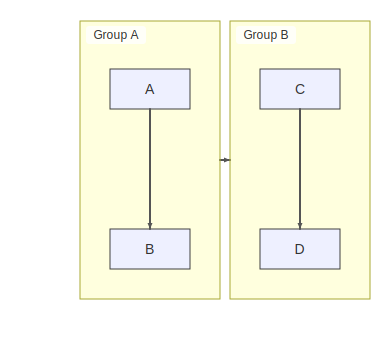

</td>
</tr>
</table>

<details>
<summary>View source code</summary>

```
flowchart TD
  subgraph A1[Group A]
    A --> B
  end
  subgraph B1[Group B]
    C --> D
  end
  A1 --> B1


```
</details>

---

## 26. Subgraphs

📄 **Source**: [`subgraphs.mmd`](./valid/subgraphs.mmd)

### Rendered Output

<table>
<tr>
<th width="50%">Mermaid (Official)</th>
<th width="50%">Maid (Experimental)</th>
</tr>
<tr>
<td>

```mermaid
flowchart TD
    subgraph one[One]
        A --> B
    end
    subgraph two[Two]
        C --> D
    end
    one --> two
```

</td>
<td>


</td>
</tr>
</table>

<details>
<summary>View source code</summary>

```
flowchart TD
    subgraph one[One]
        A --> B
    end
    subgraph two[Two]
        C --> D
    end
    one --> two
```
</details>

---

## 27. Undefined Node

📄 **Source**: [`undefined-node.mmd`](./valid/undefined-node.mmd)

### Rendered Output

<table>
<tr>
<th width="50%">Mermaid (Official)</th>
<th width="50%">Maid (Experimental)</th>
</tr>
<tr>
<td>

```mermaid
flowchart TD
    A --> B
    B --> C
    D --> E
```

</td>
<td>


</td>
</tr>
</table>

<details>
<summary>View source code</summary>

```
flowchart TD
    A --> B
    B --> C
    D --> E
```
</details>

---

## 28. Unicode Text

📄 **Source**: [`unicode-text.mmd`](./valid/unicode-text.mmd)

### Rendered Output

<table>
<tr>
<th width="50%">Mermaid (Official)</th>
<th width="50%">Maid (Experimental)</th>
</tr>
<tr>
<td>

```mermaid
flowchart LR
    A[Hello 世界]
    B[Emoji 😀]
    C[Symbols ★☆♦♠]
    A --> B
    B --> C
```

</td>
<td>


</td>
</tr>
</table>

<details>
<summary>View source code</summary>

```
flowchart LR
    A[Hello 世界]
    B[Emoji 😀]
    C[Symbols ★☆♦♠]
    A --> B
    B --> C
```
</details>

---

## 29. With Text

📄 **Source**: [`with-text.mmd`](./valid/with-text.mmd)

### Rendered Output

<table>
<tr>
<th width="50%">Mermaid (Official)</th>
<th width="50%">Maid (Experimental)</th>
</tr>
<tr>
<td>

```mermaid
flowchart LR
    A[Start Process] --> B{Decision}
    B -->|Yes| C[Do something]
    B -->|No| D[Do something else]
    C --> E[End]
    D --> E
```

</td>
<td>


</td>
</tr>
</table>

<details>
<summary>View source code</summary>

```
flowchart LR
    A[Start Process] --> B{Decision}
    B -->|Yes| C[Do something]
    B -->|No| D[Do something else]
    C --> E[End]
    D --> E
```
</details>

---

