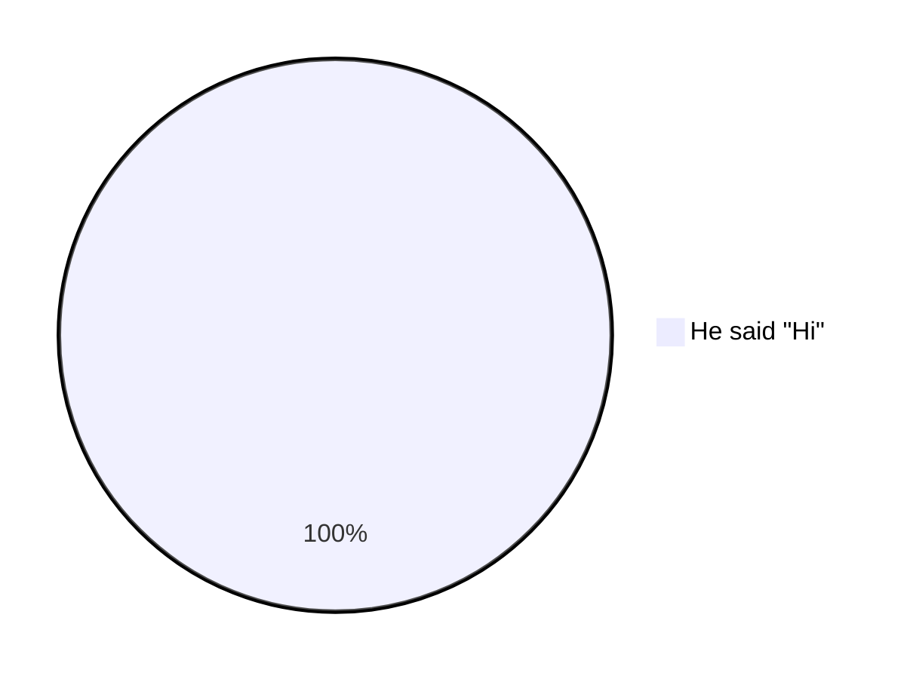

# Invalid Pie Diagrams

This file contains invalid pie test fixtures with:
- GitHub render attempts
- Error from mermaid-cli
- Error/output from our linter

> Note: Auto-generated by `scripts/generate-invalid-preview.js`. Do not edit manually.

## Table of Contents

1. [Colon Only](#1-colon-only)
2. [Double In Double](#2-double-in-double)
3. [Escaped Quotes](#3-escaped-quotes)
4. [Invalid Header](#4-invalid-header)
5. [Missing Colon](#5-missing-colon)
6. [Missing Label](#6-missing-label)
7. [Missing Number](#7-missing-number)
8. [Unclosed Quote](#8-unclosed-quote)

---

## Summary

| # | Diagram | mermaid-cli | maid | Auto-fix? |
|---:|---|:---:|:---:|:---:|
| 1 | [Colon Only](#1-colon-only) | INVALID | INVALID | — |
| 2 | [Double In Double](#2-double-in-double) | INVALID | INVALID | — |
| 3 | [Escaped Quotes](#3-escaped-quotes) | VALID | INVALID | — |
| 4 | [Invalid Header](#4-invalid-header) | INVALID | INVALID | — |
| 5 | [Missing Colon](#5-missing-colon) | INVALID | INVALID | — |
| 6 | [Missing Label](#6-missing-label) | INVALID | INVALID | — |
| 7 | [Missing Number](#7-missing-number) | INVALID | INVALID | — |
| 8 | [Unclosed Quote](#8-unclosed-quote) | INVALID | INVALID | — |

---

## 1. Colon Only

📄 **Source**: [`colon-only.mmd`](./invalid/colon-only.mmd)

### GitHub Render Attempt

> **Note**: This invalid diagram may not render or may render incorrectly.


### mermaid-cli Result: INVALID

```
Syntax error in text
```

### maid Result: INVALID

```
file://node_modules/chevrotain/lib/src/parse/parser/parser.js:140
                throw new Error(`Parser Definition Errors detected:\n ${defErrorsMsgs.join("\n-------------------------------\n")}`);
                      ^

Error: Parser Definition Errors detected:
 ->OPTION<-
appears more than once (2 times) in the top level rule: ->stateDecl<-.
For further details see: https://chevrotain.io/docs/FAQ.html#NUMERICAL_SUFFIXES

-------------------------------
Ambiguous alternatives: <3 ,4> due to common lookahead prefix
in <OR> inside <statement> Rule,
<StateKw, Identifier> may appears as a prefix path in all these alternatives.
See: https://chevrotain.io/docs/guide/resolving_grammar_errors.html#COMMON_PREFIX
For Further details.
    at file://node_modules/chevrotain/lib/src/parse/parser/parser.js:140:23
    at StateParser.TRACE_INIT (file://node_modules/chevrotain/lib/src/parse/parser/traits/perf_tracer.js:44:20)
    at StateParser.performSelfAnalysis (file://node_modules/chevrotain/lib/src/parse/parser/parser.js:66:14)
    at new StateParser (file://out/diagrams/state/parser.js:140:14)
    at file://out/diagrams/state/parser.js:143:31
    at ModuleJob.run (node:internal/modules/esm/module_job:371:25)
    at async onImport.tracePromise.__proto__ (node:internal/modules/esm/loader:683:26)
    at async asyncRunEntryPointWithESMLoader (node:internal/modules/run_main:101:5)

Node.js v24.7.0
```

### maid Auto-fix (`--fix`) Preview

No auto-fix changes (safe level).

### maid Auto-fix (`--fix=all`) Preview

No auto-fix changes (all level).

<details>
<summary>View source code</summary>

```
pie
  :


```
</details>

---

## 2. Double In Double

📄 **Source**: [`double-in-double.mmd`](./invalid/double-in-double.mmd)

### GitHub Render Attempt

> **Note**: This invalid diagram may not render or may render incorrectly.


### mermaid-cli Result: INVALID

```
Syntax error in text
```

### maid Result: INVALID

```
file://node_modules/chevrotain/lib/src/parse/parser/parser.js:140
                throw new Error(`Parser Definition Errors detected:\n ${defErrorsMsgs.join("\n-------------------------------\n")}`);
                      ^

Error: Parser Definition Errors detected:
 ->OPTION<-
appears more than once (2 times) in the top level rule: ->stateDecl<-.
For further details see: https://chevrotain.io/docs/FAQ.html#NUMERICAL_SUFFIXES

-------------------------------
Ambiguous alternatives: <3 ,4> due to common lookahead prefix
in <OR> inside <statement> Rule,
<StateKw, Identifier> may appears as a prefix path in all these alternatives.
See: https://chevrotain.io/docs/guide/resolving_grammar_errors.html#COMMON_PREFIX
For Further details.
    at file://node_modules/chevrotain/lib/src/parse/parser/parser.js:140:23
    at StateParser.TRACE_INIT (file://node_modules/chevrotain/lib/src/parse/parser/traits/perf_tracer.js:44:20)
    at StateParser.performSelfAnalysis (file://node_modules/chevrotain/lib/src/parse/parser/parser.js:66:14)
    at new StateParser (file://out/diagrams/state/parser.js:140:14)
    at file://out/diagrams/state/parser.js:143:31
    at ModuleJob.run (node:internal/modules/esm/module_job:371:25)
    at async onImport.tracePromise.__proto__ (node:internal/modules/esm/loader:683:26)
    at async asyncRunEntryPointWithESMLoader (node:internal/modules/run_main:101:5)

Node.js v24.7.0
```

### maid Auto-fix (`--fix`) Preview

No auto-fix changes (safe level).

### maid Auto-fix (`--fix=all`) Preview

No auto-fix changes (all level).

<details>
<summary>View source code</summary>

```
pie
  "He said "Hi"" : 1


```
</details>

---

## 3. Escaped Quotes

📄 **Source**: [`escaped-quotes.mmd`](./invalid/escaped-quotes.mmd)

### GitHub Render Attempt

> **Note**: This invalid diagram may not render or may render incorrectly.



### mermaid-cli Result: VALID

### maid Result: INVALID

```
file://node_modules/chevrotain/lib/src/parse/parser/parser.js:140
                throw new Error(`Parser Definition Errors detected:\n ${defErrorsMsgs.join("\n-------------------------------\n")}`);
                      ^

Error: Parser Definition Errors detected:
 ->OPTION<-
appears more than once (2 times) in the top level rule: ->stateDecl<-.
For further details see: https://chevrotain.io/docs/FAQ.html#NUMERICAL_SUFFIXES

-------------------------------
Ambiguous alternatives: <3 ,4> due to common lookahead prefix
in <OR> inside <statement> Rule,
<StateKw, Identifier> may appears as a prefix path in all these alternatives.
See: https://chevrotain.io/docs/guide/resolving_grammar_errors.html#COMMON_PREFIX
For Further details.
    at file://node_modules/chevrotain/lib/src/parse/parser/parser.js:140:23
    at StateParser.TRACE_INIT (file://node_modules/chevrotain/lib/src/parse/parser/traits/perf_tracer.js:44:20)
    at StateParser.performSelfAnalysis (file://node_modules/chevrotain/lib/src/parse/parser/parser.js:66:14)
    at new StateParser (file://out/diagrams/state/parser.js:140:14)
    at file://out/diagrams/state/parser.js:143:31
    at ModuleJob.run (node:internal/modules/esm/module_job:371:25)
    at async onImport.tracePromise.__proto__ (node:internal/modules/esm/loader:683:26)
    at async asyncRunEntryPointWithESMLoader (node:internal/modules/run_main:101:5)

Node.js v24.7.0
```

### maid Auto-fix (`--fix`) Preview

No auto-fix changes (safe level).

### maid Auto-fix (`--fix=all`) Preview

No auto-fix changes (all level).

<details>
<summary>View source code</summary>

```
pie
  "He said \"Hi\"" : 1


```
</details>

---

## 4. Invalid Header

📄 **Source**: [`invalid-header.mmd`](./invalid/invalid-header.mmd)

### GitHub Render Attempt

> **Note**: This invalid diagram may not render or may render incorrectly.


### mermaid-cli Result: INVALID

```
Syntax error in text
```

### maid Result: INVALID

```
file://node_modules/chevrotain/lib/src/parse/parser/parser.js:140
                throw new Error(`Parser Definition Errors detected:\n ${defErrorsMsgs.join("\n-------------------------------\n")}`);
                      ^

Error: Parser Definition Errors detected:
 ->OPTION<-
appears more than once (2 times) in the top level rule: ->stateDecl<-.
For further details see: https://chevrotain.io/docs/FAQ.html#NUMERICAL_SUFFIXES

-------------------------------
Ambiguous alternatives: <3 ,4> due to common lookahead prefix
in <OR> inside <statement> Rule,
<StateKw, Identifier> may appears as a prefix path in all these alternatives.
See: https://chevrotain.io/docs/guide/resolving_grammar_errors.html#COMMON_PREFIX
For Further details.
    at file://node_modules/chevrotain/lib/src/parse/parser/parser.js:140:23
    at StateParser.TRACE_INIT (file://node_modules/chevrotain/lib/src/parse/parser/traits/perf_tracer.js:44:20)
    at StateParser.performSelfAnalysis (file://node_modules/chevrotain/lib/src/parse/parser/parser.js:66:14)
    at new StateParser (file://out/diagrams/state/parser.js:140:14)
    at file://out/diagrams/state/parser.js:143:31
    at ModuleJob.run (node:internal/modules/esm/module_job:371:25)
    at async onImport.tracePromise.__proto__ (node:internal/modules/esm/loader:683:26)
    at async asyncRunEntryPointWithESMLoader (node:internal/modules/run_main:101:5)

Node.js v24.7.0
```

### maid Auto-fix (`--fix`) Preview

No auto-fix changes (safe level).

### maid Auto-fix (`--fix=all`) Preview

No auto-fix changes (all level).

<details>
<summary>View source code</summary>

```
piee
  "Dogs" : 10


```
</details>

---

## 5. Missing Colon

📄 **Source**: [`missing-colon.mmd`](./invalid/missing-colon.mmd)

### GitHub Render Attempt

> **Note**: This invalid diagram may not render or may render incorrectly.


### mermaid-cli Result: INVALID

```
Syntax error in text
```

### maid Result: INVALID

```
file://node_modules/chevrotain/lib/src/parse/parser/parser.js:140
                throw new Error(`Parser Definition Errors detected:\n ${defErrorsMsgs.join("\n-------------------------------\n")}`);
                      ^

Error: Parser Definition Errors detected:
 ->OPTION<-
appears more than once (2 times) in the top level rule: ->stateDecl<-.
For further details see: https://chevrotain.io/docs/FAQ.html#NUMERICAL_SUFFIXES

-------------------------------
Ambiguous alternatives: <3 ,4> due to common lookahead prefix
in <OR> inside <statement> Rule,
<StateKw, Identifier> may appears as a prefix path in all these alternatives.
See: https://chevrotain.io/docs/guide/resolving_grammar_errors.html#COMMON_PREFIX
For Further details.
    at file://node_modules/chevrotain/lib/src/parse/parser/parser.js:140:23
    at StateParser.TRACE_INIT (file://node_modules/chevrotain/lib/src/parse/parser/traits/perf_tracer.js:44:20)
    at StateParser.performSelfAnalysis (file://node_modules/chevrotain/lib/src/parse/parser/parser.js:66:14)
    at new StateParser (file://out/diagrams/state/parser.js:140:14)
    at file://out/diagrams/state/parser.js:143:31
    at ModuleJob.run (node:internal/modules/esm/module_job:371:25)
    at async onImport.tracePromise.__proto__ (node:internal/modules/esm/loader:683:26)
    at async asyncRunEntryPointWithESMLoader (node:internal/modules/run_main:101:5)

Node.js v24.7.0
```

### maid Auto-fix (`--fix`) Preview

No auto-fix changes (safe level).

### maid Auto-fix (`--fix=all`) Preview

No auto-fix changes (all level).

<details>
<summary>View source code</summary>

```
pie
  title "Pets"
  "Dogs" 10

```
</details>

---

## 6. Missing Label

📄 **Source**: [`missing-label.mmd`](./invalid/missing-label.mmd)

### GitHub Render Attempt

> **Note**: This invalid diagram may not render or may render incorrectly.


### mermaid-cli Result: INVALID

```
Syntax error in text
```

### maid Result: INVALID

```
file://node_modules/chevrotain/lib/src/parse/parser/parser.js:140
                throw new Error(`Parser Definition Errors detected:\n ${defErrorsMsgs.join("\n-------------------------------\n")}`);
                      ^

Error: Parser Definition Errors detected:
 ->OPTION<-
appears more than once (2 times) in the top level rule: ->stateDecl<-.
For further details see: https://chevrotain.io/docs/FAQ.html#NUMERICAL_SUFFIXES

-------------------------------
Ambiguous alternatives: <3 ,4> due to common lookahead prefix
in <OR> inside <statement> Rule,
<StateKw, Identifier> may appears as a prefix path in all these alternatives.
See: https://chevrotain.io/docs/guide/resolving_grammar_errors.html#COMMON_PREFIX
For Further details.
    at file://node_modules/chevrotain/lib/src/parse/parser/parser.js:140:23
    at StateParser.TRACE_INIT (file://node_modules/chevrotain/lib/src/parse/parser/traits/perf_tracer.js:44:20)
    at StateParser.performSelfAnalysis (file://node_modules/chevrotain/lib/src/parse/parser/parser.js:66:14)
    at new StateParser (file://out/diagrams/state/parser.js:140:14)
    at file://out/diagrams/state/parser.js:143:31
    at ModuleJob.run (node:internal/modules/esm/module_job:371:25)
    at async onImport.tracePromise.__proto__ (node:internal/modules/esm/loader:683:26)
    at async asyncRunEntryPointWithESMLoader (node:internal/modules/run_main:101:5)

Node.js v24.7.0
```

### maid Auto-fix (`--fix`) Preview

No auto-fix changes (safe level).

### maid Auto-fix (`--fix=all`) Preview

No auto-fix changes (all level).

<details>
<summary>View source code</summary>

```
pie
  : 10


```
</details>

---

## 7. Missing Number

📄 **Source**: [`missing-number.mmd`](./invalid/missing-number.mmd)

### GitHub Render Attempt

> **Note**: This invalid diagram may not render or may render incorrectly.


### mermaid-cli Result: INVALID

```
Syntax error in text
```

### maid Result: INVALID

```
file://node_modules/chevrotain/lib/src/parse/parser/parser.js:140
                throw new Error(`Parser Definition Errors detected:\n ${defErrorsMsgs.join("\n-------------------------------\n")}`);
                      ^

Error: Parser Definition Errors detected:
 ->OPTION<-
appears more than once (2 times) in the top level rule: ->stateDecl<-.
For further details see: https://chevrotain.io/docs/FAQ.html#NUMERICAL_SUFFIXES

-------------------------------
Ambiguous alternatives: <3 ,4> due to common lookahead prefix
in <OR> inside <statement> Rule,
<StateKw, Identifier> may appears as a prefix path in all these alternatives.
See: https://chevrotain.io/docs/guide/resolving_grammar_errors.html#COMMON_PREFIX
For Further details.
    at file://node_modules/chevrotain/lib/src/parse/parser/parser.js:140:23
    at StateParser.TRACE_INIT (file://node_modules/chevrotain/lib/src/parse/parser/traits/perf_tracer.js:44:20)
    at StateParser.performSelfAnalysis (file://node_modules/chevrotain/lib/src/parse/parser/parser.js:66:14)
    at new StateParser (file://out/diagrams/state/parser.js:140:14)
    at file://out/diagrams/state/parser.js:143:31
    at ModuleJob.run (node:internal/modules/esm/module_job:371:25)
    at async onImport.tracePromise.__proto__ (node:internal/modules/esm/loader:683:26)
    at async asyncRunEntryPointWithESMLoader (node:internal/modules/run_main:101:5)

Node.js v24.7.0
```

### maid Auto-fix (`--fix`) Preview

No auto-fix changes (safe level).

### maid Auto-fix (`--fix=all`) Preview

No auto-fix changes (all level).

<details>
<summary>View source code</summary>

```
pie
  "Dogs" :
  "Cats" : 

```
</details>

---

## 8. Unclosed Quote

📄 **Source**: [`unclosed-quote.mmd`](./invalid/unclosed-quote.mmd)

### GitHub Render Attempt

> **Note**: This invalid diagram may not render or may render incorrectly.


### mermaid-cli Result: INVALID

```
Syntax error in text
```

### maid Result: INVALID

```
file://node_modules/chevrotain/lib/src/parse/parser/parser.js:140
                throw new Error(`Parser Definition Errors detected:\n ${defErrorsMsgs.join("\n-------------------------------\n")}`);
                      ^

Error: Parser Definition Errors detected:
 ->OPTION<-
appears more than once (2 times) in the top level rule: ->stateDecl<-.
For further details see: https://chevrotain.io/docs/FAQ.html#NUMERICAL_SUFFIXES

-------------------------------
Ambiguous alternatives: <3 ,4> due to common lookahead prefix
in <OR> inside <statement> Rule,
<StateKw, Identifier> may appears as a prefix path in all these alternatives.
See: https://chevrotain.io/docs/guide/resolving_grammar_errors.html#COMMON_PREFIX
For Further details.
    at file://node_modules/chevrotain/lib/src/parse/parser/parser.js:140:23
    at StateParser.TRACE_INIT (file://node_modules/chevrotain/lib/src/parse/parser/traits/perf_tracer.js:44:20)
    at StateParser.performSelfAnalysis (file://node_modules/chevrotain/lib/src/parse/parser/parser.js:66:14)
    at new StateParser (file://out/diagrams/state/parser.js:140:14)
    at file://out/diagrams/state/parser.js:143:31
    at ModuleJob.run (node:internal/modules/esm/module_job:371:25)
    at async onImport.tracePromise.__proto__ (node:internal/modules/esm/loader:683:26)
    at async asyncRunEntryPointWithESMLoader (node:internal/modules/run_main:101:5)

Node.js v24.7.0
```

### maid Auto-fix (`--fix`) Preview

No auto-fix changes (safe level).

### maid Auto-fix (`--fix=all`) Preview

No auto-fix changes (all level).

<details>
<summary>View source code</summary>

```
pie
  "Dogs : 10

```
</details>

---

## Notes

This document captures outputs from both tools for each fixture. Use the summary table above to spot mismatches.

Generated by scripts/generate-invalid-preview.js (deterministic output)

## How to Regenerate

```bash
node scripts/generate-invalid-preview.js pie
```
