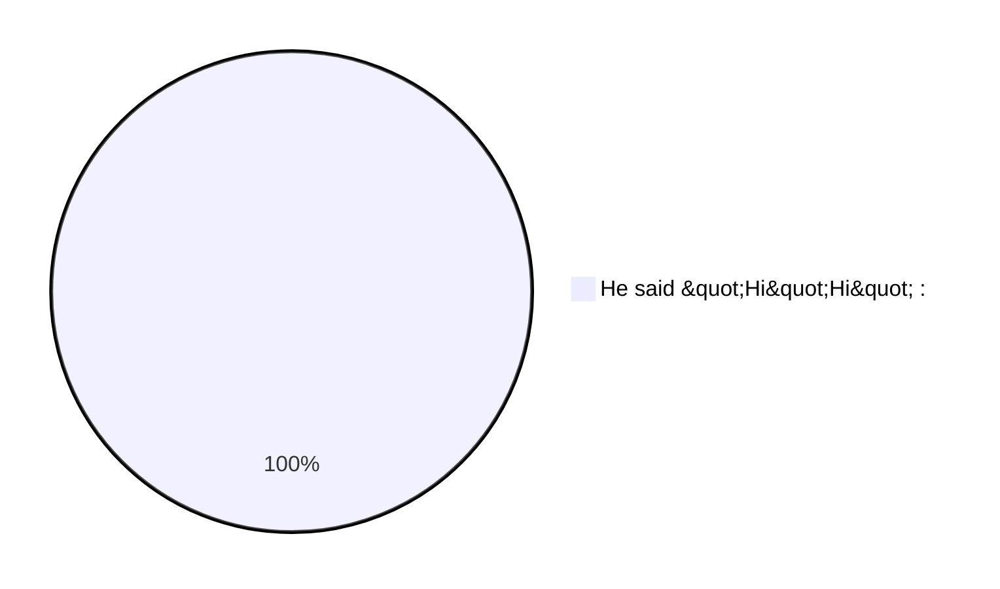
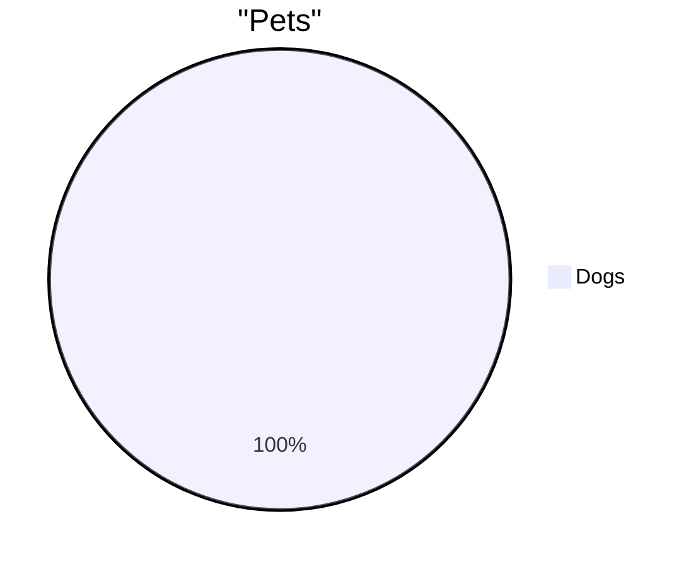
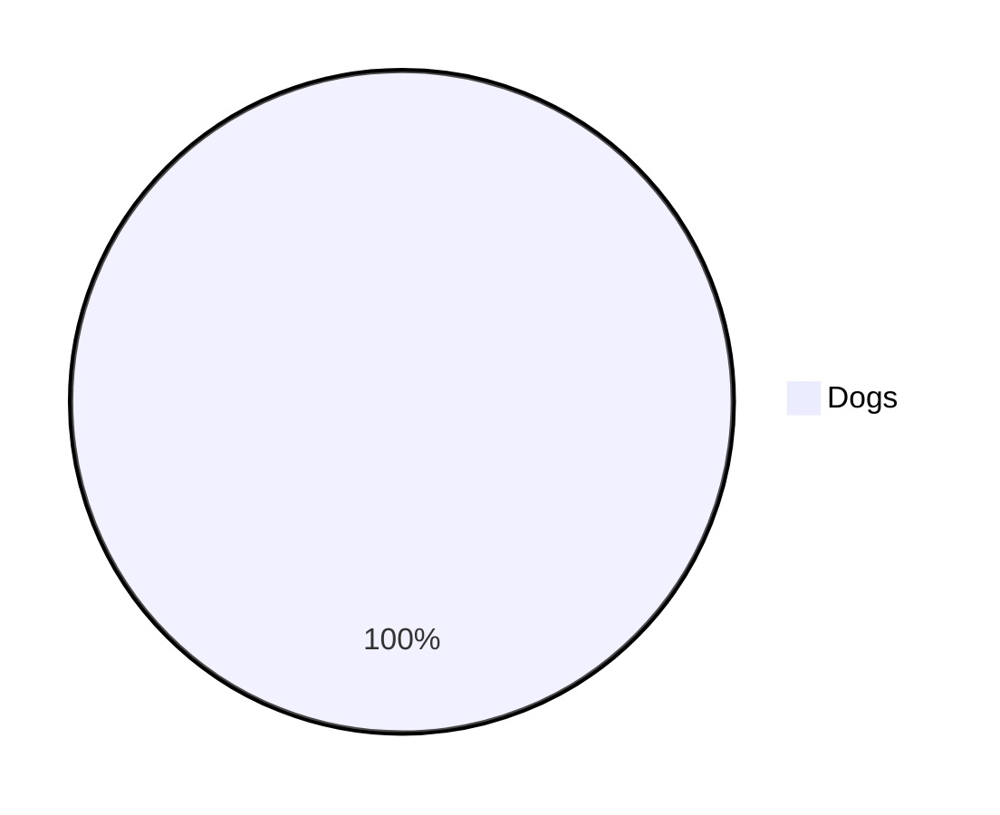

# Invalid Pie Diagrams

This file contains invalid pie test fixtures with:
- GitHub render attempts
- Error from mermaid-cli
- Error/output from our linter

> Note: Auto-generated by `scripts/generate-previews.js`. Do not edit manually.

## Table of Contents

1. [Colon Only](#1-colon-only)
2. [Double In Double](#2-double-in-double)
3. [Invalid Header](#3-invalid-header)
4. [Missing Colon](#4-missing-colon)
5. [Missing Label](#5-missing-label)
6. [Missing Number](#6-missing-number)
7. [Unclosed Quote](#7-unclosed-quote)

---

## Summary

| # | Diagram | mermaid-cli | maid | Auto-fix? |
|---:|---|:---:|:---:|:---:|
| 1 | [colon only](#1-colon-only) | INVALID | INVALID | — |
| 2 | [double in double](#2-double-in-double) | INVALID | INVALID | ✅ safe |
| 3 | [invalid header](#3-invalid-header) | INVALID | INVALID | — |
| 4 | [missing colon](#4-missing-colon) | INVALID | INVALID | ✅ safe |
| 5 | [missing label](#5-missing-label) | INVALID | INVALID | — |
| 6 | [missing number](#6-missing-number) | INVALID | INVALID | — |
| 7 | [unclosed quote](#7-unclosed-quote) | INVALID | INVALID | ✅ all |

---

## 1. Colon Only

📄 **Source**: [`colon-only.mmd`](./invalid/colon-only.mmd)

### GitHub Render Attempt

> **Note**: This invalid diagram may not render or may render incorrectly.


### Error Comparison: mermaid-cli vs maid

<table>
<tr>
<th width="50%">mermaid-cli</th>
<th width="50%">maid</th>
</tr>
<tr>
<td valign="top">

**Result**: ❌ INVALID

```
Syntax error in text
```

</td>
<td valign="top">

**Result**: ❌ INVALID

```
error[PI-LABEL-REQUIRES-QUOTES]: Slice labels must be quoted (single or double quotes).
at test-fixtures/pie/invalid/colon-only.mmd:2:3
  1 | pie
  2 |   :
    |   ^
  3 | 
hint: Example: "Dogs" : 10
```

</td>
</tr>
</table>

### maid Auto-fix (`--fix`) Preview

No auto-fix changes (safe level).

### maid Auto-fix (`--fix=all`) Preview

No auto-fix changes (all level).

<details>
<summary>View source code</summary>

```
pie
  :


```
</details>

---

## 2. Double In Double

📄 **Source**: [`double-in-double.mmd`](./invalid/double-in-double.mmd)

### GitHub Render Attempt

> **Note**: This invalid diagram may not render or may render incorrectly.


### Error Comparison: mermaid-cli vs maid

<table>
<tr>
<th width="50%">mermaid-cli</th>
<th width="50%">maid</th>
</tr>
<tr>
<td valign="top">

**Result**: ❌ INVALID

```
Syntax error in text
```

</td>
<td valign="top">

**Result**: ❌ INVALID

```
error[PI-LABEL-DOUBLE-IN-DOUBLE]: Double quotes inside a double-quoted slice label are not supported. Use &quot; for inner quotes.
at test-fixtures/pie/invalid/double-in-double.mmd:2:15
  1 | pie
  2 |   "He said "Hi"" : 1
    |               ^
  3 | 
hint: Example: "He said &quot;Hi&quot;" : 1

error[PI-MISSING-COLON]: Missing colon between slice label and value.
at test-fixtures/pie/invalid/double-in-double.mmd:2:13
  1 | pie
  2 |   "He said "Hi"" : 1
    |             ^^^^^
  3 | 
hint: Use: "Label" : 10
```

</td>
</tr>
</table>

### maid Auto-fix (`--fix`) Preview



### maid Auto-fix (`--fix=all`) Preview

Shown above (safe changes applied).

<details>
<summary>View source code</summary>

```
pie
  "He said "Hi"" : 1


```
</details>

---

## 3. Invalid Header

📄 **Source**: [`invalid-header.mmd`](./invalid/invalid-header.mmd)

### GitHub Render Attempt

> **Note**: This invalid diagram may not render or may render incorrectly.


### Error Comparison: mermaid-cli vs maid

<table>
<tr>
<th width="50%">mermaid-cli</th>
<th width="50%">maid</th>
</tr>
<tr>
<td valign="top">

**Result**: ❌ INVALID

```
Syntax error in text
```

</td>
<td valign="top">

**Result**: ❌ INVALID

```
error[GEN-HEADER-INVALID]: Diagram must start with "graph", "flowchart", "pie", "sequenceDiagram", "classDiagram" or "stateDiagram[-v2]"
at test-fixtures/pie/invalid/invalid-header.mmd:1:1
  1 | piee
    | ^
  2 |   "Dogs" : 10
hint: Start with: flowchart TD | pie | sequenceDiagram | classDiagram | stateDiagram-v2.
```

</td>
</tr>
</table>

### maid Auto-fix (`--fix`) Preview

No auto-fix changes (safe level).

### maid Auto-fix (`--fix=all`) Preview

No auto-fix changes (all level).

<details>
<summary>View source code</summary>

```
piee
  "Dogs" : 10


```
</details>

---

## 4. Missing Colon

📄 **Source**: [`missing-colon.mmd`](./invalid/missing-colon.mmd)

### GitHub Render Attempt

> **Note**: This invalid diagram may not render or may render incorrectly.


### Error Comparison: mermaid-cli vs maid

<table>
<tr>
<th width="50%">mermaid-cli</th>
<th width="50%">maid</th>
</tr>
<tr>
<td valign="top">

**Result**: ❌ INVALID

```
Syntax error in text
```

</td>
<td valign="top">

**Result**: ❌ INVALID

```
error[PI-MISSING-COLON]: Missing colon between slice label and value.
at test-fixtures/pie/invalid/missing-colon.mmd:3:10
  2 |   title "Pets"
  3 |   "Dogs" 10
    |          ^^
  4 | 
hint: Use: "Label" : 10
```

</td>
</tr>
</table>

### maid Auto-fix (`--fix`) Preview



### maid Auto-fix (`--fix=all`) Preview

Shown above (safe changes applied).

<details>
<summary>View source code</summary>

```
pie
  title "Pets"
  "Dogs" 10

```
</details>

---

## 5. Missing Label

📄 **Source**: [`missing-label.mmd`](./invalid/missing-label.mmd)

### GitHub Render Attempt

> **Note**: This invalid diagram may not render or may render incorrectly.


### Error Comparison: mermaid-cli vs maid

<table>
<tr>
<th width="50%">mermaid-cli</th>
<th width="50%">maid</th>
</tr>
<tr>
<td valign="top">

**Result**: ❌ INVALID

```
Syntax error in text
```

</td>
<td valign="top">

**Result**: ❌ INVALID

```
error[PI-LABEL-REQUIRES-QUOTES]: Slice labels must be quoted (single or double quotes).
at test-fixtures/pie/invalid/missing-label.mmd:2:3
  1 | pie
  2 |   : 10
    |   ^
  3 | 
hint: Example: "Dogs" : 10
```

</td>
</tr>
</table>

### maid Auto-fix (`--fix`) Preview

No auto-fix changes (safe level).

### maid Auto-fix (`--fix=all`) Preview

No auto-fix changes (all level).

<details>
<summary>View source code</summary>

```
pie
  : 10


```
</details>

---

## 6. Missing Number

📄 **Source**: [`missing-number.mmd`](./invalid/missing-number.mmd)

### GitHub Render Attempt

> **Note**: This invalid diagram may not render or may render incorrectly.


### Error Comparison: mermaid-cli vs maid

<table>
<tr>
<th width="50%">mermaid-cli</th>
<th width="50%">maid</th>
</tr>
<tr>
<td valign="top">

**Result**: ❌ INVALID

```
Syntax error in text
```

</td>
<td valign="top">

**Result**: ❌ INVALID

```
error[PI-MISSING-NUMBER]: Missing numeric value after colon.
at test-fixtures/pie/invalid/missing-number.mmd:2:11
  1 | pie
  2 |   "Dogs" :
    |           ^
  3 |   "Cats" : 
hint: Use a number like 10 or 42.5
```

</td>
</tr>
</table>

### maid Auto-fix (`--fix`) Preview

No auto-fix changes (safe level).

### maid Auto-fix (`--fix=all`) Preview

No auto-fix changes (all level).

<details>
<summary>View source code</summary>

```
pie
  "Dogs" :
  "Cats" : 

```
</details>

---

## 7. Unclosed Quote

📄 **Source**: [`unclosed-quote.mmd`](./invalid/unclosed-quote.mmd)

### GitHub Render Attempt

> **Note**: This invalid diagram may not render or may render incorrectly.


### Error Comparison: mermaid-cli vs maid

<table>
<tr>
<th width="50%">mermaid-cli</th>
<th width="50%">maid</th>
</tr>
<tr>
<td valign="top">

**Result**: ❌ INVALID

```
Syntax error in text
```

</td>
<td valign="top">

**Result**: ❌ INVALID

```
error[PI-QUOTE-UNCLOSED]: Unclosed quote in slice label.
at test-fixtures/pie/invalid/unclosed-quote.mmd:2:3
  1 | pie
  2 |   "Dogs : 10
    |   ^
  3 | 
hint: Close the quote: "Dogs" : 10

error[PI-QUOTE-UNCLOSED]: Unclosed quote in slice label.
at test-fixtures/pie/invalid/unclosed-quote.mmd:2:3
  1 | pie
  2 |   "Dogs : 10
    |   ^^^^^^
  3 | 
hint: Close the quote: "Dogs" : 10
```

</td>
</tr>
</table>

### maid Auto-fix (`--fix`) Preview

No auto-fix changes (safe level).

### maid Auto-fix (`--fix=all`) Preview



<details>
<summary>View source code</summary>

```
pie
  "Dogs : 10

```
</details>

---

