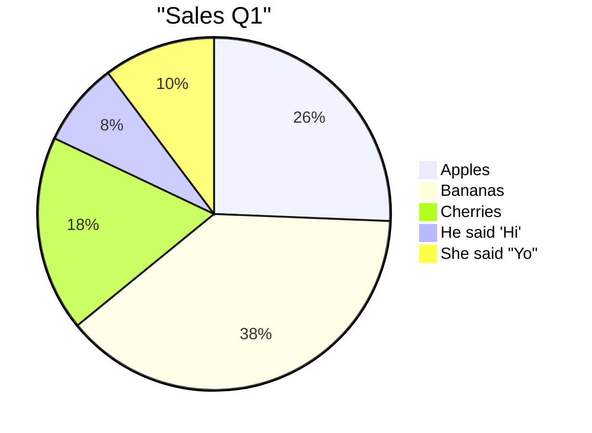
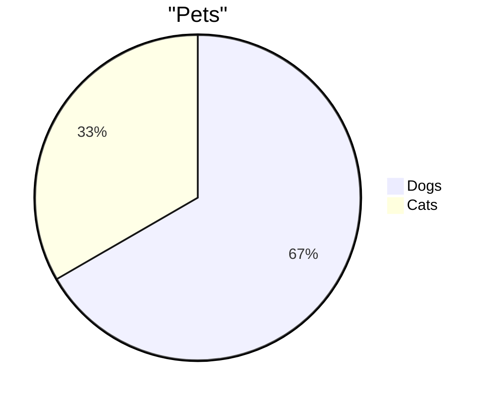

# Valid Pie Diagrams

This file contains all valid pie test fixtures rendered as Mermaid diagrams.
These diagrams are validated to be 100% compatible with mermaid-cli.

> **Note**: This file is auto-generated by `scripts/generate-preview.js`. Do not edit manually.

## Table of Contents

1. [Labels And Formats](#1-labels-and-formats)
2. [Simple](#2-simple)

---

## 1. Labels And Formats

📄 **Source**: [`labels-and-formats.mmd`](./valid/labels-and-formats.mmd)



<details>
<summary>View source code</summary>

```
pie
  title "Sales Q1"
  "Apples" : 10
  'Bananas' : 15
  "Cherries" : 7
  "He said 'Hi'" : 3
  'She said "Yo"' : 4

```
</details>

---

## 2. Simple

📄 **Source**: [`simple.mmd`](./valid/simple.mmd)



<details>
<summary>View source code</summary>

```
pie
  title "Pets"
  "Dogs" : 10
  "Cats" : 5

```
</details>

---

## Validation Status

All diagrams in this file have been validated against:
- ✅ Our Mermaid linter
- ✅ Official mermaid-cli
- ✅ GitHub's Mermaid renderer

Last generated: 2025-09-29T15:16:43.109Z

## How to Regenerate

```bash
node scripts/generate-preview.js pie
```
