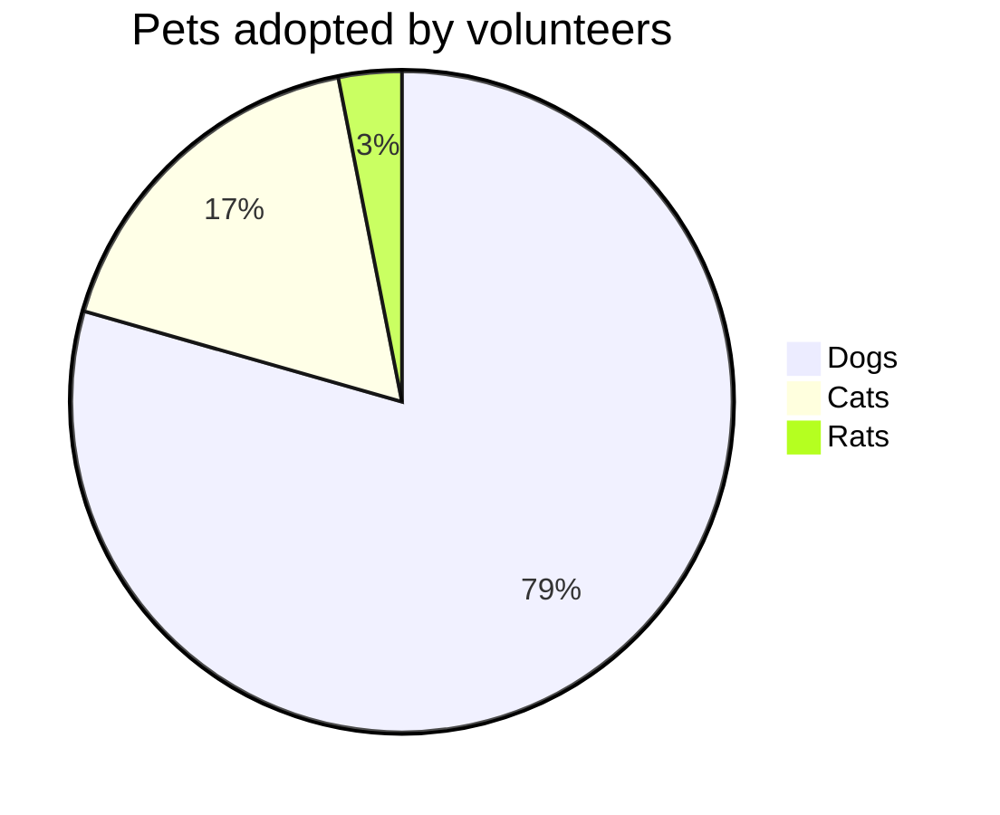
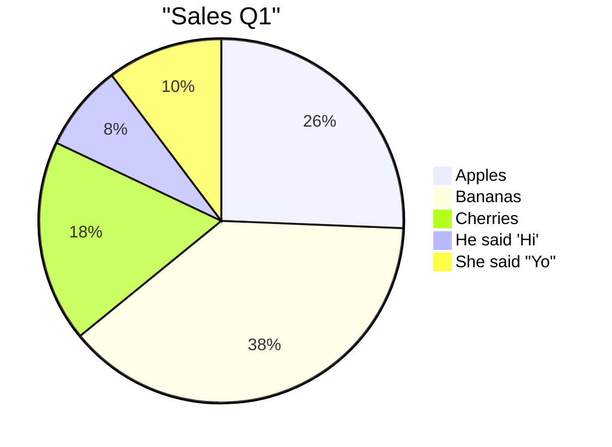
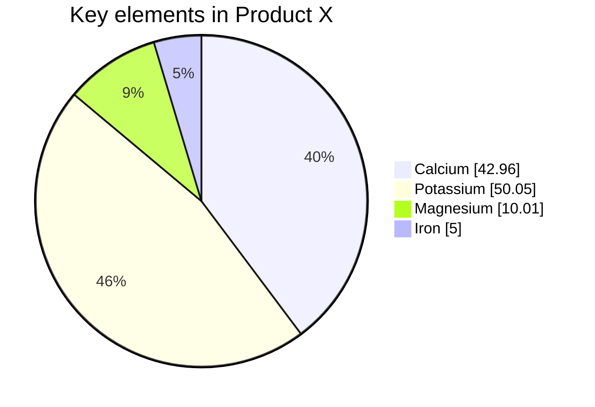
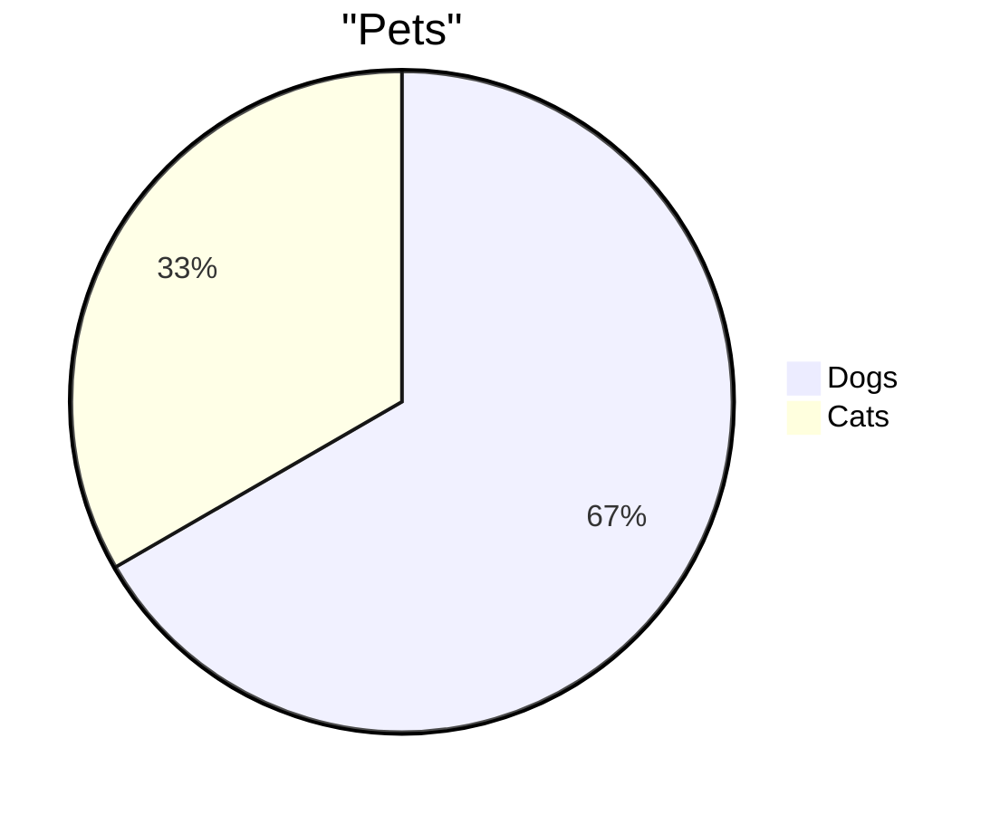

# Valid Pie Diagrams

This file contains all valid pie test fixtures rendered with both Mermaid and our Maid renderer.

> **Note**: This file is auto-generated by `scripts/generate-preview-with-renderer.js`. Do not edit manually.

## Renderer Comparison

| Renderer | Description |
|----------|-------------|
| **Mermaid** | Official Mermaid.js renderer (GitHub/mermaid-cli) |
| **Maid** | Our lightweight renderer using Chevrotain + Dagre |

## Table of Contents

1. [Inline Title](#1-inline-title)
2. [Labels And Formats](#2-labels-and-formats)
3. [Showdata Header](#3-showdata-header)
4. [Simple](#4-simple)

---

## 1. Inline Title

📄 **Source**: [`inline-title.mmd`](./valid/inline-title.mmd)

### Rendered Output

<table>
<tr>
<th width="50%">Mermaid (Official)</th>
<th width="50%">Maid (Our Renderer)</th>
</tr>
<tr>
<td>



</td>
<td>

⚠️ *Maid renderer currently only supports flowchart diagrams*

</td>
</tr>
</table>

<details>
<summary>View source code</summary>

```
pie title Pets adopted by volunteers
  "Dogs" : 386
  "Cats" : 85
  "Rats" : 15


```
</details>

---

## 2. Labels And Formats

📄 **Source**: [`labels-and-formats.mmd`](./valid/labels-and-formats.mmd)

### Rendered Output

<table>
<tr>
<th width="50%">Mermaid (Official)</th>
<th width="50%">Maid (Our Renderer)</th>
</tr>
<tr>
<td>



</td>
<td>

⚠️ *Maid renderer currently only supports flowchart diagrams*

</td>
</tr>
</table>

<details>
<summary>View source code</summary>

```
pie
  title "Sales Q1"
  "Apples" : 10
  'Bananas' : 15
  "Cherries" : 7
  "He said 'Hi'" : 3
  'She said "Yo"' : 4

```
</details>

---

## 3. Showdata Header

📄 **Source**: [`showdata-header.mmd`](./valid/showdata-header.mmd)

### Rendered Output

<table>
<tr>
<th width="50%">Mermaid (Official)</th>
<th width="50%">Maid (Our Renderer)</th>
</tr>
<tr>
<td>



</td>
<td>

⚠️ *Maid renderer currently only supports flowchart diagrams*

</td>
</tr>
</table>

<details>
<summary>View source code</summary>

```
pie showData
  title Key elements in Product X
  "Calcium" : 42.96
  "Potassium" : 50.05
  "Magnesium" : 10.01
  "Iron" : 5


```
</details>

---

## 4. Simple

📄 **Source**: [`simple.mmd`](./valid/simple.mmd)

### Rendered Output

<table>
<tr>
<th width="50%">Mermaid (Official)</th>
<th width="50%">Maid (Our Renderer)</th>
</tr>
<tr>
<td>



</td>
<td>

⚠️ *Maid renderer currently only supports flowchart diagrams*

</td>
</tr>
</table>

<details>
<summary>View source code</summary>

```
pie
  title "Pets"
  "Dogs" : 10
  "Cats" : 5

```
</details>

---

## Validation Status

All diagrams in this file have been validated against:
- ✅ Our Mermaid linter
- ✅ Official mermaid-cli
- ✅ Our Maid renderer (flowcharts only)
- ✅ GitHub's Mermaid renderer

## Renderer Comparison Summary

- **Mermaid.js**: Full-featured, 2.6MB bundle, supports all diagram types
- **Maid Renderer**: Lightweight, 294KB bundle, currently flowcharts only

Generated by scripts/generate-preview-with-renderer.js
