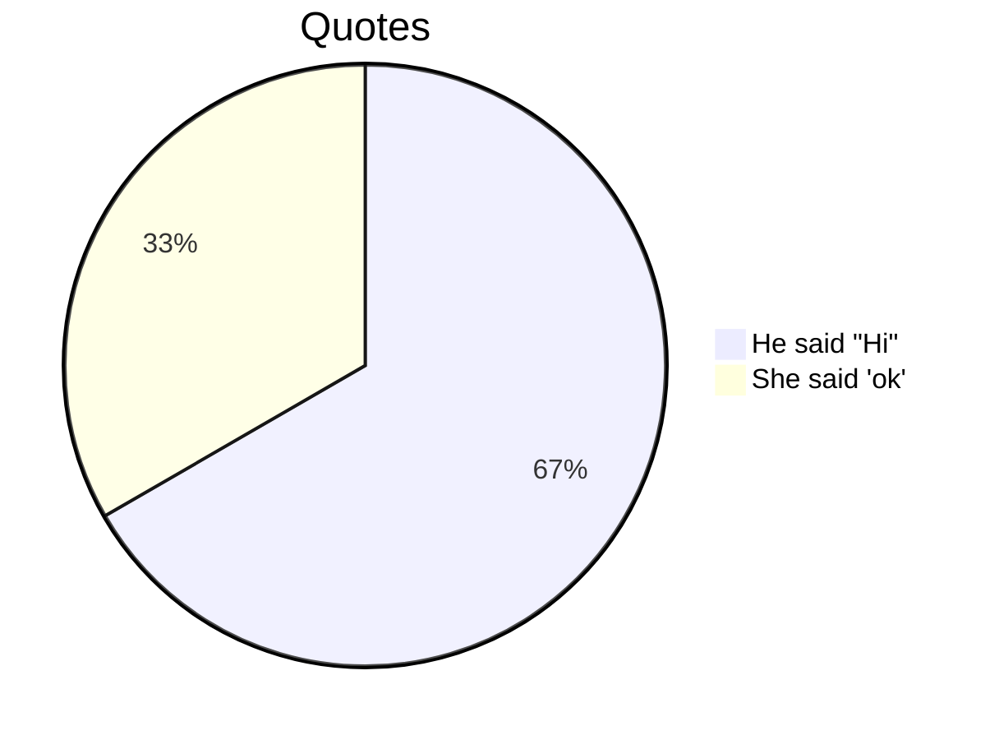
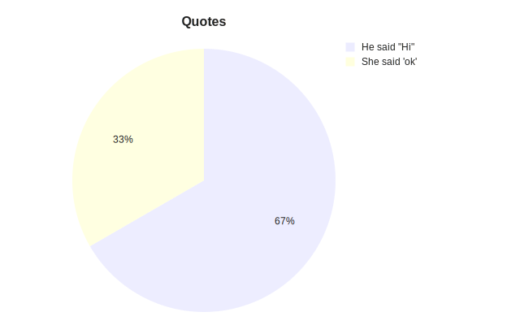
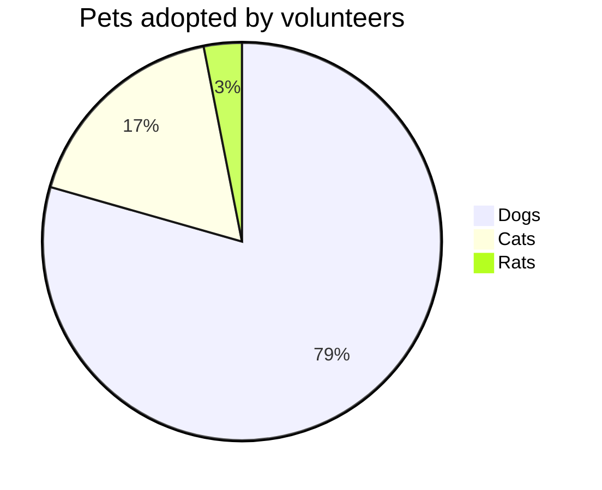
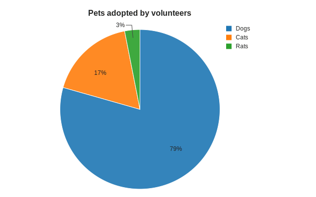
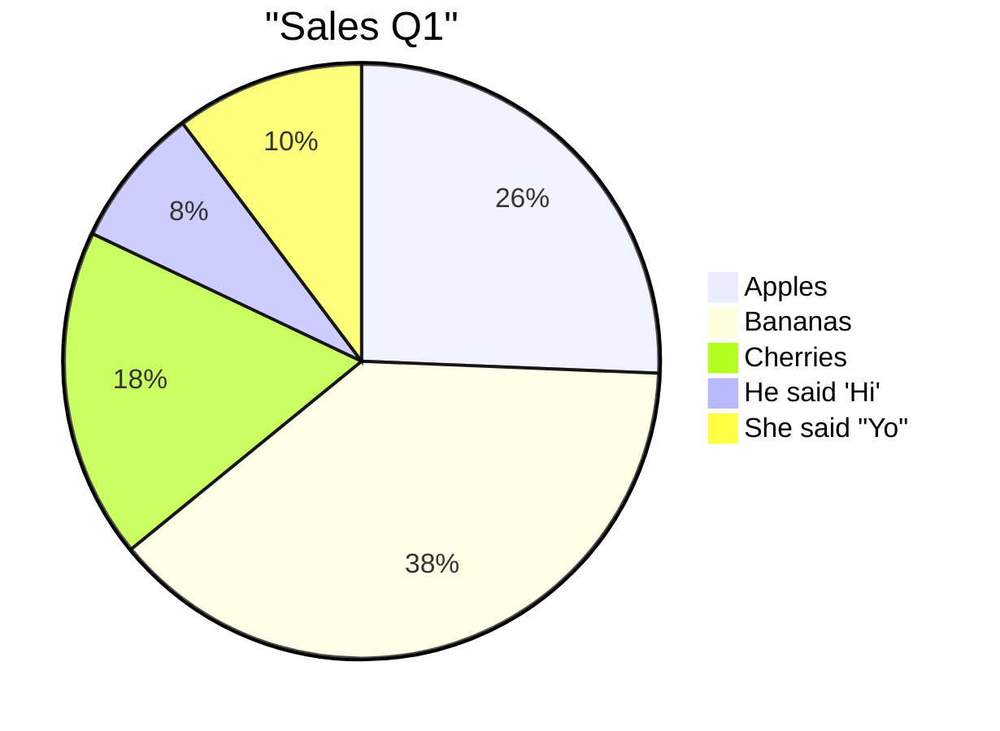
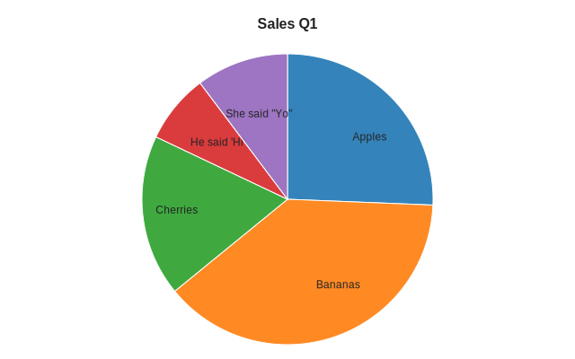
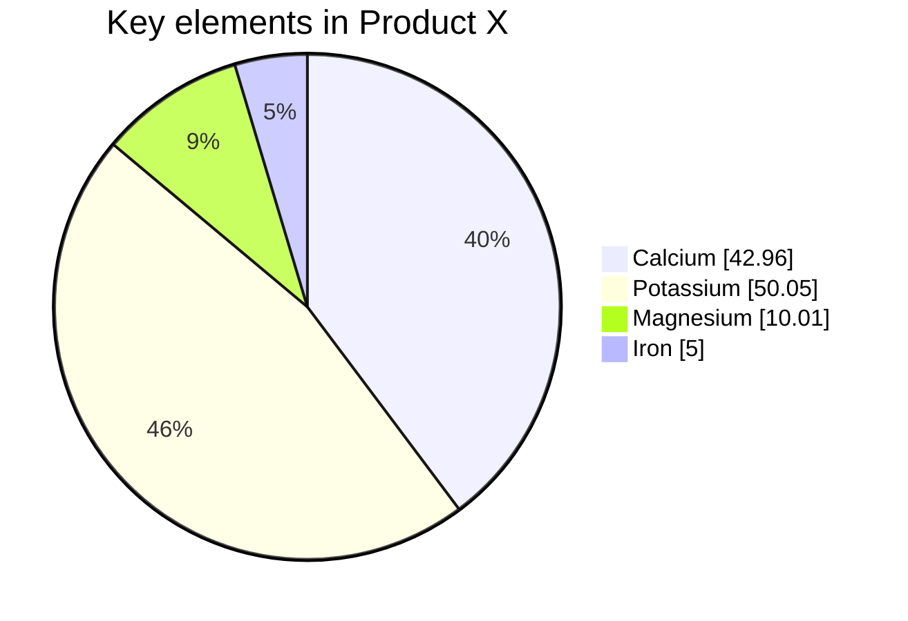
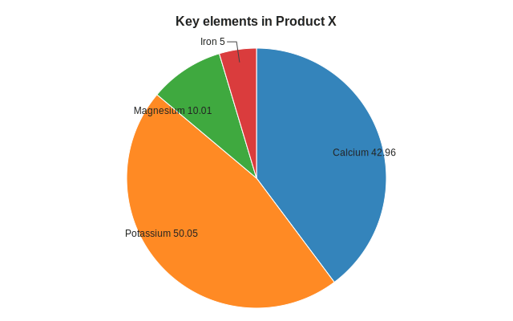
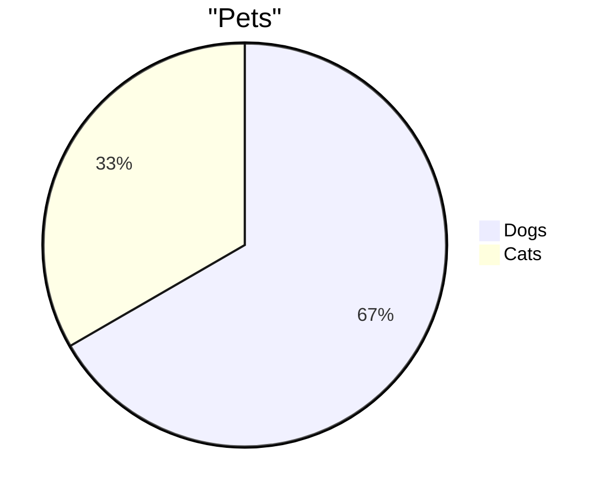
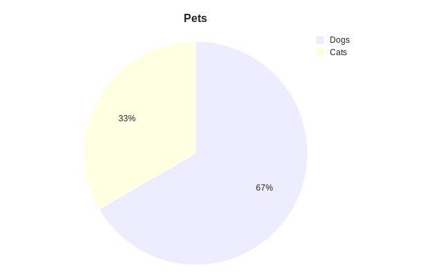

# Valid Pie Diagrams

This file contains all valid pie test fixtures rendered with both Mermaid and our Maid renderer.

> **Note**: This file is auto-generated by `scripts/generate-previews.js`. Do not edit manually.

## Renderer Comparison

| Renderer | Description |
|----------|-------------|
| **Mermaid** | Official Mermaid.js renderer (GitHub/mermaid-cli) |
| **Maid** | Our experimental renderer (only for supported types) |

## Table of Contents

1. [escaped quotes](#1-escaped-quotes)
2. [inline title](#2-inline-title)
3. [labels and formats](#3-labels-and-formats)
4. [showdata header](#4-showdata-header)
5. [simple](#5-simple)

---

## 1. Escaped Quotes

📄 **Source**: [`escaped-quotes.mmd`](./valid/escaped-quotes.mmd)

### Rendered Output

<table>
<tr>
<th width="50%">Mermaid (Official)</th>
<th width="50%">Maid (Experimental)</th>
</tr>
<tr>
<td>



</td>
<td>



</td>
</tr>
</table>

<details>
<summary>View source code</summary>

```
pie title Quotes
  "He said \"Hi\"" : 10
  "She said 'ok'" : 5


```
</details>

---

## 2. Inline Title

📄 **Source**: [`inline-title.mmd`](./valid/inline-title.mmd)

### Rendered Output

<table>
<tr>
<th width="50%">Mermaid (Official)</th>
<th width="50%">Maid (Experimental)</th>
</tr>
<tr>
<td>



</td>
<td>



</td>
</tr>
</table>

<details>
<summary>View source code</summary>

```
pie title Pets adopted by volunteers
  "Dogs" : 386
  "Cats" : 85
  "Rats" : 15


```
</details>

---

## 3. Labels And Formats

📄 **Source**: [`labels-and-formats.mmd`](./valid/labels-and-formats.mmd)

### Rendered Output

<table>
<tr>
<th width="50%">Mermaid (Official)</th>
<th width="50%">Maid (Experimental)</th>
</tr>
<tr>
<td>



</td>
<td>



</td>
</tr>
</table>

<details>
<summary>View source code</summary>

```
pie
  title "Sales Q1"
  "Apples" : 10
  'Bananas' : 15
  "Cherries" : 7
  "He said 'Hi'" : 3
  'She said "Yo"' : 4

```
</details>

---

## 4. Showdata Header

📄 **Source**: [`showdata-header.mmd`](./valid/showdata-header.mmd)

### Rendered Output

<table>
<tr>
<th width="50%">Mermaid (Official)</th>
<th width="50%">Maid (Experimental)</th>
</tr>
<tr>
<td>



</td>
<td>



</td>
</tr>
</table>

<details>
<summary>View source code</summary>

```
pie showData
  title Key elements in Product X
  "Calcium" : 42.96
  "Potassium" : 50.05
  "Magnesium" : 10.01
  "Iron" : 5


```
</details>

---

## 5. Simple

📄 **Source**: [`simple.mmd`](./valid/simple.mmd)

### Rendered Output

<table>
<tr>
<th width="50%">Mermaid (Official)</th>
<th width="50%">Maid (Experimental)</th>
</tr>
<tr>
<td>



</td>
<td>



</td>
</tr>
</table>

<details>
<summary>View source code</summary>

```
pie
  title "Pets"
  "Dogs" : 10
  "Cats" : 5

```
</details>

---

