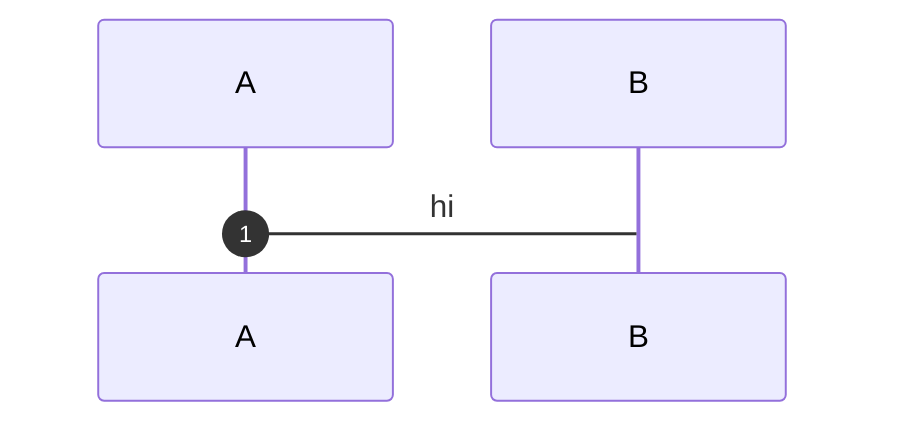
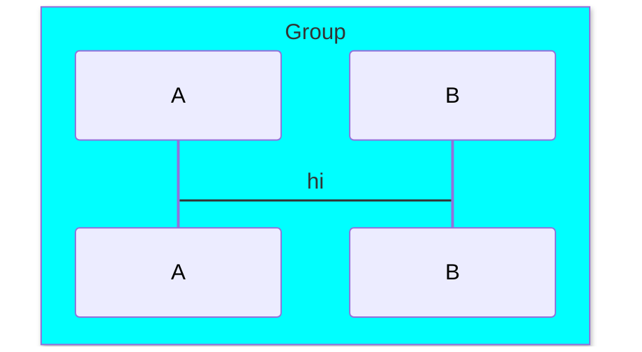
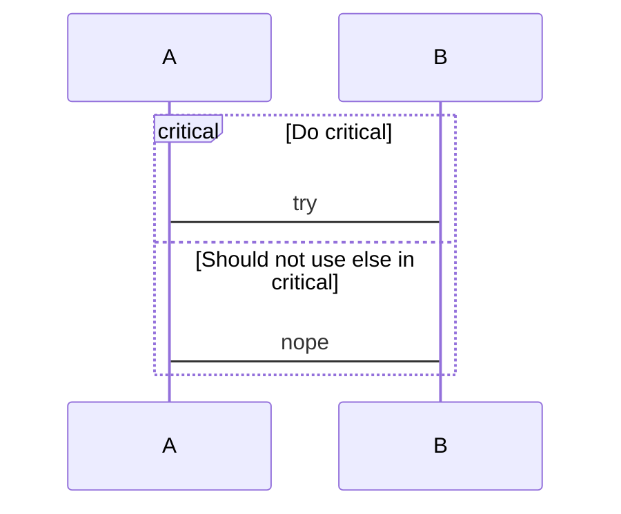
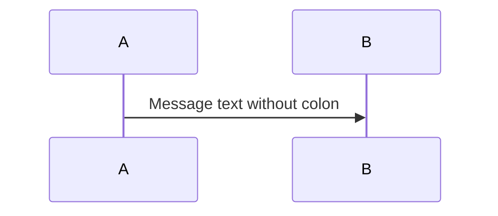
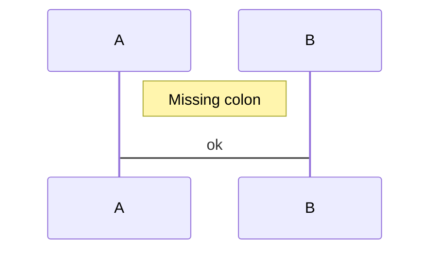

# Invalid Sequence Diagrams

This file contains invalid sequence test fixtures with:
- GitHub render attempts
- Error from mermaid-cli
- Error/output from our linter

> Note: Auto-generated by `scripts/generate-previews.js`. Do not edit manually.

## Table of Contents

1. [And In Alt](#1-and-in-alt)
2. [And Outside Par](#2-and-outside-par)
3. [Autonumber Extraneous](#3-autonumber-extraneous)
4. [Autonumber Malformed](#4-autonumber-malformed)
5. [Box Unclosed](#5-box-unclosed)
6. [Create Malformed](#6-create-malformed)
7. [Create Missing Name](#7-create-missing-name)
8. [Critical Else](#8-critical-else)
9. [Destroy Malformed](#9-destroy-malformed)
10. [Else Outside Alt](#10-else-outside-alt)
11. [Missing Colon](#11-missing-colon)
12. [Note Malformed](#12-note-malformed)
13. [Option In Par](#13-option-in-par)
14. [Option Outside Critical](#14-option-outside-critical)
15. [Unmatched End](#15-unmatched-end)
16. [Wrong Arrow](#16-wrong-arrow)

---

## Summary

| # | Diagram | mermaid-cli | maid | Auto-fix? |
|---:|---|:---:|:---:|:---:|
| 1 | [and in alt](#1-and-in-alt) | INVALID | INVALID | — |
| 2 | [and outside par](#2-and-outside-par) | INVALID | INVALID | — |
| 3 | [autonumber extraneous](#3-autonumber-extraneous) | INVALID | INVALID | ✅ safe |
| 4 | [autonumber malformed](#4-autonumber-malformed) | INVALID | INVALID | ✅ all |
| 5 | [box unclosed](#5-box-unclosed) | INVALID | INVALID | ✅ safe |
| 6 | [create malformed](#6-create-malformed) | INVALID | INVALID | — |
| 7 | [create missing name](#7-create-missing-name) | INVALID | INVALID | — |
| 8 | [critical else](#8-critical-else) | INVALID | INVALID | ✅ safe |
| 9 | [destroy malformed](#9-destroy-malformed) | INVALID | INVALID | — |
| 10 | [else outside alt](#10-else-outside-alt) | INVALID | INVALID | — |
| 11 | [missing colon](#11-missing-colon) | INVALID | INVALID | ✅ safe |
| 12 | [note malformed](#12-note-malformed) | INVALID | INVALID | ✅ safe |
| 13 | [option in par](#13-option-in-par) | INVALID | INVALID | — |
| 14 | [option outside critical](#14-option-outside-critical) | INVALID | INVALID | — |
| 15 | [unmatched end](#15-unmatched-end) | INVALID | INVALID | — |
| 16 | [wrong arrow](#16-wrong-arrow) | INVALID | INVALID | — |

---

## 1. And In Alt

📄 **Source**: [`and-in-alt.mmd`](./invalid/and-in-alt.mmd)

### GitHub Render Attempt

> **Note**: This invalid diagram may not render or may render incorrectly.

```mermaid
sequenceDiagram
  alt Something
    A->B: one
  and
    A->C: two
  end


```

### mermaid-cli Result: INVALID

```
Generating single mermaid chart
```

### maid Result: INVALID

```
error[SE-BRANCH-IN-WRONG-BLOCK]: 'and' is only valid in 'par' blocks (not inside 'alt').
at test-fixtures/sequence/invalid/and-in-alt.mmd:4:3
  3 |     A->B: one
  4 |   and
    |   ^^^
  5 |     A->C: two
hint: Use the proper branch for 'alt' or close it with 'end'.
  For 'par', use:
  par
    …
  and
    …
  end

warning[SE-HINT-PAR-BLOCK-SUGGEST]: Found 'and' but no 'par' block in the file.
at test-fixtures/sequence/invalid/and-in-alt.mmd:4:3
  3 |     A->B: one
  4 |   and
    |   ^^^
  5 |     A->C: two
hint: Start a parallel section with: par … and … end
```

### maid Auto-fix (`--fix`) Preview

No auto-fix changes (safe level).

### maid Auto-fix (`--fix=all`) Preview

No auto-fix changes (all level).

<details>
<summary>View source code</summary>

```
sequenceDiagram
  alt Something
    A->B: one
  and
    A->C: two
  end


```
</details>

---

## 2. And Outside Par

📄 **Source**: [`and-outside-par.mmd`](./invalid/and-outside-par.mmd)

### GitHub Render Attempt

> **Note**: This invalid diagram may not render or may render incorrectly.

```mermaid
sequenceDiagram
  participant A
  and Also not allowed
  A->B: hi


```

### mermaid-cli Result: INVALID

```
Generating single mermaid chart
```

### maid Result: INVALID

```
error[SE-AND-OUTSIDE-PAR]: 'and' is only allowed inside 'par' blocks.
at test-fixtures/sequence/invalid/and-outside-par.mmd:3:3
  2 |   participant A
  3 |   and Also not allowed
    |   ^^^
  4 |   A->B: hi
hint: Example: par … and … end (parallel branches).
```

### maid Auto-fix (`--fix`) Preview

No auto-fix changes (safe level).

### maid Auto-fix (`--fix=all`) Preview

No auto-fix changes (all level).

<details>
<summary>View source code</summary>

```
sequenceDiagram
  participant A
  and Also not allowed
  A->B: hi


```
</details>

---

## 3. Autonumber Extraneous

📄 **Source**: [`autonumber-extraneous.mmd`](./invalid/autonumber-extraneous.mmd)

### GitHub Render Attempt

> **Note**: This invalid diagram may not render or may render incorrectly.

```mermaid
sequenceDiagram
  autonumber 10 10 participant A
  A->B: ok


```

### mermaid-cli Result: INVALID

```
Generating single mermaid chart
```

### maid Result: INVALID

```
error[SE-AUTONUMBER-EXTRANEOUS]: Unexpected token after 'autonumber'. Put 'autonumber' on its own line.
at test-fixtures/sequence/invalid/autonumber-extraneous.mmd:2:20
  1 | sequenceDiagram
  2 |   autonumber 10 10 participant A
    |                    ^^^^^^^^^^^
  3 |   A->B: ok
hint: Example:
  autonumber 10 10
  participant A
```

### maid Auto-fix (`--fix`) Preview


### maid Auto-fix (`--fix=all`) Preview

Shown above (safe changes applied).

<details>
<summary>View source code</summary>

```
sequenceDiagram
  autonumber 10 10 participant A
  A->B: ok


```
</details>

---

## 4. Autonumber Malformed

📄 **Source**: [`autonumber-malformed.mmd`](./invalid/autonumber-malformed.mmd)

### GitHub Render Attempt

> **Note**: This invalid diagram may not render or may render incorrectly.

```mermaid
sequenceDiagram
  autonumber 10 ten
  participant A
  participant B
  A->B: hi


```

### mermaid-cli Result: INVALID

```
Generating single mermaid chart
```

### maid Result: INVALID

```
error[SE-AUTONUMBER-NON-NUMERIC]: Autonumber values must be numbers. Found 'ten'.
at test-fixtures/sequence/invalid/autonumber-malformed.mmd:2:17
  1 | sequenceDiagram
  2 |   autonumber 10 ten
    |                 ^^^
  3 |   participant A
hint: Use numbers: autonumber 10 or autonumber 10 10 (start and step).
```

### maid Auto-fix (`--fix`) Preview

No auto-fix changes (safe level).

### maid Auto-fix (`--fix=all`) Preview



<details>
<summary>View source code</summary>

```
sequenceDiagram
  autonumber 10 ten
  participant A
  participant B
  A->B: hi


```
</details>

---

## 5. Box Unclosed

📄 **Source**: [`box-unclosed.mmd`](./invalid/box-unclosed.mmd)

### GitHub Render Attempt

> **Note**: This invalid diagram may not render or may render incorrectly.

```mermaid
sequenceDiagram
  box Aqua Group
    participant A
    participant B
  A->B: hi


```

### mermaid-cli Result: INVALID

```
Generating single mermaid chart
```

### maid Result: INVALID

```
error[SE-BLOCK-MISSING-END]: Missing 'end' to close a 'box' block.
at test-fixtures/sequence/invalid/box-unclosed.mmd:5:1
  2 |   box Aqua Group  ← start of 'box'
    | …
  5 |   A->B: hi
  6 |   end  ← insert 'end' here
hint: Add 'end' on its own line aligned with the block's start.
```

### maid Auto-fix (`--fix`) Preview



### maid Auto-fix (`--fix=all`) Preview

Shown above (safe changes applied).

<details>
<summary>View source code</summary>

```
sequenceDiagram
  box Aqua Group
    participant A
    participant B
  A->B: hi


```
</details>

---

## 6. Create Malformed

📄 **Source**: [`create-malformed.mmd`](./invalid/create-malformed.mmd)

### GitHub Render Attempt

> **Note**: This invalid diagram may not render or may render incorrectly.

```mermaid
sequenceDiagram
  create B
  participant A
  A->B: hi


```

### mermaid-cli Result: INVALID

```
Generating single mermaid chart
```

### maid Result: INVALID

```
error[SE-CREATE-MALFORMED]: After 'create', specify 'participant' or 'actor' before the name.
at test-fixtures/sequence/invalid/create-malformed.mmd:2:10
  1 | sequenceDiagram
  2 |   create B
    |          ^
  3 |   participant A
hint: Examples:
  create participant B
  create actor D as Donald
```

### maid Auto-fix (`--fix`) Preview

No auto-fix changes (safe level).

### maid Auto-fix (`--fix=all`) Preview

No auto-fix changes (all level).

<details>
<summary>View source code</summary>

```
sequenceDiagram
  create B
  participant A
  A->B: hi


```
</details>

---

## 7. Create Missing Name

📄 **Source**: [`create-missing-name.mmd`](./invalid/create-missing-name.mmd)

### GitHub Render Attempt

> **Note**: This invalid diagram may not render or may render incorrectly.

```mermaid
sequenceDiagram
  create participant
  A->B: hi


```

### mermaid-cli Result: INVALID

```
Generating single mermaid chart
```

### maid Result: INVALID

```
error[SE-CREATE-MISSING-NAME]: Missing name after 'create'.
at test-fixtures/sequence/invalid/create-missing-name.mmd:2:21
  1 | sequenceDiagram
  2 |   create participant
    |                     ^
  3 |   A->B: hi
hint: Use: create participant A  or  create actor B
```

### maid Auto-fix (`--fix`) Preview

No auto-fix changes (safe level).

### maid Auto-fix (`--fix=all`) Preview

No auto-fix changes (all level).

<details>
<summary>View source code</summary>

```
sequenceDiagram
  create participant
  A->B: hi


```
</details>

---

## 8. Critical Else

📄 **Source**: [`critical-else.mmd`](./invalid/critical-else.mmd)

### GitHub Render Attempt

> **Note**: This invalid diagram may not render or may render incorrectly.

```mermaid
sequenceDiagram
  critical Do critical
    A->B: try
  else Should not use else in critical
    A->B: nope
  end


```

### mermaid-cli Result: INVALID

```
Generating single mermaid chart
```

### maid Result: INVALID

```
error[SE-ELSE-IN-CRITICAL]: 'else' is not allowed inside a 'critical' block. Use 'option' or close the block with 'end'.
at test-fixtures/sequence/invalid/critical-else.mmd:4:3
  2 |   critical Do critical  ← start of 'critical'
    | …
  4 |   else Should not use else in critical
  5 |   end  ← insert 'end' here
hint: Replace with: option <label>
  Example:
  option Retry

warning[SE-HINT-ALT-BLOCK-SUGGEST]: Found 'else' but no 'alt' block in the file.
at test-fixtures/sequence/invalid/critical-else.mmd:4:3
  3 |     A->B: try
  4 |   else Should not use else in critical
    |   ^^^^
  5 |     A->B: nope
hint: Use: alt Condition … else … end
```

### maid Auto-fix (`--fix`) Preview



### maid Auto-fix (`--fix=all`) Preview

Shown above (safe changes applied).

<details>
<summary>View source code</summary>

```
sequenceDiagram
  critical Do critical
    A->B: try
  else Should not use else in critical
    A->B: nope
  end


```
</details>

---

## 9. Destroy Malformed

📄 **Source**: [`destroy-malformed.mmd`](./invalid/destroy-malformed.mmd)

### GitHub Render Attempt

> **Note**: This invalid diagram may not render or may render incorrectly.

```mermaid
sequenceDiagram
  destroy participant
  participant A
  participant B
  A->B: hi


```

### mermaid-cli Result: INVALID

```
Generating single mermaid chart
```

### maid Result: INVALID

```
error[SE-DESTROY-MISSING-NAME]: Missing name after 'destroy'.
at test-fixtures/sequence/invalid/destroy-malformed.mmd:2:22
  1 | sequenceDiagram
  2 |   destroy participant
    |                      ^
  3 |   participant A
hint: Use: destroy participant A  or  destroy actor B
```

### maid Auto-fix (`--fix`) Preview

No auto-fix changes (safe level).

### maid Auto-fix (`--fix=all`) Preview

No auto-fix changes (all level).

<details>
<summary>View source code</summary>

```
sequenceDiagram
  destroy participant
  participant A
  participant B
  A->B: hi


```
</details>

---

## 10. Else Outside Alt

📄 **Source**: [`else-outside-alt.mmd`](./invalid/else-outside-alt.mmd)

### GitHub Render Attempt

> **Note**: This invalid diagram may not render or may render incorrectly.

```mermaid
sequenceDiagram
  participant A
  else Not allowed here
  A->B: hi


```

### mermaid-cli Result: INVALID

```
Generating single mermaid chart
```

### maid Result: INVALID

```
error[SE-ELSE-OUTSIDE-ALT]: 'else' is only allowed inside 'alt' blocks.
at test-fixtures/sequence/invalid/else-outside-alt.mmd:3:3
  2 |   participant A
  3 |   else Not allowed here
    |   ^^^^
  4 |   A->B: hi
hint: Use: alt Condition … else … end
```

### maid Auto-fix (`--fix`) Preview

No auto-fix changes (safe level).

### maid Auto-fix (`--fix=all`) Preview

No auto-fix changes (all level).

<details>
<summary>View source code</summary>

```
sequenceDiagram
  participant A
  else Not allowed here
  A->B: hi


```
</details>

---

## 11. Missing Colon

📄 **Source**: [`missing-colon.mmd`](./invalid/missing-colon.mmd)

### GitHub Render Attempt

> **Note**: This invalid diagram may not render or may render incorrectly.

```mermaid
sequenceDiagram
  participant A
  participant B
  A->>B Message text without colon


```

### mermaid-cli Result: INVALID

```
Generating single mermaid chart
```

### maid Result: INVALID

```
error[SE-MSG-COLON-MISSING]: Missing colon after target actor in message.
at test-fixtures/sequence/invalid/missing-colon.mmd:4:35
  3 |   participant B
  4 |   A->>B Message text without colon
    |                                   ^^
  5 | 
hint: Use: A->>B: Message text
```

### maid Auto-fix (`--fix`) Preview



### maid Auto-fix (`--fix=all`) Preview

Shown above (safe changes applied).

<details>
<summary>View source code</summary>

```
sequenceDiagram
  participant A
  participant B
  A->>B Message text without colon


```
</details>

---

## 12. Note Malformed

📄 **Source**: [`note-malformed.mmd`](./invalid/note-malformed.mmd)

### GitHub Render Attempt

> **Note**: This invalid diagram may not render or may render incorrectly.

```mermaid
sequenceDiagram
  participant A
  Note right of A Missing colon
  A->B: ok


```

### mermaid-cli Result: INVALID

```
Generating single mermaid chart
```

### maid Result: INVALID

```
error[SE-NOTE-MALFORMED]: Malformed note: missing colon before the note text.
at test-fixtures/sequence/invalid/note-malformed.mmd:3:32
  2 |   participant A
  3 |   Note right of A Missing colon
    |                                ^
  4 |   A->B: ok
hint: Example: Note right of Alice: Hello
```

### maid Auto-fix (`--fix`) Preview



### maid Auto-fix (`--fix=all`) Preview

Shown above (safe changes applied).

<details>
<summary>View source code</summary>

```
sequenceDiagram
  participant A
  Note right of A Missing colon
  A->B: ok


```
</details>

---

## 13. Option In Par

📄 **Source**: [`option-in-par.mmd`](./invalid/option-in-par.mmd)

### GitHub Render Attempt

> **Note**: This invalid diagram may not render or may render incorrectly.

```mermaid
sequenceDiagram
  par
    option Retry
    A->B: nope
  end


```

### mermaid-cli Result: INVALID

```
Generating single mermaid chart
```

### maid Result: INVALID

```
error[SE-BRANCH-IN-WRONG-BLOCK]: 'option' is only valid in 'critical' blocks (not inside 'par').
at test-fixtures/sequence/invalid/option-in-par.mmd:3:5
  2 |   par
  3 |     option Retry
    |     ^^^^^^
  4 |     A->B: nope
hint: Use the proper branch for 'par' or close it with 'end'.
  For 'critical', use:
  critical
    …
  option Label
    …
  end
```

### maid Auto-fix (`--fix`) Preview

No auto-fix changes (safe level).

### maid Auto-fix (`--fix=all`) Preview

No auto-fix changes (all level).

<details>
<summary>View source code</summary>

```
sequenceDiagram
  par
    option Retry
    A->B: nope
  end


```
</details>

---

## 14. Option Outside Critical

📄 **Source**: [`option-outside-critical.mmd`](./invalid/option-outside-critical.mmd)

### GitHub Render Attempt

> **Note**: This invalid diagram may not render or may render incorrectly.

```mermaid
sequenceDiagram
  option Retry
  A->B: Should be inside critical


```

### mermaid-cli Result: INVALID

```
Generating single mermaid chart
```

### maid Result: INVALID

```
error[SE-BRANCH-OUTSIDE-BLOCK]: 'option' is only allowed inside a 'critical' block.
at test-fixtures/sequence/invalid/option-outside-critical.mmd:2:3
  1 | sequenceDiagram
  2 |   option Retry
    |   ^^^^^^
  3 |   A->B: Should be inside critical
hint: Start a critical section:
  critical
    …
  option Label
    …
  end
```

### maid Auto-fix (`--fix`) Preview

No auto-fix changes (safe level).

### maid Auto-fix (`--fix=all`) Preview

No auto-fix changes (all level).

<details>
<summary>View source code</summary>

```
sequenceDiagram
  option Retry
  A->B: Should be inside critical


```
</details>

---

## 15. Unmatched End

📄 **Source**: [`unmatched-end.mmd`](./invalid/unmatched-end.mmd)

### GitHub Render Attempt

> **Note**: This invalid diagram may not render or may render incorrectly.

```mermaid
sequenceDiagram
  participant A
  end
  A->B: hi


```

### mermaid-cli Result: INVALID

```
Generating single mermaid chart
```

### maid Result: INVALID

```
error[SE-END-WITHOUT-BLOCK]: 'end' without an open block (alt/opt/loop/par/rect/critical/break/box).
at test-fixtures/sequence/invalid/unmatched-end.mmd:3:3
  2 |   participant A
  3 |   end
    |   ^^^
  4 |   A->B: hi
hint: Add a block above (e.g., par … end | alt … end) or remove this end.
```

### maid Auto-fix (`--fix`) Preview

No auto-fix changes (safe level).

### maid Auto-fix (`--fix=all`) Preview

No auto-fix changes (all level).

<details>
<summary>View source code</summary>

```
sequenceDiagram
  participant A
  end
  A->B: hi


```
</details>

---

## 16. Wrong Arrow

📄 **Source**: [`wrong-arrow.mmd`](./invalid/wrong-arrow.mmd)

### GitHub Render Attempt

> **Note**: This invalid diagram may not render or may render incorrectly.

```mermaid
sequenceDiagram
  participant A
  participant B
  A==>>B: Unknown arrow


```

### mermaid-cli Result: INVALID

```
Generating single mermaid chart
```

### maid Result: INVALID

```
error[SE-ARROW-INVALID]: Invalid sequence arrow near '

'.
at test-fixtures/sequence/invalid/wrong-arrow.mmd:4:24
  3 |   participant B
  4 |   A==>>B: Unknown arrow
    |                        ^^
  5 | 
hint: Use ->, -->, ->>, -->>, -x, --x, -), --), <<->>, or <<-->>
```

### maid Auto-fix (`--fix`) Preview

No auto-fix changes (safe level).

### maid Auto-fix (`--fix=all`) Preview

No auto-fix changes (all level).

<details>
<summary>View source code</summary>

```
sequenceDiagram
  participant A
  participant B
  A==>>B: Unknown arrow


```
</details>

---

