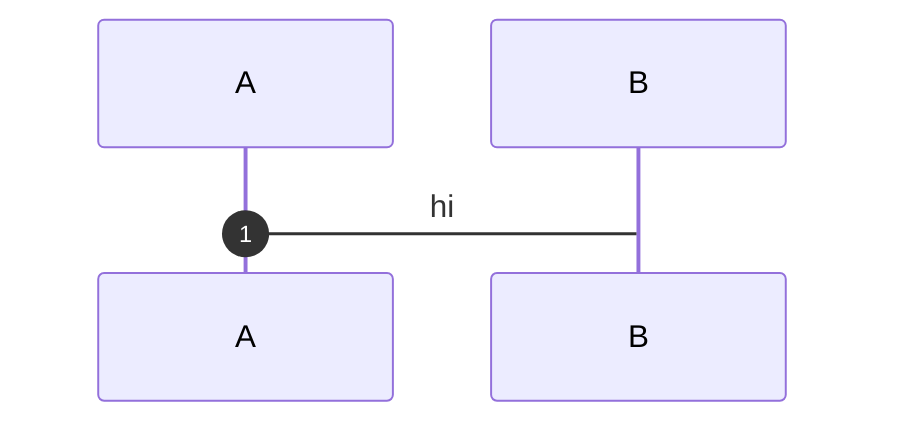
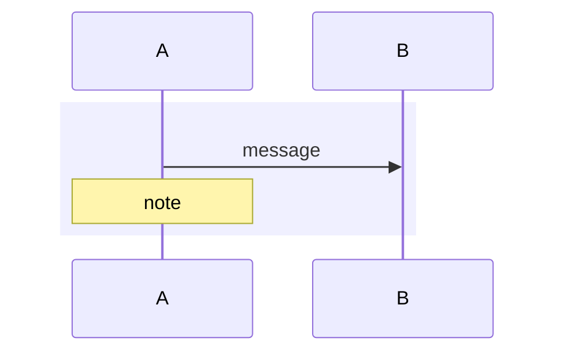
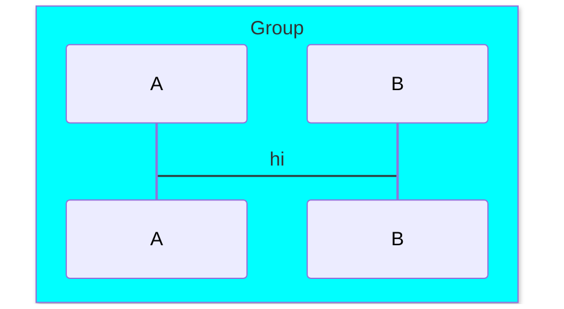
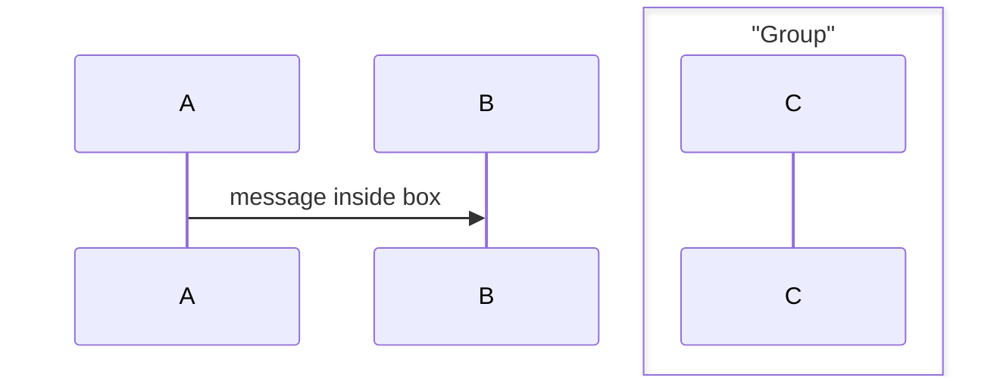
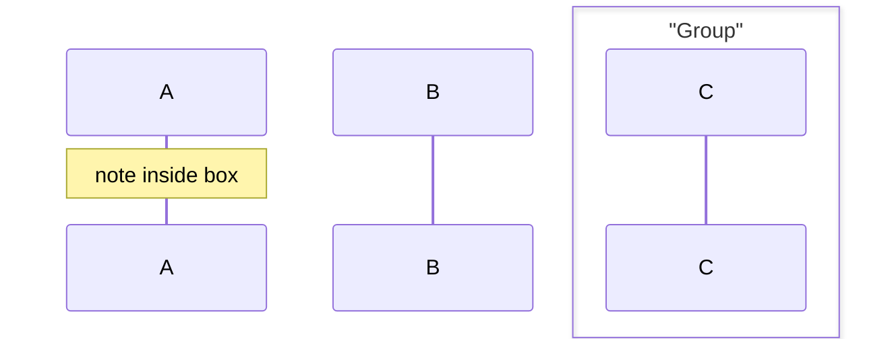
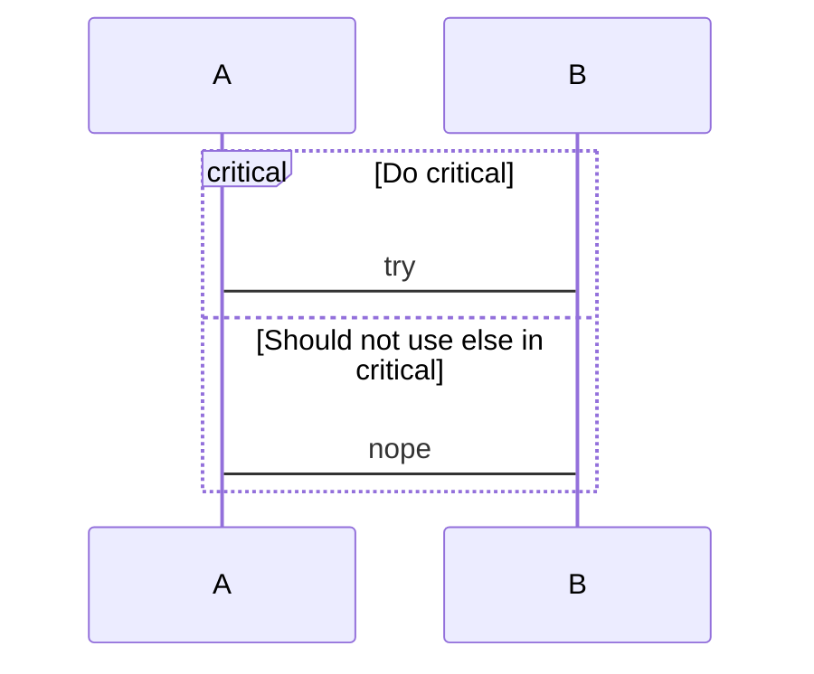

# Invalid Sequence Diagrams

This file contains invalid sequence test fixtures with:
- GitHub render attempts
- Error from mermaid-cli
- Error/output from our linter

> Note: Auto-generated by `scripts/generate-previews.js`. Do not edit manually.

## Table of Contents

1. [And In Alt Nested](#1-and-in-alt-nested)
2. [And In Alt](#2-and-in-alt)
3. [And Outside Par](#3-and-outside-par)
4. [Autonumber Extraneous](#4-autonumber-extraneous)
5. [Autonumber Malformed](#5-autonumber-malformed)
6. [Box Empty](#6-box-empty)
7. [Box Unclosed](#7-box-unclosed)
8. [Box With Messages](#8-box-with-messages)
9. [Box With Notes](#9-box-with-notes)
10. [Create Malformed](#10-create-malformed)
11. [Create Missing Name](#11-create-missing-name)
12. [Critical Else](#12-critical-else)
13. [Destroy Malformed](#13-destroy-malformed)
14. [Details And Properties](#14-details-and-properties)
15. [Else In Par Nested](#15-else-in-par-nested)
16. [Else Outside Alt](#16-else-outside-alt)
17. [Missing Colon](#17-missing-colon)
18. [Note Malformed](#18-note-malformed)
19. [Note Multiline Missing Colon](#19-note-multiline-missing-colon)
20. [Option In Par](#20-option-in-par)
21. [Option Outside Critical](#21-option-outside-critical)
22. [Title And Accessibility](#22-title-and-accessibility)
23. [Unmatched End](#23-unmatched-end)
24. [Wrong Arrow](#24-wrong-arrow)

---

## Summary

| # | Diagram | mermaid-cli | maid | Auto-fix? |
|---:|---|:---:|:---:|:---:|
| 1 | [and in alt nested](#1-and-in-alt-nested) | INVALID | INVALID | — |
| 2 | [and in alt](#2-and-in-alt) | INVALID | INVALID | — |
| 3 | [and outside par](#3-and-outside-par) | INVALID | INVALID | — |
| 4 | [autonumber extraneous](#4-autonumber-extraneous) | INVALID | INVALID | ✅ safe |
| 5 | [autonumber malformed](#5-autonumber-malformed) | INVALID | INVALID | ✅ all |
| 6 | [box empty](#6-box-empty) | INVALID | INVALID | ✅ safe |
| 7 | [box unclosed](#7-box-unclosed) | INVALID | INVALID | ✅ safe |
| 8 | [box with messages](#8-box-with-messages) | INVALID | INVALID | ✅ safe |
| 9 | [box with notes](#9-box-with-notes) | INVALID | INVALID | ✅ safe |
| 10 | [create malformed](#10-create-malformed) | INVALID | INVALID | — |
| 11 | [create missing name](#11-create-missing-name) | INVALID | INVALID | — |
| 12 | [critical else](#12-critical-else) | INVALID | INVALID | ✅ safe |
| 13 | [destroy malformed](#13-destroy-malformed) | INVALID | INVALID | — |
| 14 | [details and properties](#14-details-and-properties) | INVALID | INVALID | — |
| 15 | [else in par nested](#15-else-in-par-nested) | INVALID | INVALID | — |
| 16 | [else outside alt](#16-else-outside-alt) | INVALID | INVALID | — |
| 17 | [missing colon](#17-missing-colon) | INVALID | INVALID | ✅ safe |
| 18 | [note malformed](#18-note-malformed) | INVALID | INVALID | ✅ safe |
| 19 | [note multiline missing colon](#19-note-multiline-missing-colon) | INVALID | INVALID | ✅ safe |
| 20 | [option in par](#20-option-in-par) | INVALID | INVALID | — |
| 21 | [option outside critical](#21-option-outside-critical) | INVALID | INVALID | — |
| 22 | [title and accessibility](#22-title-and-accessibility) | INVALID | INVALID | — |
| 23 | [unmatched end](#23-unmatched-end) | INVALID | INVALID | — |
| 24 | [wrong arrow](#24-wrong-arrow) | INVALID | INVALID | — |

---

## 1. And In Alt Nested

📄 **Source**: [`and-in-alt-nested.mmd`](./invalid/and-in-alt-nested.mmd)

### GitHub Render Attempt

> **Note**: This invalid diagram may not render or may render incorrectly.

```mermaid
sequenceDiagram
  alt Branching
    A->>B: hi
    and Illegal inside alt
  end


```

### Error Comparison: mermaid-cli vs maid

<table>
<tr>
<th width="50%">mermaid-cli</th>
<th width="50%">maid</th>
</tr>
<tr>
<td valign="top">

**Result**: ❌ INVALID

```
Error: Parse error on line 4:
...g    A->>B: hi    and Illegal inside a
---------------------^
Expecting 'SPACE', 'NEWLINE', 'create', 'box', 'end', 'autonumber', 'activate', 'deactivate', 'title', 'legacy_title', 'acc_title', 'acc_descr', 'acc_descr_multiline_value', 'loop', 'rect', 'opt', 'alt', 'par', 'par_over', 'critical', 'break', 'else', 'participant', 'participant_actor', 'destroy', 'note', 'links', 'link', 'properties', 'details', 'ACTOR', got 'and'
Parser3.parseError (node_modules/mermaid/dist/mermaid.js:123898:28)
    at #evaluate (node_modules/puppeteer-core/lib/esm/puppeteer/cdp/ExecutionContext.js:388:19)
    at async ExecutionContext.evaluate (node_modules/puppeteer-core/lib/esm/puppeteer/cdp/ExecutionContext.js:275:16)
    at async IsolatedWorld.evaluate (node_modules/puppeteer-core/lib/esm/puppeteer/cdp/IsolatedWorld.js:97:16)
    at async CdpJSHandle.evaluate (node_modules/puppeteer-core/lib/esm/puppeteer/api/JSHandle.js:146:20)
    at async CdpElementHandle.evaluate (node_modules/puppeteer-core/lib/esm/puppeteer/api/ElementHandle.js:340:20)
    at async CdpElementHandle.$eval (node_modules/puppeteer-core/lib/esm/puppeteer/api/ElementHandle.js:494:24)
    at async CdpFrame.$eval (node_modules/puppeteer-core/lib/esm/puppeteer/api/Frame.js:450:20)
    at async CdpPage.$eval (node_modules/puppeteer-core/lib/esm/puppeteer/api/Page.js:450:20)
    at async renderMermaid (node_modules/@mermaid-js/mermaid-cli/src/index.js:266:22)
    at fromText (node_modules/mermaid/dist/mermaid.js:153955:21)
```

</td>
<td valign="top">

**Result**: ❌ INVALID

```
error[SE-BRANCH-IN-WRONG-BLOCK]: 'and' is only valid in 'par' blocks (not inside 'alt').
at test-fixtures/sequence/invalid/and-in-alt-nested.mmd:4:5
  3 |     A->>B: hi
  4 |     and Illegal inside alt
    |     ^^^
  5 |   end
hint: Use the proper branch for 'alt' or close it with 'end'.
  For 'par', use:
  par
    …
  and
    …
  end

warning[SE-HINT-PAR-BLOCK-SUGGEST]: Found 'and' but no 'par' block in the file.
at test-fixtures/sequence/invalid/and-in-alt-nested.mmd:4:5
  3 |     A->>B: hi
  4 |     and Illegal inside alt
    |     ^^^
  5 |   end
hint: Start a parallel section with: par … and … end
```

</td>
</tr>
</table>

### maid Auto-fix (`--fix`) Preview

No auto-fix changes (safe level).

### maid Auto-fix (`--fix=all`) Preview

No auto-fix changes (all level).

<details>
<summary>View source code</summary>

```
sequenceDiagram
  alt Branching
    A->>B: hi
    and Illegal inside alt
  end


```
</details>

---

## 2. And In Alt

📄 **Source**: [`and-in-alt.mmd`](./invalid/and-in-alt.mmd)

### GitHub Render Attempt

> **Note**: This invalid diagram may not render or may render incorrectly.

```mermaid
sequenceDiagram
  alt Something
    A->B: one
  and
    A->C: two
  end


```

### Error Comparison: mermaid-cli vs maid

<table>
<tr>
<th width="50%">mermaid-cli</th>
<th width="50%">maid</th>
</tr>
<tr>
<td valign="top">

**Result**: ❌ INVALID

```
Error: Parse error on line 4:
...ing    A->B: one  and    A->C: two  
---------------------^
Expecting 'SPACE', 'NEWLINE', 'create', 'box', 'end', 'autonumber', 'activate', 'deactivate', 'title', 'legacy_title', 'acc_title', 'acc_descr', 'acc_descr_multiline_value', 'loop', 'rect', 'opt', 'alt', 'par', 'par_over', 'critical', 'break', 'else', 'participant', 'participant_actor', 'destroy', 'note', 'links', 'link', 'properties', 'details', 'ACTOR', got 'and'
Parser3.parseError (node_modules/mermaid/dist/mermaid.js:123898:28)
    at #evaluate (node_modules/puppeteer-core/lib/esm/puppeteer/cdp/ExecutionContext.js:388:19)
    at async ExecutionContext.evaluate (node_modules/puppeteer-core/lib/esm/puppeteer/cdp/ExecutionContext.js:275:16)
    at async IsolatedWorld.evaluate (node_modules/puppeteer-core/lib/esm/puppeteer/cdp/IsolatedWorld.js:97:16)
    at async CdpJSHandle.evaluate (node_modules/puppeteer-core/lib/esm/puppeteer/api/JSHandle.js:146:20)
    at async CdpElementHandle.evaluate (node_modules/puppeteer-core/lib/esm/puppeteer/api/ElementHandle.js:340:20)
    at async CdpElementHandle.$eval (node_modules/puppeteer-core/lib/esm/puppeteer/api/ElementHandle.js:494:24)
    at async CdpFrame.$eval (node_modules/puppeteer-core/lib/esm/puppeteer/api/Frame.js:450:20)
    at async CdpPage.$eval (node_modules/puppeteer-core/lib/esm/puppeteer/api/Page.js:450:20)
    at async renderMermaid (node_modules/@mermaid-js/mermaid-cli/src/index.js:266:22)
    at fromText (node_modules/mermaid/dist/mermaid.js:153955:21)
```

</td>
<td valign="top">

**Result**: ❌ INVALID

```
error[SE-BRANCH-IN-WRONG-BLOCK]: 'and' is only valid in 'par' blocks (not inside 'alt').
at test-fixtures/sequence/invalid/and-in-alt.mmd:4:3
  3 |     A->B: one
  4 |   and
    |   ^^^
  5 |     A->C: two
hint: Use the proper branch for 'alt' or close it with 'end'.
  For 'par', use:
  par
    …
  and
    …
  end

warning[SE-HINT-PAR-BLOCK-SUGGEST]: Found 'and' but no 'par' block in the file.
at test-fixtures/sequence/invalid/and-in-alt.mmd:4:3
  3 |     A->B: one
  4 |   and
    |   ^^^
  5 |     A->C: two
hint: Start a parallel section with: par … and … end
```

</td>
</tr>
</table>

### maid Auto-fix (`--fix`) Preview

No auto-fix changes (safe level).

### maid Auto-fix (`--fix=all`) Preview

No auto-fix changes (all level).

<details>
<summary>View source code</summary>

```
sequenceDiagram
  alt Something
    A->B: one
  and
    A->C: two
  end


```
</details>

---

## 3. And Outside Par

📄 **Source**: [`and-outside-par.mmd`](./invalid/and-outside-par.mmd)

### GitHub Render Attempt

> **Note**: This invalid diagram may not render or may render incorrectly.

```mermaid
sequenceDiagram
  participant A
  and Also not allowed
  A->B: hi


```

### Error Comparison: mermaid-cli vs maid

<table>
<tr>
<th width="50%">mermaid-cli</th>
<th width="50%">maid</th>
</tr>
<tr>
<td valign="top">

**Result**: ❌ INVALID

```
Error: Parse error on line 3:
...m  participant A  and Also not allowed
---------------------^
Expecting 'SPACE', 'NEWLINE', 'create', 'box', 'autonumber', 'activate', 'deactivate', 'title', 'legacy_title', 'acc_title', 'acc_descr', 'acc_descr_multiline_value', 'loop', 'rect', 'opt', 'alt', 'par', 'par_over', 'critical', 'break', 'participant', 'participant_actor', 'destroy', 'note', 'links', 'link', 'properties', 'details', 'ACTOR', got 'and'
Parser3.parseError (node_modules/mermaid/dist/mermaid.js:123898:28)
    at #evaluate (node_modules/puppeteer-core/lib/esm/puppeteer/cdp/ExecutionContext.js:388:19)
    at async ExecutionContext.evaluate (node_modules/puppeteer-core/lib/esm/puppeteer/cdp/ExecutionContext.js:275:16)
    at async IsolatedWorld.evaluate (node_modules/puppeteer-core/lib/esm/puppeteer/cdp/IsolatedWorld.js:97:16)
    at async CdpJSHandle.evaluate (node_modules/puppeteer-core/lib/esm/puppeteer/api/JSHandle.js:146:20)
    at async CdpElementHandle.evaluate (node_modules/puppeteer-core/lib/esm/puppeteer/api/ElementHandle.js:340:20)
    at async CdpElementHandle.$eval (node_modules/puppeteer-core/lib/esm/puppeteer/api/ElementHandle.js:494:24)
    at async CdpFrame.$eval (node_modules/puppeteer-core/lib/esm/puppeteer/api/Frame.js:450:20)
    at async CdpPage.$eval (node_modules/puppeteer-core/lib/esm/puppeteer/api/Page.js:450:20)
    at async renderMermaid (node_modules/@mermaid-js/mermaid-cli/src/index.js:266:22)
    at fromText (node_modules/mermaid/dist/mermaid.js:153955:21)
```

</td>
<td valign="top">

**Result**: ❌ INVALID

```
error[SE-AND-OUTSIDE-PAR]: 'and' is only allowed inside 'par' blocks.
at test-fixtures/sequence/invalid/and-outside-par.mmd:3:3
  2 |   participant A
  3 |   and Also not allowed
    |   ^^^
  4 |   A->B: hi
hint: Example: par … and … end (parallel branches).
```

</td>
</tr>
</table>

### maid Auto-fix (`--fix`) Preview

No auto-fix changes (safe level).

### maid Auto-fix (`--fix=all`) Preview

No auto-fix changes (all level).

<details>
<summary>View source code</summary>

```
sequenceDiagram
  participant A
  and Also not allowed
  A->B: hi


```
</details>

---

## 4. Autonumber Extraneous

📄 **Source**: [`autonumber-extraneous.mmd`](./invalid/autonumber-extraneous.mmd)

### GitHub Render Attempt

> **Note**: This invalid diagram may not render or may render incorrectly.

```mermaid
sequenceDiagram
  autonumber 10 10 participant A
  A->B: ok


```

### Error Comparison: mermaid-cli vs maid

<table>
<tr>
<th width="50%">mermaid-cli</th>
<th width="50%">maid</th>
</tr>
<tr>
<td valign="top">

**Result**: ❌ INVALID

```
Error: Parse error on line 2:
...  autonumber 10 10 participant A  A->B
----------------------^
Expecting 'NEWLINE', got 'participant'
Parser3.parseError (node_modules/mermaid/dist/mermaid.js:123898:28)
    at #evaluate (node_modules/puppeteer-core/lib/esm/puppeteer/cdp/ExecutionContext.js:388:19)
    at async ExecutionContext.evaluate (node_modules/puppeteer-core/lib/esm/puppeteer/cdp/ExecutionContext.js:275:16)
    at async IsolatedWorld.evaluate (node_modules/puppeteer-core/lib/esm/puppeteer/cdp/IsolatedWorld.js:97:16)
    at async CdpJSHandle.evaluate (node_modules/puppeteer-core/lib/esm/puppeteer/api/JSHandle.js:146:20)
    at async CdpElementHandle.evaluate (node_modules/puppeteer-core/lib/esm/puppeteer/api/ElementHandle.js:340:20)
    at async CdpElementHandle.$eval (node_modules/puppeteer-core/lib/esm/puppeteer/api/ElementHandle.js:494:24)
    at async CdpFrame.$eval (node_modules/puppeteer-core/lib/esm/puppeteer/api/Frame.js:450:20)
    at async CdpPage.$eval (node_modules/puppeteer-core/lib/esm/puppeteer/api/Page.js:450:20)
    at async renderMermaid (node_modules/@mermaid-js/mermaid-cli/src/index.js:266:22)
    at fromText (node_modules/mermaid/dist/mermaid.js:153955:21)
```

</td>
<td valign="top">

**Result**: ❌ INVALID

```
error[SE-AUTONUMBER-EXTRANEOUS]: Unexpected token after 'autonumber'. Put 'autonumber' on its own line.
at test-fixtures/sequence/invalid/autonumber-extraneous.mmd:2:20
  1 | sequenceDiagram
  2 |   autonumber 10 10 participant A
    |                    ^^^^^^^^^^^
  3 |   A->B: ok
hint: Example:
  autonumber 10 10
  participant A
```

</td>
</tr>
</table>

### maid Auto-fix (`--fix`) Preview


### maid Auto-fix (`--fix=all`) Preview

Shown above (safe changes applied).

<details>
<summary>View source code</summary>

```
sequenceDiagram
  autonumber 10 10 participant A
  A->B: ok


```
</details>

---

## 5. Autonumber Malformed

📄 **Source**: [`autonumber-malformed.mmd`](./invalid/autonumber-malformed.mmd)

### GitHub Render Attempt

> **Note**: This invalid diagram may not render or may render incorrectly.

```mermaid
sequenceDiagram
  autonumber 10 ten
  participant A
  participant B
  A->B: hi


```

### Error Comparison: mermaid-cli vs maid

<table>
<tr>
<th width="50%">mermaid-cli</th>
<th width="50%">maid</th>
</tr>
<tr>
<td valign="top">

**Result**: ❌ INVALID

```
Error: Parse error on line 2:
...ram  autonumber 10 ten  participant A
----------------------^
Expecting 'NEWLINE', 'NUM', got 'ACTOR'
Parser3.parseError (node_modules/mermaid/dist/mermaid.js:123898:28)
    at #evaluate (node_modules/puppeteer-core/lib/esm/puppeteer/cdp/ExecutionContext.js:388:19)
    at async ExecutionContext.evaluate (node_modules/puppeteer-core/lib/esm/puppeteer/cdp/ExecutionContext.js:275:16)
    at async IsolatedWorld.evaluate (node_modules/puppeteer-core/lib/esm/puppeteer/cdp/IsolatedWorld.js:97:16)
    at async CdpJSHandle.evaluate (node_modules/puppeteer-core/lib/esm/puppeteer/api/JSHandle.js:146:20)
    at async CdpElementHandle.evaluate (node_modules/puppeteer-core/lib/esm/puppeteer/api/ElementHandle.js:340:20)
    at async CdpElementHandle.$eval (node_modules/puppeteer-core/lib/esm/puppeteer/api/ElementHandle.js:494:24)
    at async CdpFrame.$eval (node_modules/puppeteer-core/lib/esm/puppeteer/api/Frame.js:450:20)
    at async CdpPage.$eval (node_modules/puppeteer-core/lib/esm/puppeteer/api/Page.js:450:20)
    at async renderMermaid (node_modules/@mermaid-js/mermaid-cli/src/index.js:266:22)
    at fromText (node_modules/mermaid/dist/mermaid.js:153955:21)
```

</td>
<td valign="top">

**Result**: ❌ INVALID

```
error[SE-AUTONUMBER-NON-NUMERIC]: Autonumber values must be numbers. Found 'ten'.
at test-fixtures/sequence/invalid/autonumber-malformed.mmd:2:17
  1 | sequenceDiagram
  2 |   autonumber 10 ten
    |                 ^^^
  3 |   participant A
hint: Use numbers: autonumber 10 or autonumber 10 10 (start and step).
```

</td>
</tr>
</table>

### maid Auto-fix (`--fix`) Preview

No auto-fix changes (safe level).

### maid Auto-fix (`--fix=all`) Preview



<details>
<summary>View source code</summary>

```
sequenceDiagram
  autonumber 10 ten
  participant A
  participant B
  A->B: hi


```
</details>

---

## 6. Box Empty

📄 **Source**: [`box-empty.mmd`](./invalid/box-empty.mmd)

### GitHub Render Attempt

> **Note**: This invalid diagram may not render or may render incorrectly.

```mermaid
sequenceDiagram
    participant A
    participant B
    box "Empty Group"
        A->>B: message
        Note over A: note
    end

```

### Error Comparison: mermaid-cli vs maid

<table>
<tr>
<th width="50%">mermaid-cli</th>
<th width="50%">maid</th>
</tr>
<tr>
<td valign="top">

**Result**: ❌ INVALID

```
Error: Parse error on line 5:
...mpty Group"        A->>B: message     
----------------------^
Expecting 'SPACE', 'NEWLINE', 'end', 'participant', 'participant_actor', 'destroy', got 'ACTOR'
Parser3.parseError (node_modules/mermaid/dist/mermaid.js:123898:28)
    at #evaluate (node_modules/puppeteer-core/lib/esm/puppeteer/cdp/ExecutionContext.js:388:19)
    at async ExecutionContext.evaluate (node_modules/puppeteer-core/lib/esm/puppeteer/cdp/ExecutionContext.js:275:16)
    at async IsolatedWorld.evaluate (node_modules/puppeteer-core/lib/esm/puppeteer/cdp/IsolatedWorld.js:97:16)
    at async CdpJSHandle.evaluate (node_modules/puppeteer-core/lib/esm/puppeteer/api/JSHandle.js:146:20)
    at async CdpElementHandle.evaluate (node_modules/puppeteer-core/lib/esm/puppeteer/api/ElementHandle.js:340:20)
    at async CdpElementHandle.$eval (node_modules/puppeteer-core/lib/esm/puppeteer/api/ElementHandle.js:494:24)
    at async CdpFrame.$eval (node_modules/puppeteer-core/lib/esm/puppeteer/api/Frame.js:450:20)
    at async CdpPage.$eval (node_modules/puppeteer-core/lib/esm/puppeteer/api/Page.js:450:20)
    at async renderMermaid (node_modules/@mermaid-js/mermaid-cli/src/index.js:266:22)
    at fromText (node_modules/mermaid/dist/mermaid.js:153955:21)
```

</td>
<td valign="top">

**Result**: ❌ INVALID

```
error[SE-BOX-EMPTY]: Box block has no participant/actor declarations. Use 'rect' to group messages visually.
at test-fixtures/sequence/invalid/box-empty.mmd:4:1
  3 |     participant B
  4 |     box "Empty Group"
    | ^^^
  5 |         A->>B: message
hint: Replace 'box' with 'rect' if you want to group messages:
  rect rgb(240, 240, 255)
    A->>B: Message
    Note over A: Info
  end
```

</td>
</tr>
</table>

### maid Auto-fix (`--fix`) Preview



### maid Auto-fix (`--fix=all`) Preview

Shown above (safe changes applied).

<details>
<summary>View source code</summary>

```
sequenceDiagram
    participant A
    participant B
    box "Empty Group"
        A->>B: message
        Note over A: note
    end

```
</details>

---

## 7. Box Unclosed

📄 **Source**: [`box-unclosed.mmd`](./invalid/box-unclosed.mmd)

### GitHub Render Attempt

> **Note**: This invalid diagram may not render or may render incorrectly.

```mermaid
sequenceDiagram
  box Aqua Group
    participant A
    participant B
  A->B: hi


```

### Error Comparison: mermaid-cli vs maid

<table>
<tr>
<th width="50%">mermaid-cli</th>
<th width="50%">maid</th>
</tr>
<tr>
<td valign="top">

**Result**: ❌ INVALID

```
Error: Parse error on line 5:
...    participant B  A->B: hi
----------------------^
Expecting 'SPACE', 'NEWLINE', 'end', 'participant', 'participant_actor', 'destroy', got 'ACTOR'
Parser3.parseError (node_modules/mermaid/dist/mermaid.js:123898:28)
    at #evaluate (node_modules/puppeteer-core/lib/esm/puppeteer/cdp/ExecutionContext.js:388:19)
    at async ExecutionContext.evaluate (node_modules/puppeteer-core/lib/esm/puppeteer/cdp/ExecutionContext.js:275:16)
    at async IsolatedWorld.evaluate (node_modules/puppeteer-core/lib/esm/puppeteer/cdp/IsolatedWorld.js:97:16)
    at async CdpJSHandle.evaluate (node_modules/puppeteer-core/lib/esm/puppeteer/api/JSHandle.js:146:20)
    at async CdpElementHandle.evaluate (node_modules/puppeteer-core/lib/esm/puppeteer/api/ElementHandle.js:340:20)
    at async CdpElementHandle.$eval (node_modules/puppeteer-core/lib/esm/puppeteer/api/ElementHandle.js:494:24)
    at async CdpFrame.$eval (node_modules/puppeteer-core/lib/esm/puppeteer/api/Frame.js:450:20)
    at async CdpPage.$eval (node_modules/puppeteer-core/lib/esm/puppeteer/api/Page.js:450:20)
    at async renderMermaid (node_modules/@mermaid-js/mermaid-cli/src/index.js:266:22)
    at fromText (node_modules/mermaid/dist/mermaid.js:153955:21)
```

</td>
<td valign="top">

**Result**: ❌ INVALID

```
error[SE-BLOCK-MISSING-END]: Missing 'end' to close a 'box' block.
at test-fixtures/sequence/invalid/box-unclosed.mmd:5:1
  2 |   box Aqua Group  ← start of 'box'
    | …
  5 |   A->B: hi
  6 |   end  ← insert 'end' here
hint: Add 'end' on its own line aligned with the block's start.
```

</td>
</tr>
</table>

### maid Auto-fix (`--fix`) Preview



### maid Auto-fix (`--fix=all`) Preview

Shown above (safe changes applied).

<details>
<summary>View source code</summary>

```
sequenceDiagram
  box Aqua Group
    participant A
    participant B
  A->B: hi


```
</details>

---

## 8. Box With Messages

📄 **Source**: [`box-with-messages.mmd`](./invalid/box-with-messages.mmd)

### GitHub Render Attempt

> **Note**: This invalid diagram may not render or may render incorrectly.

```mermaid
sequenceDiagram
    participant A
    participant B
    box "Group"
        participant C
        A->>B: message inside box
    end

```

### Error Comparison: mermaid-cli vs maid

<table>
<tr>
<th width="50%">mermaid-cli</th>
<th width="50%">maid</th>
</tr>
<tr>
<td valign="top">

**Result**: ❌ INVALID

```
Error: Parse error on line 6:
...rticipant C        A->>B: message insid
----------------------^
Expecting 'SPACE', 'NEWLINE', 'end', 'participant', 'participant_actor', 'destroy', got 'ACTOR'
Parser3.parseError (node_modules/mermaid/dist/mermaid.js:123898:28)
    at #evaluate (node_modules/puppeteer-core/lib/esm/puppeteer/cdp/ExecutionContext.js:388:19)
    at async ExecutionContext.evaluate (node_modules/puppeteer-core/lib/esm/puppeteer/cdp/ExecutionContext.js:275:16)
    at async IsolatedWorld.evaluate (node_modules/puppeteer-core/lib/esm/puppeteer/cdp/IsolatedWorld.js:97:16)
    at async CdpJSHandle.evaluate (node_modules/puppeteer-core/lib/esm/puppeteer/api/JSHandle.js:146:20)
    at async CdpElementHandle.evaluate (node_modules/puppeteer-core/lib/esm/puppeteer/api/ElementHandle.js:340:20)
    at async CdpElementHandle.$eval (node_modules/puppeteer-core/lib/esm/puppeteer/api/ElementHandle.js:494:24)
    at async CdpFrame.$eval (node_modules/puppeteer-core/lib/esm/puppeteer/api/Frame.js:450:20)
    at async CdpPage.$eval (node_modules/puppeteer-core/lib/esm/puppeteer/api/Page.js:450:20)
    at async renderMermaid (node_modules/@mermaid-js/mermaid-cli/src/index.js:266:22)
    at fromText (node_modules/mermaid/dist/mermaid.js:153955:21)
```

</td>
<td valign="top">

**Result**: ❌ INVALID

```
error[SE-BOX-INVALID-CONTENT]: Box blocks can only contain participant/actor declarations.
at test-fixtures/sequence/invalid/box-with-messages.mmd:6:9
  5 |         participant C
  6 |         A->>B: message inside box
    |         ^
  7 |     end
hint: Move messages, notes, and other statements outside the box block.
  Example:
  box "Group"
    participant A
    participant B
  end
  A->>B: Message
```

</td>
</tr>
</table>

### maid Auto-fix (`--fix`) Preview



### maid Auto-fix (`--fix=all`) Preview

Shown above (safe changes applied).

<details>
<summary>View source code</summary>

```
sequenceDiagram
    participant A
    participant B
    box "Group"
        participant C
        A->>B: message inside box
    end

```
</details>

---

## 9. Box With Notes

📄 **Source**: [`box-with-notes.mmd`](./invalid/box-with-notes.mmd)

### GitHub Render Attempt

> **Note**: This invalid diagram may not render or may render incorrectly.

```mermaid
sequenceDiagram
    participant A
    participant B
    box "Group"
        participant C
        Note over A: note inside box
    end

```

### Error Comparison: mermaid-cli vs maid

<table>
<tr>
<th width="50%">mermaid-cli</th>
<th width="50%">maid</th>
</tr>
<tr>
<td valign="top">

**Result**: ❌ INVALID

```
Error: Parse error on line 6:
...rticipant C        Note over A: note in
----------------------^
Expecting 'SPACE', 'NEWLINE', 'end', 'participant', 'participant_actor', 'destroy', got 'note'
Parser3.parseError (node_modules/mermaid/dist/mermaid.js:123898:28)
    at #evaluate (node_modules/puppeteer-core/lib/esm/puppeteer/cdp/ExecutionContext.js:388:19)
    at async ExecutionContext.evaluate (node_modules/puppeteer-core/lib/esm/puppeteer/cdp/ExecutionContext.js:275:16)
    at async IsolatedWorld.evaluate (node_modules/puppeteer-core/lib/esm/puppeteer/cdp/IsolatedWorld.js:97:16)
    at async CdpJSHandle.evaluate (node_modules/puppeteer-core/lib/esm/puppeteer/api/JSHandle.js:146:20)
    at async CdpElementHandle.evaluate (node_modules/puppeteer-core/lib/esm/puppeteer/api/ElementHandle.js:340:20)
    at async CdpElementHandle.$eval (node_modules/puppeteer-core/lib/esm/puppeteer/api/ElementHandle.js:494:24)
    at async CdpFrame.$eval (node_modules/puppeteer-core/lib/esm/puppeteer/api/Frame.js:450:20)
    at async CdpPage.$eval (node_modules/puppeteer-core/lib/esm/puppeteer/api/Page.js:450:20)
    at async renderMermaid (node_modules/@mermaid-js/mermaid-cli/src/index.js:266:22)
    at fromText (node_modules/mermaid/dist/mermaid.js:153955:21)
```

</td>
<td valign="top">

**Result**: ❌ INVALID

```
error[SE-BOX-INVALID-CONTENT]: Box blocks can only contain participant/actor declarations.
at test-fixtures/sequence/invalid/box-with-notes.mmd:6:9
  5 |         participant C
  6 |         Note over A: note inside box
    |         ^^^^
  7 |     end
hint: Move messages, notes, and other statements outside the box block.
  Example:
  box "Group"
    participant A
    participant B
  end
  A->>B: Message
```

</td>
</tr>
</table>

### maid Auto-fix (`--fix`) Preview



### maid Auto-fix (`--fix=all`) Preview

Shown above (safe changes applied).

<details>
<summary>View source code</summary>

```
sequenceDiagram
    participant A
    participant B
    box "Group"
        participant C
        Note over A: note inside box
    end

```
</details>

---

## 10. Create Malformed

📄 **Source**: [`create-malformed.mmd`](./invalid/create-malformed.mmd)

### GitHub Render Attempt

> **Note**: This invalid diagram may not render or may render incorrectly.

```mermaid
sequenceDiagram
  create B
  participant A
  A->B: hi


```

### Error Comparison: mermaid-cli vs maid

<table>
<tr>
<th width="50%">mermaid-cli</th>
<th width="50%">maid</th>
</tr>
<tr>
<td valign="top">

**Result**: ❌ INVALID

```
Error: Parse error on line 2:
...nceDiagram  create B  participant A  
----------------------^
Expecting 'participant', 'participant_actor', 'destroy', got 'ACTOR'
Parser3.parseError (node_modules/mermaid/dist/mermaid.js:123898:28)
    at #evaluate (node_modules/puppeteer-core/lib/esm/puppeteer/cdp/ExecutionContext.js:388:19)
    at async ExecutionContext.evaluate (node_modules/puppeteer-core/lib/esm/puppeteer/cdp/ExecutionContext.js:275:16)
    at async IsolatedWorld.evaluate (node_modules/puppeteer-core/lib/esm/puppeteer/cdp/IsolatedWorld.js:97:16)
    at async CdpJSHandle.evaluate (node_modules/puppeteer-core/lib/esm/puppeteer/api/JSHandle.js:146:20)
    at async CdpElementHandle.evaluate (node_modules/puppeteer-core/lib/esm/puppeteer/api/ElementHandle.js:340:20)
    at async CdpElementHandle.$eval (node_modules/puppeteer-core/lib/esm/puppeteer/api/ElementHandle.js:494:24)
    at async CdpFrame.$eval (node_modules/puppeteer-core/lib/esm/puppeteer/api/Frame.js:450:20)
    at async CdpPage.$eval (node_modules/puppeteer-core/lib/esm/puppeteer/api/Page.js:450:20)
    at async renderMermaid (node_modules/@mermaid-js/mermaid-cli/src/index.js:266:22)
    at fromText (node_modules/mermaid/dist/mermaid.js:153955:21)
```

</td>
<td valign="top">

**Result**: ❌ INVALID

```
error[SE-CREATE-MALFORMED]: After 'create', specify 'participant' or 'actor' before the name.
at test-fixtures/sequence/invalid/create-malformed.mmd:2:10
  1 | sequenceDiagram
  2 |   create B
    |          ^
  3 |   participant A
hint: Examples:
  create participant B
  create actor D as Donald
```

</td>
</tr>
</table>

### maid Auto-fix (`--fix`) Preview

No auto-fix changes (safe level).

### maid Auto-fix (`--fix=all`) Preview

No auto-fix changes (all level).

<details>
<summary>View source code</summary>

```
sequenceDiagram
  create B
  participant A
  A->B: hi


```
</details>

---

## 11. Create Missing Name

📄 **Source**: [`create-missing-name.mmd`](./invalid/create-missing-name.mmd)

### GitHub Render Attempt

> **Note**: This invalid diagram may not render or may render incorrectly.

```mermaid
sequenceDiagram
  create participant
  A->B: hi


```

### Error Comparison: mermaid-cli vs maid

<table>
<tr>
<th width="50%">mermaid-cli</th>
<th width="50%">maid</th>
</tr>
<tr>
<td valign="top">

**Result**: ❌ INVALID

```
Error: Lexical error on line 2. Unrecognized text.
...  create participant  A->B: hi
-----------------------^
Parser3.parseError (node_modules/mermaid/dist/mermaid.js:123898:28)
    at #evaluate (node_modules/puppeteer-core/lib/esm/puppeteer/cdp/ExecutionContext.js:388:19)
    at async ExecutionContext.evaluate (node_modules/puppeteer-core/lib/esm/puppeteer/cdp/ExecutionContext.js:275:16)
    at async IsolatedWorld.evaluate (node_modules/puppeteer-core/lib/esm/puppeteer/cdp/IsolatedWorld.js:97:16)
    at async CdpJSHandle.evaluate (node_modules/puppeteer-core/lib/esm/puppeteer/api/JSHandle.js:146:20)
    at async CdpElementHandle.evaluate (node_modules/puppeteer-core/lib/esm/puppeteer/api/ElementHandle.js:340:20)
    at async CdpElementHandle.$eval (node_modules/puppeteer-core/lib/esm/puppeteer/api/ElementHandle.js:494:24)
    at async CdpFrame.$eval (node_modules/puppeteer-core/lib/esm/puppeteer/api/Frame.js:450:20)
    at async CdpPage.$eval (node_modules/puppeteer-core/lib/esm/puppeteer/api/Page.js:450:20)
    at async renderMermaid (node_modules/@mermaid-js/mermaid-cli/src/index.js:266:22)
    at fromText (node_modules/mermaid/dist/mermaid.js:153955:21)
```

</td>
<td valign="top">

**Result**: ❌ INVALID

```
error[SE-CREATE-MISSING-NAME]: Missing name after 'create'.
at test-fixtures/sequence/invalid/create-missing-name.mmd:2:21
  1 | sequenceDiagram
  2 |   create participant
    |                     ^
  3 |   A->B: hi
hint: Use: create participant A  or  create actor B
```

</td>
</tr>
</table>

### maid Auto-fix (`--fix`) Preview

No auto-fix changes (safe level).

### maid Auto-fix (`--fix=all`) Preview

No auto-fix changes (all level).

<details>
<summary>View source code</summary>

```
sequenceDiagram
  create participant
  A->B: hi


```
</details>

---

## 12. Critical Else

📄 **Source**: [`critical-else.mmd`](./invalid/critical-else.mmd)

### GitHub Render Attempt

> **Note**: This invalid diagram may not render or may render incorrectly.

```mermaid
sequenceDiagram
  critical Do critical
    A->B: try
  else Should not use else in critical
    A->B: nope
  end


```

### Error Comparison: mermaid-cli vs maid

<table>
<tr>
<th width="50%">mermaid-cli</th>
<th width="50%">maid</th>
</tr>
<tr>
<td valign="top">

**Result**: ❌ INVALID

```
Error: Parse error on line 4:
...cal    A->B: try  else Should not use 
---------------------^
Expecting 'SPACE', 'NEWLINE', 'create', 'box', 'end', 'autonumber', 'activate', 'deactivate', 'title', 'legacy_title', 'acc_title', 'acc_descr', 'acc_descr_multiline_value', 'loop', 'rect', 'opt', 'alt', 'par', 'par_over', 'critical', 'break', 'option', 'participant', 'participant_actor', 'destroy', 'note', 'links', 'link', 'properties', 'details', 'ACTOR', got 'else'
Parser3.parseError (node_modules/mermaid/dist/mermaid.js:123898:28)
    at #evaluate (node_modules/puppeteer-core/lib/esm/puppeteer/cdp/ExecutionContext.js:388:19)
    at async ExecutionContext.evaluate (node_modules/puppeteer-core/lib/esm/puppeteer/cdp/ExecutionContext.js:275:16)
    at async IsolatedWorld.evaluate (node_modules/puppeteer-core/lib/esm/puppeteer/cdp/IsolatedWorld.js:97:16)
    at async CdpJSHandle.evaluate (node_modules/puppeteer-core/lib/esm/puppeteer/api/JSHandle.js:146:20)
    at async CdpElementHandle.evaluate (node_modules/puppeteer-core/lib/esm/puppeteer/api/ElementHandle.js:340:20)
    at async CdpElementHandle.$eval (node_modules/puppeteer-core/lib/esm/puppeteer/api/ElementHandle.js:494:24)
    at async CdpFrame.$eval (node_modules/puppeteer-core/lib/esm/puppeteer/api/Frame.js:450:20)
    at async CdpPage.$eval (node_modules/puppeteer-core/lib/esm/puppeteer/api/Page.js:450:20)
    at async renderMermaid (node_modules/@mermaid-js/mermaid-cli/src/index.js:266:22)
    at fromText (node_modules/mermaid/dist/mermaid.js:153955:21)
```

</td>
<td valign="top">

**Result**: ❌ INVALID

```
error[SE-ELSE-IN-CRITICAL]: 'else' is not allowed inside a 'critical' block. Use 'option' or close the block with 'end'.
at test-fixtures/sequence/invalid/critical-else.mmd:4:3
  2 |   critical Do critical  ← start of 'critical'
    | …
  4 |   else Should not use else in critical
  5 |   end  ← insert 'end' here
hint: Replace with: option <label>
  Example:
  option Retry

warning[SE-HINT-ALT-BLOCK-SUGGEST]: Found 'else' but no 'alt' block in the file.
at test-fixtures/sequence/invalid/critical-else.mmd:4:3
  3 |     A->B: try
  4 |   else Should not use else in critical
    |   ^^^^
  5 |     A->B: nope
hint: Use: alt Condition … else … end
```

</td>
</tr>
</table>

### maid Auto-fix (`--fix`) Preview



### maid Auto-fix (`--fix=all`) Preview

Shown above (safe changes applied).

<details>
<summary>View source code</summary>

```
sequenceDiagram
  critical Do critical
    A->B: try
  else Should not use else in critical
    A->B: nope
  end


```
</details>

---

## 13. Destroy Malformed

📄 **Source**: [`destroy-malformed.mmd`](./invalid/destroy-malformed.mmd)

### GitHub Render Attempt

> **Note**: This invalid diagram may not render or may render incorrectly.

```mermaid
sequenceDiagram
  destroy participant
  participant A
  participant B
  A->B: hi


```

### Error Comparison: mermaid-cli vs maid

<table>
<tr>
<th width="50%">mermaid-cli</th>
<th width="50%">maid</th>
</tr>
<tr>
<td valign="top">

**Result**: ❌ INVALID

```
Error: The destroyed participant undefined does not have an associated destroying message after its declaration. Please check the sequence diagram.
SequenceDB.apply (node_modules/mermaid/dist/mermaid.js:125083:27)
node_modules/mermaid/dist/mermaid.js:125016:20
    at #evaluate (node_modules/puppeteer-core/lib/esm/puppeteer/cdp/ExecutionContext.js:388:19)
    at async ExecutionContext.evaluate (node_modules/puppeteer-core/lib/esm/puppeteer/cdp/ExecutionContext.js:275:16)
    at async IsolatedWorld.evaluate (node_modules/puppeteer-core/lib/esm/puppeteer/cdp/IsolatedWorld.js:97:16)
    at async CdpJSHandle.evaluate (node_modules/puppeteer-core/lib/esm/puppeteer/api/JSHandle.js:146:20)
    at async CdpElementHandle.evaluate (node_modules/puppeteer-core/lib/esm/puppeteer/api/ElementHandle.js:340:20)
    at async CdpElementHandle.$eval (node_modules/puppeteer-core/lib/esm/puppeteer/api/ElementHandle.js:494:24)
    at async CdpFrame.$eval (node_modules/puppeteer-core/lib/esm/puppeteer/api/Frame.js:450:20)
    at async CdpPage.$eval (node_modules/puppeteer-core/lib/esm/puppeteer/api/Page.js:450:20)
    at async renderMermaid (node_modules/@mermaid-js/mermaid-cli/src/index.js:266:22)
    at fromText (node_modules/mermaid/dist/mermaid.js:153955:21)
```

</td>
<td valign="top">

**Result**: ❌ INVALID

```
error[SE-DESTROY-MISSING-NAME]: Missing name after 'destroy'.
at test-fixtures/sequence/invalid/destroy-malformed.mmd:2:22
  1 | sequenceDiagram
  2 |   destroy participant
    |                      ^
  3 |   participant A
hint: Use: destroy participant A  or  destroy actor B
```

</td>
</tr>
</table>

### maid Auto-fix (`--fix`) Preview

No auto-fix changes (safe level).

### maid Auto-fix (`--fix=all`) Preview

No auto-fix changes (all level).

<details>
<summary>View source code</summary>

```
sequenceDiagram
  destroy participant
  participant A
  participant B
  A->B: hi


```
</details>

---

## 14. Details And Properties

📄 **Source**: [`details-and-properties.mmd`](./invalid/details-and-properties.mmd)

### GitHub Render Attempt

> **Note**: This invalid diagram may not render or may render incorrectly.

```mermaid
sequenceDiagram
  title Order Flow
  participant A
  participant B
  properties: retry=3, timeout=5s
  details: This scenario covers failed payment retry.
  A->>B: Pay


```

### Error Comparison: mermaid-cli vs maid

<table>
<tr>
<th width="50%">mermaid-cli</th>
<th width="50%">maid</th>
</tr>
<tr>
<td valign="top">

**Result**: ❌ INVALID

```
Error: Parse error on line 5:
...ipant B  properties: retry=3, timeout=5...
----------------------^
Expecting 'ACTOR', got 'TXT'
Parser3.parseError (node_modules/mermaid/dist/mermaid.js:123898:28)
    at #evaluate (node_modules/puppeteer-core/lib/esm/puppeteer/cdp/ExecutionContext.js:388:19)
    at async ExecutionContext.evaluate (node_modules/puppeteer-core/lib/esm/puppeteer/cdp/ExecutionContext.js:275:16)
    at async IsolatedWorld.evaluate (node_modules/puppeteer-core/lib/esm/puppeteer/cdp/IsolatedWorld.js:97:16)
    at async CdpJSHandle.evaluate (node_modules/puppeteer-core/lib/esm/puppeteer/api/JSHandle.js:146:20)
    at async CdpElementHandle.evaluate (node_modules/puppeteer-core/lib/esm/puppeteer/api/ElementHandle.js:340:20)
    at async CdpElementHandle.$eval (node_modules/puppeteer-core/lib/esm/puppeteer/api/ElementHandle.js:494:24)
    at async CdpFrame.$eval (node_modules/puppeteer-core/lib/esm/puppeteer/api/Frame.js:450:20)
    at async CdpPage.$eval (node_modules/puppeteer-core/lib/esm/puppeteer/api/Page.js:450:20)
    at async renderMermaid (node_modules/@mermaid-js/mermaid-cli/src/index.js:266:22)
    at fromText (node_modules/mermaid/dist/mermaid.js:153955:21)
```

</td>
<td valign="top">

**Result**: ❌ INVALID

```
error[SE-META-UNSUPPORTED]: Title/accTitle/accDescr are not accepted by current Mermaid CLI for sequence diagrams.
at test-fixtures/sequence/invalid/details-and-properties.mmd:2:3
  1 | sequenceDiagram
  2 |   title Order Flow
    |   ^^^^^
  3 |   participant A
hint: Remove this line (e.g., 'title …') to match mermaid-cli.

error[SE-PROPERTIES-UNSUPPORTED]: 'properties' is not accepted by current Mermaid CLI for sequence diagrams.
at test-fixtures/sequence/invalid/details-and-properties.mmd:5:3
  4 |   participant B
  5 |   properties: retry=3, timeout=5s
    |   ^^^^^^^^^^
  6 |   details: This scenario covers failed payment retry.
hint: Remove the 'properties:' line to match mermaid-cli.

error[SE-DETAILS-UNSUPPORTED]: 'details' is not accepted by current Mermaid CLI for sequence diagrams.
at test-fixtures/sequence/invalid/details-and-properties.mmd:6:3
  5 |   properties: retry=3, timeout=5s
  6 |   details: This scenario covers failed payment retry.
    |   ^^^^^^^
  7 |   A->>B: Pay
hint: Remove the 'details:' line to match mermaid-cli.
```

</td>
</tr>
</table>

### maid Auto-fix (`--fix`) Preview

No auto-fix changes (safe level).

### maid Auto-fix (`--fix=all`) Preview

No auto-fix changes (all level).

<details>
<summary>View source code</summary>

```
sequenceDiagram
  title Order Flow
  participant A
  participant B
  properties: retry=3, timeout=5s
  details: This scenario covers failed payment retry.
  A->>B: Pay


```
</details>

---

## 15. Else In Par Nested

📄 **Source**: [`else-in-par-nested.mmd`](./invalid/else-in-par-nested.mmd)

### GitHub Render Attempt

> **Note**: This invalid diagram may not render or may render incorrectly.

```mermaid
sequenceDiagram
  par Parallel
    A->>B: hi
    else Wrong here
  end


```

### Error Comparison: mermaid-cli vs maid

<table>
<tr>
<th width="50%">mermaid-cli</th>
<th width="50%">maid</th>
</tr>
<tr>
<td valign="top">

**Result**: ❌ INVALID

```
Error: Parse error on line 4:
...l    A->>B: hi    else Wrong here  en
---------------------^
Expecting 'SPACE', 'NEWLINE', 'create', 'box', 'end', 'autonumber', 'activate', 'deactivate', 'title', 'legacy_title', 'acc_title', 'acc_descr', 'acc_descr_multiline_value', 'loop', 'rect', 'opt', 'alt', 'par', 'par_over', 'critical', 'break', 'and', 'participant', 'participant_actor', 'destroy', 'note', 'links', 'link', 'properties', 'details', 'ACTOR', got 'else'
Parser3.parseError (node_modules/mermaid/dist/mermaid.js:123898:28)
    at #evaluate (node_modules/puppeteer-core/lib/esm/puppeteer/cdp/ExecutionContext.js:388:19)
    at async ExecutionContext.evaluate (node_modules/puppeteer-core/lib/esm/puppeteer/cdp/ExecutionContext.js:275:16)
    at async IsolatedWorld.evaluate (node_modules/puppeteer-core/lib/esm/puppeteer/cdp/IsolatedWorld.js:97:16)
    at async CdpJSHandle.evaluate (node_modules/puppeteer-core/lib/esm/puppeteer/api/JSHandle.js:146:20)
    at async CdpElementHandle.evaluate (node_modules/puppeteer-core/lib/esm/puppeteer/api/ElementHandle.js:340:20)
    at async CdpElementHandle.$eval (node_modules/puppeteer-core/lib/esm/puppeteer/api/ElementHandle.js:494:24)
    at async CdpFrame.$eval (node_modules/puppeteer-core/lib/esm/puppeteer/api/Frame.js:450:20)
    at async CdpPage.$eval (node_modules/puppeteer-core/lib/esm/puppeteer/api/Page.js:450:20)
    at async renderMermaid (node_modules/@mermaid-js/mermaid-cli/src/index.js:266:22)
    at fromText (node_modules/mermaid/dist/mermaid.js:153955:21)
```

</td>
<td valign="top">

**Result**: ❌ INVALID

```
error[SE-BRANCH-IN-WRONG-BLOCK]: 'else' is only valid in 'alt' blocks (not inside 'par').
at test-fixtures/sequence/invalid/else-in-par-nested.mmd:4:5
  3 |     A->>B: hi
  4 |     else Wrong here
    |     ^^^^
  5 |   end
hint: Use the proper branch for 'par' or close it with 'end'.
  For 'alt', use:
  alt Condition
    …
  else
    …
  end

warning[SE-HINT-ALT-BLOCK-SUGGEST]: Found 'else' but no 'alt' block in the file.
at test-fixtures/sequence/invalid/else-in-par-nested.mmd:4:5
  3 |     A->>B: hi
  4 |     else Wrong here
    |     ^^^^
  5 |   end
hint: Use: alt Condition … else … end
```

</td>
</tr>
</table>

### maid Auto-fix (`--fix`) Preview

No auto-fix changes (safe level).

### maid Auto-fix (`--fix=all`) Preview

No auto-fix changes (all level).

<details>
<summary>View source code</summary>

```
sequenceDiagram
  par Parallel
    A->>B: hi
    else Wrong here
  end


```
</details>

---

## 16. Else Outside Alt

📄 **Source**: [`else-outside-alt.mmd`](./invalid/else-outside-alt.mmd)

### GitHub Render Attempt

> **Note**: This invalid diagram may not render or may render incorrectly.

```mermaid
sequenceDiagram
  participant A
  else Not allowed here
  A->B: hi


```

### Error Comparison: mermaid-cli vs maid

<table>
<tr>
<th width="50%">mermaid-cli</th>
<th width="50%">maid</th>
</tr>
<tr>
<td valign="top">

**Result**: ❌ INVALID

```
Error: Parse error on line 3:
...m  participant A  else Not allowed her
---------------------^
Expecting 'SPACE', 'NEWLINE', 'create', 'box', 'autonumber', 'activate', 'deactivate', 'title', 'legacy_title', 'acc_title', 'acc_descr', 'acc_descr_multiline_value', 'loop', 'rect', 'opt', 'alt', 'par', 'par_over', 'critical', 'break', 'participant', 'participant_actor', 'destroy', 'note', 'links', 'link', 'properties', 'details', 'ACTOR', got 'else'
Parser3.parseError (node_modules/mermaid/dist/mermaid.js:123898:28)
    at #evaluate (node_modules/puppeteer-core/lib/esm/puppeteer/cdp/ExecutionContext.js:388:19)
    at async ExecutionContext.evaluate (node_modules/puppeteer-core/lib/esm/puppeteer/cdp/ExecutionContext.js:275:16)
    at async IsolatedWorld.evaluate (node_modules/puppeteer-core/lib/esm/puppeteer/cdp/IsolatedWorld.js:97:16)
    at async CdpJSHandle.evaluate (node_modules/puppeteer-core/lib/esm/puppeteer/api/JSHandle.js:146:20)
    at async CdpElementHandle.evaluate (node_modules/puppeteer-core/lib/esm/puppeteer/api/ElementHandle.js:340:20)
    at async CdpElementHandle.$eval (node_modules/puppeteer-core/lib/esm/puppeteer/api/ElementHandle.js:494:24)
    at async CdpFrame.$eval (node_modules/puppeteer-core/lib/esm/puppeteer/api/Frame.js:450:20)
    at async CdpPage.$eval (node_modules/puppeteer-core/lib/esm/puppeteer/api/Page.js:450:20)
    at async renderMermaid (node_modules/@mermaid-js/mermaid-cli/src/index.js:266:22)
    at fromText (node_modules/mermaid/dist/mermaid.js:153955:21)
```

</td>
<td valign="top">

**Result**: ❌ INVALID

```
error[SE-ELSE-OUTSIDE-ALT]: 'else' is only allowed inside 'alt' blocks.
at test-fixtures/sequence/invalid/else-outside-alt.mmd:3:3
  2 |   participant A
  3 |   else Not allowed here
    |   ^^^^
  4 |   A->B: hi
hint: Use: alt Condition … else … end
```

</td>
</tr>
</table>

### maid Auto-fix (`--fix`) Preview

No auto-fix changes (safe level).

### maid Auto-fix (`--fix=all`) Preview

No auto-fix changes (all level).

<details>
<summary>View source code</summary>

```
sequenceDiagram
  participant A
  else Not allowed here
  A->B: hi


```
</details>

---

## 17. Missing Colon

📄 **Source**: [`missing-colon.mmd`](./invalid/missing-colon.mmd)

### GitHub Render Attempt

> **Note**: This invalid diagram may not render or may render incorrectly.

```mermaid
sequenceDiagram
  participant A
  participant B
  A->>B Message text without colon


```

### Error Comparison: mermaid-cli vs maid

<table>
<tr>
<th width="50%">mermaid-cli</th>
<th width="50%">maid</th>
</tr>
<tr>
<td valign="top">

**Result**: ❌ INVALID

```
Error: Parse error on line 4:
...e text without colon
-----------------------^
Expecting 'TXT', got 'NEWLINE'
Parser3.parseError (node_modules/mermaid/dist/mermaid.js:123898:28)
    at #evaluate (node_modules/puppeteer-core/lib/esm/puppeteer/cdp/ExecutionContext.js:388:19)
    at async ExecutionContext.evaluate (node_modules/puppeteer-core/lib/esm/puppeteer/cdp/ExecutionContext.js:275:16)
    at async IsolatedWorld.evaluate (node_modules/puppeteer-core/lib/esm/puppeteer/cdp/IsolatedWorld.js:97:16)
    at async CdpJSHandle.evaluate (node_modules/puppeteer-core/lib/esm/puppeteer/api/JSHandle.js:146:20)
    at async CdpElementHandle.evaluate (node_modules/puppeteer-core/lib/esm/puppeteer/api/ElementHandle.js:340:20)
    at async CdpElementHandle.$eval (node_modules/puppeteer-core/lib/esm/puppeteer/api/ElementHandle.js:494:24)
    at async CdpFrame.$eval (node_modules/puppeteer-core/lib/esm/puppeteer/api/Frame.js:450:20)
    at async CdpPage.$eval (node_modules/puppeteer-core/lib/esm/puppeteer/api/Page.js:450:20)
    at async renderMermaid (node_modules/@mermaid-js/mermaid-cli/src/index.js:266:22)
    at fromText (node_modules/mermaid/dist/mermaid.js:153955:21)
```

</td>
<td valign="top">

**Result**: ❌ INVALID

```
error[SE-MSG-COLON-MISSING]: Missing colon after target actor in message.
at test-fixtures/sequence/invalid/missing-colon.mmd:4:35
  3 |   participant B
  4 |   A->>B Message text without colon
    |                                   ^^
  5 | 
hint: Use: A->>B: Message text
```

</td>
</tr>
</table>

### maid Auto-fix (`--fix`) Preview

```mermaid
sequenceDiagram
  participant A
  participant B
  A->>B : Message text without colon


```

### maid Auto-fix (`--fix=all`) Preview

Shown above (safe changes applied).

<details>
<summary>View source code</summary>

```
sequenceDiagram
  participant A
  participant B
  A->>B Message text without colon


```
</details>

---

## 18. Note Malformed

📄 **Source**: [`note-malformed.mmd`](./invalid/note-malformed.mmd)

### GitHub Render Attempt

> **Note**: This invalid diagram may not render or may render incorrectly.

```mermaid
sequenceDiagram
  participant A
  Note right of A Missing colon
  A->B: ok


```

### Error Comparison: mermaid-cli vs maid

<table>
<tr>
<th width="50%">mermaid-cli</th>
<th width="50%">maid</th>
</tr>
<tr>
<td valign="top">

**Result**: ❌ INVALID

```
Error: Parse error on line 3:
...t of A Missing colon  A->B: ok
-----------------------^
Expecting 'TXT', got 'NEWLINE'
Parser3.parseError (node_modules/mermaid/dist/mermaid.js:123898:28)
    at #evaluate (node_modules/puppeteer-core/lib/esm/puppeteer/cdp/ExecutionContext.js:388:19)
    at async ExecutionContext.evaluate (node_modules/puppeteer-core/lib/esm/puppeteer/cdp/ExecutionContext.js:275:16)
    at async IsolatedWorld.evaluate (node_modules/puppeteer-core/lib/esm/puppeteer/cdp/IsolatedWorld.js:97:16)
    at async CdpJSHandle.evaluate (node_modules/puppeteer-core/lib/esm/puppeteer/api/JSHandle.js:146:20)
    at async CdpElementHandle.evaluate (node_modules/puppeteer-core/lib/esm/puppeteer/api/ElementHandle.js:340:20)
    at async CdpElementHandle.$eval (node_modules/puppeteer-core/lib/esm/puppeteer/api/ElementHandle.js:494:24)
    at async CdpFrame.$eval (node_modules/puppeteer-core/lib/esm/puppeteer/api/Frame.js:450:20)
    at async CdpPage.$eval (node_modules/puppeteer-core/lib/esm/puppeteer/api/Page.js:450:20)
    at async renderMermaid (node_modules/@mermaid-js/mermaid-cli/src/index.js:266:22)
    at fromText (node_modules/mermaid/dist/mermaid.js:153955:21)
```

</td>
<td valign="top">

**Result**: ❌ INVALID

```
error[SE-NOTE-MALFORMED]: Malformed note: missing colon before the note text.
at test-fixtures/sequence/invalid/note-malformed.mmd:3:32
  2 |   participant A
  3 |   Note right of A Missing colon
    |                                ^
  4 |   A->B: ok
hint: Example: Note right of Alice: Hello
```

</td>
</tr>
</table>

### maid Auto-fix (`--fix`) Preview

```mermaid
sequenceDiagram
  participant A
  Note right of A : Missing colon
  A->B: ok


```

### maid Auto-fix (`--fix=all`) Preview

Shown above (safe changes applied).

<details>
<summary>View source code</summary>

```
sequenceDiagram
  participant A
  Note right of A Missing colon
  A->B: ok


```
</details>

---

## 19. Note Multiline Missing Colon

📄 **Source**: [`note-multiline-missing-colon.mmd`](./invalid/note-multiline-missing-colon.mmd)

### GitHub Render Attempt

> **Note**: This invalid diagram may not render or may render incorrectly.

```mermaid
sequenceDiagram
  participant A
  participant B

  Note right of A
    Multi-line note without colon on header
  end note

  Note over A,B
    Also missing colon on multi-line header
  end note

  A->>B: ok

```

### Error Comparison: mermaid-cli vs maid

<table>
<tr>
<th width="50%">mermaid-cli</th>
<th width="50%">maid</th>
</tr>
<tr>
<td valign="top">

**Result**: ❌ INVALID

```
Error: Parse error on line 5:
...B  Note right of A    Multi-line note
---------------------^
Expecting 'TXT', got 'NEWLINE'
Parser3.parseError (node_modules/mermaid/dist/mermaid.js:123898:28)
    at #evaluate (node_modules/puppeteer-core/lib/esm/puppeteer/cdp/ExecutionContext.js:388:19)
    at async ExecutionContext.evaluate (node_modules/puppeteer-core/lib/esm/puppeteer/cdp/ExecutionContext.js:275:16)
    at async IsolatedWorld.evaluate (node_modules/puppeteer-core/lib/esm/puppeteer/cdp/IsolatedWorld.js:97:16)
    at async CdpJSHandle.evaluate (node_modules/puppeteer-core/lib/esm/puppeteer/api/JSHandle.js:146:20)
    at async CdpElementHandle.evaluate (node_modules/puppeteer-core/lib/esm/puppeteer/api/ElementHandle.js:340:20)
    at async CdpElementHandle.$eval (node_modules/puppeteer-core/lib/esm/puppeteer/api/ElementHandle.js:494:24)
    at async CdpFrame.$eval (node_modules/puppeteer-core/lib/esm/puppeteer/api/Frame.js:450:20)
    at async CdpPage.$eval (node_modules/puppeteer-core/lib/esm/puppeteer/api/Page.js:450:20)
    at async renderMermaid (node_modules/@mermaid-js/mermaid-cli/src/index.js:266:22)
    at fromText (node_modules/mermaid/dist/mermaid.js:153955:21)
```

</td>
<td valign="top">

**Result**: ❌ INVALID

```
error[SE-NOTE-MALFORMED]: Malformed note: missing colon before the note text.
at test-fixtures/sequence/invalid/note-multiline-missing-colon.mmd:5:18
   4 | 
   5 |   Note right of A
     |                  ^
   6 |     Multi-line note without colon on header
hint: Example: Note right of Alice: Hello
```

</td>
</tr>
</table>

### maid Auto-fix (`--fix`) Preview

```mermaid
sequenceDiagram
  participant A
  participant B

  Note right of A : Multi-line note without colon on header

  Note over A,B : Also missing colon on multi-line header

  A->>B: ok

```

### maid Auto-fix (`--fix=all`) Preview

Shown above (safe changes applied).

<details>
<summary>View source code</summary>

```
sequenceDiagram
  participant A
  participant B

  Note right of A
    Multi-line note without colon on header
  end note

  Note over A,B
    Also missing colon on multi-line header
  end note

  A->>B: ok

```
</details>

---

## 20. Option In Par

📄 **Source**: [`option-in-par.mmd`](./invalid/option-in-par.mmd)

### GitHub Render Attempt

> **Note**: This invalid diagram may not render or may render incorrectly.

```mermaid
sequenceDiagram
  par
    option Retry
    A->B: nope
  end


```

### Error Comparison: mermaid-cli vs maid

<table>
<tr>
<th width="50%">mermaid-cli</th>
<th width="50%">maid</th>
</tr>
<tr>
<td valign="top">

**Result**: ❌ INVALID

```
Error: Parse error on line 3:
...ceDiagram  par    option Retry    A->
---------------------^
Expecting 'SPACE', 'NEWLINE', 'create', 'box', 'end', 'autonumber', 'activate', 'deactivate', 'title', 'legacy_title', 'acc_title', 'acc_descr', 'acc_descr_multiline_value', 'loop', 'rect', 'opt', 'alt', 'par', 'par_over', 'critical', 'break', 'and', 'participant', 'participant_actor', 'destroy', 'note', 'links', 'link', 'properties', 'details', 'ACTOR', got 'option'
Parser3.parseError (node_modules/mermaid/dist/mermaid.js:123898:28)
    at #evaluate (node_modules/puppeteer-core/lib/esm/puppeteer/cdp/ExecutionContext.js:388:19)
    at async ExecutionContext.evaluate (node_modules/puppeteer-core/lib/esm/puppeteer/cdp/ExecutionContext.js:275:16)
    at async IsolatedWorld.evaluate (node_modules/puppeteer-core/lib/esm/puppeteer/cdp/IsolatedWorld.js:97:16)
    at async CdpJSHandle.evaluate (node_modules/puppeteer-core/lib/esm/puppeteer/api/JSHandle.js:146:20)
    at async CdpElementHandle.evaluate (node_modules/puppeteer-core/lib/esm/puppeteer/api/ElementHandle.js:340:20)
    at async CdpElementHandle.$eval (node_modules/puppeteer-core/lib/esm/puppeteer/api/ElementHandle.js:494:24)
    at async CdpFrame.$eval (node_modules/puppeteer-core/lib/esm/puppeteer/api/Frame.js:450:20)
    at async CdpPage.$eval (node_modules/puppeteer-core/lib/esm/puppeteer/api/Page.js:450:20)
    at async renderMermaid (node_modules/@mermaid-js/mermaid-cli/src/index.js:266:22)
    at fromText (node_modules/mermaid/dist/mermaid.js:153955:21)
```

</td>
<td valign="top">

**Result**: ❌ INVALID

```
error[SE-BRANCH-IN-WRONG-BLOCK]: 'option' is only valid in 'critical' blocks (not inside 'par').
at test-fixtures/sequence/invalid/option-in-par.mmd:3:5
  2 |   par
  3 |     option Retry
    |     ^^^^^^
  4 |     A->B: nope
hint: Use the proper branch for 'par' or close it with 'end'.
  For 'critical', use:
  critical
    …
  option Label
    …
  end
```

</td>
</tr>
</table>

### maid Auto-fix (`--fix`) Preview

No auto-fix changes (safe level).

### maid Auto-fix (`--fix=all`) Preview

No auto-fix changes (all level).

<details>
<summary>View source code</summary>

```
sequenceDiagram
  par
    option Retry
    A->B: nope
  end


```
</details>

---

## 21. Option Outside Critical

📄 **Source**: [`option-outside-critical.mmd`](./invalid/option-outside-critical.mmd)

### GitHub Render Attempt

> **Note**: This invalid diagram may not render or may render incorrectly.

```mermaid
sequenceDiagram
  option Retry
  A->B: Should be inside critical


```

### Error Comparison: mermaid-cli vs maid

<table>
<tr>
<th width="50%">mermaid-cli</th>
<th width="50%">maid</th>
</tr>
<tr>
<td valign="top">

**Result**: ❌ INVALID

```
Error: Parse error on line 2:
sequenceDiagram  option Retry  A->B:
-----------------^
Expecting 'SPACE', 'NEWLINE', 'create', 'box', 'autonumber', 'activate', 'deactivate', 'title', 'legacy_title', 'acc_title', 'acc_descr', 'acc_descr_multiline_value', 'loop', 'rect', 'opt', 'alt', 'par', 'par_over', 'critical', 'break', 'participant', 'participant_actor', 'destroy', 'note', 'links', 'link', 'properties', 'details', 'ACTOR', got 'option'
Parser3.parseError (node_modules/mermaid/dist/mermaid.js:123898:28)
    at #evaluate (node_modules/puppeteer-core/lib/esm/puppeteer/cdp/ExecutionContext.js:388:19)
    at async ExecutionContext.evaluate (node_modules/puppeteer-core/lib/esm/puppeteer/cdp/ExecutionContext.js:275:16)
    at async IsolatedWorld.evaluate (node_modules/puppeteer-core/lib/esm/puppeteer/cdp/IsolatedWorld.js:97:16)
    at async CdpJSHandle.evaluate (node_modules/puppeteer-core/lib/esm/puppeteer/api/JSHandle.js:146:20)
    at async CdpElementHandle.evaluate (node_modules/puppeteer-core/lib/esm/puppeteer/api/ElementHandle.js:340:20)
    at async CdpElementHandle.$eval (node_modules/puppeteer-core/lib/esm/puppeteer/api/ElementHandle.js:494:24)
    at async CdpFrame.$eval (node_modules/puppeteer-core/lib/esm/puppeteer/api/Frame.js:450:20)
    at async CdpPage.$eval (node_modules/puppeteer-core/lib/esm/puppeteer/api/Page.js:450:20)
    at async renderMermaid (node_modules/@mermaid-js/mermaid-cli/src/index.js:266:22)
    at fromText (node_modules/mermaid/dist/mermaid.js:153955:21)
```

</td>
<td valign="top">

**Result**: ❌ INVALID

```
error[SE-BRANCH-OUTSIDE-BLOCK]: 'option' is only allowed inside a 'critical' block.
at test-fixtures/sequence/invalid/option-outside-critical.mmd:2:3
  1 | sequenceDiagram
  2 |   option Retry
    |   ^^^^^^
  3 |   A->B: Should be inside critical
hint: Start a critical section:
  critical
    …
  option Label
    …
  end
```

</td>
</tr>
</table>

### maid Auto-fix (`--fix`) Preview

No auto-fix changes (safe level).

### maid Auto-fix (`--fix=all`) Preview

No auto-fix changes (all level).

<details>
<summary>View source code</summary>

```
sequenceDiagram
  option Retry
  A->B: Should be inside critical


```
</details>

---

## 22. Title And Accessibility

📄 **Source**: [`title-and-accessibility.mmd`](./invalid/title-and-accessibility.mmd)

### GitHub Render Attempt

> **Note**: This invalid diagram may not render or may render incorrectly.

```mermaid
sequenceDiagram
  title Checkout Flow
  accTitle Accessible Title
  accDescr This diagram describes the checkout steps.
  participant A as Alice
  participant B as Bob
  A->>B: Start


```

### Error Comparison: mermaid-cli vs maid

<table>
<tr>
<th width="50%">mermaid-cli</th>
<th width="50%">maid</th>
</tr>
<tr>
<td valign="top">

**Result**: ❌ INVALID

```
Error: Parse error on line 3:
...tle Accessible Title  accDescr This dia
-----------------------^
Expecting 'SOLID_OPEN_ARROW', 'DOTTED_OPEN_ARROW', 'SOLID_ARROW', 'BIDIRECTIONAL_SOLID_ARROW', 'DOTTED_ARROW', 'BIDIRECTIONAL_DOTTED_ARROW', 'SOLID_CROSS', 'DOTTED_CROSS', 'SOLID_POINT', 'DOTTED_POINT', got 'NEWLINE'
Parser3.parseError (node_modules/mermaid/dist/mermaid.js:123898:28)
    at #evaluate (node_modules/puppeteer-core/lib/esm/puppeteer/cdp/ExecutionContext.js:388:19)
    at async ExecutionContext.evaluate (node_modules/puppeteer-core/lib/esm/puppeteer/cdp/ExecutionContext.js:275:16)
    at async IsolatedWorld.evaluate (node_modules/puppeteer-core/lib/esm/puppeteer/cdp/IsolatedWorld.js:97:16)
    at async CdpJSHandle.evaluate (node_modules/puppeteer-core/lib/esm/puppeteer/api/JSHandle.js:146:20)
    at async CdpElementHandle.evaluate (node_modules/puppeteer-core/lib/esm/puppeteer/api/ElementHandle.js:340:20)
    at async CdpElementHandle.$eval (node_modules/puppeteer-core/lib/esm/puppeteer/api/ElementHandle.js:494:24)
    at async CdpFrame.$eval (node_modules/puppeteer-core/lib/esm/puppeteer/api/Frame.js:450:20)
    at async CdpPage.$eval (node_modules/puppeteer-core/lib/esm/puppeteer/api/Page.js:450:20)
    at async renderMermaid (node_modules/@mermaid-js/mermaid-cli/src/index.js:266:22)
    at fromText (node_modules/mermaid/dist/mermaid.js:153955:21)
```

</td>
<td valign="top">

**Result**: ❌ INVALID

```
error[SE-META-UNSUPPORTED]: Title/accTitle/accDescr are not accepted by current Mermaid CLI for sequence diagrams.
at test-fixtures/sequence/invalid/title-and-accessibility.mmd:2:3
  1 | sequenceDiagram
  2 |   title Checkout Flow
    |   ^^^^^
  3 |   accTitle Accessible Title
hint: Remove this line (e.g., 'title …') to match mermaid-cli.

error[SE-META-UNSUPPORTED]: Title/accTitle/accDescr are not accepted by current Mermaid CLI for sequence diagrams.
at test-fixtures/sequence/invalid/title-and-accessibility.mmd:3:3
  2 |   title Checkout Flow
  3 |   accTitle Accessible Title
    |   ^^^^^^^^
  4 |   accDescr This diagram describes the checkout steps.
hint: Remove this line (e.g., 'title …') to match mermaid-cli.

error[SE-META-UNSUPPORTED]: Title/accTitle/accDescr are not accepted by current Mermaid CLI for sequence diagrams.
at test-fixtures/sequence/invalid/title-and-accessibility.mmd:4:3
  3 |   accTitle Accessible Title
  4 |   accDescr This diagram describes the checkout steps.
    |   ^^^^^^^^
  5 |   participant A as Alice
hint: Remove this line (e.g., 'title …') to match mermaid-cli.
```

</td>
</tr>
</table>

### maid Auto-fix (`--fix`) Preview

No auto-fix changes (safe level).

### maid Auto-fix (`--fix=all`) Preview

No auto-fix changes (all level).

<details>
<summary>View source code</summary>

```
sequenceDiagram
  title Checkout Flow
  accTitle Accessible Title
  accDescr This diagram describes the checkout steps.
  participant A as Alice
  participant B as Bob
  A->>B: Start


```
</details>

---

## 23. Unmatched End

📄 **Source**: [`unmatched-end.mmd`](./invalid/unmatched-end.mmd)

### GitHub Render Attempt

> **Note**: This invalid diagram may not render or may render incorrectly.

```mermaid
sequenceDiagram
  participant A
  end
  A->B: hi


```

### Error Comparison: mermaid-cli vs maid

<table>
<tr>
<th width="50%">mermaid-cli</th>
<th width="50%">maid</th>
</tr>
<tr>
<td valign="top">

**Result**: ❌ INVALID

```
Error: Parse error on line 3:
...m  participant A  end  A->B: hi
---------------------^
Expecting 'SPACE', 'NEWLINE', 'create', 'box', 'autonumber', 'activate', 'deactivate', 'title', 'legacy_title', 'acc_title', 'acc_descr', 'acc_descr_multiline_value', 'loop', 'rect', 'opt', 'alt', 'par', 'par_over', 'critical', 'break', 'participant', 'participant_actor', 'destroy', 'note', 'links', 'link', 'properties', 'details', 'ACTOR', got 'end'
Parser3.parseError (node_modules/mermaid/dist/mermaid.js:123898:28)
    at #evaluate (node_modules/puppeteer-core/lib/esm/puppeteer/cdp/ExecutionContext.js:388:19)
    at async ExecutionContext.evaluate (node_modules/puppeteer-core/lib/esm/puppeteer/cdp/ExecutionContext.js:275:16)
    at async IsolatedWorld.evaluate (node_modules/puppeteer-core/lib/esm/puppeteer/cdp/IsolatedWorld.js:97:16)
    at async CdpJSHandle.evaluate (node_modules/puppeteer-core/lib/esm/puppeteer/api/JSHandle.js:146:20)
    at async CdpElementHandle.evaluate (node_modules/puppeteer-core/lib/esm/puppeteer/api/ElementHandle.js:340:20)
    at async CdpElementHandle.$eval (node_modules/puppeteer-core/lib/esm/puppeteer/api/ElementHandle.js:494:24)
    at async CdpFrame.$eval (node_modules/puppeteer-core/lib/esm/puppeteer/api/Frame.js:450:20)
    at async CdpPage.$eval (node_modules/puppeteer-core/lib/esm/puppeteer/api/Page.js:450:20)
    at async renderMermaid (node_modules/@mermaid-js/mermaid-cli/src/index.js:266:22)
    at fromText (node_modules/mermaid/dist/mermaid.js:153955:21)
```

</td>
<td valign="top">

**Result**: ❌ INVALID

```
error[SE-END-WITHOUT-BLOCK]: 'end' without an open block (alt/opt/loop/par/rect/critical/break/box).
at test-fixtures/sequence/invalid/unmatched-end.mmd:3:3
  2 |   participant A
  3 |   end
    |   ^^^
  4 |   A->B: hi
hint: Add a block above (e.g., par … end | alt … end) or remove this end.
```

</td>
</tr>
</table>

### maid Auto-fix (`--fix`) Preview

No auto-fix changes (safe level).

### maid Auto-fix (`--fix=all`) Preview

No auto-fix changes (all level).

<details>
<summary>View source code</summary>

```
sequenceDiagram
  participant A
  end
  A->B: hi


```
</details>

---

## 24. Wrong Arrow

📄 **Source**: [`wrong-arrow.mmd`](./invalid/wrong-arrow.mmd)

### GitHub Render Attempt

> **Note**: This invalid diagram may not render or may render incorrectly.

```mermaid
sequenceDiagram
  participant A
  participant B
  A==>>B: Unknown arrow


```

### Error Comparison: mermaid-cli vs maid

<table>
<tr>
<th width="50%">mermaid-cli</th>
<th width="50%">maid</th>
</tr>
<tr>
<td valign="top">

**Result**: ❌ INVALID

```
Error: Parse error on line 4:
... participant B  A==>>B: Unknown arrow
----------------------^
Expecting 'NEWLINE', 'AS', ',', 'SOLID_OPEN_ARROW', 'DOTTED_OPEN_ARROW', 'SOLID_ARROW', 'BIDIRECTIONAL_SOLID_ARROW', 'DOTTED_ARROW', 'BIDIRECTIONAL_DOTTED_ARROW', 'SOLID_CROSS', 'DOTTED_CROSS', 'SOLID_POINT', 'DOTTED_POINT', 'TXT', got 'INVALID'
Parser3.parseError (node_modules/mermaid/dist/mermaid.js:123898:28)
    at #evaluate (node_modules/puppeteer-core/lib/esm/puppeteer/cdp/ExecutionContext.js:388:19)
    at async ExecutionContext.evaluate (node_modules/puppeteer-core/lib/esm/puppeteer/cdp/ExecutionContext.js:275:16)
    at async IsolatedWorld.evaluate (node_modules/puppeteer-core/lib/esm/puppeteer/cdp/IsolatedWorld.js:97:16)
    at async CdpJSHandle.evaluate (node_modules/puppeteer-core/lib/esm/puppeteer/api/JSHandle.js:146:20)
    at async CdpElementHandle.evaluate (node_modules/puppeteer-core/lib/esm/puppeteer/api/ElementHandle.js:340:20)
    at async CdpElementHandle.$eval (node_modules/puppeteer-core/lib/esm/puppeteer/api/ElementHandle.js:494:24)
    at async CdpFrame.$eval (node_modules/puppeteer-core/lib/esm/puppeteer/api/Frame.js:450:20)
    at async CdpPage.$eval (node_modules/puppeteer-core/lib/esm/puppeteer/api/Page.js:450:20)
    at async renderMermaid (node_modules/@mermaid-js/mermaid-cli/src/index.js:266:22)
    at fromText (node_modules/mermaid/dist/mermaid.js:153955:21)
```

</td>
<td valign="top">

**Result**: ❌ INVALID

```
error[SE-ARROW-INVALID]: Invalid sequence arrow near '

'.
at test-fixtures/sequence/invalid/wrong-arrow.mmd:4:24
  3 |   participant B
  4 |   A==>>B: Unknown arrow
    |                        ^^
  5 | 
hint: Use ->, -->, ->>, -->>, -x, --x, -), --), <<->>, or <<-->>
```

</td>
</tr>
</table>

### maid Auto-fix (`--fix`) Preview

No auto-fix changes (safe level).

### maid Auto-fix (`--fix=all`) Preview

No auto-fix changes (all level).

<details>
<summary>View source code</summary>

```
sequenceDiagram
  participant A
  participant B
  A==>>B: Unknown arrow


```
</details>

---

