# Valid Sequence Diagrams

This file contains all valid sequence test fixtures rendered with both Mermaid and our Maid renderer.

> **Note**: This file is auto-generated by `scripts/generate-preview-with-renderer.js`. Do not edit manually.

## Renderer Comparison

| Renderer | Description |
|----------|-------------|
| **Mermaid** | Official Mermaid.js renderer (GitHub/mermaid-cli) |
| **Maid** | Our lightweight renderer using Chevrotain + Dagre |

## Table of Contents

1. [Activation Suffix](#1-activation-suffix)
2. [Actors And Aliases](#2-actors-and-aliases)
3. [Alias Unclosed Quote](#3-alias-unclosed-quote)
4. [Alt Minimal](#4-alt-minimal)
5. [Autonumber Variants](#5-autonumber-variants)
6. [Basic](#6-basic)
7. [Bidir And Async Arrows](#7-bidir-and-async-arrows)
8. [Blocks Alt Opt Loop](#8-blocks-alt-opt-loop)
9. [Box Groups](#9-box-groups)
10. [Critical Break Rect](#10-critical-break-rect)
11. [Links And Menus](#11-links-and-menus)
12. [Notes](#12-notes)
13. [Par And](#13-par-and)
14. [Par Minimal](#14-par-minimal)
15. [Participant Double In Double](#15-participant-double-in-double)
16. [Participant Escaped Quotes](#16-participant-escaped-quotes)
17. [Participant Unclosed Quote](#17-participant-unclosed-quote)

---

## 1. Activation Suffix

📄 **Source**: [`activation-suffix.mmd`](./valid/activation-suffix.mmd)

### Rendered Output

<table>
<tr>
<th width="50%">Mermaid (Official)</th>
<th width="50%">Maid (Our Renderer)</th>
</tr>
<tr>
<td>

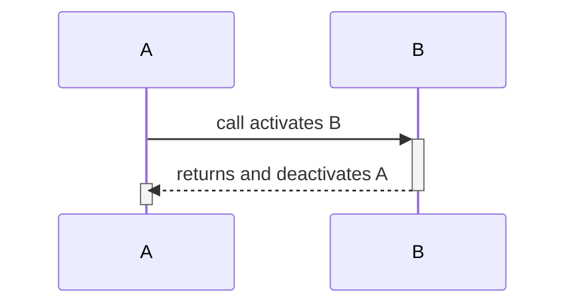

</td>
<td>

⚠️ *Maid renderer currently only supports flowchart diagrams*

</td>
</tr>
</table>

<details>
<summary>View source code</summary>

```
sequenceDiagram
  participant A
  participant B
  A->>+B: call activates B
  B-->>-A: returns and deactivates A
  activate A
  deactivate A


```
</details>

---

## 2. Actors And Aliases

📄 **Source**: [`actors-and-aliases.mmd`](./valid/actors-and-aliases.mmd)

### Rendered Output

<table>
<tr>
<th width="50%">Mermaid (Official)</th>
<th width="50%">Maid (Our Renderer)</th>
</tr>
<tr>
<td>

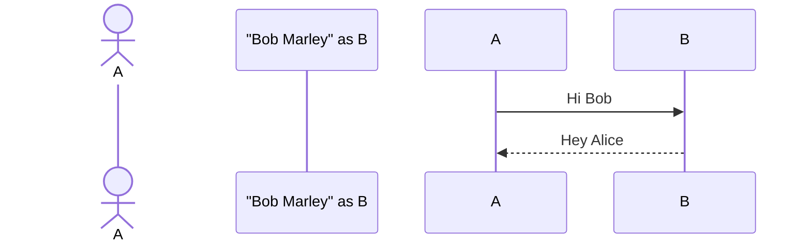

</td>
<td>

⚠️ *Maid renderer currently only supports flowchart diagrams*

</td>
</tr>
</table>

<details>
<summary>View source code</summary>

```
sequenceDiagram
  actor Alice as A
  participant "Bob Marley" as B
  A->>B: Hi Bob
  B-->>A: Hey Alice


```
</details>

---

## 3. Alias Unclosed Quote

📄 **Source**: [`alias-unclosed-quote.mmd`](./valid/alias-unclosed-quote.mmd)

### Rendered Output

<table>
<tr>
<th width="50%">Mermaid (Official)</th>
<th width="50%">Maid (Our Renderer)</th>
</tr>
<tr>
<td>

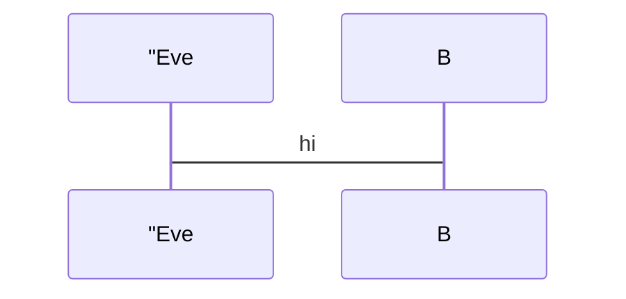

</td>
<td>

⚠️ *Maid renderer currently only supports flowchart diagrams*

</td>
</tr>
</table>

<details>
<summary>View source code</summary>

```
sequenceDiagram
  participant Alice as "Eve
  Alice->B: hi


```
</details>

---

## 4. Alt Minimal

📄 **Source**: [`alt-minimal.mmd`](./valid/alt-minimal.mmd)

### Rendered Output

<table>
<tr>
<th width="50%">Mermaid (Official)</th>
<th width="50%">Maid (Our Renderer)</th>
</tr>
<tr>
<td>

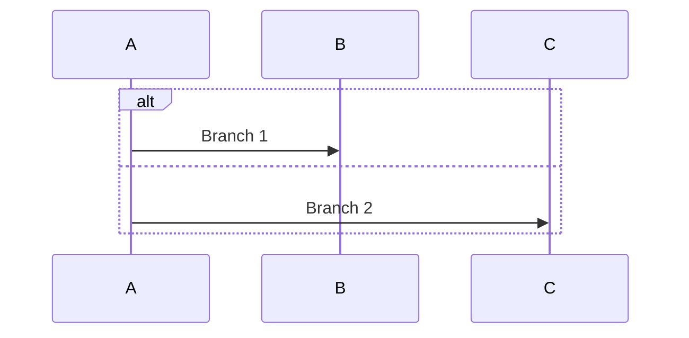

</td>
<td>

⚠️ *Maid renderer currently only supports flowchart diagrams*

</td>
</tr>
</table>

<details>
<summary>View source code</summary>

```
sequenceDiagram
  alt
    A->>B: Branch 1
  else
    A->>C: Branch 2
  end


```
</details>

---

## 5. Autonumber Variants

📄 **Source**: [`autonumber-variants.mmd`](./valid/autonumber-variants.mmd)

### Rendered Output

<table>
<tr>
<th width="50%">Mermaid (Official)</th>
<th width="50%">Maid (Our Renderer)</th>
</tr>
<tr>
<td>

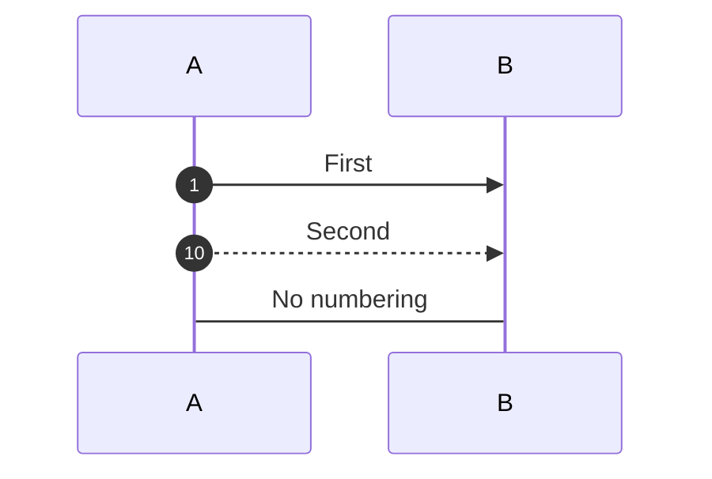

</td>
<td>

⚠️ *Maid renderer currently only supports flowchart diagrams*

</td>
</tr>
</table>

<details>
<summary>View source code</summary>

```
sequenceDiagram
  autonumber
  participant A
  participant B
  A->>B: First
  autonumber 10 10
  A-->>B: Second
  autonumber off
  A->B: No numbering


```
</details>

---

## 6. Basic

📄 **Source**: [`basic.mmd`](./valid/basic.mmd)

### Rendered Output

<table>
<tr>
<th width="50%">Mermaid (Official)</th>
<th width="50%">Maid (Our Renderer)</th>
</tr>
<tr>
<td>

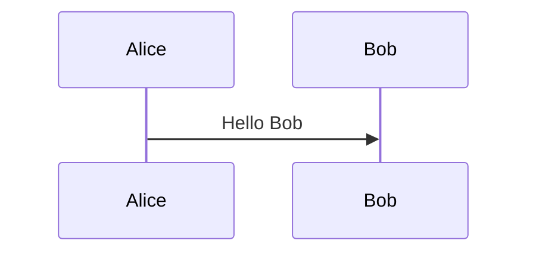

</td>
<td>

⚠️ *Maid renderer currently only supports flowchart diagrams*

</td>
</tr>
</table>

<details>
<summary>View source code</summary>

```
sequenceDiagram
  participant Alice
  participant Bob
  Alice->>Bob: Hello Bob


```
</details>

---

## 7. Bidir And Async Arrows

📄 **Source**: [`bidir-and-async-arrows.mmd`](./valid/bidir-and-async-arrows.mmd)

### Rendered Output

<table>
<tr>
<th width="50%">Mermaid (Official)</th>
<th width="50%">Maid (Our Renderer)</th>
</tr>
<tr>
<td>

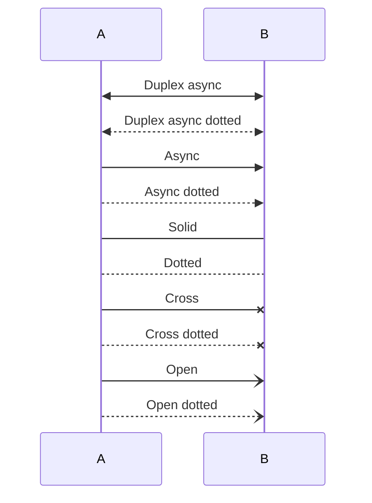

</td>
<td>

⚠️ *Maid renderer currently only supports flowchart diagrams*

</td>
</tr>
</table>

<details>
<summary>View source code</summary>

```
sequenceDiagram
  participant A
  participant B
  A<<->>B: Duplex async
  A<<-->>B: Duplex async dotted
  A->>B: Async
  A-->>B: Async dotted
  A->B: Solid
  A-->B: Dotted
  A-x B: Cross
  A--x B: Cross dotted
  A-) B: Open
  A--) B: Open dotted


```
</details>

---

## 8. Blocks Alt Opt Loop

📄 **Source**: [`blocks-alt-opt-loop.mmd`](./valid/blocks-alt-opt-loop.mmd)

### Rendered Output

<table>
<tr>
<th width="50%">Mermaid (Official)</th>
<th width="50%">Maid (Our Renderer)</th>
</tr>
<tr>
<td>

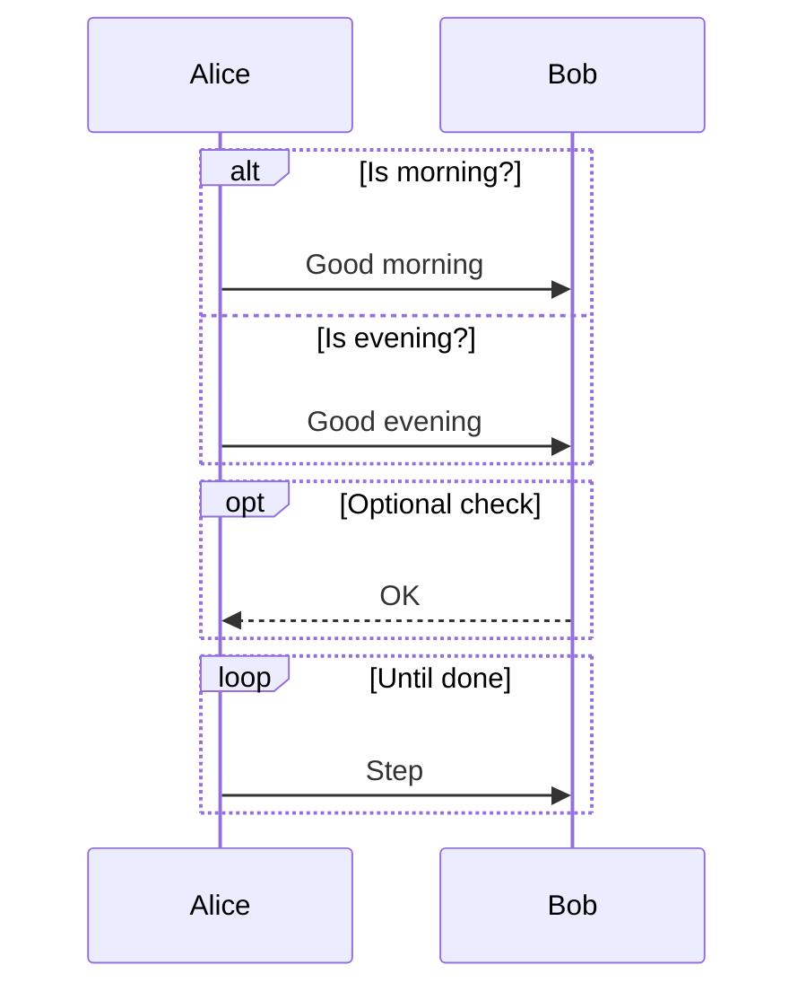

</td>
<td>

⚠️ *Maid renderer currently only supports flowchart diagrams*

</td>
</tr>
</table>

<details>
<summary>View source code</summary>

```
sequenceDiagram
  participant Alice
  participant Bob
  alt Is morning?
    Alice->>Bob: Good morning
  else Is evening?
    Alice->>Bob: Good evening
  end

  opt Optional check
    Bob-->>Alice: OK
  end

  loop Until done
    Alice->>Bob: Step
  end


```
</details>

---

## 9. Box Groups

📄 **Source**: [`box-groups.mmd`](./valid/box-groups.mmd)

### Rendered Output

<table>
<tr>
<th width="50%">Mermaid (Official)</th>
<th width="50%">Maid (Our Renderer)</th>
</tr>
<tr>
<td>

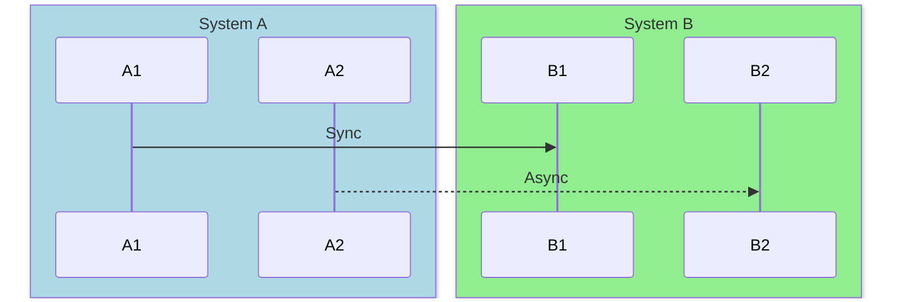

</td>
<td>

⚠️ *Maid renderer currently only supports flowchart diagrams*

</td>
</tr>
</table>

<details>
<summary>View source code</summary>

```
sequenceDiagram
  box LightBlue System A
    participant A1
    participant A2
  end
  box LightGreen System B
    participant B1
    participant B2
  end
  A1->>B1: Sync
  A2-->>B2: Async


```
</details>

---

## 10. Critical Break Rect

📄 **Source**: [`critical-break-rect.mmd`](./valid/critical-break-rect.mmd)

### Rendered Output

<table>
<tr>
<th width="50%">Mermaid (Official)</th>
<th width="50%">Maid (Our Renderer)</th>
</tr>
<tr>
<td>

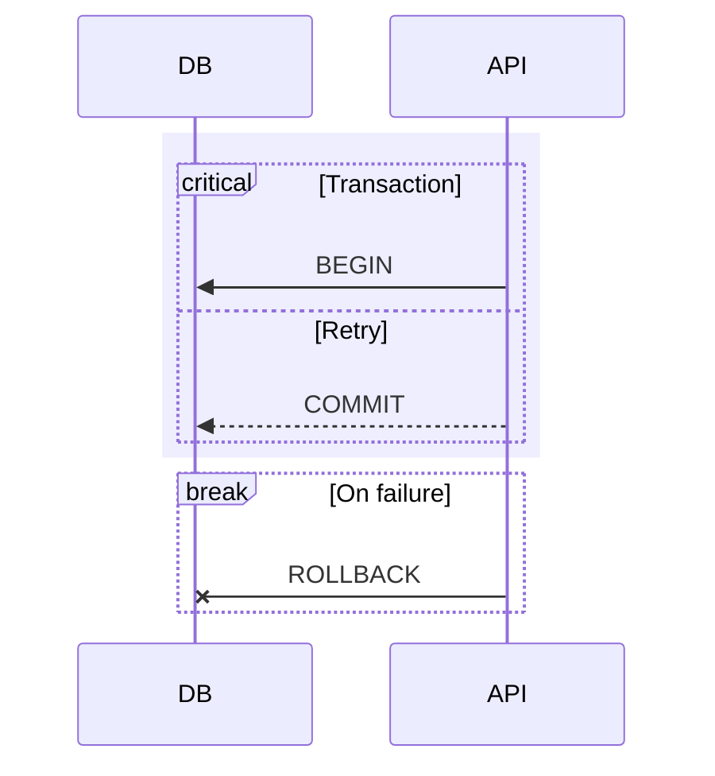

</td>
<td>

⚠️ *Maid renderer currently only supports flowchart diagrams*

</td>
</tr>
</table>

<details>
<summary>View source code</summary>

```
sequenceDiagram
  participant DB
  participant API
  rect rgba(200, 200, 255, 0.3)
    critical Transaction
      API->>DB: BEGIN
      option Retry
        API-->>DB: COMMIT
    end
  end
  break On failure
    API-x DB: ROLLBACK
  end


```
</details>

---

## 11. Links And Menus

📄 **Source**: [`links-and-menus.mmd`](./valid/links-and-menus.mmd)

### Rendered Output

<table>
<tr>
<th width="50%">Mermaid (Official)</th>
<th width="50%">Maid (Our Renderer)</th>
</tr>
<tr>
<td>

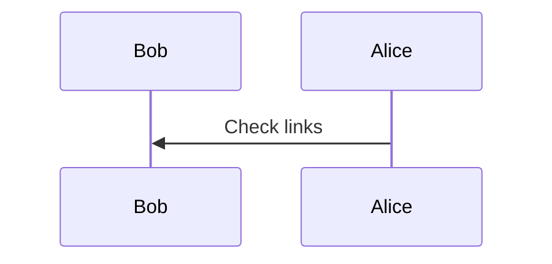

</td>
<td>

⚠️ *Maid renderer currently only supports flowchart diagrams*

</td>
</tr>
</table>

<details>
<summary>View source code</summary>

```
sequenceDiagram
  participant Bob
  link Bob: Dashboard @ https://example.com/dashboard
  links Bob: {"Docs": "https://example.com/docs", "Repo": "https://example.com/repo"}
  participant Alice
  Alice->>Bob: Check links


```
</details>

---

## 12. Notes

📄 **Source**: [`notes.mmd`](./valid/notes.mmd)

### Rendered Output

<table>
<tr>
<th width="50%">Mermaid (Official)</th>
<th width="50%">Maid (Our Renderer)</th>
</tr>
<tr>
<td>

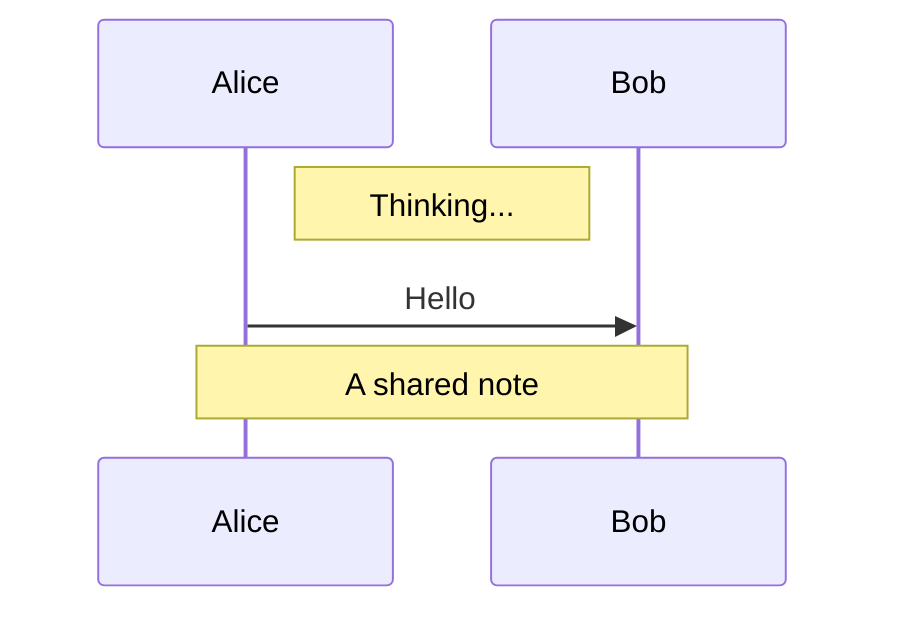

</td>
<td>

⚠️ *Maid renderer currently only supports flowchart diagrams*

</td>
</tr>
</table>

<details>
<summary>View source code</summary>

```
sequenceDiagram
  participant Alice
  participant Bob
  Note right of Alice: Thinking...
  Alice->>Bob: Hello
  Note over Alice,Bob: A shared note


```
</details>

---

## 13. Par And

📄 **Source**: [`par-and.mmd`](./valid/par-and.mmd)

### Rendered Output

<table>
<tr>
<th width="50%">Mermaid (Official)</th>
<th width="50%">Maid (Our Renderer)</th>
</tr>
<tr>
<td>

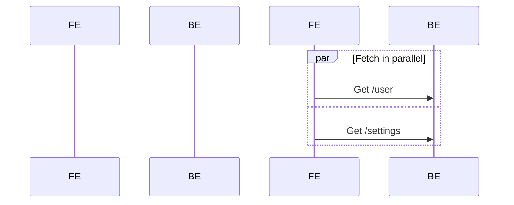

</td>
<td>

⚠️ *Maid renderer currently only supports flowchart diagrams*

</td>
</tr>
</table>

<details>
<summary>View source code</summary>

```
sequenceDiagram
  participant Frontend as FE
  participant Backend as BE
  par Fetch in parallel
    FE->>BE: Get /user
  and
    FE->>BE: Get /settings
  end


```
</details>

---

## 14. Par Minimal

📄 **Source**: [`par-minimal.mmd`](./valid/par-minimal.mmd)

### Rendered Output

<table>
<tr>
<th width="50%">Mermaid (Official)</th>
<th width="50%">Maid (Our Renderer)</th>
</tr>
<tr>
<td>

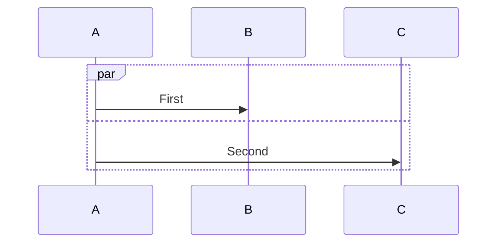

</td>
<td>

⚠️ *Maid renderer currently only supports flowchart diagrams*

</td>
</tr>
</table>

<details>
<summary>View source code</summary>

```
sequenceDiagram
  par
    A->>B: First
  and
    A->>C: Second
  end


```
</details>

---

## 15. Participant Double In Double

📄 **Source**: [`participant-double-in-double.mmd`](./valid/participant-double-in-double.mmd)

### Rendered Output

<table>
<tr>
<th width="50%">Mermaid (Official)</th>
<th width="50%">Maid (Our Renderer)</th>
</tr>
<tr>
<td>

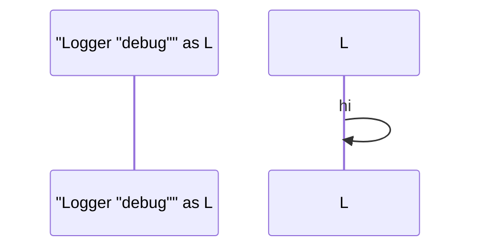

</td>
<td>

⚠️ *Maid renderer currently only supports flowchart diagrams*

</td>
</tr>
</table>

<details>
<summary>View source code</summary>

```
sequenceDiagram
  participant "Logger "debug"" as L
  L->>L: hi


```
</details>

---

## 16. Participant Escaped Quotes

📄 **Source**: [`participant-escaped-quotes.mmd`](./valid/participant-escaped-quotes.mmd)

### Rendered Output

<table>
<tr>
<th width="50%">Mermaid (Official)</th>
<th width="50%">Maid (Our Renderer)</th>
</tr>
<tr>
<td>

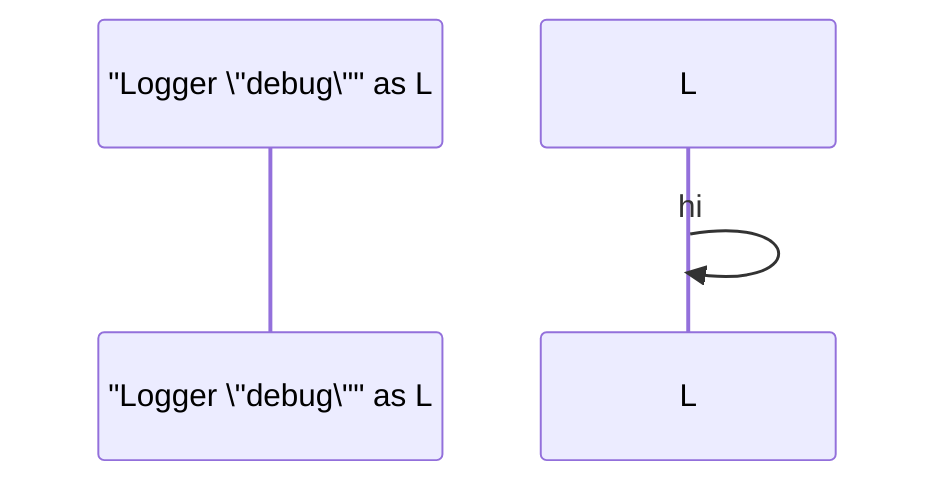

</td>
<td>

⚠️ *Maid renderer currently only supports flowchart diagrams*

</td>
</tr>
</table>

<details>
<summary>View source code</summary>

```
sequenceDiagram
  participant "Logger \"debug\"" as L
  L->>L: hi


```
</details>

---

## 17. Participant Unclosed Quote

📄 **Source**: [`participant-unclosed-quote.mmd`](./valid/participant-unclosed-quote.mmd)

### Rendered Output

<table>
<tr>
<th width="50%">Mermaid (Official)</th>
<th width="50%">Maid (Our Renderer)</th>
</tr>
<tr>
<td>

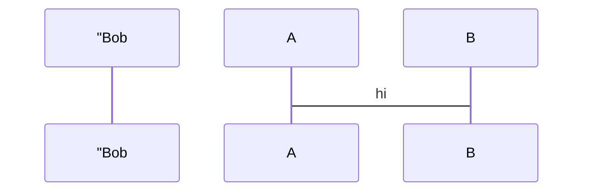

</td>
<td>

⚠️ *Maid renderer currently only supports flowchart diagrams*

</td>
</tr>
</table>

<details>
<summary>View source code</summary>

```
sequenceDiagram
  participant "Bob
  A->B: hi


```
</details>

---

## Validation Status

All diagrams in this file have been validated against:
- ✅ Our Mermaid linter
- ✅ Official mermaid-cli
- ✅ Our Maid renderer (flowcharts only)
- ✅ GitHub's Mermaid renderer

## Renderer Comparison Summary

- **Mermaid.js**: Full-featured, 2.6MB bundle, supports all diagram types
- **Maid Renderer**: Lightweight, 294KB bundle, currently flowcharts only

Generated by scripts/generate-preview-with-renderer.js
