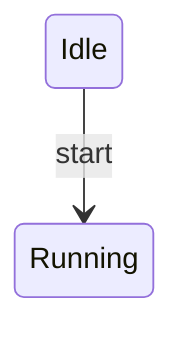
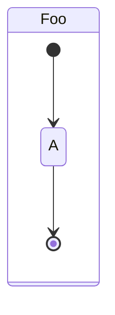
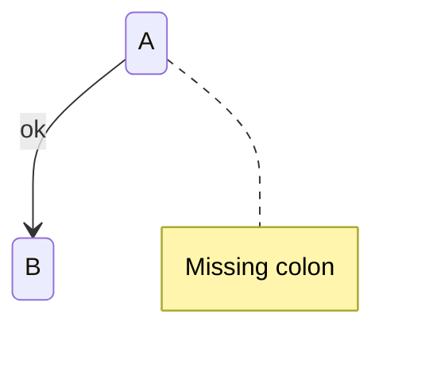
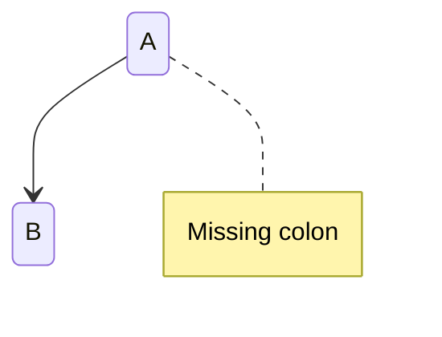

# Invalid State Diagrams

This file contains invalid state test fixtures with:
- GitHub render attempts
- Error from mermaid-cli
- Error/output from our linter

> Note: Auto-generated by `scripts/generate-previews.js`. Do not edit manually.

## Table of Contents

1. [Concurrency Adjacent](#1-concurrency-adjacent)
2. [Concurrency At End](#2-concurrency-at-end)
3. [Concurrency At Start](#3-concurrency-at-start)
4. [Concurrency Outside Block](#4-concurrency-outside-block)
5. [Concurrency Two Regions](#5-concurrency-two-regions)
6. [Header Missing](#6-header-missing)
7. [Invalid Arrow](#7-invalid-arrow)
8. [Markers And Concurrency](#8-markers-and-concurrency)
9. [Missing Rbrace](#9-missing-rbrace)
10. [Note Glued To Previous](#10-note-glued-to-previous)
11. [Note Missing Colon](#11-note-missing-colon)
12. [Note Over Missing Colon](#12-note-over-missing-colon)

---

## Summary

| # | Diagram | mermaid-cli | maid | Auto-fix? |
|---:|---|:---:|:---:|:---:|
| 1 | [concurrency adjacent](#1-concurrency-adjacent) | INVALID | INVALID | — |
| 2 | [concurrency at end](#2-concurrency-at-end) | INVALID | INVALID | — |
| 3 | [concurrency at start](#3-concurrency-at-start) | INVALID | INVALID | — |
| 4 | [concurrency outside block](#4-concurrency-outside-block) | INVALID | INVALID | — |
| 5 | [concurrency two regions](#5-concurrency-two-regions) | INVALID | INVALID | — |
| 6 | [header missing](#6-header-missing) | INVALID | INVALID | — |
| 7 | [invalid arrow](#7-invalid-arrow) | INVALID | INVALID | ✅ safe |
| 8 | [markers and concurrency](#8-markers-and-concurrency) | INVALID | INVALID | — |
| 9 | [missing rbrace](#9-missing-rbrace) | INVALID | INVALID | ✅ safe |
| 10 | [note glued to previous](#10-note-glued-to-previous) | INVALID | INVALID | — |
| 11 | [note missing colon](#11-note-missing-colon) | INVALID | INVALID | ✅ safe |
| 12 | [note over missing colon](#12-note-over-missing-colon) | INVALID | INVALID | ✅ safe |

---

## 1. Concurrency Adjacent

📄 **Source**: [`concurrency-adjacent.mmd`](./invalid/concurrency-adjacent.mmd)

### GitHub Render Attempt

> **Note**: This invalid diagram may not render or may render incorrectly.

```mermaid
stateDiagram-v2
  state S {
    A --> B : ev1
    ---
    ---
    C --> D : ev2
  }


```

### Error Comparison: mermaid-cli vs maid

<table>
<tr>
<th width="50%">mermaid-cli</th>
<th width="50%">maid</th>
</tr>
<tr>
<td valign="top">

**Result**: ❌ INVALID

```
Error: Lexical error on line 4. Unrecognized text.
...A --> B : ev1    ---    ---    C --> 
----------------------^
Parser3.parseError (node_modules/mermaid/dist/mermaid.js:129832:28)
    at #evaluate (node_modules/puppeteer-core/lib/esm/puppeteer/cdp/ExecutionContext.js:388:19)
    at async ExecutionContext.evaluate (node_modules/puppeteer-core/lib/esm/puppeteer/cdp/ExecutionContext.js:275:16)
    at async IsolatedWorld.evaluate (node_modules/puppeteer-core/lib/esm/puppeteer/cdp/IsolatedWorld.js:97:16)
    at async CdpJSHandle.evaluate (node_modules/puppeteer-core/lib/esm/puppeteer/api/JSHandle.js:146:20)
    at async CdpElementHandle.evaluate (node_modules/puppeteer-core/lib/esm/puppeteer/api/ElementHandle.js:340:20)
    at async CdpElementHandle.$eval (node_modules/puppeteer-core/lib/esm/puppeteer/api/ElementHandle.js:494:24)
    at async CdpFrame.$eval (node_modules/puppeteer-core/lib/esm/puppeteer/api/Frame.js:450:20)
    at async CdpPage.$eval (node_modules/puppeteer-core/lib/esm/puppeteer/api/Page.js:450:20)
    at async renderMermaid (node_modules/@mermaid-js/mermaid-cli/src/index.js:266:22)
    at fromText (node_modules/mermaid/dist/mermaid.js:153955:21)
```

</td>
<td valign="top">

**Result**: ❌ INVALID

```
error[ST-CONCURRENCY-UNSUPPORTED]: Concurrency separator '---' is not supported by Mermaid CLI in state diagrams.
at test-fixtures/state/invalid/concurrency-adjacent.mmd:4:1
  3 |     A --> B : ev1
  4 |     ---
    | ^
  5 |     ---
hint: Remove '---' or split logic into separate composite states.

error[ST-CONCURRENCY-UNSUPPORTED]: Concurrency separator '---' is not supported by Mermaid CLI in state diagrams.
at test-fixtures/state/invalid/concurrency-adjacent.mmd:5:1
  4 |     ---
  5 |     ---
    | ^
  6 |     C --> D : ev2
hint: Remove '---' or split logic into separate composite states.

error[ST-CONCURRENCY-MISPLACED]: Concurrency separator '---' must be between regions, not at the start or end of a block.
at test-fixtures/state/invalid/concurrency-adjacent.mmd:4:1
  3 |     A --> B : ev1
  4 |     ---
    | ^
  5 |     ---
hint: Place '---' between two sets of state lines inside the same block.

error[ST-CONCURRENCY-MISPLACED]: Concurrency separator '---' must be between regions, not at the start or end of a block.
at test-fixtures/state/invalid/concurrency-adjacent.mmd:5:1
  4 |     ---
  5 |     ---
    | ^
  6 |     C --> D : ev2
hint: Place '---' between two sets of state lines inside the same block.
```

</td>
</tr>
</table>

### maid Auto-fix (`--fix`) Preview

No auto-fix changes (safe level).

### maid Auto-fix (`--fix=all`) Preview

No auto-fix changes (all level).

<details>
<summary>View source code</summary>

```
stateDiagram-v2
  state S {
    A --> B : ev1
    ---
    ---
    C --> D : ev2
  }


```
</details>

---

## 2. Concurrency At End

📄 **Source**: [`concurrency-at-end.mmd`](./invalid/concurrency-at-end.mmd)

### GitHub Render Attempt

> **Note**: This invalid diagram may not render or may render incorrectly.

```mermaid
stateDiagram-v2
  state S {
    A --> B : ev1
    ---
  }


```

### Error Comparison: mermaid-cli vs maid

<table>
<tr>
<th width="50%">mermaid-cli</th>
<th width="50%">maid</th>
</tr>
<tr>
<td valign="top">

**Result**: ❌ INVALID

```
Error: Lexical error on line 4. Unrecognized text.
...A --> B : ev1    ---  }
----------------------^
Parser3.parseError (node_modules/mermaid/dist/mermaid.js:129832:28)
    at #evaluate (node_modules/puppeteer-core/lib/esm/puppeteer/cdp/ExecutionContext.js:388:19)
    at async ExecutionContext.evaluate (node_modules/puppeteer-core/lib/esm/puppeteer/cdp/ExecutionContext.js:275:16)
    at async IsolatedWorld.evaluate (node_modules/puppeteer-core/lib/esm/puppeteer/cdp/IsolatedWorld.js:97:16)
    at async CdpJSHandle.evaluate (node_modules/puppeteer-core/lib/esm/puppeteer/api/JSHandle.js:146:20)
    at async CdpElementHandle.evaluate (node_modules/puppeteer-core/lib/esm/puppeteer/api/ElementHandle.js:340:20)
    at async CdpElementHandle.$eval (node_modules/puppeteer-core/lib/esm/puppeteer/api/ElementHandle.js:494:24)
    at async CdpFrame.$eval (node_modules/puppeteer-core/lib/esm/puppeteer/api/Frame.js:450:20)
    at async CdpPage.$eval (node_modules/puppeteer-core/lib/esm/puppeteer/api/Page.js:450:20)
    at async renderMermaid (node_modules/@mermaid-js/mermaid-cli/src/index.js:266:22)
    at fromText (node_modules/mermaid/dist/mermaid.js:153955:21)
```

</td>
<td valign="top">

**Result**: ❌ INVALID

```
error[ST-CONCURRENCY-UNSUPPORTED]: Concurrency separator '---' is not supported by Mermaid CLI in state diagrams.
at test-fixtures/state/invalid/concurrency-at-end.mmd:4:1
  3 |     A --> B : ev1
  4 |     ---
    | ^
  5 |   }
hint: Remove '---' or split logic into separate composite states.

error[ST-CONCURRENCY-MISPLACED]: Concurrency separator '---' must be between regions, not at the start or end of a block.
at test-fixtures/state/invalid/concurrency-at-end.mmd:4:1
  3 |     A --> B : ev1
  4 |     ---
    | ^
  5 |   }
hint: Place '---' between two sets of state lines inside the same block.
```

</td>
</tr>
</table>

### maid Auto-fix (`--fix`) Preview

No auto-fix changes (safe level).

### maid Auto-fix (`--fix=all`) Preview

No auto-fix changes (all level).

<details>
<summary>View source code</summary>

```
stateDiagram-v2
  state S {
    A --> B : ev1
    ---
  }


```
</details>

---

## 3. Concurrency At Start

📄 **Source**: [`concurrency-at-start.mmd`](./invalid/concurrency-at-start.mmd)

### GitHub Render Attempt

> **Note**: This invalid diagram may not render or may render incorrectly.

```mermaid
stateDiagram-v2
  state S {
    ---
    A --> B : ev1
  }


```

### Error Comparison: mermaid-cli vs maid

<table>
<tr>
<th width="50%">mermaid-cli</th>
<th width="50%">maid</th>
</tr>
<tr>
<td valign="top">

**Result**: ❌ INVALID

```
Error: Lexical error on line 3. Unrecognized text.
...2  state S {    ---    A --> B : ev1
---------------------^
Parser3.parseError (node_modules/mermaid/dist/mermaid.js:129832:28)
    at #evaluate (node_modules/puppeteer-core/lib/esm/puppeteer/cdp/ExecutionContext.js:388:19)
    at async ExecutionContext.evaluate (node_modules/puppeteer-core/lib/esm/puppeteer/cdp/ExecutionContext.js:275:16)
    at async IsolatedWorld.evaluate (node_modules/puppeteer-core/lib/esm/puppeteer/cdp/IsolatedWorld.js:97:16)
    at async CdpJSHandle.evaluate (node_modules/puppeteer-core/lib/esm/puppeteer/api/JSHandle.js:146:20)
    at async CdpElementHandle.evaluate (node_modules/puppeteer-core/lib/esm/puppeteer/api/ElementHandle.js:340:20)
    at async CdpElementHandle.$eval (node_modules/puppeteer-core/lib/esm/puppeteer/api/ElementHandle.js:494:24)
    at async CdpFrame.$eval (node_modules/puppeteer-core/lib/esm/puppeteer/api/Frame.js:450:20)
    at async CdpPage.$eval (node_modules/puppeteer-core/lib/esm/puppeteer/api/Page.js:450:20)
    at async renderMermaid (node_modules/@mermaid-js/mermaid-cli/src/index.js:266:22)
    at fromText (node_modules/mermaid/dist/mermaid.js:153955:21)
```

</td>
<td valign="top">

**Result**: ❌ INVALID

```
error[ST-CONCURRENCY-UNSUPPORTED]: Concurrency separator '---' is not supported by Mermaid CLI in state diagrams.
at test-fixtures/state/invalid/concurrency-at-start.mmd:3:1
  2 |   state S {
  3 |     ---
    | ^
  4 |     A --> B : ev1
hint: Remove '---' or split logic into separate composite states.

error[ST-CONCURRENCY-MISPLACED]: Concurrency separator '---' must be between regions, not at the start or end of a block.
at test-fixtures/state/invalid/concurrency-at-start.mmd:3:1
  2 |   state S {
  3 |     ---
    | ^
  4 |     A --> B : ev1
hint: Place '---' between two sets of state lines inside the same block.
```

</td>
</tr>
</table>

### maid Auto-fix (`--fix`) Preview

No auto-fix changes (safe level).

### maid Auto-fix (`--fix=all`) Preview

No auto-fix changes (all level).

<details>
<summary>View source code</summary>

```
stateDiagram-v2
  state S {
    ---
    A --> B : ev1
  }


```
</details>

---

## 4. Concurrency Outside Block

📄 **Source**: [`concurrency-outside-block.mmd`](./invalid/concurrency-outside-block.mmd)

### GitHub Render Attempt

> **Note**: This invalid diagram may not render or may render incorrectly.

```mermaid
stateDiagram-v2
[*] --> A
---
A --> [*]


```

### Error Comparison: mermaid-cli vs maid

<table>
<tr>
<th width="50%">mermaid-cli</th>
<th width="50%">maid</th>
</tr>
<tr>
<td valign="top">

**Result**: ❌ INVALID

```
Error: Parse error on line 3:
...iagram-v2[*] --> A---A --> [*]
---------------------^
Expecting 'SPACE', 'NL', 'HIDE_EMPTY', 'scale', 'COMPOSIT_STATE', 'STRUCT_STOP', 'STATE_DESCR', 'ID', 'FORK', 'JOIN', 'CHOICE', 'CONCURRENT', 'note', 'acc_title', 'acc_descr', 'acc_descr_multiline_value', 'CLICK', 'classDef', 'style', 'class', 'direction_tb', 'direction_bt', 'direction_rl', 'direction_lr', 'EDGE_STATE', got 'INVALID'
Parser3.parseError (node_modules/mermaid/dist/mermaid.js:129832:28)
    at #evaluate (node_modules/puppeteer-core/lib/esm/puppeteer/cdp/ExecutionContext.js:388:19)
    at async ExecutionContext.evaluate (node_modules/puppeteer-core/lib/esm/puppeteer/cdp/ExecutionContext.js:275:16)
    at async IsolatedWorld.evaluate (node_modules/puppeteer-core/lib/esm/puppeteer/cdp/IsolatedWorld.js:97:16)
    at async CdpJSHandle.evaluate (node_modules/puppeteer-core/lib/esm/puppeteer/api/JSHandle.js:146:20)
    at async CdpElementHandle.evaluate (node_modules/puppeteer-core/lib/esm/puppeteer/api/ElementHandle.js:340:20)
    at async CdpElementHandle.$eval (node_modules/puppeteer-core/lib/esm/puppeteer/api/ElementHandle.js:494:24)
    at async CdpFrame.$eval (node_modules/puppeteer-core/lib/esm/puppeteer/api/Frame.js:450:20)
    at async CdpPage.$eval (node_modules/puppeteer-core/lib/esm/puppeteer/api/Page.js:450:20)
    at async renderMermaid (node_modules/@mermaid-js/mermaid-cli/src/index.js:266:22)
    at fromText (node_modules/mermaid/dist/mermaid.js:153955:21)
```

</td>
<td valign="top">

**Result**: ❌ INVALID

```
error: Redundant input, expecting EOF but found: ---
at test-fixtures/state/invalid/concurrency-outside-block.mmd:3:1
  2 | [*] --> A
  3 | ---
    | ^^^
  4 | A --> [*]
```

</td>
</tr>
</table>

### maid Auto-fix (`--fix`) Preview

No auto-fix changes (safe level).

### maid Auto-fix (`--fix=all`) Preview

No auto-fix changes (all level).

<details>
<summary>View source code</summary>

```
stateDiagram-v2
[*] --> A
---
A --> [*]


```
</details>

---

## 5. Concurrency Two Regions

📄 **Source**: [`concurrency-two-regions.mmd`](./invalid/concurrency-two-regions.mmd)

### GitHub Render Attempt

> **Note**: This invalid diagram may not render or may render incorrectly.

```mermaid
stateDiagram-v2
  state Outer {
    [*] --> A
    ---
    [*] --> B
  }


```

### Error Comparison: mermaid-cli vs maid

<table>
<tr>
<th width="50%">mermaid-cli</th>
<th width="50%">maid</th>
</tr>
<tr>
<td valign="top">

**Result**: ❌ INVALID

```
Error: Lexical error on line 4. Unrecognized text.
...    [*] --> A    ---    [*] --> B  }
----------------------^
Parser3.parseError (node_modules/mermaid/dist/mermaid.js:129832:28)
    at #evaluate (node_modules/puppeteer-core/lib/esm/puppeteer/cdp/ExecutionContext.js:388:19)
    at async ExecutionContext.evaluate (node_modules/puppeteer-core/lib/esm/puppeteer/cdp/ExecutionContext.js:275:16)
    at async IsolatedWorld.evaluate (node_modules/puppeteer-core/lib/esm/puppeteer/cdp/IsolatedWorld.js:97:16)
    at async CdpJSHandle.evaluate (node_modules/puppeteer-core/lib/esm/puppeteer/api/JSHandle.js:146:20)
    at async CdpElementHandle.evaluate (node_modules/puppeteer-core/lib/esm/puppeteer/api/ElementHandle.js:340:20)
    at async CdpElementHandle.$eval (node_modules/puppeteer-core/lib/esm/puppeteer/api/ElementHandle.js:494:24)
    at async CdpFrame.$eval (node_modules/puppeteer-core/lib/esm/puppeteer/api/Frame.js:450:20)
    at async CdpPage.$eval (node_modules/puppeteer-core/lib/esm/puppeteer/api/Page.js:450:20)
    at async renderMermaid (node_modules/@mermaid-js/mermaid-cli/src/index.js:266:22)
    at fromText (node_modules/mermaid/dist/mermaid.js:153955:21)
```

</td>
<td valign="top">

**Result**: ❌ INVALID

```
error[ST-CONCURRENCY-UNSUPPORTED]: Concurrency separator '---' is not supported by Mermaid CLI in state diagrams.
at test-fixtures/state/invalid/concurrency-two-regions.mmd:4:1
  3 |     [*] --> A
  4 |     ---
    | ^
  5 |     [*] --> B
hint: Remove '---' or split logic into separate composite states.
```

</td>
</tr>
</table>

### maid Auto-fix (`--fix`) Preview

No auto-fix changes (safe level).

### maid Auto-fix (`--fix=all`) Preview

No auto-fix changes (all level).

<details>
<summary>View source code</summary>

```
stateDiagram-v2
  state Outer {
    [*] --> A
    ---
    [*] --> B
  }


```
</details>

---

## 6. Header Missing

📄 **Source**: [`header-missing.mmd`](./invalid/header-missing.mmd)

### GitHub Render Attempt

> **Note**: This invalid diagram may not render or may render incorrectly.

```mermaid
A --> B


```

### Error Comparison: mermaid-cli vs maid

<table>
<tr>
<th width="50%">mermaid-cli</th>
<th width="50%">maid</th>
</tr>
<tr>
<td valign="top">

**Result**: ❌ INVALID

```
UnknownDiagramError: No diagram type detected matching given configuration for text: A --> B


detectType (node_modules/mermaid/dist/mermaid.js:20437:15)
    at $eval ($eval at renderMermaid (node_modules/@mermaid-js/mermaid-cli/src/index.js:266:33), <anonymous>:48:45)
    at #evaluate (node_modules/puppeteer-core/lib/esm/puppeteer/cdp/ExecutionContext.js:388:19)
    at async ExecutionContext.evaluate (node_modules/puppeteer-core/lib/esm/puppeteer/cdp/ExecutionContext.js:275:16)
    at async IsolatedWorld.evaluate (node_modules/puppeteer-core/lib/esm/puppeteer/cdp/IsolatedWorld.js:97:16)
    at async CdpJSHandle.evaluate (node_modules/puppeteer-core/lib/esm/puppeteer/api/JSHandle.js:146:20)
    at async CdpElementHandle.evaluate (node_modules/puppeteer-core/lib/esm/puppeteer/api/ElementHandle.js:340:20)
    at async CdpElementHandle.$eval (node_modules/puppeteer-core/lib/esm/puppeteer/api/ElementHandle.js:494:24)
    at async CdpFrame.$eval (node_modules/puppeteer-core/lib/esm/puppeteer/api/Frame.js:450:20)
    at async CdpPage.$eval (node_modules/puppeteer-core/lib/esm/puppeteer/api/Page.js:450:20)
    at async renderMermaid (node_modules/@mermaid-js/mermaid-cli/src/index.js:266:22)
```

</td>
<td valign="top">

**Result**: ❌ INVALID

```
error[GEN-HEADER-INVALID]: Diagram must start with "graph", "flowchart", "pie", "sequenceDiagram", "classDiagram" or "stateDiagram[-v2]"
at test-fixtures/state/invalid/header-missing.mmd:1:1
  1 | A --> B
    | ^
  2 | 
hint: Start with: flowchart TD | pie | sequenceDiagram | classDiagram | stateDiagram-v2.
```

</td>
</tr>
</table>

### maid Auto-fix (`--fix`) Preview

No auto-fix changes (safe level).

### maid Auto-fix (`--fix=all`) Preview

No auto-fix changes (all level).

<details>
<summary>View source code</summary>

```
A --> B


```
</details>

---

## 7. Invalid Arrow

📄 **Source**: [`invalid-arrow.mmd`](./invalid/invalid-arrow.mmd)

### GitHub Render Attempt

> **Note**: This invalid diagram may not render or may render incorrectly.

```mermaid
stateDiagram-v2
Idle -> Running : start


```

### Error Comparison: mermaid-cli vs maid

<table>
<tr>
<th width="50%">mermaid-cli</th>
<th width="50%">maid</th>
</tr>
<tr>
<td valign="top">

**Result**: ❌ INVALID

```
Error: Parse error on line 2:
...tateDiagram-v2Idle -> Running : start
----------------------^
Expecting 'SPACE', 'NL', 'DESCR', '-->', 'HIDE_EMPTY', 'scale', 'COMPOSIT_STATE', 'STRUCT_STOP', 'STATE_DESCR', 'ID', 'FORK', 'JOIN', 'CHOICE', 'CONCURRENT', 'note', 'acc_title', 'acc_descr', 'acc_descr_multiline_value', 'CLICK', 'STRING', 'HREF', 'classDef', 'style', 'class', 'direction_tb', 'direction_bt', 'direction_rl', 'direction_lr', 'EDGE_STATE', 'STYLE_SEPARATOR', got 'INVALID'
Parser3.parseError (node_modules/mermaid/dist/mermaid.js:129832:28)
    at #evaluate (node_modules/puppeteer-core/lib/esm/puppeteer/cdp/ExecutionContext.js:388:19)
    at async ExecutionContext.evaluate (node_modules/puppeteer-core/lib/esm/puppeteer/cdp/ExecutionContext.js:275:16)
    at async IsolatedWorld.evaluate (node_modules/puppeteer-core/lib/esm/puppeteer/cdp/IsolatedWorld.js:97:16)
    at async CdpJSHandle.evaluate (node_modules/puppeteer-core/lib/esm/puppeteer/api/JSHandle.js:146:20)
    at async CdpElementHandle.evaluate (node_modules/puppeteer-core/lib/esm/puppeteer/api/ElementHandle.js:340:20)
    at async CdpElementHandle.$eval (node_modules/puppeteer-core/lib/esm/puppeteer/api/ElementHandle.js:494:24)
    at async CdpFrame.$eval (node_modules/puppeteer-core/lib/esm/puppeteer/api/Frame.js:450:20)
    at async CdpPage.$eval (node_modules/puppeteer-core/lib/esm/puppeteer/api/Page.js:450:20)
    at async renderMermaid (node_modules/@mermaid-js/mermaid-cli/src/index.js:266:22)
    at fromText (node_modules/mermaid/dist/mermaid.js:153955:21)
```

</td>
<td valign="top">

**Result**: ❌ INVALID

```
error[ST-ARROW-INVALID]: Invalid arrow '->'. Use '-->' in state transitions.
at test-fixtures/state/invalid/invalid-arrow.mmd:2:6
  1 | stateDiagram-v2
  2 | Idle -> Running : start
    |      ^^
  3 | 
hint: Example: A --> B : event
```

</td>
</tr>
</table>

### maid Auto-fix (`--fix`) Preview



### maid Auto-fix (`--fix=all`) Preview

Shown above (safe changes applied).

<details>
<summary>View source code</summary>

```
stateDiagram-v2
Idle -> Running : start


```
</details>

---

## 8. Markers And Concurrency

📄 **Source**: [`markers-and-concurrency.mmd`](./invalid/markers-and-concurrency.mmd)

### GitHub Render Attempt

> **Note**: This invalid diagram may not render or may render incorrectly.

```mermaid
stateDiagram-v2
state Auth {
  [*] --> Stage1
  ---
  Stage2 --> [*]
}


```

### Error Comparison: mermaid-cli vs maid

<table>
<tr>
<th width="50%">mermaid-cli</th>
<th width="50%">maid</th>
</tr>
<tr>
<td valign="top">

**Result**: ❌ INVALID

```
Error: Lexical error on line 4. Unrecognized text.
... [*] --> Stage1  ---  Stage2 --> [*]}
----------------------^
Parser3.parseError (node_modules/mermaid/dist/mermaid.js:129832:28)
    at #evaluate (node_modules/puppeteer-core/lib/esm/puppeteer/cdp/ExecutionContext.js:388:19)
    at async ExecutionContext.evaluate (node_modules/puppeteer-core/lib/esm/puppeteer/cdp/ExecutionContext.js:275:16)
    at async IsolatedWorld.evaluate (node_modules/puppeteer-core/lib/esm/puppeteer/cdp/IsolatedWorld.js:97:16)
    at async CdpJSHandle.evaluate (node_modules/puppeteer-core/lib/esm/puppeteer/api/JSHandle.js:146:20)
    at async CdpElementHandle.evaluate (node_modules/puppeteer-core/lib/esm/puppeteer/api/ElementHandle.js:340:20)
    at async CdpElementHandle.$eval (node_modules/puppeteer-core/lib/esm/puppeteer/api/ElementHandle.js:494:24)
    at async CdpFrame.$eval (node_modules/puppeteer-core/lib/esm/puppeteer/api/Frame.js:450:20)
    at async CdpPage.$eval (node_modules/puppeteer-core/lib/esm/puppeteer/api/Page.js:450:20)
    at async renderMermaid (node_modules/@mermaid-js/mermaid-cli/src/index.js:266:22)
    at fromText (node_modules/mermaid/dist/mermaid.js:153955:21)
```

</td>
<td valign="top">

**Result**: ❌ INVALID

```
error[ST-CONCURRENCY-UNSUPPORTED]: Concurrency separator '---' is not supported by Mermaid CLI in state diagrams.
at test-fixtures/state/invalid/markers-and-concurrency.mmd:4:1
  3 |   [*] --> Stage1
  4 |   ---
    | ^
  5 |   Stage2 --> [*]
hint: Remove '---' or split logic into separate composite states.
```

</td>
</tr>
</table>

### maid Auto-fix (`--fix`) Preview

No auto-fix changes (safe level).

### maid Auto-fix (`--fix=all`) Preview

No auto-fix changes (all level).

<details>
<summary>View source code</summary>

```
stateDiagram-v2
state Auth {
  [*] --> Stage1
  ---
  Stage2 --> [*]
}


```
</details>

---

## 9. Missing Rbrace

📄 **Source**: [`missing-rbrace.mmd`](./invalid/missing-rbrace.mmd)

### GitHub Render Attempt

> **Note**: This invalid diagram may not render or may render incorrectly.

```mermaid
stateDiagram-v2
state Foo {
  [*] --> A
  A --> [*]


```

### Error Comparison: mermaid-cli vs maid

<table>
<tr>
<th width="50%">mermaid-cli</th>
<th width="50%">maid</th>
</tr>
<tr>
<td valign="top">

**Result**: ❌ INVALID

```
Error: Parse error on line 4:
...--> A  A --> [*]
-------------------^
Expecting 'SPACE', 'NL', 'HIDE_EMPTY', 'scale', 'COMPOSIT_STATE', 'STRUCT_STOP', 'STATE_DESCR', 'ID', 'FORK', 'JOIN', 'CHOICE', 'CONCURRENT', 'note', 'acc_title', 'acc_descr', 'acc_descr_multiline_value', 'CLICK', 'classDef', 'style', 'class', 'direction_tb', 'direction_bt', 'direction_rl', 'direction_lr', 'EDGE_STATE', got '1'
Parser3.parseError (node_modules/mermaid/dist/mermaid.js:129832:28)
    at #evaluate (node_modules/puppeteer-core/lib/esm/puppeteer/cdp/ExecutionContext.js:388:19)
    at async ExecutionContext.evaluate (node_modules/puppeteer-core/lib/esm/puppeteer/cdp/ExecutionContext.js:275:16)
    at async IsolatedWorld.evaluate (node_modules/puppeteer-core/lib/esm/puppeteer/cdp/IsolatedWorld.js:97:16)
    at async CdpJSHandle.evaluate (node_modules/puppeteer-core/lib/esm/puppeteer/api/JSHandle.js:146:20)
    at async CdpElementHandle.evaluate (node_modules/puppeteer-core/lib/esm/puppeteer/api/ElementHandle.js:340:20)
    at async CdpElementHandle.$eval (node_modules/puppeteer-core/lib/esm/puppeteer/api/ElementHandle.js:494:24)
    at async CdpFrame.$eval (node_modules/puppeteer-core/lib/esm/puppeteer/api/Frame.js:450:20)
    at async CdpPage.$eval (node_modules/puppeteer-core/lib/esm/puppeteer/api/Page.js:450:20)
    at async renderMermaid (node_modules/@mermaid-js/mermaid-cli/src/index.js:266:22)
    at fromText (node_modules/mermaid/dist/mermaid.js:153955:21)
```

</td>
<td valign="top">

**Result**: ❌ INVALID

```
error[ST-BLOCK-MISSING-RBRACE]: Missing '}' to close a state block.
at test-fixtures/state/invalid/missing-rbrace.mmd:6:1
  2 | state Foo {  ← start of 'state'
    | …
  6 | 
  7 | }  ← insert '}' here
hint: Close the block: state Foo { ... }
```

</td>
</tr>
</table>

### maid Auto-fix (`--fix`) Preview



### maid Auto-fix (`--fix=all`) Preview

Shown above (safe changes applied).

<details>
<summary>View source code</summary>

```
stateDiagram-v2
state Foo {
  [*] --> A
  A --> [*]


```
</details>

---

## 10. Note Glued To Previous

📄 **Source**: [`note-glued-to-previous.mmd`](./invalid/note-glued-to-previous.mmd)

### GitHub Render Attempt

> **Note**: This invalid diagram may not render or may render incorrectly.

```mermaid
stateDiagram-v2
direction LR
[*] --> Auth
Auth --> [*]Note over Auth: Handles user auth


```

### Error Comparison: mermaid-cli vs maid

<table>
<tr>
<th width="50%">mermaid-cli</th>
<th width="50%">maid</th>
</tr>
<tr>
<td valign="top">

**Result**: ❌ INVALID

```
Error: Lexical error on line 4. Unrecognized text.
...thAuth --> [*]Note over Auth: Handles u
----------------------^
Parser3.parseError (node_modules/mermaid/dist/mermaid.js:129832:28)
    at #evaluate (node_modules/puppeteer-core/lib/esm/puppeteer/cdp/ExecutionContext.js:388:19)
    at async ExecutionContext.evaluate (node_modules/puppeteer-core/lib/esm/puppeteer/cdp/ExecutionContext.js:275:16)
    at async IsolatedWorld.evaluate (node_modules/puppeteer-core/lib/esm/puppeteer/cdp/IsolatedWorld.js:97:16)
    at async CdpJSHandle.evaluate (node_modules/puppeteer-core/lib/esm/puppeteer/api/JSHandle.js:146:20)
    at async CdpElementHandle.evaluate (node_modules/puppeteer-core/lib/esm/puppeteer/api/ElementHandle.js:340:20)
    at async CdpElementHandle.$eval (node_modules/puppeteer-core/lib/esm/puppeteer/api/ElementHandle.js:494:24)
    at async CdpFrame.$eval (node_modules/puppeteer-core/lib/esm/puppeteer/api/Frame.js:450:20)
    at async CdpPage.$eval (node_modules/puppeteer-core/lib/esm/puppeteer/api/Page.js:450:20)
    at async renderMermaid (node_modules/@mermaid-js/mermaid-cli/src/index.js:266:22)
    at fromText (node_modules/mermaid/dist/mermaid.js:153955:21)
```

</td>
<td valign="top">

**Result**: ❌ INVALID

```
error[ST-NOTE-GLUED]: 'Note' must start on a new line (not glued to the previous statement).
at test-fixtures/state/invalid/note-glued-to-previous.mmd:4:13
  3 | [*] --> Auth
  4 | Auth --> [*]Note over Auth: Handles user auth
    |             ^^^^
  5 | 
hint: Put 'Note …' on its own line: Note right of Auth: …
```

</td>
</tr>
</table>

### maid Auto-fix (`--fix`) Preview

No auto-fix changes (safe level).

### maid Auto-fix (`--fix=all`) Preview

No auto-fix changes (all level).

<details>
<summary>View source code</summary>

```
stateDiagram-v2
direction LR
[*] --> Auth
Auth --> [*]Note over Auth: Handles user auth


```
</details>

---

## 11. Note Missing Colon

📄 **Source**: [`note-missing-colon.mmd`](./invalid/note-missing-colon.mmd)

### GitHub Render Attempt

> **Note**: This invalid diagram may not render or may render incorrectly.

```mermaid
stateDiagram-v2
Note right of A Missing colon
A --> B : ok


```

### Error Comparison: mermaid-cli vs maid

<table>
<tr>
<th width="50%">mermaid-cli</th>
<th width="50%">maid</th>
</tr>
<tr>
<td valign="top">

**Result**: ❌ INVALID

```
Error: Lexical error on line 2. Unrecognized text.
...m-v2Note right of A Missing colonA -->
----------------------^
Parser3.parseError (node_modules/mermaid/dist/mermaid.js:129832:28)
    at #evaluate (node_modules/puppeteer-core/lib/esm/puppeteer/cdp/ExecutionContext.js:388:19)
    at async ExecutionContext.evaluate (node_modules/puppeteer-core/lib/esm/puppeteer/cdp/ExecutionContext.js:275:16)
    at async IsolatedWorld.evaluate (node_modules/puppeteer-core/lib/esm/puppeteer/cdp/IsolatedWorld.js:97:16)
    at async CdpJSHandle.evaluate (node_modules/puppeteer-core/lib/esm/puppeteer/api/JSHandle.js:146:20)
    at async CdpElementHandle.evaluate (node_modules/puppeteer-core/lib/esm/puppeteer/api/ElementHandle.js:340:20)
    at async CdpElementHandle.$eval (node_modules/puppeteer-core/lib/esm/puppeteer/api/ElementHandle.js:494:24)
    at async CdpFrame.$eval (node_modules/puppeteer-core/lib/esm/puppeteer/api/Frame.js:450:20)
    at async CdpPage.$eval (node_modules/puppeteer-core/lib/esm/puppeteer/api/Page.js:450:20)
    at async renderMermaid (node_modules/@mermaid-js/mermaid-cli/src/index.js:266:22)
    at fromText (node_modules/mermaid/dist/mermaid.js:153955:21)
```

</td>
<td valign="top">

**Result**: ❌ INVALID

```
error[ST-NOTE-MALFORMED]: Malformed note: missing colon before note text.
at test-fixtures/state/invalid/note-missing-colon.mmd:2:17
  1 | stateDiagram-v2
  2 | Note right of A Missing colon
    |                 ^^^^^^^
  3 | A --> B : ok
hint: Example: Note right of A: message
```

</td>
</tr>
</table>

### maid Auto-fix (`--fix`) Preview



### maid Auto-fix (`--fix=all`) Preview

Shown above (safe changes applied).

<details>
<summary>View source code</summary>

```
stateDiagram-v2
Note right of A Missing colon
A --> B : ok


```
</details>

---

## 12. Note Over Missing Colon

📄 **Source**: [`note-over-missing-colon.mmd`](./invalid/note-over-missing-colon.mmd)

### GitHub Render Attempt

> **Note**: This invalid diagram may not render or may render incorrectly.

```mermaid
stateDiagram-v2
Note over A,B Missing colon
A --> B


```

### Error Comparison: mermaid-cli vs maid

<table>
<tr>
<th width="50%">mermaid-cli</th>
<th width="50%">maid</th>
</tr>
<tr>
<td valign="top">

**Result**: ❌ INVALID

```
Error: Lexical error on line 2. Unrecognized text.
...tateDiagram-v2Note over A,B Missing col
----------------------^
Parser3.parseError (node_modules/mermaid/dist/mermaid.js:129832:28)
    at #evaluate (node_modules/puppeteer-core/lib/esm/puppeteer/cdp/ExecutionContext.js:388:19)
    at async ExecutionContext.evaluate (node_modules/puppeteer-core/lib/esm/puppeteer/cdp/ExecutionContext.js:275:16)
    at async IsolatedWorld.evaluate (node_modules/puppeteer-core/lib/esm/puppeteer/cdp/IsolatedWorld.js:97:16)
    at async CdpJSHandle.evaluate (node_modules/puppeteer-core/lib/esm/puppeteer/api/JSHandle.js:146:20)
    at async CdpElementHandle.evaluate (node_modules/puppeteer-core/lib/esm/puppeteer/api/ElementHandle.js:340:20)
    at async CdpElementHandle.$eval (node_modules/puppeteer-core/lib/esm/puppeteer/api/ElementHandle.js:494:24)
    at async CdpFrame.$eval (node_modules/puppeteer-core/lib/esm/puppeteer/api/Frame.js:450:20)
    at async CdpPage.$eval (node_modules/puppeteer-core/lib/esm/puppeteer/api/Page.js:450:20)
    at async renderMermaid (node_modules/@mermaid-js/mermaid-cli/src/index.js:266:22)
    at fromText (node_modules/mermaid/dist/mermaid.js:153955:21)
```

</td>
<td valign="top">

**Result**: ❌ INVALID

```
error[ST-NOTE-MALFORMED]: Malformed note: missing colon before note text.
at test-fixtures/state/invalid/note-over-missing-colon.mmd:2:15
  1 | stateDiagram-v2
  2 | Note over A,B Missing colon
    |               ^^^^^^^
  3 | A --> B
hint: Example: Note right of A: message
```

</td>
</tr>
</table>

### maid Auto-fix (`--fix`) Preview



### maid Auto-fix (`--fix=all`) Preview

Shown above (safe changes applied).

<details>
<summary>View source code</summary>

```
stateDiagram-v2
Note over A,B Missing colon
A --> B


```
</details>

---

