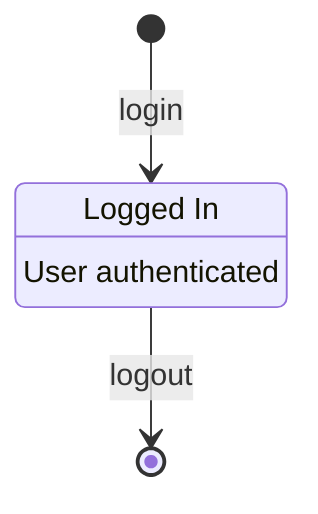
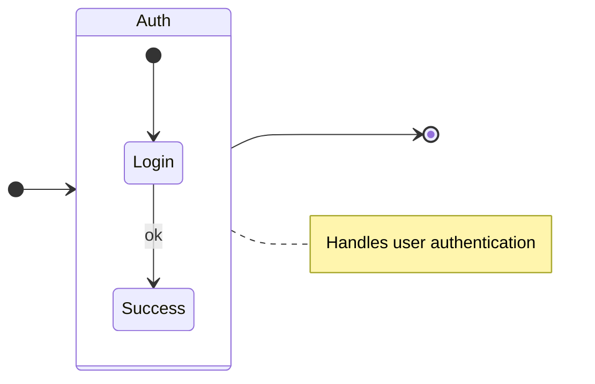
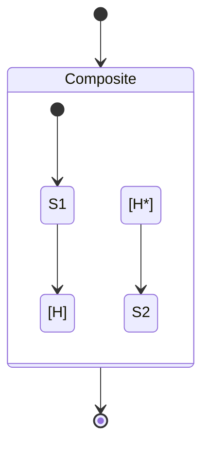
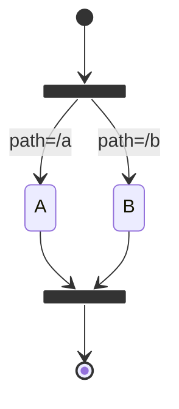
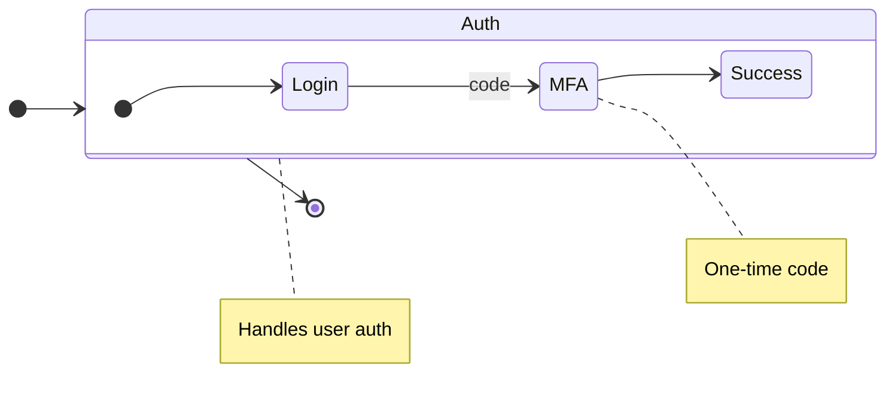
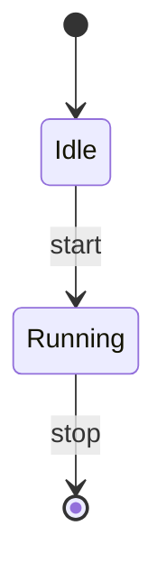

# Valid State Diagrams

This file contains all valid state test fixtures rendered with Mermaid.

> **Note**: This file is auto-generated by `scripts/generate-previews.js`. Do not edit manually.

## Table of Contents

1. [aliases and descriptions](#1-aliases-and-descriptions)
2. [block and notes](#2-block-and-notes)
3. [history states](#3-history-states)
4. [markers fork join](#4-markers-fork-join)
5. [nested and notes](#5-nested-and-notes)
6. [simple](#6-simple)

---

## 1. Aliases And Descriptions

📄 **Source**: [`aliases-and-descriptions.mmd`](./valid/aliases-and-descriptions.mmd)

### Rendered Output (Mermaid)



<details>
<summary>View source code</summary>

```
stateDiagram-v2
state "Logged In" as S1
S1 : User authenticated
[*] --> S1 : login
S1 --> [*] : logout


```
</details>

---

## 2. Block And Notes

📄 **Source**: [`block-and-notes.mmd`](./valid/block-and-notes.mmd)

### Rendered Output (Mermaid)



<details>
<summary>View source code</summary>

```
stateDiagram-v2
direction LR
state Auth {
  [*] --> Login
  Login --> Success : ok
}
[*] --> Auth
Auth --> [*]
Note right of Auth: Handles user authentication


```
</details>

---

## 3. History States

📄 **Source**: [`history-states.mmd`](./valid/history-states.mmd)

### Rendered Output (Mermaid)



<details>
<summary>View source code</summary>

```
stateDiagram-v2
  state Composite {
    [*] --> S1
    S1 --> [H]
    [H*] --> S2
  }
  [*] --> Composite
  Composite --> [*]


```
</details>

---

## 4. Markers Fork Join

📄 **Source**: [`markers-fork-join.mmd`](./valid/markers-fork-join.mmd)

### Rendered Output (Mermaid)



<details>
<summary>View source code</summary>

```
stateDiagram-v2
state Split <<fork>>
[*] --> Split
Split --> A : path=/a
Split --> B : path=/b
state Join <<join>>
A --> Join
B --> Join
Join --> [*]


```
</details>

---

## 5. Nested And Notes

📄 **Source**: [`nested-and-notes.mmd`](./valid/nested-and-notes.mmd)

### Rendered Output (Mermaid)



<details>
<summary>View source code</summary>

```
stateDiagram-v2
direction LR
state Auth {
  [*] --> Login
  Login --> MFA : code
  MFA --> Success
}
[*] --> Auth
Auth --> [*]
Note right of Auth: Handles user auth
Note right of MFA: One-time code

```
</details>

---

## 6. Simple

📄 **Source**: [`simple.mmd`](./valid/simple.mmd)

### Rendered Output (Mermaid)



<details>
<summary>View source code</summary>

```
stateDiagram-v2
[*] --> Idle
Idle --> Running : start
Running --> [*] : stop


```
</details>

---

