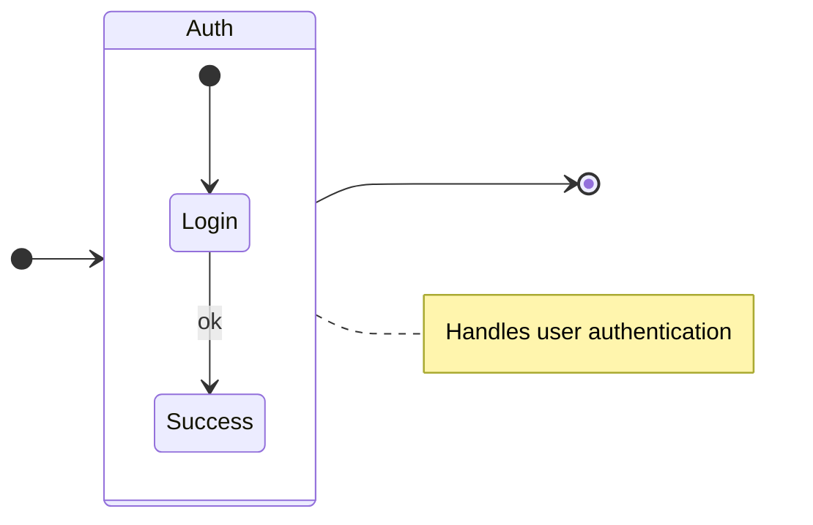
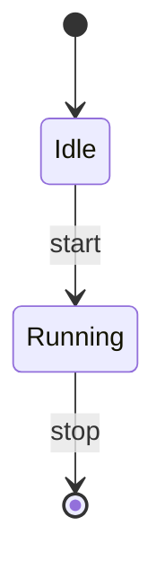

# Valid State Diagrams

This file contains all valid state test fixtures rendered as Mermaid diagrams.
These diagrams are validated to be 100% compatible with mermaid-cli.

> **Note**: This file is auto-generated by `scripts/generate-preview.js`. Do not edit manually.

## Table of Contents

1. [Block And Notes](#1-block-and-notes)
2. [Simple](#2-simple)

---

## 1. Block And Notes

📄 **Source**: [`block-and-notes.mmd`](./valid/block-and-notes.mmd)



<details>
<summary>View source code</summary>

```
stateDiagram-v2
direction LR
state Auth {
  [*] --> Login
  Login --> Success : ok
}
[*] --> Auth
Auth --> [*]
Note right of Auth: Handles user authentication


```
</details>

---

## 2. Simple

📄 **Source**: [`simple.mmd`](./valid/simple.mmd)



<details>
<summary>View source code</summary>

```
stateDiagram-v2
[*] --> Idle
Idle --> Running : start
Running --> [*] : stop


```
</details>

---

## Validation Status

All diagrams in this file have been validated against:
- ✅ Our Mermaid linter
- ✅ Official mermaid-cli
- ✅ GitHub's Mermaid renderer

Generated by scripts/generate-preview.js (deterministic output)

## How to Regenerate

```bash
node scripts/generate-preview.js state
```
