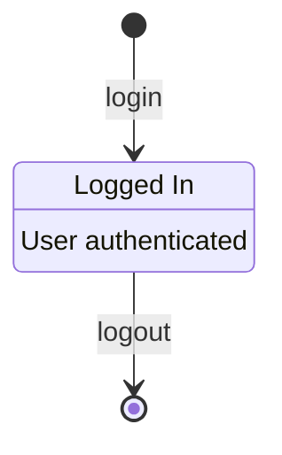
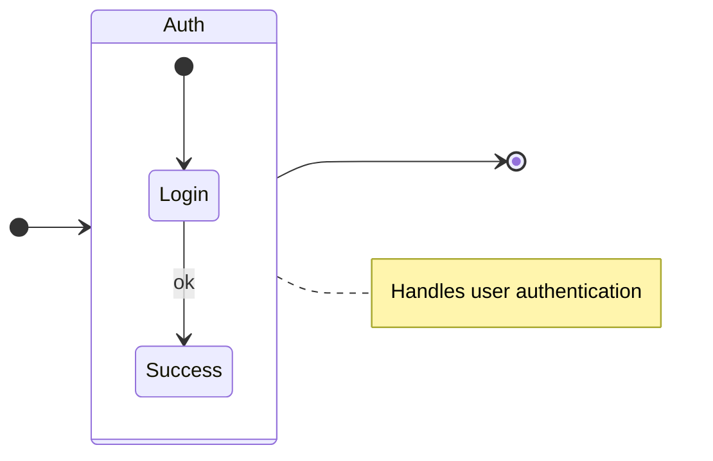
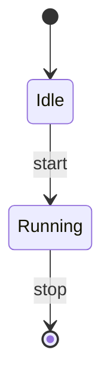

# Valid State Diagrams

This file contains all valid state test fixtures rendered as Mermaid diagrams.
These diagrams are validated to be 100% compatible with mermaid-cli.

> **Note**: This file is auto-generated by `scripts/generate-preview.js`. Do not edit manually.

## Table of Contents

1. [Aliases And Descriptions](#1-aliases-and-descriptions)
2. [Block And Notes](#2-block-and-notes)
3. [Nested And Notes](#3-nested-and-notes)
4. [Simple](#4-simple)

---

## 1. Aliases And Descriptions

📄 **Source**: [`aliases-and-descriptions.mmd`](./valid/aliases-and-descriptions.mmd)



<details>
<summary>View source code</summary>

```
stateDiagram-v2
state "Logged In" as S1
S1 : User authenticated
[*] --> S1 : login
S1 --> [*] : logout


```
</details>

---

## 2. Block And Notes

📄 **Source**: [`block-and-notes.mmd`](./valid/block-and-notes.mmd)



<details>
<summary>View source code</summary>

```
stateDiagram-v2
direction LR
state Auth {
  [*] --> Login
  Login --> Success : ok
}
[*] --> Auth
Auth --> [*]
Note right of Auth: Handles user authentication


```
</details>

---

## 3. Nested And Notes

📄 **Source**: [`nested-and-notes.mmd`](./valid/nested-and-notes.mmd)

```mermaid
stateDiagram-v2
direction LR
state Auth {
  [*] --> Login
  Login --> MFA : code
  MFA --> Success
}
[*] --> Auth
Auth --> [*]
Note over Auth: Handles user auth
Note right of MFA: One-time code


```

<details>
<summary>View source code</summary>

```
stateDiagram-v2
direction LR
state Auth {
  [*] --> Login
  Login --> MFA : code
  MFA --> Success
}
[*] --> Auth
Auth --> [*]
Note over Auth: Handles user auth
Note right of MFA: One-time code


```
</details>

---

## 4. Simple

📄 **Source**: [`simple.mmd`](./valid/simple.mmd)



<details>
<summary>View source code</summary>

```
stateDiagram-v2
[*] --> Idle
Idle --> Running : start
Running --> [*] : stop


```
</details>

---

## Validation Status

All diagrams in this file have been validated against:
- ✅ Our Mermaid linter
- ✅ Official mermaid-cli
- ✅ GitHub's Mermaid renderer

Generated by scripts/generate-preview.js (deterministic output)

## How to Regenerate

```bash
node scripts/generate-preview.js state
```
